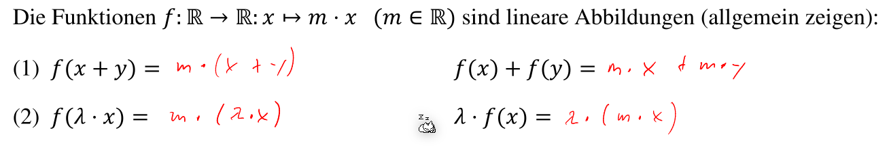
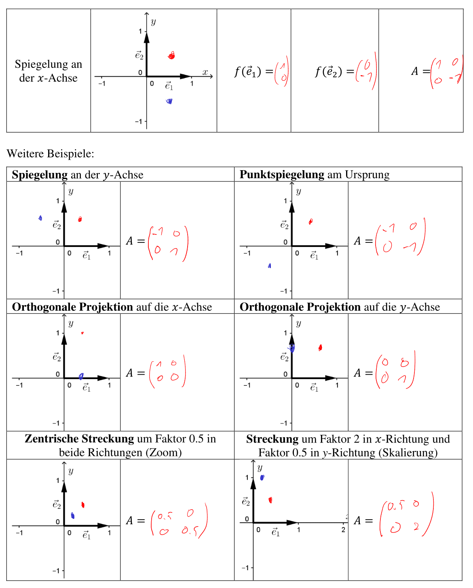
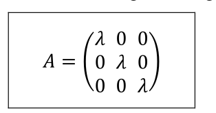
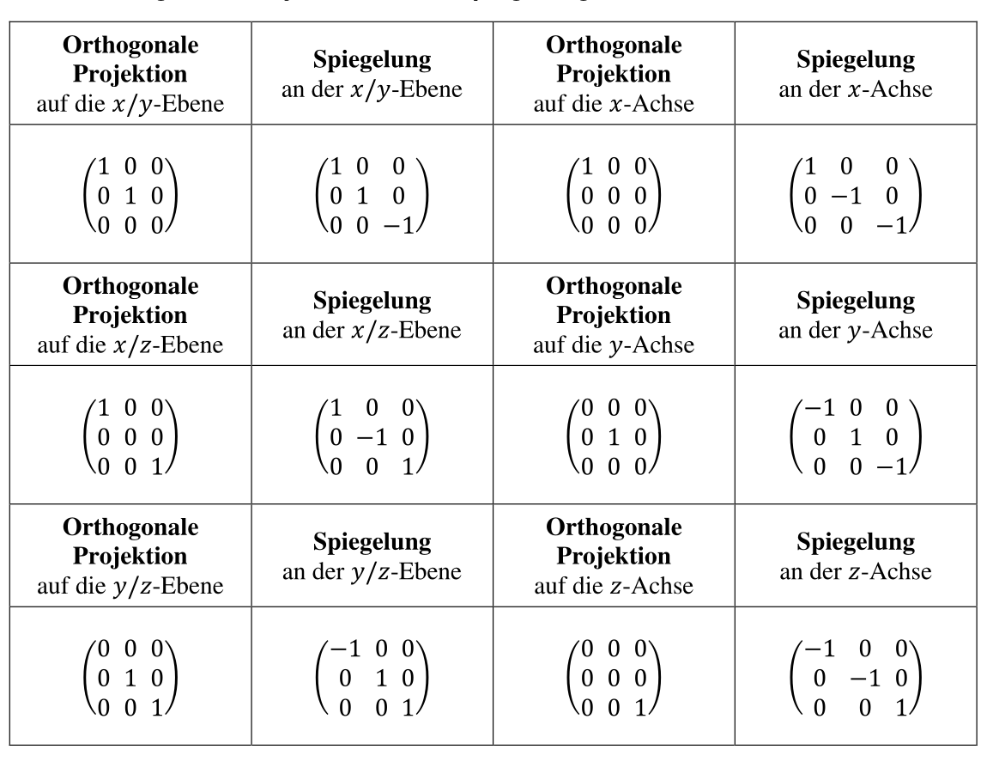
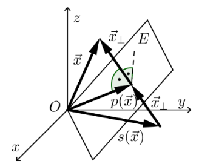

# Lineare Abbildung

$$
\DeclareMathOperator{\im}{im}
\DeclareMathOperator{\span}{span}
\DeclareMathOperator{\rg}{rg}
$$
Eine Lineare Abbildung wird mit Hilfe einer Funktion $f: V \to W$ , welche ein Parameter vom Typ $V$ nimt und als Rückgabetyp $W$ zurück gibt. Wichtig ist, dass die Funktion folgende zwei Rechungsregeln einhält:

* $f(x+y)=f(x)+f(y)$
* $f(\lambda\cdot x)=\lambda\cdot f(x)$

Wenn bewiesen werden soll, dass eine Funktion eine Abbildungsfunktion ist, dann müssen diese zwei Gesetze allgemein gezeigt werden. Um es zu widerlegen, reicht ein Gegenbeispiel.

## Lineare Abbildung eines Vektorraumes

Wenn die Abbildungsfunktion $f$ komplett definiert ist, für die Einheitsvektoren $\vec e_1$, $\vec e_2$, ..., $\vec e_n$, dann gilt follgendes:
$$
\vec x=x_1 \cdot \vec e_1 + x_2 \cdot \vec e_2\\
f(\vec x)=f(x_1 \cdot \vec e_1 + x_2 \cdot \vec e_2)=f(x_1\cdot \vec e_1)+ f(x_2\cdot \vec e_2)=x_1\cdot f(\vec e_1)+x_2\cdot f(\vec e_2)\\
$$
Da das letzte Resultat eine Linearkombination ist, kann diese auch als Matrix geschrieben werden.

Um diese Matrix zu finden, gibt es zwei Möglichkeiten:

1. Die Einheitsvektoren in $f(x)$ ein setzten und aus den Resultaten eine Matrix bauen
2. Zeile für Zeile durchgehen und die Matrixzeilen davon ableiten

Zusätzlich können Matrixen (und auch Abbildngsfunktionen) auch zwischen Basen konvertieren:

Bei der Matrix $_CA_B$ und der linearen Abbildung $f: V \to W$ bezieht sich $_B$ auf $V$ und $_C$ auf $W$.

## Abbildungen im Raum

In den folgenden Kapiteln werden Beispiele gezeigt, wie eine Abbildung aussehen kann

### In 2-Dimensionalen Vektorräumen

Die folgenden Beispielen beziehen sich alle auf einen zweidimensionalen Vektorraum

### Zweidimensionale Spezialfälle

#### Orthogonale Projektion auf eine allgemeine Gerade durch den Ursprung

Wenn auf eine Gerade projektiert werden soll, welche nicht die x-, y- oder z-Achse ist, muss folgende Formel verwendet werden. Dabei wird erwartet, dass die Gerade in der Kordinatendarstelung ($ax + by = 0$) normiert ist ($a^2 + b^2 = 1$).
$$
P=
\begin{pmatrix}
1 - a^2 & -ab\\
-ab & 1-b^2
\end{pmatrix}\\
\text{Wobei gilt: }\\
ax + by = 0\\
a^2+ b^2 = 1
$$

#### Spiegelung an einer allgemeinen Gerade durch den Ursprung

Wenn alle Vektoren bei einer Gerade, welche durch den Ursprung geht, gespiegelt werden soll, kann folgende Formel benützt werden. Dabei muss aber die Gerade in der Koordinatendarstellung ($ax + by=0$) normiert ist ($a^2+b^2 = 1$).
$$
S=
\begin{pmatrix}
1 - 2a^2 & -2ab\\
-2ab & 1 - 2b^2
\end{pmatrix}\\
\text{Wobei gilt: }\\
ax + by = 0\\
a^2+ b^2 = 1
$$

### In dreidimensionalen Vektorräumen

### Dreidimensionale Spezialfälle

#### Orthogonale Projektion auf eine allgemeine Ebene durch den Ursprung

Wenn alle Vektoren auf eine Ebene, welche durch den Ursprung geht, projektiert werden sollen, kann folgende Formel benützt werden. Dabei muss aber die Koordinatendarstellung der Ebene ($ax + by + cz = 0$) normiert sein ($a^2 + b^2 + c^2=1$).
$$
P=\begin{pmatrix}
1 - a^2 & -ab & -ac\\
-ab & 1 - b^2 & -bc\\
-ac & -bc & 1 - c^2
\end{pmatrix}=E-\vec n \cdot \vec n^T\\
\text{Wobei gilt:}\\
ax + by + cz = 0\\
a^2 + b^2 + c^2 = 1
$$
Im folgenden Bild wird noch eine andere Schreibweise gezeigt:

#### Spiegelung an einer allgemeinen Ebene durch den Ursprung

Wenn alle Vektoren bei einer Ebene, welche durch den Ursprung geht, gespiegelt werden sollen, kann folgende Formel benützt werden. Dabei müssen die Ebene in der Koordinatendarstellung normiert sein:
$$
S=\begin{pmatrix}
1 - 2a^2 & -2ab & -2ac\\
-2ab & 1 - 2b^2 & -2bc\\
-2ac & -2bc & 1 - 2c^2
\end{pmatrix}=E-\vec n \cdot \vec n^T\\
\text{Wobei gilt:}\\
ax + by + cz = 0\\
a^2 + b^2 + c^2 = 1
$$

#### Rotation um eine allgemeine Achse durch den Ursprung

Wenn alle Vektoren um eine allgemeine Achse, welche durch den Ursprung geht, gedreht werden soll, kann folgende Formel benützt werden. Dabei muss die Koordinatendarstellung der Achse/Gerade normiert sein.

## Kern und Bild einer Abbildung

Wenn wir eine Abbildung $f: V \to W, \vec x \mapsto f(\vec x)=A \cdot \vec x$ haben, dann ist der Kern alle Vektoren $\vec x$, welche die Gleichung $A \cdot \vec x=\vec 0$   erfüllen. Der Nullvektor $\vec 0$ ist dabei immer in $\ker(A)$ enthalten.
$$
\ker(A)=\{\vec x \in V \vert A\cdot \vec x = \vec 0\}
$$
Das Bild der Abbildung ist der Spalten der Vektoren von $A$
$$
\im(A)=\span(\vec a_1, \vec a_2, ..., \vec a_n)=\{\lambda_1 \vec a_1 + \lambda_2 \vec a_2 + ... + \lambda_n\vec a_n \vert \lambda_k \in \R\}
$$
Eine Wichtige Beobachtung ist, dass die Dimension von $\ker(A)$ und $\im(A)$ zusammen $\dim(A)$ ergeben:
$$
\dim(\ker(A)) + \dim(\im(A)) = \dim(A)\\
\dim(\im(A)) = \rg(A)
$$

