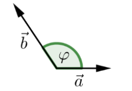
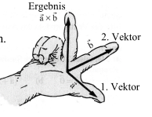
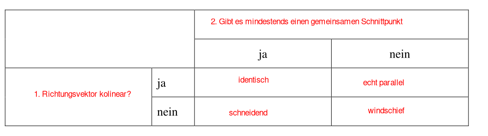
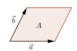
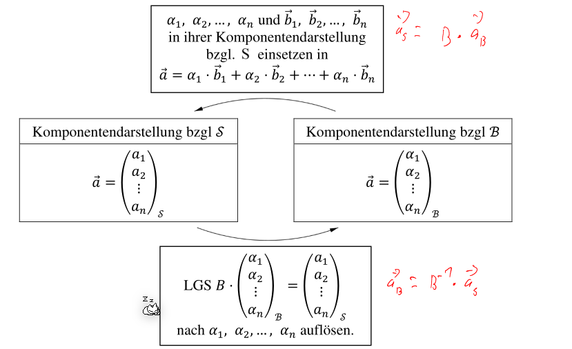
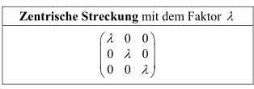

# LA Summary 

$$
\newcommand{\len}[1]{\vert #1 \vert}
\DeclareMathOperator{\rg}{rg}
\DeclareMathOperator{\span}{span}
\DeclareMathOperator{\dim}{dim}
\DeclareMathOperator{\im}{im}
$$

[TOC]

## Linearen Gleichungssysteme (LGS)

* Zeilenstufenform: Alle nicht-`0` Zeilen, haben eine führende `1`; Alle `0`-Zeilen stehen zu unterst; Je weiter unten, desto weiter rechts steht eine führende `1`
* reduzierte Zeilenstufenform: Zusätzlich gilt: Eine Spalte mit einer führenden `1`, darf nur noch `0` enthalten

### Lösung aus Zeilenstufenform

1. Unterscheiden zwischen Spalten mit führenden `1` und mit freien Unbekannten.
2. Für alle freie Unbekannte kann ein Unbekannte gleichgesetzt werden (z.B. $\lambda$)
3. Alle Zeilen mit einer führenden-`1` werden in eine Gleichung umgewandelt werden

### Lösung aus reduzierter Zeilenstufenform

Das Resultat kann abgeschaut werden.

### Lösbarkeit von LGS

$\rg(A)=\text{Anzahl Zeilen}-\text{Anzahl Nullzeilen}$ (in der Zeilenstuffen form)

$n$ ist die Anzahl **Spalten** von $A$

Eigenschaften, wenn $rg(A)=n$ gilt:

* $\det(A)\neq 0$
* $\Leftrightarrow$ Spalten sind linear unabhängig
* $\Leftrightarrow$ Zeilen sind linear unabhängig
* $\Leftrightarrow rg(A)=n$
* $\Leftrightarrow$ A ist regulär, bzw. invertierbar
* $\Leftrightarrow A\cdot \vec x=\vec 0$ ist eindeutig lösbar   

## Vektoren

* **Ortsvektor**
  Ein Vektor $\vec r(P)$, welcher am Ursprung festgehaftet ist
* **Nullvektor** $\vec 0$
  Ein Vektor mit dem Betrag 0 und keiner Richtung
* **Gegenvektor**: $\vec a\rightarrow -\vec a$
* **Kollinear**:
  Wenn zwei Vektoren parallel sind oder $\vec a = \lambda \cdot \vec b$
* **Komplanar**
  Drei Vektoren heissen komplanar, wenn es eine Ebene gibt, zu der alle drei parallel sind.
* **Vektor zwischen zwei Punkten**
  $\vec{PQ}=\begin{pmatrix}x_Q-x_P\\y_Q-y_P\end{pmatrix}=\vec r(Q)-\vec r(P)$

### Linear Unabhängig

Vektoren sind linear Unabhängig, wenn es nur **eine** Möglichkeit gibt mit einer Linearkombination $\vec 0$ zu erreichen: $\lambda_1\cdot \vec a_1 + \lambda_2 \cdot \vec a_2 + ... + \lambda_n \cdot \vec a_n=\vec 0$

Eigenschaften die daraus folgen:

* $\det(A)\neq 0$
* $\Leftrightarrow$ die Inversematrix kann gebildet werden
* $\Leftrightarrow$ Spalten sind linear unabhängig
* $\Leftrightarrow$ Zeilen sind linear unabhängig
* $\Leftrightarrow rg(A)=n=\text{Anzahl Spalten}$
* $\Leftrightarrow$ A ist regulär, bzw. invertierbar
* $\Leftrightarrow A\cdot \vec x=\vec 0$ ist eindeutig lösbar   

### Sätze

1. **Satz 1**: Es lässt sich der Vektor $\vec c$ als Linearkombination der Vektorn $\vec a$ und $\vec b$ im **2D**-Raum darstellen, wenn
   1. $\vec a$, $\vec b$ und $\vec c$ komplanar sind
   2. $\vec a$ und $\vec b$ nicht kollinear sind
2. **Satz 2**: Es lässt sich den Vektor $\vec d$ als Linearkombinatino der Vektoren $\vec a$, $\vec b$ und $\vec c$ im **3D**-Raum darstellen, wenn $\vec a$, $\vec b$ und $\vec c$ nicht komplanar sind

### 3D-Koordinatensystem

### Skalarprodukt
 
$$
\vec a \cdot \vec b = \vert \vec a \vert \cdot \vert \vec b\vert \cdot \cos(\varphi)\\
\vec a \cdot \vec b=a_1b_1+a_2b_2+a_3b_3\\
\varphi =cos^{-1}\left(\frac{\vec a \cdot \vec b}{|\vec a|\cdot |\vec b|}\right)\\
\vec a \cdot \vec b = 0\Rightarrow \varphi=90°=\frac 2 \pi
$$
Folgende Gesetzte gelten:

* Kommuntativ-Gesetzt: $\vec a \cdot \vec b=\vec b \cdot \vec a$
* Distributive-Gesetzt: $\vec a \cdot (\vec b + \vec c)=\vec a \cdot \vec b + \vec a \cdot \vec c$
* Gemischtes Assoziativ-Gesetzt: $\lambda\cdot (\vec a \cdot \vec b)=(\lambda \cdot \vec a)\cdot \vec b=\vec a \cdot (\lambda \cdot \vec b)$
* $\vec a \cdot \vec a=\vert \vec a \vert ^2$

### Orthogonale Projektion

$$
\vec b_a =\frac{\vec a \cdot \vec b}{|\vec a|^2}\cdot \vec a\\
|\vec b_a|=\frac{|\vec a \cdot \vec b|}{|\vec a|}
$$
### Vektorprodukt

Folgende Gesetze gelten: 

* $\len {\vec a \times \vec b}=\len {\vec a}\cdot \len {\vec b}\cdot \sin(\varphi)$
* $\vec a \times \vec b$ ist orthogonal zu $\vec a$ und $\vec b$
* $\vec a$ und $\vec b$ sind kollinear, wenn $\vec a \times \vec b=\vec 0$ gilt
* $\vec a \times \vec a = \vec 0$
* Antikommutativ-Gesetz: $\vec a \times \vec b = -(\vec b \times \vec a)$
* Distributiv-Gesetzt: $\vec a \times (\vec b + \vec c)=\vec a \times \vec b + \vec a \times \vec c$ und $(\vec a + \vec c)\times \vec c = \vec a \times \vec c + \vec b \times \vec c$
* Gemischtes Assoziativ-Gesetz: $\lambda \cdot (\vec a \times \vec b)=(\lambda \cdot \vec a)\times \vec b=\vec a \times (\lambda \cdot \vec b)$
* Das Assoziative-Gesetzt gilt **nicht**: $\vec a \times (\vec b \times \vec c)\neq (\vec a \times \vec b)\times\vec c$
* $\vec a \times \vec b$ ist die Fläche eines Parallelogrammes aufgespannt durch $\vec a$ und $\vec b$
  

## Gerade

* **Parameterdarstellung**
  $g: \vec r(P)+ \lambda \cdot \vec{PQ}$

  * Zu Kordinatendarstellung umrechnen

    Als LGS schreiben und $\lambda$ eliminieren

* **Kordinatendarstellung** (nur in 2D)
  $g: ax+by+c=0$

  * Normalvektor $n=\pmatrix{a \\ b}$
    Normalvektor steht senkrecht auf der gerade
  * Zu Paramterdarstellung umrechnen:
    Zwei Punkte auf $g$ finden und damit $\vec{PQ}$ berechnen
  
* **Normierte Kordinatendarstellung** (Nur in 2D)
  Die Länge des Normalvektors is $0$. Um dies zu berechnen, den Normalvektor normieren (also durch die Länge des Normalvektors teilen)

### Wie stehen zwei Gerade zueinander

### Abstand eines Punktes

**TODO**

## Ebene

* Parameterdarstellung
  $E: \vec r(P)+\lambda \cdot \vec{PR}+\mu\cdot \vec{PQ}$ 
  * Normalvektor $\vec n = \vec{PR}\times \vec{PQ}$
  * Zu Koordinatendarstelung umwandeln
    * **Variante 1**
      Normalvektor $\vec n$ ausrechnen und in Koordinatenform einsetzen. 
      Daraus ergibt sich eine Gleichung mit einer Unbekannte $d$. Diese Lösen
    * **Variante 2**
      Die drei Gleichungen in einem LGS schreiben und $\lambda$ und $\mu$ eliminieren
  
* Koordinatendarstellung
  $E: ax+by+cz+d=0$
  * Normalvektor: $\vec n=\pmatrix{a\\b\\ c}$
    Normalvektor steht orthogonal auf der Ebene
  * Zu Parameterdarstellung umwandeln
    Drei Punkte auf der Ebene finden und daraus die Parameterdarstellung bilden

* Normierte Koordinatendarstellung
  Der Normalvektor $\vec n$ ist normiert (durch $\vert \vec n \vert$ geteilt) ($d$ muss auch durch $|\vec n |$ geteilt werden)

### Wie stehen zwei Ebene zueinander

* **Parallel**: 
  * Parameterdarstellung
    Überprüfen, ob die Richtungsvektoren komplanar zu einander sind
  
  * Koordinatendarstellung
    Es muss ein Faktor $p$ in folgendem System geben
$$
    a_1=a_2\cdot p\\
    b_1=b_2\cdot p\\
    c_1=c_2\cdot p\\
    d_1\neq d_2\cdot p
$$
    Alternativ: Die Normalvektoren beider Ebenen  müssen koolinear sein

* **Identisch**

  * Parameterdarstellung
    Wenn die zwei Ebenen gleichgesetzt werden, müssen unendlich viele Lösungen, mit zwei nicht gefixte Grade, heraus kommen
  * Koordinatendarstellung:
    Für die Koordinatendarstellung muss folgendes gültig sein (die letzte Gleichung ist anderst)

  $$
  a_1=a_2\cdot p\\
  b_1=b_2\cdot p\\
  c_1=c_2\cdot p\\
  d_1=d_2\cdot p
  $$

* **Schneident**

  * Parameterdarstellung
    Wenn die zwei Ebenen gleichgesetzt werden, müssen unendlich viele Lösungen, mit einer nicht gefixte Grade, heraus kommen. Das Resultat ist eine Gerade in der Parameterdarstellung
  * Koordinatendarstellung
    Die beiden Ebenen in dasselbe Gleichungssystem tun und zu einem Gauss umwandeln ($d$ auf die andere Seite nehmen). Wenn dies aufgelöst wird, müsste eine Geradegleichung dabei herauskommen

### Abstand von einem Punkt zu einer Ebene

$$
\text{Wenn die Ebene nicht normiert sind: } l=\frac{|ax_A+by_A+cz_A+d|}{|\vec n|}\\
\text{Wenn die Ebene normiert ist: } l=|ax_A+by_A+cz_A+d|
$$

## Matrix

* **Null-Matrix**: Eine Matrix mit nur Nullen
* **Spalten-Matrix**: Eine Matrix mit nur einer Spalte. Verhält sich gleich, wie ein Vektor

Die folgenden Rechenregeln funktioniert für gleichgrosse Matrizen.

* Kommutativ-Gesetz: $A+B=B+A$ (Geht **NICHT** bei Multiplikation)
* Assoziativ-Gesetzt: $A+(B+C)=(A+B)+C$
* Distributiv-Gesetzt: $\lambda\cdot(A+B)=\lambda\cdot A + \lambda \cdot B$ 
  * Aber Achtung: $\lambda\cdot A + B\cdot \lambda$ kann **nicht** ausgeklammert werden (In könnte einfach $\lambda \cdot A$ und $B\cdot \lambda$ ausgerechnet werden)

* Distributiv-Gesetzt mit Transportierten Matrizen: 
  * $(A\cdot B)^T=B^T \cdot A^T$ (Beachte die Reihenfolge von A und B)
  * $(A+B)^T=A^T+B^T=B^T+A^T$
  * $(A-B)^T=A^T-B^T=B^T-A^T$

### Transponierte Matrix

$$
B= \begin{bmatrix}
1 & 2 & 3\\
3 & 4 & 5
\end{bmatrix}\\
B^T= \begin{bmatrix}
1 & 3 \\
2 & 4\\
3 & 5
\end{bmatrix}
$$

Es gilt folgendes Gesetzt: $(A\cdot B)^T=B^T\cdot A^T$ (Bemerke, dass sich die Reihenfolge von $A$ und $B$ sich ändert)

### Inverse Matrix

Die inverse Matrix kann von einer Quadratischen-Matrix gebildet werden, bei welcher $\det(A)\neq 0$ gilt
$$
\pmatrix{a & b\\ c & d}^{-1}=\frac 1 {ad-bc}\cdot \pmatrix{d & -b \\ -c & a}
$$

Für grössere Matrizen folgendes Gleichungssystem muss aufgelöst werden:
$$
\pmatrix{
	a_{11} & a_{12} & a_{13} \\ 
	a_{21} & a_{22} & a_{23} \\ 
	a_{31} & a_{32} & a_{33}
}^{-1} \Rightarrow 
\left(\begin{array}{ccc|cr}
	a_{11} & a_{12} & a_{13} & 1 & 0 & 0\\ 
	a_{21} & a_{22} & a_{23} & 0 & 1 & 0\\ 
	a_{31} & a_{32} & a_{33} & 0 & 0 & 1
\end{array}\right )
$$

### Determinante

Wenn die Determinanten einer grösseren Matrix als 3x3 Berechnet werden soll, kann ein Verfahren nach Laplace eingesetzt werden:

1. Es wird eine feste Spalte oder Zeile gewählt

2. Nun wird nach der folgenden Formel entwickelt:
   $$
   \text{Entwicklung nach i-ten Zeilen: }\det(A)=\sum^n_{j=1} (-1)^{i+j}\cdot a_{ij}\cdot\det(A_{ij})\\
   \text{Entwicklung nach j-ten Spalte: }\det(A)=\sum^n_{i=1} (-1)^{i+j}\cdot a_{ij}\cdot\det(A_{ij})\\
   $$
   Dabei  ist $a_{ij}$, das Element an $i$-ter Zeile und $j$-ter Spalte und $A_{ij}$ die Matrix, bei welcher die $i$-te Zeile und $j$-Spalte weggelassen wurden

 

Der Determinante einer 2x2-Matrix, ist der Flächeninhalt des Parallelogrammes, wenn die Spalten als Vektoren aufgefasst werden. Der Determinante einer 3x3-Matrix ist der Volumeninhalt des Spates, von den Spalten der Matrix aufgespannt wird.

Eigenschaften:

* Einheitsmatrix haben den Determinanten $1$
* Für nxn Matrix gilt: $\det(A\cdot B)=\det(A)\cdot \det(B)$
* Für invertierbare Matrix gilt: $\det(A^{-1})=\frac 1 {\det(A)}$
* Für $A^T$ gilt: $\det(A^T)=\det(A)$

Wenn:

* $\det(A)\neq 0$
* $\Leftrightarrow$ Die Spalten und Zeilen sind linear unabhängig
* $\Leftrightarrow \rg(A)=n=m$
* $\Leftrightarrow A$ ist invertierbar
* $\Leftrightarrow$ Das LGS $A\cdot \vec x = \vec c$ hat eine eindeutige Lösung 
* $\Leftrightarrow $ Die Vektoren in $A$ sind eine Basis

## Vektorräume

$$
+:V \times V \rightarrow V\\
\cdot : \R \times V \rightarrow V
$$

Dabei müssen folgende Gesetze existieren:

* Kommutativgesetz: $a + b = b + a$
* Assoziativgesetzt: $a + (b + c)=(a + b) + c$
* Es gibt ein neutrales Element $\vec 0$, für welches gilt $a + 0v = \vec a$ und $0v \in V$
* Für jedes Element $a \in V$ muss es ein inverses Element $-a \in V$ geben, so dass $a + (-a) = 0v$ ergibt.
* Assoziativgesetzt: $\lambda \cdot (\mu \cdot a) = (\lambda \cdot \mu) \cdot a$
* Distributivgesetzt: $\lambda \cdot(a + b) = \lambda \cdot a + \lambda \cdot b$
* Distirbutgesetzt: $(\lambda + \mu)\cdot a = \lambda \cdot a + \mu \cdot a$
* Für jedes Element $a \in V$ gibt es ein neutrales Element $1\cdot a = a$,

Allgemein bekannte Vektorräume:

* $\R^n$ - Vektorraum von allen Vekotren mit $n$ reellen Komponente
* $ \R^{m\times n}$ - Vektorraum von allen reelen $m\times n$-Matrizen
* $\mathbb P_n[x]$ - Vektorraum der Polynome von Grad $\le n$

### Unterräume

* Für beliebige Element $a, b \in U$ ist auch $a+b\in U$
* Für jeden Skalar $\lambda \in \R$ und jedes Element $a\in U$ ist auch $\lambda \cdot a\in U$
* (Die neutralen Elemente der Addition und Skalarmultiplikation müssen ebenfalls in $U$ sein.)

### Linearer Spann

$$
\span(\vec a_1, \vec a_2 , ..., \vec a_n)=\lambda_1\cdot \vec a_n1 + \lambda_2\cdot \vec a_2 + ... + \lambda_n \cdot \vec a_n
$$

Jenachdem, wie viele linear unabhängige Vektoren gegeben sind, wird ein anderes geometrisches Objekt gebildet:

* Bei `1` Vektor, wird eine Ursprungs-Gerade gebildet
* Bei `2` Vektoren, wird eine Ursprungs-Ebene
* Bei `3` Vektoren, wird ein "Ursprungs-Körper" gebildet

### Erzeugendensystem

Eine Menge von Vektoren $\{\vec b_1, \vec b_2, ..., \vec b_N\}$, falls die Vektoren nicht komplanar und kolinear zueinander sind, bilden ein Erzeugendensystem von $V$: $V=\span(\vec b_1, \vec b_2, ..., \vec b_n)$

Ein Erzeugendensystem hat folgende eigenschaften:
$$
\begin{align}
& V=span(\vec b_1, \vec b_2, ..., \vec b_n)\\
\Leftrightarrow \text{ } & B\cdot \vec x = \vec a \text { für jedes } \vec a \in \R^m\\
\Leftrightarrow \text{ } & rg(B)=m = \text{Anzahl Zeilen}
\end{align}
$$

### Basis

Eine Basis ist eine Menge von Vektoren, welche

* ein Erzeugendensystem sind 
* linear unabhängig sind 

(Auf Deutsch: Es darf nur eine Möglichkeit geben, jeden Vektor zu Bilden)

Es kann auch überprüft werden, ob $\det(A)\neq 0$ ist (siehe Determinante)

Wichtige Basen:

* Für $\R^n$ : $\mathcal S=\{\vec e_1, \vec e_2, ..., \vec e_n\}$ - Standardbasis 
* Für $\mathbb P_n[x]$ $\mathcal M=\{1, x, x^2, ..., x^n\}$ - Monombasis

### Dimension

Die Anzahl Vektoren in der Basis eines Vektorraumes: $\dim(V)$

Die Dimension von $\{\vec 0\}$ ist $0$

## Lineare Abbildung

Eine Lineare Abbildung ist eine Funktion $f: V \to W$, welche folgende zwei Regeln einhält:
$$
f(x+y)=f(x)+f(y)\\
f(\lambda \cdot x)=\lambda \cdot f(x)
$$

Eine lineare Abbildung kann auch als Matrix geschrieben werden. Um dies zu erreichen, gibt es zwei möglichkeiten:

1. Die Einheitsvektoren in $f(x)$ einsetzen und aus den Resultaten eine Matrix bauen 

2. Zeile für Zeile durchgehen und die Matrixzeilen davon ableiten
   $$
   A\cdot\pmatrix{x \\ y \\ z} = \pmatrix{x\\ z - y \\ y - x \\ 2x - y} \Rightarrow A = \pmatrix{1 & 0 & 0 \\ 0 & -1 & 1 \\ -1 & 1 & 0 \\ 2 & -1 & 0}
   $$

### Basis-wechselnde Abbildung

$_CA_B$ beschreibt die Lineare Abbildung $f: V_B \to W_C$ (Achtung Reihenfolge) und wird wie folgt gebraucht: $_CA_B\cdot \vec x_B=f(\vec x)$.

Es kann wie folgt gebildet werden: 

Die Matrix $(_CA_B)^{-1}={}_BA_C$

### Abbildung in der Ebene

#### Orthogonale Projektion auf eine allgemeine Gerade durch den Ursprung

Wenn auf eine Gerade projektiert werden soll, welche nicht die x-, y- oder z-Achse ist, muss folgende Formel verwendet werden. Dabei wird erwartet, dass die Gerade in der Kordinatendarstelung ($ax + by = 0$) normiert ist ($a^2 + b^2 = 1$).
$$
P=
\begin{pmatrix}
1 - a^2 & -ab\\
-ab & 1-b^2
\end{pmatrix}\\
\text{Wobei gilt: }\\
ax + by = 0\\
a^2+ b^2 = 1
$$

#### Spiegelung an einer allgemeinen Gerade durch den Ursprung

Wenn alle Vektoren bei einer Gerade, welche durch den Ursprung geht, gespiegelt werden soll, kann folgende Formel benützt werden. Dabei muss aber die Gerade in der Koordinatendarstellung ($ax + by=0$) normiert ist ($a^2+b^2 = 1$).
$$
S=
\begin{pmatrix}
1 - 2a^2 & -2ab\\
-2ab & 1 - 2b^2
\end{pmatrix}\\
\text{Wobei gilt: }\\
ax + by = 0\\
a^2+ b^2 = 1
$$

### Abbildung im Raum

### Kern und Bild

$$
\ker(A)=\{\vec x \in V \vert A\cdot \vec x = \vec 0\}\\
\im(A)=\span(\vec a_1, \vec a_2, ..., \vec a_n)=\{\lambda_1 \vec a_1 + \lambda_2 \vec a_2 + ... + \lambda_n\vec a_n \vert \lambda_k \in \R\}
$$

Der Kern $\ker(A)$ besteht aus alle Vektoren $\vec x$, welche die Gleichung $A\cdot \vec x=\vec 0$ erfüllen

Das Bild $\im(A)$ ist der Spalten der Vektoren von $A$

Zusätzlich gilt für $\im(A)$ und $\ker(A)$:
$$
\dim(\ker(A)) + \dim(\im(A)) = \dim(A)\\
\dim(\im(A)) = \rg(A)
$$
Um die Dimensionen zu bestimmen gibt es mehrere Möglichkeiten:

1. Mit der Zeilenstuffenform von $A$ den Rang ablesen. Von diesem kann die Dimension von $\im(A)$ abgelesen werden und dank des Satzes von oben auch $\dim(\ker(A))$ bestimmen
2. Da die Menge, welche von $\ker(A)$ zurück gegeben werden, auch ein Unterraum ist, kann eine Basis mit $A$ erstellt werden. Es müssen alle Vektoren $a_i$ gefunden werden, welche linear Unabhängig sind

### Verknüpfung von Abbildungen

$$
g: V \to W \mapsto g(\vec x)=A \cdot \vec x\\
f: U  \to W \mapsto f(\vec x)=B \cdot \vec x \\
g(f(\vec x)) = (g \circ f)(\vec x)=B \cdot A \cdot \vec x
$$

# Rest Klassen

In der Restklasse $[x]_n$ sind alle Zahlen $a$, welche durch $n$ geteilt den Rest $x$ ergeben

| Formel                    | Erklärung                                                    |
| ------------------------- | ------------------------------------------------------------ |
| $\Z/n=\{[z]_n\|z\in \Z\}$ | Die Menge aller Restklasse                                   |
| $\Z^*_{/n}$               | Das Primes Restklassenssytem, welches nur die Restklassen enthält, welche zu n teilerfremd sind. Alle Restklassen in diesem System können multipliziert werden (Siehe [Prime Restklassen](#prime-restklassen)) |
| $[z]_n=\overline{z}$      | Die Restklasse, bzw. Äquivalenzklasse mit dem Teiler n und dem Vertreter $z$ |

### Prime Restklassen

Prime Restklassen sind die Restklassen, welche ein Inverseselement für die Multiplikation besitzen. Dies wird mit einem Stern geschrieben, wie hier zu sehen: $\Z_{/7}^{*}$ .

> Beispiel:
>
> $\Z^*_{/7}=\{[1], [2], [3], [4], [5], [6]\}$
>
> $\Z^*_{/6}=\{[1], [5]\}$

### Modulare Arithmethik

für Multiplikation:

* neutrales Element: $[1]_n$
* inverses Element:
  * Nur Zahlen, welche teilefrmed sind ($ggT(Zahl, N)=1$)
  * Eine Zahl multipliziert mt ihrem inversen Element gibt $1$
  * Kann mit dem Erweiterten Euklidischen Algorithmus berechnet werden:
    $Zahlenbereich \cdot x + Zahl \cdot y=1$ $\Rightarrow y$ ist das multiplikative Inverse. (Zahl muss kleiner sein als Zahlenbereich, sonst muss gewechselt werden)
