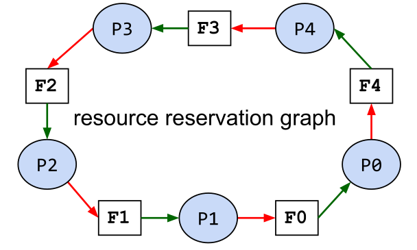
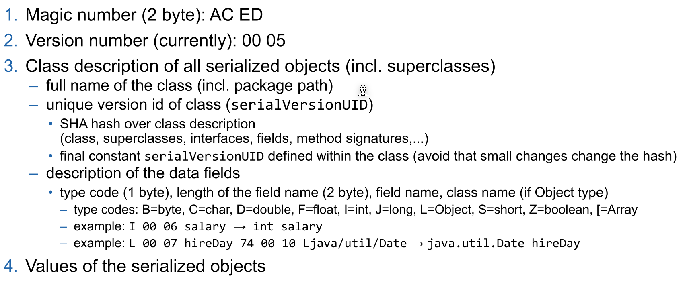

# PROG2 Summary

## Gradle

## Concurrency

### Types of Concurrencies

There are multiple types of concurrencies:

* True concurrency
  On a computer with more multiple cores, each core can run a flow independently
* Interleaving concurrency
  Each flow gets a slice of time. After that time the flow will be paused and the core will work on another flow.
  The scheduler controls which core works on which flow

#### Strategies for Interlaving Concurrency

* Non-Preemptive (cooperative)

  The process releases the core voluntarily 
  Tyes: FCFS(First comes, first served), SNP(shortest process next). This was how it was in the olden days 

* Preemtive 
  A scheduler can interrupt a process

### Program vs Process vs Thread

A program is a sequence of instructions and can consists of multiple processes.

A **process** executes a program or part of it and can consists of multiple threads. Each process has its own memory, uses IPC (Inter-Process-Communication) to communicate to other processes and switching between processes is expensive.

A **thread** is part of a process and runs one flow. It shares its memory with the other threads in the same process and switching between thread is cheap.


### Java-Concurrency

#### Thread

* `Thread.sleep()` doesn't gurantee that sleep doesn't wake up early or late
* `Object.yield()` will advice the scheduler to release the thread, but there is guarantee that the thread will be suspened
* With `Thread.currentThread()` one can get the thread which runs the current thread
* `Thread.stop()`, `Thread.suspend()` and `Thread.resume()` are depricated and potentialy unsafe

```java
public static void main (String[] args) {
    System.out.println("START: main");
    Thread java = new JoinThread("Java");
    Thread fiji = new JoinThread("Fiji");
    java.start();
    fiji.start();
    System.out.println("Wait for theads..");
    try {
        java.join(); // blocks until java ends
        fiji.join(); // blocks until fiji ends
    } catch (InterruptedException e) {
    	System.out.println("Interrupted");
    }
    System.out.println("DONE main");
}
```

##### Lifecycle of a Thread


A Thread is considered "alive" and `Thread.isAlive()` will return true, when the Thread is either ready, running oder suspended (the blocks with the dotted outline). This means that `run` needs to start running before the Thread is alive.

### Executor Framework

```java
// Example of a Sheduled Executor
public static void main(String[] args) {
    ScheduledExecutorService scheduledExecutor = Executors.newScheduledThreadPool(2);
    
	scheduledExecutor.execute(new ScheduledTask(0, System.currentTimeMillis()));
    Future<?> future = scheduledExecutor.submit(new ScheduledTask(0, System.currentTimeMillis()));
    
    scheduledExecutor.schedule(new ScheduledTask(1, System.currentTimeMillis()), 4, TimeUnit.SECONDS);
    scheduledExecutor.scheduleAtFixedRate(new ScheduledTask(2, System.currentTimeMillis()),4,3,TimeUnit.SECONDS);
    
    scheduledExecutor.scheduleWithFixedDelay(new ScheduledTask(3, System.currentTimeMillis()),2,3,TimeUnit.SECONDS);
    
    try {
    	TimeUnit.SECONDS.sleep(20); // waiting for 20s
    } catch (InterruptedException e) { }
    scheduledExecutor.shutdown();
}

private static record ScheduledTask(int id, long starttime) implements Runnable {
    @Override
    public void run() {
        System.out.println("Executing Task " + id +
        " at " + (System.currentTimeMillis()-starttime) + " ms after start " +
        " in Thread : " + Thread.currentThread().getName());
    }
}
```

####         Executor Service


An `Executor` just promises to execute a given task.

An `ExecutorService` extends `Executor` to allow to shutdown the Executor and to track the progress and the state of a task. The `shutdownNow()` method uses `Thread.interrupt()` under the hood and is thus not deprecated.

The `ScheduledExecutorService` extends the `ExecutorService` to allow a task to be scheduled. The method signitures of the new methods are: 

* `schedule(Runnable task, long delay, TimeUnit unit)`,
* `scheduleAtFixedRate(Runnable task, long initialDelay, long period, TimeUnit unit)`
* `scheduleWithFixedDelay(Runnable task, long initialDelay, long delay, TimeUnit unit)`

#### Thread Pools

A thread pool uses multiple threads which are reused for multiple tasks. Thread pools usually use a queue to hold the tasks to be executed.

A special kind of thread pool is a **Blocking Queue**, which when it's full, will reject newly submitted tasks.

Most `Executor Services` use thread pools underneath.

#### Different Executors

| Executor Name                                         | Description                                                  |
| ----------------------------------------------------- | ------------------------------------------------------------ |
| `Executors.newSingleThreadExecutor()`                 | Creates an Executor which only uses one thread               |
| `Executors.newFixedThreadPool(int numOfThreads)`      | Creates an Executor which has the given number of threads. Those thread will be reused |
| `Executors.newCachedThreadPool()`                     | Creates new threads as needed. It will retain Threads for an amount of time (approx. up to 60s) and will stop it after. |
| `Executors.newScheduledThreadPoool(int numOfThreads)` | Creates a new scheduled thread pool with the given number of threads. |
| `Executors.newSingleThreadExecutor()`                 | Creates a new scheduled executor with a single thread        |

### Callable and Futures

```java
public interface Callable<V> {
	V call() throws Exception;
}
```

A `Callable` will return a result or an exception and can also be submitted to an `ExecutorService` and a `Future<V>` will be returned.

```java
public static void main(String[] args) throws InterruptedException, ExecutionException, TimeoutException {
    ExecutorService service = Executors.newSingleThreadExecutor();
    Future<String> future = service.submit(() -> "Hello world");
    String result = future.get(); // waits until the future completes
    result = future.get(1, TimeUnit.SECONDS); // will throw TimeoutException after 1 second
    future.cancel(<mayInterruptIfRunning>); // will cancel the future
    future.isDone(); // returs if the future is done
    future.isCancelled(); // returns if the future was cancelled
}
```

### Patterns

#### Wait for all Tasks to finish

```java
List<Future<?>> futureList = executorService.invokeAll(taskList);
for(Future<?> future : futureList) {
	future.get(); // wait for each future
}
```

#### Wait for the fastest task to finish

```java
String result = executorService.invokeAny(taskList);
/*
The result of the task which completed first, is returned
*/
```

### Share Data between Multiple Threads

### Atomic

Use the atomic data types, like `AtomicBoolean`, `AtomicInteger`, `AtomicLong`, `AtomicReference`, `AtomicIntegerArray`, `AtomicLongArray` or `AtomicReferenceArray`.

```java
private static class Account {
    private final int id;
    private AtomicInteger balance;
    
    public Account(int id, int initialAmount) {
        this.id = id;
        this.balance = new AtomicInteger(initialAmount);
    }
    
    public int getId() { return id; }
    
    public int getBalance () {
    	return balance.get();
    }
    
    public void setBalance(int amount) {
   		this.balance.set(amount);
    }
    
    public void transferAmount (int amount) {
    	this.balance.addAndGet(amount);
    }
}
```

### Synchronized

```java
class Account {
    private int balance;
   	public synchronized void transferAmount1(int amount) {
        this.balance += amaount;
    }
    
    public void transferAmount2(int amount) {
        synchronized(this) {
        	this.balance += amaount;
        }
    }
    
    public synchronized static staticLock1() {
        //do stuff
    }
    public static staticLock1() {
        synchronized(Amount.class) {
            // do stuff
        }
    } 
}
```

Never call an other synchronized method which uses a different object. This can cause a dead lock.

### Monitor

A Java object can be used as a locked. 

```java
class FooBar {
	private Object monitor;
    
    public void test() {
        synchronized(monitor) {
            // waits for the monitor to be called with monitor.notify() or monitor.notifyAll()
            monitor.wait();
        }
    }
}
```

`Object.wait()` blocks until `Object.notify()` or `Object.notifyAll()` is invoked on the same monitor object. `notify()` only wakes up one waiting Thread while `notifyAll()` will wake up all waiting threads.

**`wait()` releases the monitor object**. 

### Types of Synchronization

#### Mutual Exclusion

Mutual Exclusion means that only only thread can access a shared resource at a time. This usually means, that a section of code needs to be locked (eg. with synchronize) until the thread is done with that code.

#### Conditional Synchronization

Conditional synchronization is needed when one thread waits for an event to happen in another thread. This is basicly the Producer-Consumer "Pattern". The order of events or operations is critical.

#### Producer-Consumer

The producer produces some data which can be consumed by the consumer. The consumer tries to access the resource. If it is already ready, then it can just continue. If not it will `wait()` for the producer to `notify()` its monitor after which it can access the resource.

The producer thread might needs to throttle itself to avoid loosing results when no consumer can consume them.


Here is an example for a consumer-producer example: The `while` loop is necessary because when the thread calls `wait()` it releases the monitor the synchronize block and an other thread can enter the synchronize block and call `wait()`.


#### Synchronized Queue

With a queue the problem of the consumer and producer can be abstracted into a separate class to make it less brittle. Implementing the following becomes trivial:

* The producer fills the queue with data
* The consumer retrieves the data from the queue if available
* The consumer waits only if the queue is empty
* The producer waits when the queue is full


#### Locks and Conditions

A `Lock` is like a monitor object but instead of using `synchronize` the methods `lock()` and `unlock()` are used (in a try-finally-block). 

Additionally `Conditions` can be created with `Lock.newCondition()`. A condition is connected to its lock and can only be interacted with when its lock is locked. A Condition has `await()`, `signal()` and `signallAll()`, which behaviour like `Object.wait()`, `Object.notify()` and `Object.notifyAll()`. The advantage of Conditions is, that each lock can have multiple conditions. 

With `ReentrantLock.hasWaiters(Condition)` can be checked, if a thread currently waits for a condition.


```java
public class ConditionalSyncQueue<E> {
    private Lock mutex = new ReentrantLock();
    private Condition notEmpty = mutex.newCondition();
    private Condition notFull = mutex.newCondition();
    private LinkedList<E> queue = new LinkedList<E>();
    private int capacity = 5;
    
    public void add (E item) throws InterruptedException {
        mutex.lock(); // enter critical section
        try { // condition 1: queue not full
            while(queue.size() >= capacity) {
            	notFull.await();
       		}
        	queue.addLast(item);
        	notEmpty.signal();
        } finally {
        	mutex.unlock(); // exit critical section
        }
    }
    
    public E remove() throws InterruptedException {
        E item = null;
        mutex.lock(); // enter critical section
        try { // condition 2: queue not empty
            while (queue.empty()) {
            	notEmpty.await();
            }
            item = queue.removeFirst();
            notFull.signal();
        } finally {
            mutex.unlock(); // exit critical section
        }
        return item;
    }
}
```

#### ReadWriteLocks

A `ReadWriteLock` is like a `Lock` but it provides 2 `Lock` instances:

* A write lock: When locked, neither locks are lockable anymore
* A read lock: When locked, the write lock won't be lockable


The `ReentrantReadWriteLock` has the methods `readLock()` and `writeLock()` which return the respective lock instance.

This helps reduce the performance impact of synchronizing.

### Problems of lack of Synchronization

#### Lost Update

A lost update happens when an write/update was overridden by another thread.


### Deadlocks

A deadlock occurs when two threads wait for a resource, which is locked by the other thread. It can **only** occur when all of the following conditions are meth:

1. **Mutual Exclusion**: Each resource is available only once
2. **Hold and Wait Condition**: A thread which already blocks a resource, claims additional resources
3. **No Preemption**: A blocked resource cannot be taken away by the OS
4. **Cyclic waiting Conditions**: A chain of processes exists which are waiting for a resource, which is blocked by a successor in the chain

#### How to avoid Dead Locks

Generally avoiding shared resources will avoid dead locks as well. This however isn't always possible.  In those cases, insure that a resource is always locked in the same order,

```java
public static void transfer(Account from, Account to, int amount) {
    boolean isLower = from.getId() < to.getId();
    Account lowerAccount = isLower ? from : to;
    Account higherAccount = !isLower ? from : to;
    synchronized( lowerAccount ) {
        synchronized( higherAccount ) {
            from.transferAmount(-amount);
            to.transferAmount(amount);
        }
    }
}
```

Another solution is to program a special case for one of the resource which will access the resources in the reverse direction (see Dining Philosophers)

### Dining Philosophers

There are 5 Philosophers. Each philosophers can either eat or think. For eating a philosopher needs two forks, but there are only 5 forks in total, so not everybody can eat at the same time.


A naive solution would first let the philosophers take the right and then the left fork. This would result in everybody holding a fork in the right hand and waiting for a fork to be available resulting in a **dead lock**.



To prevent this cyclic waiting condition the abstract can be change to always take and release two forks as one atomic action. The situation above should never happen.

A second solution is to change the behavior of one philosopher to first take the left and then the right fork.


## GUI

### Scene Graph

A scene Graph is a cycle free graph of nodes. It contains **one** root node.


### Panes

* **Group**
  All children keep their size and it is just large enough to contain all children

* **Region**
  Is the base class of all panes and controlls and defines minimum, maximum and desired size

* **Pane**
  The size of the pane and the layout of its children can be manually set; clipping is possible

* **HBox/VBox**
  Aligns the children horizontally or vertically
  

* **BorderPane**
  Defines 5 regions. Nodes are added by `setCenter(Node)`, `setLeft(Node)`, ...

* **GridPane**
  The children are aranged in a table. Nodes are added with `add(Node, column, row)`

* **FlowPane**
  Automaticly aranges nodes in a new row/column, when the size of the pane is filled.

* **AnchorPane**

  Nodes can be anchored to multiple edges. This allows for a flexible layout. A node is added with `getChildren().add(Node)` and can be attached to an edge with `setTopAnchor(Node, distance)`, `setLeftAnchor(Node, distance)`, `setBottomAnchor(Node, distance)` and `setRightAnchor(Node, distance)`.

* **TilePane** 
  Every Node gets the same amount of space in a grid. Like in a `FlowPane`, nodes are wrapped to the next line if the size of the pane is filled. Either a max tile size is set or the biggest child is used as a reference. Nodes are added with `getChildren().add(Node)`.

### Menus

The root is `MenuBar` which contains `Menu`s  (contain other Menus oder MenuItems) or `MenuItem`s (contains text and/or graphics), like `CheckMenuItem` or `RadioMenuItem`

```java
MenuBar menuBar = new MenuBar();
Menu fileMenu = new Menu("File");
menuBar.getMenus().add(fileMenu);

MenuItem quitMenuItem = new MenuItem("Quit");
fileMenu.getItems().add(quitMenuItem);
Image quitImage = new Image(getClass().getClassLoader().getResourceAsStream("quit-icon.png"));
quitMenuItem.setGraphic(new ImageView(quitImage));
quitMenuItem.setAccelerator(KeyCombination.keyCombination("ESC"));
quitItem.setOnAction(new EventHandler<ActionEvent>() {
	public void handle(ActionEvent e) { Platform.exit(); }
});
// or as lambda expression
quitMenuItem.setOnAction(e -> Platform.exit());

CheckMenuItem bookMenu = new CheckMenuItem("Book");
bookMenu.setSelected(true);
fileMenu.getItems().add(bookMenu);
```


### Events


An event has two phases:

1. **Event Capturing Phase**:
   The event is passed up from the origin node to the stage. On each node, its `EventFilter` is invoked
2. **Event Bubbling Phase**
   The event is passed back up from the stage to the origin node. On each node, its `EventHandler` is called.

An event handler can be added to a node via their respective methods:

```java
Button button = new Button("test");
button.setOnAction((ActionEvent event) -> {});
button.setOnAction(new EventHandler<ActionEvent> {
    @Override
    public void handle(ActionEvent event) {}
});
button.setOnMouseClicked((MouseEvent event) -> {});
```

All event handlers are `EventHandler<? extends Event>`

### Demo App

```java
public class App extends Application {
    @Override
    public void start(Stage primaryStage) throws Exception {
    	FXMLLoader loader = new FXMLLoader(getClass().getResource("test.fxml"));
        Parent parent = loader.load();
        Scene scene = new Scene(parent);
        stage.setTitle("Test");
        stage.setScene(scene);
        stage.setMinWidth(400);
        stage.setMinHeight(600);
        // if this is  a new stage
        stage.initOwner(parentStage);
        // disables events for owner windows only
        stage.initModality(Modality.WINDOW_MODAL);
        // disables events for all app windows
        stage.initModality(Modality.WINDOW_MODAL);
        stage.show();
        // or stage.showAndWait(); to block until modal window is closed
        // create new Stage (primaryStage= new Stage()) to open a new window
    }
}
public class Controller {
    @FXML
    private BorderPane rootPane;
    
    @FXML
    public void initialize() {
        rootPane.setStyle("-fx-bakground-color: red;");
        rootPane.setLayoutX(0);
        rootPane.setLayoutY(0);
    }
}
```

### MVC

> **Model**: Contains the data with the domain logic, but it has to be independent from the View-Classes.
>
> **View:** The UI components which render the data. The view doesn't call the model directly (usually), but it knows about the types of the model (for example via generics).
>
> **Controller:** The glue between the model and the UI. It listens to events from the UI and calls the model accordingly
>
> 

The benefits of this pattern are:

* Independent development and testing of model and UI
* Its possible to have multiple views and controllers for one model
* Changes to the UI or model are far easier

### FXML


### Properties and Bindings

```java
IntegerProperty prop = new SimpleIntegerProperty(3);
prop.addListener(new ChangeListener<Number>() {
    public void changed(ObservableValue<? extends Integer> o, Number oldVal, Number newVal) {}
});
prop.getValue(); // returns the value
prop.setValue(4); // sets the value
prop.bind(otherProp); // binds the prop to the otherProp
prop.bindBidirectional(otherProp); // binds the two properties bidirectionally

```

### Initialize

The method `initialize()` can be annotated with `@FXML` and will be called when the controller is initialized.

## Testing

> Testing is the process of executing a programm with the intent of finding errors.

### Principles of Testing

1. Specification of Input and Output
   For each test case the input and the expected output should be specified.
2. Separation of Creation and Testing
   The developer of the code shouldn't write the test for their code.
3. Completeness of Tests
   Code should always be tested for valid inputs and **invalid** tests. The natural tendency is to test only the valid inputs.
4. Testing is an investement
   Test cases are reused
5. Error Cluster
   If an error is found in a section of code,  the probability of more errors increases. Error-prone Sections should be well tested.

### Mock Testing

Mock testing is used when a class with dependencies should be tested. The dependencies can be mocked that it implements the minimal of behaviour to function. This allows to only test the class under testing and not its dependencies.

### Different Mocking Types

There are different type of mock classes.


#### Dummy

Dummies are objects which are never used. They fill parameter lists of methods, if those methods would throw NullPointerExceptions otherwise.

#### Stubs

A stub is the minimal implementation of an interface. Void method usually don't do anything and methods with a return value will usually return a hard coded value.

Here is an example.

```java
public class EmailStub implements EmailServer {
    public void sendMail(String mailTextt) {
        // do nothing
    }
    
    public String receiveMail() {
        return "Mail received"; // a hard coded value
    }
}
```

An `EmailDummy` would return `null` in `receiveMail()` because it is just a dummy.

#### Spies

Spies are similar to stubs, but record which members were invoked. This information can be checked in unit tests.

#### Fakes

A fake will implement a class similar to the production class but with shortcuts (e.g. an in-memory database)

#### Mock

A test double which implements the functions in away which we expect for the test. Depending on how they are implemented, they can function as a dummy, stub, spy or a fake.

Mock testing is usually split in multiple phases: 

1. Create: The mock object is created
2. Specify: The expected behaviour is specified
3. Use: The mock object is used in a normal unit test
4. Verify behaviour: The mock object is verified

```java
public class OrderInteractionTester extends MockObjectTestCase {
	private static String TALISKER = "Talisker";
    public void testFillingRemovesInventoryIfInStock() {
        // configuration
        Order order = new Order(TALISKER, 50);
        Mock warehouseMock = new Mock(Warehouse.class);
        // expectations
        warehouseMock
            .expects(once())
            .method("hasInventory")
            .with(eq(TALISKER),eq(50))
            .will(returnValue(true));
        warehouseMock
            .expects(once())
            .method("remove")
            .with(eq(TALISKER), eq(50))
            .after("hasInventory");
        //exercise
        order.fill((Warehouse)warehouseMock.proxy());
        //verify
        warehouseMock.verify();
        //verify expected behavior
        assertTrue(order.isFilled()); //verify state
    }
}
```

### Blacking-Box vs White-Box Testing


In black-box testing (or state testing), only the public interface is known. No assumptions is done about the internal implementaiton. Usually stubbing can be used.

In white-box testing (or behaviour testing) the inner working of the class is known and tested. Here, usually mocking can be used.

### Mockito

#### Create a Mock

Either the method `mock(Class<?> clazz)` is used or the annotation `@Mock` for which `MockitoAnnotations.openMocks()` needs to be called in the setup method.

```java
void testHalf(@Mock Half mockedHalf2) {
    Half mockedHalf = mock(Half.class);
}
```

#### Mock Behaviour

To mock the **return value** of methods, the `when(<method>).thenReturn(<value1>).thenReturn(<value2>)` pattern can be used. When the returned value should have a bit more logic than a constant value, the `thenAnswer(Answer<T>)` method can be used (see example below).

To mock an **exception throwing** method, the `doThrow(<exception>).when(<mockObj>).<method>(<args>)` pattern needs to be used. The method must support throwing the exception in case of an checked-exception.

There are multiple **matchers** available, which can match an argument of a mocked method:

* **Any-matchers**: `anyInt()`, `anyString()`, `any(Class<?> clazz)`, ...
* **String-matchers**: `startsWith(String)`,  `endsWith(String)`, `contains(String)`, ...
* **Object-matchers**: `isNull()`, `isNotNull()`, ...
* **Compare-matchvers**: `eq(T obj)`, ...
* **Custom-matchers**: `argThat()...`, `intThat(...)`, ...

```java
Person mock = mock(Person.class);

// mock return values
when(mock.getName()).thenReturn("Hans").thenReturn("Max");
doReturn(10).doReturn(20).when(mock).getAge();
when(mock.getMessage(anyString())).thenAnswer((InvocationOnMock invocation) -> "hello world");

// mock exception throwing
doThrow(new IllegalArgumentException()).when(mock).setAge(-1);

```

When an method isn't mocked, then a value is still returned based on the return value:

* The return value is an **primitive**: The "zero"-primitive is returned
* The return value is a **primitive wrapper class**: Then the "zero"-primitive of the wrapper class is returned
* The return value is a **collection**: The return value is an empty collection
* For the **toString()** method an description of the mock is returned
* For `Comparable#compareTo(T other)` returns zero if the references are equal, else a non-zero value
* **Else**: `null` is returned.

#### Verify Behaviour

Mockito can verify that a method was invoked. For this, the pattern `verify(<mock>).<method>(<args>)` can be used. With an additional argument of verify, further conditions can be specified. With `verify(<mock>, never()).<method>(<args>)` can be checked that the method was never invoked. Other condition includes `never()`, `times(int)`, `atLeastOnce()`, `atLeast(int)`, `atMost(int)`, `timeout(int milliseconds)` (that the method is invoked in the given timeout). These conditions can be combined like `timeout(10).times(2)`

Mockito can also verify the order in which methods were called. For this a `InOrder` object can be created with `inOrder(<mockObj>)`. On the `InOrder` object, the `verify(...)` method can be used.

```java
verify(mockedHalf).contractAtrium();
verify(mockedHalf, times(2)).isAtrioventricularValveOpen();
verify(mockedList, never()).add("ZHAW");

InOrder inOrder = inOrder(singleMock);
// Verify the order
inOrder.verify(singleMock).add("second"); 
inOrder.verify(singleMock).add("first");
```

#### Spies

A spy object is created based on a "real" object. All methods are delegated to this object, but the behaviour of methods can be selectively changed (similar with mocks) and it can verify than methods were called. It can be created with `spy(Object obj)` and can be used like a mock. Similar to `@Mock` the `@Spy` annotation can be used instead of `spy(...)` (`MockitoAnnotations.openMocks()` needs to be called in the setup method).

```java
List list = new LinkedList();
// create a spy on the real object instance
List spy = spy(list);
// stub the size() method
when(spy.size()).thenReturn(100);
// add() is not stubbed. So it will use the real method
spy.add("one"); spy.add("two");
assertEquals("one", spy.get(0));
assertEquals(100, spy.size());
```

## IO

### Serializing

In order for an object to be serializable in needs to implement the marker interface `Serializable`.



Fields can be marked with transient (`private transient Date someDate;`) if they shouldn't be serialized. This can be usefull for serializing classes which contain unserializable classes (like dates, file descriptor, network sockets or db connections).

```java
Employee harry = new Employee("Dirty Harry", 50000, LocalDate.of(1967, 3, 11));
Manager boss = new Manager("Walter Smith", 80000, LocalDate.of(1950, 12, 4)); // Manager is extending Employee
boss.setAssistant(harry); 

// Save (serialize) two objects to the file empolyee.dat
try (ObjectOutputStream out = new ObjectOutputStream(new FileOutputStream("employee.dat"))) {
    // objects are written in the given order to the file
    out.writeObject(harry); // write object Dirty Harry
    out.writeObject(boss); // write object Walter Smith
    out.writeInt(12); // write value of primitive type int
}
// Load (deserialize) two objects from the file employee.dat
try (ObjectInputStream in = new ObjectInputStream(new FileInputStream("employee.dat"))) {
    // number and order of reading the objects must match, also the type must be compatible (match or super class)
    Employee e1 = (Employee) in.readObject(); // object for Dirty Harry
    Employee e2 = (Employee) in.readObject(); // object for Walter Smith
    // e2.getClass().getName() would return type Manager
    int count = in.readInt(); // read primitive type int
}
```

### IO Streams


A byte stream can be converted to a char stream with `InputStreamReader` and `OutputStreamWriter` respectively.


`InputStream`  and `Readers` usually allow to skip a number of bytes/chars with `skip(long n)`. However, `OutputStream`s  and `Writer`s don't allow removing or inserting into a file, only appending (`FileOutputStream(File file, boolean append)`) or replacing is supported.

### RandomAccessFile

Allows reading from anywhere in the file, not just skipping bytes like an `InputStream`. This can be done with the `seek(long pos)` or the `skipBytes(long n)` methods.

```java
// create file and write some data into it
File f = new File("randomaccessfile.txt");
try (BufferedWriter bw = new BufferedWriter(new FileWriter(f,true))) {
    for(int i=2; i<=10; i++) { 
        if( i%2 == 0) { 
            bw.write(Integer.toString(i)); bw.newLine(); 
        } 
    }
}
try (RandomAccessFile randomFile = new RandomAccessFile(f,"rw")) { // read-write mode
    for(int i=1; i<=5; i++){
        randomFile.seek(randomFile.length()); // set file pointer to end of file (EOF)
        randomFile.writeBytes(Integer.toString(i)); // append "1","2","3","4","5" at EOF
    }
}
try (RandomAccessFile randomFile = new RandomAccessFile(f, "r")) { // read-only mode
    int i = (int) randomFile.length(); // get length of file in bytes
    System.out.println("Length: " + i);
    randomFile.seek(i-3); // set file pointer to EOF-3 bytes
    for(int ct = 0; ct < 3; ct++){
        byte b = randomFile.readByte(); // read byte(s)
        System.out.println((char)b);
    }
}
```

### Charset

An instance of `Charset` can be either obtained by `Charset.forName(<name>)`, `Charset.getDefaultCharset()` or `Charset.getAvailableCharsets()`. Alternatively `StandardCharsets.UTF_8` can be used.

## Logger

Each `Logger` instance has a list of `Handlers`. A `Handler` can be used by multiple `Loggers` and handles the storing of the logging messages (like writing it to a file, or displaying in the console). Both the `Logger` and the `Handler` have a Level. And each will only forward messages which have a level higher than their configured level. 

The possible levels are: `SEVERE(1000)`, `WARNING(900)`, `INFO(800)`, `CONFIG(700)`, `FINE(500)`, `FINER(400)`, `FINEST(300)`.


The following properties file is an example logging configuration.

```properties
## configure handlers
java.util.logging.ConsoleHandler.level = ALL
## File handler configuration
## see https://docs.oracle.com/en/java/javase/11/docs/api/java.logging/java/util/logging/FileHandler.html
java.util.logging.FileHandler.level = ALL
# %g = generation number, %u = unique number to resolve conflicts
java.util.logging.FileHandler.pattern = log-%g-%u.log
# use SimpleFormatter instead of default XMLFormatter
java.util.logging.FileHandler.formatter = java.util.logging.SimpleFormatter
java.util.logging.FileHandler.encoding = UTF-8
# max log file size in byte before switching to next generation (=1kB); 0 = unlimited
java.util.logging.FileHandler.limit = 1024
# max number of generations (%g) before overwriting (5 -> 0..4)
java.util.logging.FileHandler.count = 5
java.util.logging.FileHandler.append = true
## configure Formatter (see SimpleFormatter documentation)
java.util.logging.SimpleFormatter.format = [%1$tc] %4$s: %5$s {%2$s}%6$s%n
## configure default log level (for all loggers, if not overwritten below)
.level = INFO
## configure root logger ""
handlers = java.util.logging.ConsoleHandler
level = INFO
## Application specific logger configuration
# loggers starting with "ch.zhaw.prog2.io" -> write to console and file and do not forward to parent handlers
ch.zhaw.prog2.io.level = FINE
ch.zhaw.prog2.io.handlers = java.util.logging.FileHandler, java.util.logging.ConsoleHandler
ch.zhaw.prog2.io.useParentHandlers = false
# logger for class ch.zhaw.prog2.io.LogConfiguration
ch.zhaw.prog2.io.LogConfiguration.level = FINEST
```

A log configuration can be loaded anytime and all already existing loggers will be updated.

```java
InputStream logConfig = this.getClass().getClassLoader().getResourceAsStream("log.properties");
LogManager.getLogManager().readConfiguration(logConfig);
```
