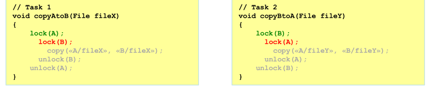
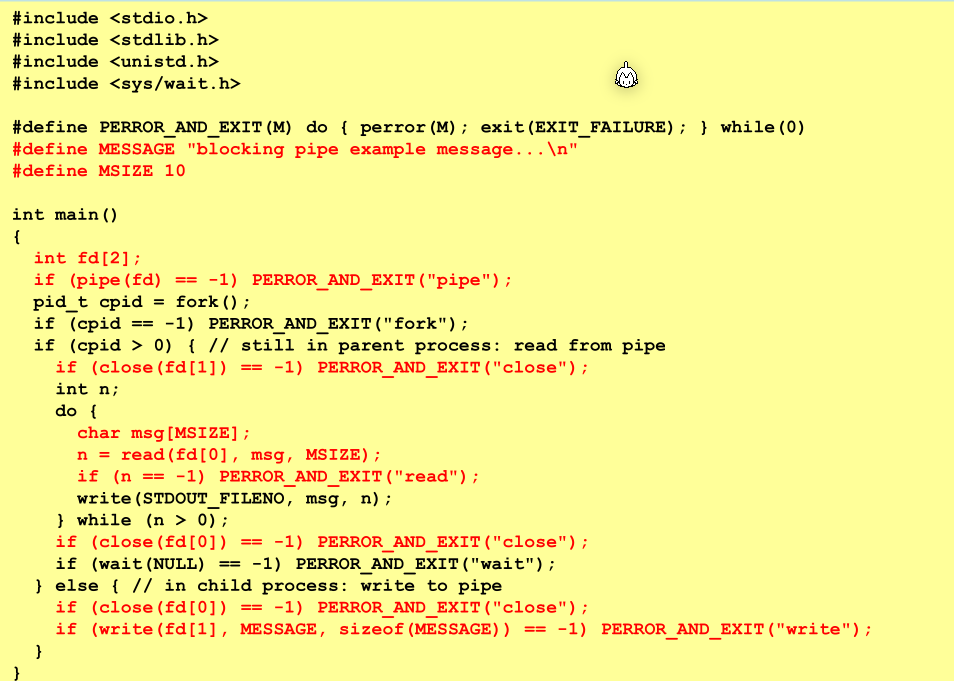
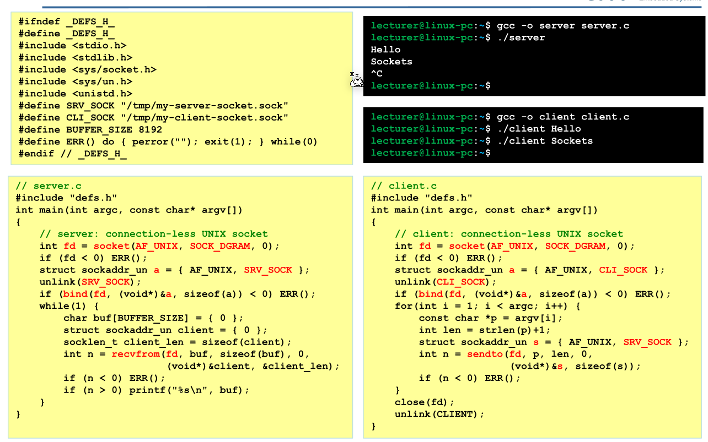

# OS

## Hardware


### CPU

Die CPU führt die Befehle aus und ist Chef des System-Bus. Über den Bus kann die CPU auf den Speicher oder IO zugreifen.

Im `PC` Register (Program Counter) steht, wo in Memory die nächste Maschineninstruktion steht. In `IR`-Register ( Instruction Register) steht die aktuell ausgeführte Instruktion.

`ALU` steht für Arithmentic-Logic-Unit, welches mit Integers rechnet. 

### Memory

Die Memory wird über den System-Bus angesprochen.

### CPU-Entlastung

- Ablaufbeschleunigung in der CPU
  - Cache:beschleunigter Zugriff auf zwischengespeicherte Daten
  - Pipeline:beschleunigte Ausführung durch gestaffelte Verarbeitung

- Arbeitsentlastung der CPU
  - IC: Interrupt Controller vermitteln von Interrupts
  - DMA: Direct Memory AccessDaten kopieren ohne CPU Interaktion
  - FPU: Floating-Point UnitRecheneinheit für Gleitkommazahlen
  - DSP: Digital Signal Processorspezielle Daten-Recheneinheit
  - GPU: Graphics Processing Unit spezielle Graphik-Recheneinheit
  - MPU: Memory Protection Unit
    Überwachung von Adresszugriffen


### Modi

Im Supervisor/Kernel-Mode läuft der Kernel. So bald ein Program auf Funktionalität des Kernels zu greifen möchte, muss ein Sys-Call aufgerufen werden, welcher der Modi wechselt.

## Schichten


## Linux Startup


## Prozess

Der Header `unistd.h` muss inkludiert werden.

### Prozess erstellen (`fork()`)

Mit `pid_t fork()` kann ein neuen Prozess erstellt werden, welche eine **Kopie** des aktuellen Prozess ist. Von diesem Punkt ab laufen zwei Threads den gleichen Code. Im aktuellen Prozess gibt `fork()` die PID des neuen Prozess zurück, im neuen Prozess wird `0` zurück gegeben.

Falls der Return Value kleiner als `0` ist, trat ein Fehler auf.

Es werden alle File Deskriptoren, Semaphoren, Signal Actions vererbt.

### `exec()` in neuen Prozessen

`execX()` Funktionen ersetzt den Code in einem Thread. Dies kann zusammen mit `fork()` benützt werden, um ein Programm in einem neuen Thread zu starten.

* `int execv(char *pathname, char *argv[])`
  Führt das Programm bei `pathname` mit den angegebenen Argumenten aus. Der aktuelle Code wird **ersetzt**
* `int system( char *command)`
  Ist eine Helper-Method, welche mit `fork()` und `execv()` ein neues Programm ausführt und wartet bis das Programm fertig ist. Der Return Value des Programmes wird zurückgegeben. Der angegebene Befehl wird mit `/bin/sh` ausgeführt.
* `FILE *popen(char *command, char *type)` und `int pclose(FILE *stream )`
  Funktioniert wie `system()`. Es wird der Befehl `command` in `/bin/sh` ausgeführt und ein File-Stream zurück gegeben, von welchem mit `fgets(char *s, int size, FILE *stream)` zugegriffen werden kann.
  Der `type` muss `r` für zum Lesen und `w` für zum Schreiben enthalten

```c
#include <stdlib.h>
#include <stdio.h>
#include <unistd.h>
#include <sys/wait.h>

int main(void) {
    pid_t pid = fork();
    if (pid > 0) {
        wait(NULL);
    } else {
        // using system(...)
        int exit_code = system("ls -la");
        printf("child exited with %d\n\n", WEXITSTATUS(exit_code));

        // using popen(...)
        FILE *stream = popen("ls -la", "r");
        char buffer[256];
        while (fgets(buffer, 256, stream) != NULL)
        	printf(buffer);
        
        exit_code = pclose(stream);
        printf("child exited with %d\n\n", WEXITSTATUS(exit_code));

        // using execv(...)
        char *argv[] = {"ls", "-la", NULL};
        if (execv("/usr/bin/ls", argv) == -1) ERROR("execv");
        printf("This will never be executed\n");
    }
}
```

### `wait()` /`waitpid()` (sys/wait.h)

Nach dem ein Prozess beendet wurde, gibt es ihn noch als Zombie-Prozess bis der Parent-Prozess `pid_t wait(int *wstatus)` oder `pid_t waitpid(pid_t pid, int *wstatus, int options)` aufgerufen hat und den Status so abgeholt hat.

```c
pid_t pid = fork();
if(pid == 0) {
    int wstatus;
    pid_t wpid = waitpid(pid, &wstatus, 0);
    if(wpid != null) {
        perror("waitpid");
        exit(1);
    }
    printf("process %d exited with status %d (%d)\n", pid, WEXITSTATUS(wstatus), wstatus);
    
    wait(&wstatus); // will do the same as waitpid() but with a random child-process
}
```

## Threading

### Begriffe

* **Race Condition**: 
* **Dead Lock**: Zwei Threads warten auf eine Resource, welche vom anderen Thread "gelockt" wurde
  
* **Live Lock**: Zwei Threads haben eine Resource frei gegeben und warten darauf, dass sie der andere Thread lockt
* **Critical Section**: Ein Stück code, in welchem nur ein Thread gleichzeitig läuft
* **Starvation**: ein blockierter Task kommt nie an die Reihe, da andere Tasks sich vordrängen. Dies sollte vom OS behoben werden.

### `volatile`

Das Volatile-Keyword zwingt dem Compiler nicht zu optimieren. Somit wird wirklich ausgeführt, was in C geschrieben wurde. Ansonsten kann der Compiler Schreib-Aufrufe verschieben oder Resultate cachen. Dies ist nützlich bei Multi-Threading, da eine Variable von mehreren Threads geändert werden kann und das Cachen problematisch sein könnte.

```c
volatile int value = 0; // erstellt ein neuen volatile int
```

### `pthread_create(...)`

Mit `int pthread_create(pthread_t *thread, pthread_attr_t *attr, void *(*start_routine)(void *), void *arg)` kann einen neuen Thread gestartet werden.

Wenn ein neuen Thread erstellt wird, muss entweder `pthread_detach()` oder `pthread_join()`

```c
void *worker(void *arg) {
    printf("worker: hi\n");
    return "Hello";
}

void main() {
	pthread_t thread;
	pthread_create(&thread, NULL, worker, NULL);
    void *msg;
    pthread_join(&thread, &msg); // pthread_join(...) wants void** as the msg
    printf("Thread sent %s\n", (char*) status)
}
```

### `pthread_detach(...)`

`int pthread_detach(pthread_t thread)` markiert ein Thread als detached und wenn ein solchen Thread sich beendet, werden die System-Resourcen automatisch freigegeben.

### `pthread_exit(...)`

`void pthread_exit(void *retval)` beendet den akutellen Thread mit dem mit gegebenen Wert. Dieser kann mit `int pthread_join(...)` abgerufen werden. Processor-Shared-Resources, wie File-Deskriptoren, werden nicht freigegeben.

### `pthread_join(...)`

`int pthread_join(pthread_t thread, void** retval)` wartet bis der angegebene Thread sich beendet. Der "Exit-Status" wird in den `retval` Pointer gespeichert. Die System-Resourcen des Threads werden nach dem `int `

`pthread_join(...)` zurückkehrt, frei gegeben.

## IO

### INode

Die Repräsentation von einem File. Es werden Daten, wie der letzte Zugriffzeitpunkt, Besitzer, Länge, physikalischer Ort auf dem Datenträger gespeichert. **Aber nicht der Name der Datei.**

### Folder

Ein einem Ordner hats Name-INode Paare. Diese geben den INodes einen Name.

### Hardlinks vs Softlink

Ein Softlink funktioniert auf dem Filesystem und sagt dem Kernel, das dieses File bei diesem Pfad gefunden wird.

Ein Hardlink ist ein "Link" auf ein INode. Es kann mehrere Namen für ein INode geben. Der INode ist erst gelöscht, wenn es keinen Namen dafür mehr gibt.

### Spezielle Files

* Character Devices
* Block Devices
* Named Pipes
* Sockets

### `FILE*`

Ein File Deskriptor, welcher auf ein File zeigt.

Folgende Funktionen sind relevant zu `FILE*`. Für viele Funktionen muss der Header `unistd.h` inkludiert werden.


Die folgenden Operationen sind die wichtigsten:

* `FILE* fopen(char *pathname, char* mode)`
  Öffnet ein File zum schrieben. Falls das File nicht geöffnet werden konnte, wird `NULL` zurück gegeben. Wenn für `mode` folgendes angegeben wird:
  * ``r` : File nur zum lesen geöffnet
  * `r+` :  File wird zum lesen und schreiben geöffnet
  * `w` :  File wird zum lesen geöffnet. Das File wird erstellt oder überschrieben
  * `w+`: Wie `r+`, aber das File wird erstellt oder überschrieben
  * `a`: File wird zum schreiben am Ende der Datei geöffnet. Das File wird erstellt, falls es nicht existiert
  * `a+`:  File wird zum lesen und schreiben vom Ende der Datei geöffnet. Falls das Datei nicht existiert, wird es erstellt
* `int fclose(FILE *stream)`
  Flushed und schliesst den angegeben File-Handler. Wenn erfolgreich, `0` wird zurück geben
* `int fprintf(FILE *stream, char* format, ...)`
  Wie `fprint(...)` aber schreibt auf den angegeben File-Handler. Die Funktion gibt die Anzahl gedruckte Zeichen aus oder einen negative Zahl, wenn ein Fehler aufgetreten ist
* `int fgetc(FILE *stream)`
  Liest von `stream` ein char und gibt in zurück. `EOF` wird  beim File-Ende zurück gebenen. Bei einem Fehler wird einen negativen Wert zurück gegeben
* `char* fgets(char *s, int size, FILE *stream)`
  Liest eine Zeile oder bis zum Ende des Streams und schreibt diesen in `s`. Es wird maximal `size-1`-Anzahl chars gelesen (`-1` wegen `\0`)
* `int sscanf(FILE *stream, char *format, ...)`
  Wie `scanf(...)`, aber liest von einem angegeben `stream`
* `int fputc(int c, FILE *stream)`
  Cast `c` zu einem unsigned char und schreibt diesen in den Stream. Als Rückgabe-Wert wird `c` zurück gegeben, oder `EOF` im Fehlerfall.
* `int fputs(char *s, FILE *stream)`
  Schreibt ein String (ohne `\0`) in den Stream. Wenn ein Error aufgetreten ist, wird `EOF` zurück geben, sonst eine positive Zahl.

Nach jedem IO Aufruf sollte überprüft werden, ob die Operation erfolgreich war: 


### Buffereing in Streams

* **unbuffered**: Die daten werden sofort weiter geleitet.
* **fully-buffered**: Wenn der Buffer voll ist, wird der Buffer geleert
* **line-buffered**:
  Wenn das Ende der Zeile erreicht wird oder der Buffer voll ist, wird der Buffer geleert

`stdin` und `stdout` sind normallerweisse fully-buffered, **wenn sie nicht mit einem interaktiven Device verbunden sind**. `stderr` ist unbuffere

### File IO Beispiel

```c
#include <stdio.h>

int main(void)
{
    FILE *test_file = fopen("./test", "w");
    char buffer[200];
    int buffer_size = sizeof(buffer) / sizeof(char);
    char *buffer_pntr = buffer;
    for (int input = getchar(); input >= 0 && input != 'q' && buffer_pntr < buffer + buffer_size; input = getchar())
    {
        *(buffer_pntr++) = (char)input;
    }
    buffer[buffer_size - 1] = '\0';
    fprintf(test_file, "%s", buffer);
    fclose(test_file);

    test_file = fopen("./test", "r");
    while (fgets(buffer, buffer_size, test_file) != NULL)
    {
        printf("buffer: %s", buffer);
    }
    fclose(test_file);
    return 0;
}
```


## Mutex (pthread.h)

In einer Critical Section ist nur ein Thread gleichzeitig am laufen


Mit `int pthread_mutex_init(pthread_mutex *mutex, NULL)` kann ein `p_thread_mutex` Objekt initialisiert werden. Mit `int pthread_mutex_lock(pthread_mutex *mutex)` kann der Mutex gelockt werden und mit  `int pthread_mutex_unlock(pthread_mutex *mutex)` 

Um Attribute für einen Mutex zu ändern, wird der Typ `pthread_mutexattr_t` genuzt, welcher mit `int pthread_mutexattr_init(pthread_mutexattr_t *mutexattr)` initialisiert und mit `int pthread_mutexattr_settype(pthread_mutex *mutex, int flag)`. Ein mögliches Flag ist `PTHREAD_MUTEX_RECURSIVE`, welches bewirkt, dass wenn ein Mutex bereits im Thread a gelockt wurde und Thread a nochmals versucht zu locken, wird nichts getan (sonst gäbe es ein Deadlock).

### Beispiel Mutex

```c
#include <pthread.h>
#include <stdbool.h>
#include <stdio.h>
#include <stdlib.h>
#include <unistd.h>

#define ERROR(M)  ...

static pthread_mutex_t mutex;
static volatile bool running = true;
static volatile int value = 0;

void *worker(void *arg) {
    while (running) {
        if (pthread_mutex_lock(&mutex) == -1) ERROR("lock worker");
        printf("current value: %d\n", value);
        if (pthread_mutex_unlock(&mutex) == -1) ERROR("unlock worker");
    }
}

void *printer(void *arg) {
    FILE *random = fopen("/dev/urandom", "rb");
    if (random == NULL) ERROR("fopen");
    while (running) {
        int input = -1;
        if (fread(&input, sizeof(input), 1, random) != 1) ERROR("read");
        if (pthread_mutex_lock(&mutex) == -1) ERROR("lock");
        value = input;
        if (pthread_mutex_unlock(&mutex) == -1) ERROR("unlock");
    }
    fclose(random);
}

int main(void) {
    pthread_mutex_init(&mutex, NULL);
    pthread_t worker_thread, printer_thread;
    if (pthread_create(&worker_thread, NULL, worker, NULL) == -1) ERROR("worker thread");
    if (pthread_create(&printer_thread, NULL, printer, NULL) == -1) ERROR("printer thread");

    while (getchar() != 'q') {}

    running = false;
    if (pthread_join(worker_thread, NULL) == -1) ERROR("join");
    if (pthread_join(printer_thread, NULL) == -1)ERROR("join");
}
```

### Beispiel Rekursiver Mutex

```c
#include <stdlib.h>
#include <stdio.h>
#include <pthread.h>

#define ERROR(M) ..

#define N 1000

pthread_mutex_t mutex;
int value = 0;

void calc(int step) {
    if (pthread_mutex_lock(&mutex) == -1) ERROR("lock");
    value += step;
    if (pthread_mutex_unlock(&mutex) == -1) ERROR("unlock");
}

void *count(void *p) {
    for (int i = 0; i < N; i++)     {
        if (pthread_mutex_lock(&mutex) == -1) ERROR("lock");
        calc(*(int *)p);
        if (pthread_mutex_unlock(&mutex) == -1) ERROR("unlock");
    }
}

int main(void) {
    pthread_mutexattr_t mutex_attr;
    if (pthread_mutexattr_init(&mutex_attr) != 0) ERROR("init mutexattr");
    if (pthread_mutexattr_settype(&mutex_attr, PTHREAD_MUTEX_RECURSIVE) != 0) 
        ERROR("set recursive type");
    if (pthread_mutex_init(&mutex, &mutex_attr) != 0) ERROR("init mutex");

    pthread_t th_inc, th_dec;
    int inc = 1;
    int dec = -1;
    if (pthread_create(&th_inc, NULL, count, &inc) != 0) ERROR("create inc thread");
    if (pthread_create(&th_dec, NULL, count, &dec) != 0) ERROR("create dec thread");

    if (pthread_join(th_inc, NULL) != 0) ERROR("inc thread join");
    if (pthread_join(th_dec, NULL) != 0) ERROR("dec thread join");
    printf("value: %d\n", value);
}
```

## Sempaphors

Es wird den Include `#include <semaphor.h>`  (und `#include <fcntl.h>` für O_CREAT) benötigt. Semaphors können für Prozesse, wie auch für Threads verwendet werden.

Eine Semaphor benützt ein Counter. Wenn der Counter 0 ist, warten Prozesse, welche `int sem_wait(...)` aufrufen. Wenn der Counter höher ist, wird der Counter um `1` dekrementiert und den Prozess durchgelassen. `int sem_post(...)` erhöht den Counter um `1`, was bedeutet, dass ein Prozess mehr durch kann.

Semaphors benützen die Struktur `sem_t`. Für eine In-Memory Sempahor kann `int sem_init(sem_t *sem, int pshared, unsigned int value)`  benützt weden. Bei einer Named-Semaphor muss `sem_t *sem_open(char *name, int oflags, mode_t mode, unsigned int value)` aufgerufen werden, welches eine neue Semaphor zurück gibt. Als `oflag` kann `O_CREAT` (ohne E am ende) (in fcntl.h definiert) benützt werden und bewirkt, dass die Sempahore erstellt wird, wenn sie noch nicht existiert. `mode_t` ist ein Otal-File Mode (wie `0700`).

`int sem_wait(sem_t *sem)` wartet darauf, dass der Counter höher ist als `0`. Wenn ja, wird er um eins dekrementiert und durchgelassen, sonst wird blockiert.

`int sem_post(sem_t *sem)` erhöht den Counter um eins. Falls ein Prozess bereits `int sem_wait(...)` aufgerufen hat, wird dieser druchgelassen, bzw. der nächste Prozess wird direkt durchgelassen.

In-Memory Semaphors werden mit `int sem_destroy(sem_t *sem)` geschlossen. Named Semaphors werden mit `int sem_close(sem_t *sem)` geschlossen. Mit `int sem_unlink(sem_t *sem)` wird die Semaphor gelöscht, sobald alle Prozesse `sem_close(...)` darauf aufgerufen haben.

### Beispiel

```c
#include <semaphore.h>
#include <sys/stat.h>
#include <fcntl.h>
#include <stdbool.h>
#include <stdlib.h>

int main(void) {
    // creates a unnamed in memory semaphore
    sem_t unamed_sem;
    //false means that the semaphore should be used for thread-communication
    // 0 is the initial value
    if(sem_init(&unamed_sem, false, 0) != 0) 
        perror("Couldn't init unnamed semaphore");

    // creates a named semaphore which can be opend by multiple processes
    sem_unlink("/name");
    // 0 is the initial value
    sem_t *named_sem = sem_open("/name", O_CREAT, 0700, 0);
    if (named_sem == NULL)
        perror("Couldn't init named semaphore");
    sem_unlink("/name");
}
```

Im folgenden Beispiel wurde Sudo-Code geschrieben.


## Barriere

Eine Barriere blockiert mehrere Tasks. Eine Barriere lässt bloss alle Tasks durch, wenn genügend Tasks da sind. Im Vergleich zu dem Sempaphors: 

* Semaphoren: der Busfahrer lässt solange Passagiere in den Bus, bis er voll ist
* Barriere: der Busfahrer wartet bis die gesamte Klasse da ist und lässt sie erst dann
  in den Bus einsteigen

## Signale

Ein Prozess kann einem anderen Prozess Signale mithilfe von `kill(pid, signal_code)`. Der empfangende Prozess kann entweder sich beenden, das Signal ignorieren oder ein Handler ausführen, wenn dieser Code empfangen wird. Das Verhalten von `SIGKILL` und `SIGSTOP` kann nicht verändert werden und beendet immer den Prozess.

Ein Prozess kann mit `pause()` warten, bis ein Signal empfangen wurde.

Mit `sigaction(int sig, struct sigaction *act, struct sigaction *oact)` kann das Verhalten beim Empfangen eines Signal geändert werden. Der int `sig` ist die Nummer des Signales,  `act` ist die neue Action und in `oact` kann ein `sigaction` Variable angegeben werden, in welche die alte Action geschrieben wird. Die `sigaction` kann folgendermassen benützt werden: 

Der Typ von `sigaction.sa_handler` hat den Typ `void(*) (int)`, was ein Pointer auf eine Funktion, wie `void test(int a)`  ist. Diese kann entweder eine eigene Funktion sein, oder `SIG_DFL` für den Default und `SIG_IGN` zum ignorieren, angegeben werden.

`raise(int sig)` sendet das Signal zum eigenen Prozess.

| Signal    | Erklärung                                                    | Default Aktion |
| --------- | ------------------------------------------------------------ | -------------- |
| ` SININT` | Interrupt-Signal von der Tastatur (CTRL-C)                   | Term           |
| `SIGQUIT` | Quit-Signal von der Tastatur (CTRL-\)                        | Core           |
| `SIGABRT` | Abort-Signal via abort() oder assert()                       | Core           |
| `SIGKILL` | Kill-Signal (unveränderbar)                                  | Term           |
| `SIGSEGV` | Unzulässiger Speicherzugriff                                 | Core           |
| `SIGALRM` | Timer-Signal durch alarm() ausgelöst                         | Term           |
| `SIGTERM` | Terminierungs-Signal                                         | Term           |
| `SIGSTOP` | Stoppt den Prozess (oder ignoriert falls gestoppt) (unveränderbar) | Stop           |
| `SIGCONT` | Reaktiviert den Prozess (oder ignoriert falls am Laufen)     | Cont           |

Dabei steht:

* `Ter` für das terminieren der Prozesse
* `Core` für das terminieren der Prozesse und ein Code-Dump zu produzieren
* `Ignored` für das ignorieren des Signales
* `Stop/Cont` für das stoppen und reaktivieren des Prozesses (oder ignorieren, falls nicht anwendbar)

### Beispiel `SA_SIGINFO`

```c
#include <stdio.h>
#include <stdlib.h>
#include <unistd.h>
#include <signal.h>
#include <sys/wait.h>
#include <fcntl.h>

void handler(int sig, siginfo_t *info, void *context) {
    printf("caught (%d): source=%d, this=%d\n", sig, info->si_pid, getpid());
    raise(SIGTERM); // = kill(getpid(), SIGTERM)
}

int main(void) {
    pid_t pid = fork();
   	if (pid == 0) {
        struct sigaction sa = {0};
        sa.sa_flags = SA_SIGINFO; // use extended handler
        sa.sa_sigaction = handler; // set handler
        // sigfillset specifies that all signals should be ignored while the handler(...) is running
        if (sigfillset(&sa.sa_mask) == -1) ERROR("sigfillset");
        if (sigaction(SIGUSR1, &sa, NULL) == -1) ERROR("sigaction");

        if (pause() == -1) ERROR("pause()"); // pause process
    } else {
        sleep(1);
        if (kill(pid, SIGUSR1) == -1) ERROR("kill");
    }
}
```

## Pipes

`int pipe(int filedes[2])` erstellt eine unbenannte Pipe mit zwei Filedeskriptoren, welche in das angegebene Array geschrieben wird. Auf diese können mit `write()` und `read()` geschrieben und gelesen weden. `pipe(...)` gibt `0` zurück, wenn kein Fehler aufgetreten ist.

Eine Pipe geht nur in eine Richtung und daher muss  eine der beiden Deskriptoren von je einem Prozess kreuzweise mit `close(int filedesriptor)` geschlossen werden, dass die Pipe nutzbar ist. Mit `write(int filedes, void *buffer, size_t size)`



Eine Pipe kann auch  Non-Blocking genutzt werden. Dies kann folgendermassen gesetzt werden: 

Nun kann folgendermassen davon gelesen werden: 

Mit `int mkfifo(char* pathname, mode_t mode)` wird eine Named-Pipe erstellt. Die Funktion gibt `0` zurück, wenn kein Fehler aufgetreten ist. Die beiden Prozesse können vom File bei `pathname` lesen oder schrieben. 

## Message Queue

Ist eine Queue, welche Strings zwischen Prozessen austauschen kann. Das Programm muss mit dem `-lrt` Flag kompiliert werden. 

Mit `mqd_t mq_open(char* qname, int flag, int mode, struct mq_attribute *attr)`  kann eine neue Queue geöffnet werden. Der QName muss mit einem Slash beginnen und existieren in einem Virtuellen Filesystem `/dev/mqueue`. Queues können auch Non-Blocking geöffnet werden.

Mit `int mq_close(mqd_t queue)` teilt dem Kernel mit, dass der Zugriff auf die Queue abgeschlossen ist. 

Mit `int mq_unlink(char* name)` kann die Queue gelöscht werden. Sie kann danach nicht mehr geöffnet werden und wird gelöscht, wenn jeder Prozess, welcher ein File-Deskriptor offen hat, diesen mit `mq_close(...)` geschlossen hat.


## Sockets


