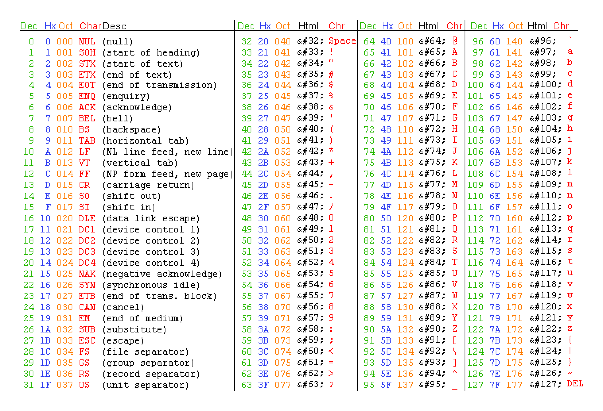
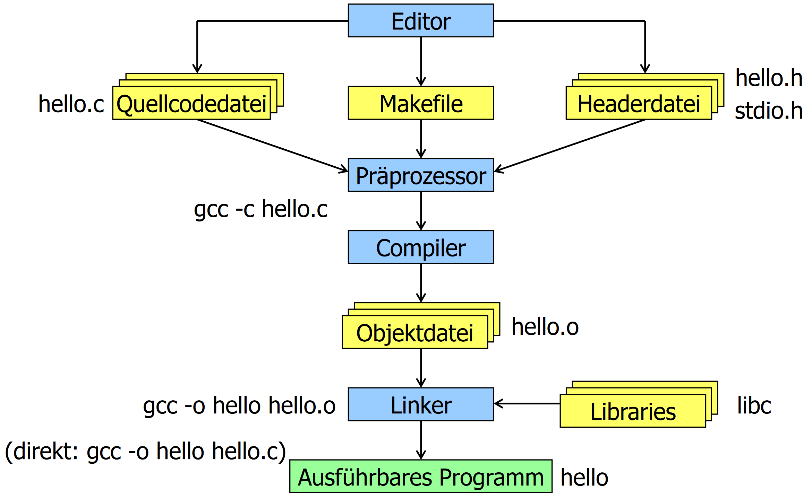
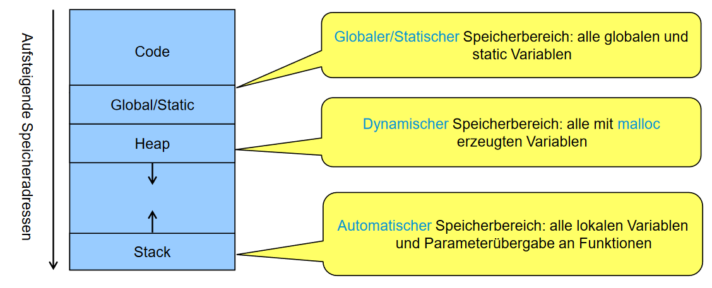
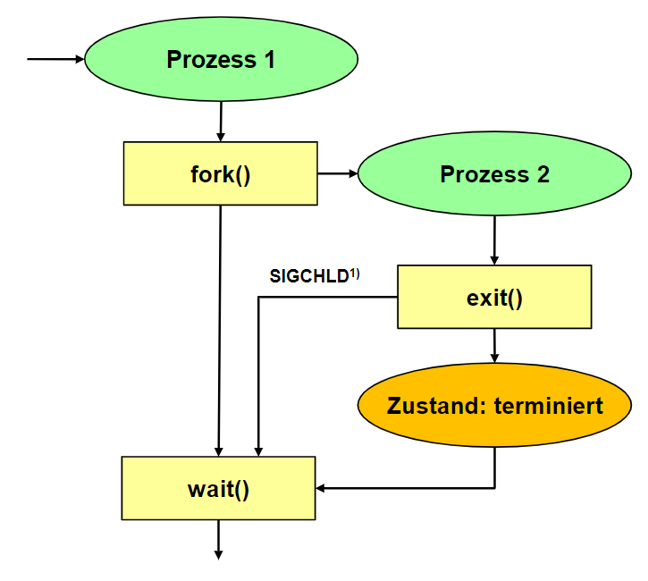
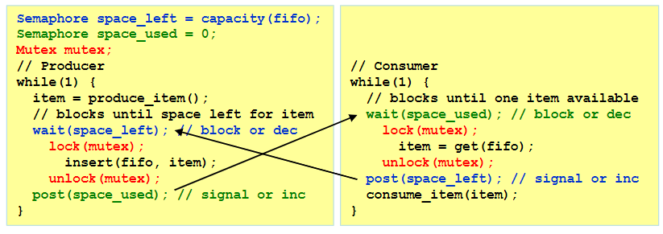
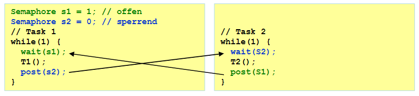

# SNP Summary

- [SNP Summary](#snp-summary)
  - [History of C](#history-of-c)
  - [Overview and Basics](#overview-and-basics)
    - [Files](#files)
    - [Data Types](#data-types)
    - [Literals](#literals)
    - [ASCII Table](#ascii-table)
    - [String Basics](#string-basics)
  - [Syntax](#syntax)
    - [Macro Definition](#macro-definition)
    - [Declaration & Definition](#declaration--definition)
    - [Operators](#operators)
      - [Arithmetic](#arithmetic)
      - [Comparison](#comparison)
      - [Logical](#logical)
      - [Bitwise](#bitwise)
      - [Assignment](#assignment)
      - [Pointer](#pointer)
      - [Other (reduced)](#other-reduced)
    - [Precedence and associativity](#precedence-and-associativity)
    - [Booleans](#booleans)
    - [Enums](#enums)
    - [Structs](#structs)
  - [Variables & References](#variables--references)
    - [Call by value](#call-by-value)
    - [Call by reference](#call-by-reference)
    - [Arrays as parameters](#arrays-as-parameters)
    - [Structs as parameters](#structs-as-parameters)
    - [Pointer to function](#pointer-to-function)
    - [Variable amount of args](#variable-amount-of-args)
  - [Global Variables](#global-variables)
  - [Modularization](#modularization)
    - [Compilation](#compilation)
    - [Header Guards](#header-guards)
    - [Useful Libraries](#useful-libraries)
  - [Make](#make)
    - [Syntax](#syntax-1)
  - [Arrays](#arrays)
    - [Array Sizes](#array-sizes)
    - [Working with Strings](#working-with-strings)
      - [Most important functions](#most-important-functions)
  - [Pointers](#pointers)
    - [Reading Pointers](#reading-pointers)
  - [Memory Management](#memory-management)
    - [Heap Memory](#heap-memory)
  - [Operating Systems](#operating-systems)
    - [System Calls](#system-calls)
    - [Shells](#shells)
    - [Linux Startup Sequence](#linux-startup-sequence)
    - [System Memory](#system-memory)
    - [Filesystem](#filesystem)
      - [Filesystem Hierarchy Standard](#filesystem-hierarchy-standard)
      - [Inodes](#inodes)
      - [Links](#links)
      - [File Types](#file-types)
    - [Working with Files](#working-with-files)
    - [Buffering](#buffering)
  - [Processes and Threads](#processes-and-threads)
    - [Lifecycle of a Process](#lifecycle-of-a-process)
    - [Functions](#functions)
    - [Working with pipelines](#working-with-pipelines)
    - [Lifecycles of Threads](#lifecycles-of-threads)
  - [Inter Process Communication](#inter-process-communication)
    - [POSIX Signals](#posix-signals)
    - [POSIX Pipes](#posix-pipes)
      - [Anonymous Pipes](#anonymous-pipes)
      - [Named Pipes](#named-pipes)
    - [POSIX Message Queues](#posix-message-queues)
    - [POSIX Sockets](#posix-sockets)
  - [Synchronization](#synchronization)
    - [Mutual exclusion](#mutual-exclusion)
    - [Semaphores](#semaphores)
    - [Examples](#examples)
      - [Producer-Consumer Problem](#producer-consumer-problem)
      - [Reader-Writer Problem](#reader-writer-problem)

---

## History of C

A quick timeline of C's development:

| Year | Name   | Event                                                                  |
| ---- | ------ | ---------------------------------------------------------------------- |
| 1970 | C      | **Dennis Ritchie** at Bell Labs developed the language for use in UNIX |
| 1978 | K&R C  | Ritchie and Kerningham release C                                       |
| 1983 | C++    | Stroustrup develops C++ as a C extension                               |
| 1989 | ANSI C | C is standardized                                                      |
| 1990 | C90    | ISO copies the ANSI standard                                           |
| 1995 | Java   | Java is released by Sun                                                |
| 1999 | C99    | C is update with newer extenbsions                                     |
| 2000 | C#     | Microsoft develops a Java competitor                                   |
| 2011 | C11    | ISO standardizes C with better c++ compat                              |
| 2018 | C18    | Minor changes to the C11 standard                                      |

---

## Overview and Basics

C is a procedural language. It is **not** object-oriented whatsoever. There is no concept of classes or methods. Only functions exists. There is a single entry-point for every application, `main`. Once `main` ends, the application terminates.

### Files

In general, there are 4 different file types that are associated with C:

| File extensions | Usage                                                                                                    |
| --------------- | -------------------------------------------------------------------------------------------------------- |
| .c              | A pure text file that usually contains code                                                              |
| .h              | A header files that provides definitions for functions and variables that other files can import and use |
| .d              | A file containing all dependecies of a program. Usually generated by Make and can be ignored             |
| .mk/Makefile    | A Make definition used to make compiling easier                                                          |
| .o/no extension | The output file(s) of the compiler                                                                       |

### Data Types

By default, C has 4 distinct data types that can also be extended with some keywords. Keywords in brackets signify that the compiler infers it when it isn't replaced with another keyword.

| Keywords                   | Bytes | Numeric range                       |
| -------------------------- | ----- | ----------------------------------- |
| `[signed] char`            | 1     | $-128$ to $127$                     |
| `[signed] int`             | 4     | $-2^{31}$ to $2^{31}-1$             |
| `float`                    | 4     | $-3.4*10^{38}$ to $3.4*10^{38}$     |
| `double`                   | 8     | $-1.79*10^{308}$ to $1.79*10^{308}$ |
|                            |       |                                     |
| `unsigned char`            | 1     | $0$ to $255$                        |
| `[signed] short [int]`     | 2     | $-32768$ to $32767$                 |
| `unsigned short [int]`     | 2     | $0$ to $65535$                      |
| `unsigned [int]`           | 4     | $0$ to $2^{32}-1$                   |
| `[signed] long [int]`      | 8     | $-2^{63}$ to $2^{31}-1$             |
| `[signed] long long [int]` | 8     | $-2^{63}$ to $2^{31}-1$             |
| `unsigned long [int]`      | 8     | $0$ to $2^{64}-1$                   |
| `unsigned long long [int]` | 8     | $0$ to $2^{64}-1$                   |
|                            |       |                                     |
| `long double`              | 10    | $-1.2*10^{4932}$ to $1.2*10^{4932}$ |

### Literals

C supports implicit typing for literals.

| Type               | Example |
| ------------------ | ------- |
| Decimal number     | 1234    |
| Octal number       | 0123    |
| Hexadecimal number | 0x123   |
| ASCII code         | `'A'`   |

Decimals and ASCII codes are always signed ints. If the int is too large, it's a long instead.

A combination of `U` and `L` can be used to explicitly declare a unsigned or long value.

Numbers with decimal points are always doubles unless appended with `F` where they are read as floats instead.

Special characters are escaped using a backslash `\`. ASCII characters may also be expressed using their hexadecimal, octal or decimal notation when escaped.

### ASCII Table



### String Basics

In C, strings are zero-terminated arrays of `char`s. As an example, the phrase 'amogus' requires an array with space for 7 elements rather than 6. This is because the zero-terminator `NUL` or `\0` is required.

Strings may also be formatted:

| Specifier | Conversion                                     |
| --------- | ---------------------------------------------- |
| %c        | A single char                                  |
| %s        | An array of chars                              |
| %d or %i  | Signed integer to decimal representation       |
| %u        | Unsigned integer to decimal representation     |
| %x        | Unsigned integer to hexadecimal representation |
| %o        | Unsigned integer to octal representation       |
| %f        | Float to decimal notation                      |
| %e        | Float to exponential notation                  |
| %g        | Float to decimal or exponential notation       |

Example:

```c
a = scanf("%d%d%d", &day, &month, &year);
```

---

## Syntax

### Macro Definition

C supports the definition of so called macros. These tell the C pre-processor to replace certain strings with a defined constant. This is most often used to define constants, as it's cheaper to directly store those values inside the program without having to allocate a variable for each constant. Example:

This definition...

```c
#define MAX_LENGTH 5
```

...is applied to this piece of code...

```c
int length = MAX_LENGTH;
```

...and results in this

```c
int length = 5;
```

### Declaration & Definition

The terms declaration and definition may sound similar but are positively distinct. A declaration merely specifies **how a name is used throughout the program** whereas a definition **allocates memory or specifies a function**. As a result, a definition can only happen after a declaration. For brevity, the term 'declaration' will be used throughout the document to address both of the terms unless.

- Base types are implicitly known to the compiler. (e.g. int, char, etc.) 
- Custom structs and enums define a type. 
- Defined types without a body are merely declared.

- The `typedef` keyword can be used to create an alias to any base or custom type.
- The `const` keyword can be used to create an unmodifiable variable.

### Operators

#### Arithmetic

| Operator | Purpose                                                                            |
| -------- | ---------------------------------------------------------------------------------- |
| a + b    | Guess what                                                                         |
| a - b    | Really now?                                                                        |
| +a       | Unary plus, generally useless but can widen lesser base types to the size of `int` |
| -a       | Unary minus, results in the additive inverse of a1                                 |
| a * b    | Multiplication                                                                     |
| a / b    | Division, segfault if b is 0                                                       |
| a % b    | Remainder of a / b or modulo                                                       |
| ++a      | Increments variable, then returns it                                               |
| a++      | Returns variable, then increments it                                               |
| --a      | Decrements variable, then returns it                                               |
| a--      | Returns variable, then decrements it                                               |

#### Comparison

| Operator | Purpose                  |
| -------- | ------------------------ |
| >        | Greater than             |
| <        | Less than                |
| >=       | Greater than or equal to |
| <=       | Less than or equal to    |
| ==       | Equal to                 |
| !=       | Not equal to             |

#### Logical

| Operator | Purpose                                                                |
| -------- | ---------------------------------------------------------------------- |
| !a       | Logical negation, equivalent to `a == 0`                               |
| a && b   | Logical AND, returns 0 if a and b are zero, returns 1 otherwise        |
| a \|\| b | Logical OR, returns 0 if at least a or b are zero, returns 1 otherwise |

#### Bitwise

| Operator | Purpose                                       |
| -------- | --------------------------------------------- |
| ~a       | NOT, inverts all bits                         |
| a & b    | AND, keeps all 1 bits that are the same       |
| a \| b   | OR, keeps all 1 bits                          |
| a ^ b    | XOR, turns all 1 and 0 pairs into 1           |
| <<       | Left shift, multiplication by 2 in some cases |
| >>       | Right shift                                   |

#### Assignment

All arithmetic and bitwise operators can be combined with the assignment operator. These lines are equivalent:

```c
a += b;
a = a + b;
```

#### Pointer

| Operator | Purpose                                                   |
| -------- | --------------------------------------------------------- |
| a[b]     | A pointer to the element of index b in the array a        |
| *a       | Indirection, object pointed to by a if a                  |
| &a       | Memory address of a                                       |
| a->b     | Structure dereference, member b of object pointed to by a |
| a.b      | Structure reference, member b of object a                 |

#### Other (reduced)

| Operator  | Purpose                |
| --------- | ---------------------- |
| a ? b : c | If a then b else c     |
| typeof(a) | The size of a in bytes |
| (type)a   | Cast a to type         |

### Precedence and associativity

Precedence is the order of evaluation of operators within operations. When all operators posess the same precedence, associativity takes over. In general, all operators default to left-associativity with the exception of **prefixed unary operators, conditional operators and assignment operators**.

### Booleans

Default C does not support Booleans. However, most libraries treat **0 as false and every other number as true**.

Booleans can also be imported with `stdbool.h`

### Enums

Enums work similar to other languages. They have a name and each value can be assigned any integer value. Example

```c
typedef enum {TRUE = 1, FALSE = 0} fakeBool;
```

When declared with typedef, enums can be used as types.

### Structs

Structs are a useful tool to create custom data types in C. They can contain any number primitive types or other custom types. The `sizeof` keyword accurately summarizes the needed data to store the struct. Example:

```c
typedef struct {
  usigned int inhabitants;
  float longitude;
  float latitude;
  bool available;
  float surface;
} House;
```

---

## Variables & References

This chapter shows examples on how data could be passed to other functions. Note that parameters and return values always occur by value. To pass a pointer into a function, it has to be dereferenced first with `&`.

### Call by value

`void func(int a, int b)`  
Passes the actual value. Effectively creates a copy

### Call by reference

`void func(int *a, int *b)`
Passes a **pointer** to a value. Changes to that value propagate up.  

example:  

```c
// Increment first parameter by second parameter.
// Pass first parameter by reference and second by value.
void increment(int *p, int step);

int main(void) {
    int a = 3, b = 5;
    increment(&a, b); // after the call, the following condition
} // must be fulfilled: a = a + b (= 8)

void increment(int *p, int step) {
    *p += b;
}
```

### Arrays as parameters

```c
void func(int a[])
```

is equivalent to 

```c
void func(int *a)
```

### Structs as parameters

```c
struct t { int v; };

void func(struct t arg);
```

or

```c
struct t { int v; };

void func(struct t *p);
```

### Pointer to function

```c
void logger(char *msg); // Function declaration
void (*out)(char *); // Error

out = &logger; // Memory address of the function is stored
out = logger; // Error
...
(*out)("Hello"); // Equivalent to writing logger("Hello");
out ("Hello"); // Error
```

### Variable amount of args

`stdarg.h` adds support for multiple variables:  

```c
int func(unsigned amount, ...)
{
    va_list args;
    unsigned i;
    int value;
    int sum = 0;
    va_start(args, amount);

    for (i = 1; i <= amount; i++)
    {
        value = va_arg(args, int);
        sum += value;
    }

    va_end(args);
    return (amount ? sum/amount : 0);
}

int main(void)
{
    (void) printf("Mittelwert 0: %d\n", mittelwert(0));
    (void) printf("Mittelwert 1: %d\n", mittelwert(1, 2));
    (void) printf("Mittelwert 3: %d\n", mittelwert(3, 4, 5, 6));
}
```

---

## Global Variables

Global variables are a dangerous but useful tool

- Variables declared outside of function scope are considered global
- Every part of that program can access any global variable
- The default value is 0
  - Local variables are undefined by default
- The `static` keyword can limit access to the current source file
  - Using `static` inside a function body keeps its value alive throughout multiple calls of said function

---

## Modularization

### Compilation

The compilation process consists of 3 steps:

1. The **pre-processor** executes all pre-processor directives (e.g. `#include`, `#define`, etc.)
2. The **compiler** transforms all code to a machine-readable byte stream
3. The **linker** links all calls to different libraries and components together



A common command to compile a program:

```sh
gcc -Wall -g -o program file1.c file2.c
```

System libraries that are not part of gcc can be specified with -l*library*. This translates to -L "liblibrary.a" but searches in multiple system directories.

### Header Guards

When including header files, it may occur that a header file is included more than once which leads to compiler errors. To prevent this, header guards can be implemented. Simply wrap the whole header file like this:

```c
// header.h
#ifndef HEADER_H
#define HEADER_H

... // Definitions here

#endif
```

### Useful Libraries

| Library  | Use                                                       |
| -------- | --------------------------------------------------------- |
| stdio.h  | IO functions                                              |
| string.h | Working with strings                                      |
| stdlib.h | RNG, memory control, process control                      |
| stdarg.h | Vararg support                                            |
| stddef.h | Additional constants like `NULL`                          |
| math.h   | Math functions                                            |
| errno.h  | Adds `errno`, a global variable that stores an error code |
| signal.h | Signal-handling functions (e.g. exceptions)               |
| assert.h | Testing library                                           |
| ctype.h  | Tests for chars                                           |
| float.h  | Macro constants relevant to floats and doubles            |
| limits.h | Limit constants of integral types                         |
| locale.h | Get locale information                                    |
| setjmp.h | Convenience functions for jumping                         |
| time.h   | Time and date functions                                   |

---

## Make

Make is a tool to compile modularized code into programs. Additionally, it only recompiles parts of the code that were unchanged.

### Syntax

Makefiles consist of rules, commands and comments. 

- Comments are marked with `#`.
- `target:` is used to define a sub-command
- `dependencies:` are used to define dependencies
- `command:` is defines a command to be executed when a `dependencies` is newer than a `target`
- `<TAB> [command]` is used to denote commands
- Variables can be declared as `VAR = VAL.c` and read via `$(VAR)`
- The pseudo-target `.PHONY` lists files to be ignored
- Variables can be substring-ed with `%`: `$(VAR:%.c=%.o)` results in `VAL.o`

Example makefile: https://github.zhaw.ch/thalmma5/snp-lab-code/blob/my-code/shared.mk

---

## Arrays

Arrays in C are always contiguous in memory. An array declaration does nothing more than reserve the necessary space in memory, place elements if applicable and return a pointer to the first value of the array. To access any other element of the array, the pointer to the first element is added to the index of the desired element times the `sizeof` result of the type. This also makes it impossible to implicitly know the size of the array.

### Array Sizes

There are a few ways to access the size/last element of an array. The obvious solution would be to store the last index during array creation, as arrays are immutable:

```c
#define N_ENTRIES 100

int array[N_ENTRIES] = { 0 };
...
for (int i = 0; i < N_ENTRIES; i++) {
  int a = array[i];
}
```

The other method would be to use a data sentry/terminator value:

```c
#define DATA_SENTRY (-1)

int array[] = { 1, 2, 3, DATA_SENTRY };
...
for (int i = 0; array[i] != DATA_SENTRY; i++) {
  a = array[i];
}
```

### Working with Strings

As mentioned already, strings are merely zero-terminated char arrays. As such, specia tools can be employed to make working with them easier. `string.h` is the most common tool for this.

#### Most important functions

| Signature                                         | Description                                                   | Returns                                            |
| ------------------------------------------------- | ------------------------------------------------------------- | -------------------------------------------------- |
| `int strlen(const char s[]);`                     | Gets the length of the given string without the terminator(s) | Length                                             |
| `int strcmp(const char s1[], const char s2[]);`   | Compares to strings                                           | The first `s1[i] - s2[i]` that is !=0, 0 otherwise |
| `char* strcpy(char dest[], const char source[]);` | Copies a string from source to dest                           | C99: Copy of dest; C11: errno_t                    |
| `char* strcat(char s1[], const char s2[]);`       | Concatenates two strings, s1 must have enough space           | Pointer to s1                                      |

---

## Pointers

The dreaded topic: Pointers. Infamous for being stupidly hard to understand. However, pointers really aren't that hard to understand. Let's set the stage first. Every variable has to be stored *somewhere* in memory. We don't care where in memory since our random-access memory is stupidly fast nowadays. We still need know how to access that data, however. Memory addresses are used for that purpose. Whenever a variable is allocated in C, a *pointer* that points to a memory address is created. Memory addresses and by extension pointers are nothing more than integers. Usually 32-bits or 64-bits long. As such, you can also store a pointer in memory. Then, you get a pointer that points to a pointer that points to a piece of data! Pointers also have a data type so that C knows how far to read into memory to get all the data. Here are a few examples:

A simple variable
```c
int a = 1;
```

A pointer that points to num
```c
int num = 1;
int *a = &num;
```

An array of pointers
```c
int *a[5];
```

A pointer to an array of ints
```c
int (*a)[5];
```

Pointer to pointer to int
```c
int **a;
```

Pointer to a function
```c
void (*out)(char *);
```

### Reading Pointers

When reading pointers, the `*` receives a different meaning. Where `p` is a pointer to an integer, the statement `int a = *p;` tells C to assign `a` the object that `p` is pointing to.

Then there is a new operator, the `&`. Where `a` is an int, the statement `int *p = &a;` tells C to get the address where `a` is located and to store it in `p`.

When reading arrays, the statement `array[3]` is equal to `*(array + 3)`. Note, however, that the `+ 3` in question is multiplied by the `sizeof` result of `array`'s type.

---

## Memory Management

Most programs posess four memory sections: The code ith all the functions, global and static variables, the heap for dynamically allocated variables and the stack where local variables and parameters are stored.



### Heap Memory

The heap is an immensly powerful tool that can be accessed with `stdlib.h`. Using `*malloc(size_t size)` a memory region of any size can be reserved for whatever purpose. `malloc` simply returns a pointer to it. However, it is **very** important that `free(void *ptr)` is called after that region of memory is not needed anymore, as otherwise memory leaks will occur.

Basic example
```c
int *p = malloc(3 * sizeof(int)); // Returns NULL when no memory available
if (p == NULL) { /* error handling */ }
p[1] = 5;
free(p); // Memory is released
```

Heap memory is most useful for dynamically allocated arrays or dynamic collections like linked lists.

Follow these guidelines to prevent most issues:

| bad                           | gud                                                        |
| ----------------------------- | ---------------------------------------------------------- |
| `gets`                        | Use `fgets` as the maximum chars can be constrained        |
| `strcpy`, `strcat`            | Use `strncpy` and `strncat` as copied chars can be limited |
| `sprintf`, `scanf`            | Always add precision specifiers like `%.100s`              |
| `malloc`, `calloc`, `realloc` | Check for NULL pointers                                    |
| `free`                        | Only use it **once**                                       |

Always sanitize user input.

---

## Operating Systems

In essence, an operating system is an abstraction of direct access to CPU Time and other system resources. On the innermost layer there is the Kernel that has direct access to all components. On the outermost layer there are the system and user libraries and programs. To connect these two, system calls are used.

### System Calls

A syscall submits a task to kernel that requests a certain resource or action to be executed for the calling user-mode program. System libraries provide implementations of this function to make development more portable. Around 300 different syscalls exist on linux.

Under the hood, `syscall()` returns -1 when an error occurs and also sets the global `errno` variable to a relevant error code. When sucessful, returns 0. `syscall()` is rarely used as is since abstractions exist in glibc and other system libraries.

### Shells

Shells provide a textual interface to the operating system. They can usually also execute shell-scripts for automation. Most shells consist of the 3 streams `stdin` for user input, `stdout` for program output and `stderr` for program error output.

### Linux Startup Sequence

1. BIOS initializes all components
2. Bootloader loads minimal partition (MBR or GPT)
3. Bootloader loads full mass storage partitions (ext4, NTFS, etc.)
4. Linux Kernel starts up
5. Init process starts (usually systemd)
6. GUI loads, could be a DE or just a shell

### System Memory

In order to prevent programs from tampering with unrelated memory, virtual memory is employed to limit access to system memory. For that to work, however, a memory management unit (MMU) is required. The MMU is tasked with translating logical memory addresses to physical addresses that the CPU can work with. Additionally, it contains a memory protection unit (MPU) that observes and prevents illegitimate resource access.

### Filesystem

On Linux, everything is a file as it serves as very logical abstraction of most devices. Linux OSes mostly adhere to the FHS as described below.

#### Filesystem Hierarchy Standard

| Directory | Description                    |
| --------- | ------------------------------ |
| /         | Root directory                 |
| /bin      | Binaries that all users need   |
| /sbin     | System binaries                |
| /boot     | Bootloader files               |
| /dev      | Device files                   |
| /etc      | System-wide config files       |
| /home     | User home directories          |
| /lib      | Essential libraries            |
| /media    | Removable media                |
| /mnt      | Mounted filesystems            |
| /opt      | Additional software packages   |
| /proc     | Process and kernel info        |
| /root     | Home of root                   |
| /srv      | Server files                   |
| /sys      | Device and driver infos        |
| /usr      | Read-only multi-user directory |
| /var      | Logs and temporary files       |

Files are measured in bytes and can be read by multiple programs simultaneously. This is achieved using file descriptors. One gets created every time a program opens a file and is stored by the kernel until the program closes that file.

#### Inodes

Files themselves are represented as **Inodes**, a management unit that associates each file with UUID called an **ino**. Thes Inodes contain necessary info about the file in questions. (except the file name) It's important to note that Inodes are strictly for accessing files programmatically as they are quite ugly to look at.

#### Links

Links link a filename to an inode in some way.

- Hard link: A strict name-to-inode pair
- Symbolic Link: A unidirectional file-to-file link

#### File Types

There are 7 different file types in Linux.

| Type             | Identifier | Use                                        |
| ---------------- | ---------- | ------------------------------------------ |
| File             | `-`        | A regular file                             |
| Directory        | `d`        | A file that contains files                 |
| Symbolic link    | `l`        | A file that points to another file         |
| Named pipe       | `p`        | Unidirectional program-to-program exchange |
| Socket           | `s`        | Inter process communication                |
| Block device     | `b`        | Random-acces storage device                |
| Character device | `c`        | Serial input and output of storage         |

Different file types may be seekable or non-seekable. Seekable files allow arbitrary changing of the read and write position whereas non-seekable files do not.

### Working with Files

The `stdio.h` library provides most necessary functions to properly interact with files. Due to the volatile nature of filesystems, it is very important to always check for errors after each IO operation.

Here is an example:
```c
#include <stdio.h>
#include <stdlib.h>

void perror_and_exit(const char *context)
{
    perror(context); 
    exit(EXIT_FAILURE); 
}

int main(int argc, char *argv[])
{
    if (argc > 1) {
        FILE *f = fopen(argv[1], "rb");
        if (!f) perror_and_exit(argv[1]); // f is null if something went wrong
        int line_no = 1;
        int print_line_no = 1;
        int c;
        while((c = fgetc(f)) >= 0) {
            if (print_line_no && printf("%6d ", line_no++) < 0) perror_and_exit("printf"); // Something could happen while reading
            print_line_no = c == '\n';
            if (putchar(c) < 0) perror_and_exit("putchar"); // Writing is also dangerous
        }
        if (!feof(f)) PERROR_AND_EXIT("fgetc"); // File may not end
        if (fclose(f) != 0) perror_and_exit("fclose"); // File might not be closable
        return EXIT_SUCCESS;
    }
    return EXIT_FAILURE;
}
```

### Buffering

IO streams can be buffered differently depending on their application.

- Unbuffered: Data gets send ASAP (e.g. stderr)
- Fully buffered: Data gets only sent when the designated buffer is full (e.g. stdin, stdout)
- Line buffered: Data gets only sent when an end-of-line is read

---

## Processes and Threads

A process is an isolated program with its own part of memory. A process can have an arbitrary number of threads. The process contains the code and data of the program. It also has access to resources as if it were the only process running. However, the process can be interrupted at any point without it noticing.

Context switches are used to swap active processes. As such, processes have different states:

- Running/active: Currently running
- Ready: Ready to run
- Blocked: Waiting for an event
- Terminated: Work ended but OS has not finished cleaning up

As a rule of thumb, processes are expensive to create and maintain whearas threads are cheap to create but need to share memory.

### Lifecycle of a Process

At some point in any multi-threaded process, the process will split into another process. As such, the program must wait for the completion of the new process to ensure consistent behavior.



### Functions

`fork()` duplicates the parent process and continues at the position. Retuns -1 on error, 0 if the process is the resulting child process and the pid > 0 if it's the parent process.

`exit()` terminates the process and notifies the parent's `wait()` call.

`waitpid()` waits for a given pid to terminate.

`WEXITSTATUS()` gets the exit code from `wait()`.

An example
```c
#include <stdio.h>
#include <stdlib.h>
#include <unistd.h>
#include <sys/wait.h>

#define PERROR_AND_EXIT(M) do { perror(M); exit(EXIT_FAILURE); } while(0)

int main()
{
    pid_t cpid = fork();
    if (cpid == -1) PERROR_AND_EXIT("fork");
    if (cpid > 0) {
        // still in parent process
        printf("Parent: %d forked child %d\n", getpid(), cpid);
        int wstatus;
        pid_t wpid = waitpid(cpid, &wstatus, 0); // wait blocking for child to terminate
        if (wpid == -1) PERROR_AND_EXIT("waitpid");
        printf("Parent: child %d exited with %d (status=0x%x)\n", cpid, WEXITSTATUS(wstatus), wstatus);
        exit(EXIT_SUCCESS);
    } else {
        // in child process
        printf("Child: %d forked by parent %d\n", getpid(), getppid());
        sleep(3);
        exit(123);
    }
}
```

`ecec()` and `execv()` can be used to execute external programs from new processes. They require a path to the executable and the argv arguments array.

Example
```c
#include <stdio.h>
#include <stdlib.h>
#include <unistd.h>
#include <sys/wait.h>

#define PERROR_AND_EXIT(M) do { perror(M); exit(EXIT_FAILURE); } while(0)

int main()
{
    pid_t cpid = fork();
    if (cpid == -1) PERROR_AND_EXIT("fork");
    if (cpid > 0) {
        // still in parent process
        printf("Parent: %d forked child %d\n", getpid(), cpid);
        int wstatus;
        pid_t wpid = waitpid(cpid, &wstatus, 0); // wait blocking for child to terminate
        if (wpid == -1) PERROR_AND_EXIT("waitpid");
        printf("Parent: child %d exited with %d (status=0x%x)\n", cpid, WEXITSTATUS(wstatus), wstatus);
        exit(EXIT_SUCCESS);
    } else {
        // in child process: replace current image by new image
        static char *eargv[] = { "ls", "-l", NULL }; // argv of the execv image below
        if (execv("/bin/ls", eargv) == -1) PERROR_AND_EXIT("execv: /bin/ls"); // Equivalent to ls -l
        // this line is never reached
    }
}
```

The shorthand form `system()` exists. No forking or waiting required.
```c
#include <stdio.h>
#include <stdlib.h>
#include <sys/wait.h>

#define PERROR_AND_EXIT(M) do { perror(M); exit(EXIT_FAILURE); } while(0)

int main()
{
    int ret = system("/bin/ls -l");
    printf("system() exited with %d (status=0x%x)\n", WEXITSTATUS(ret), ret); // WEXITSTATUS is set by system()
    return EXIT_SUCCESS;
}
```

### Working with pipelines

`popen()` allows a program to connect to another programs stdin or stdout. Returns a `FILE*`. `pclose()` closes the pipe.

Example

```c
#include <stdio.h>
#include <stdlib.h>
#include <errno.h>

#define PERROR_AND_EXIT(M) do { perror(M); exit(EXIT_FAILURE); } while(0)

int main()
{
    FILE *df = popen("df -k --output=pcent . 2>/dev/null", "r");
    if (!df) PERROR_AND_EXIT("popen: df -k .");
    char line[BUFSIZ], *end = NULL;
    long int used = -1;

    while(fgets(line, BUFSIZ, df)) {
        used = strtol(line, &end, 10);
        if (end && end != line && *end == '%') break; // line is spaces-number%-newline
        used = -1;
    }

    if (pclose(df)) PERROR_AND_EXIT("pclose()");

    if (used < 0 || used > 100) {
        errno = ERANGE;
        PERROR_AND_EXIT("df -k .");
    }

    char *msg
    = used < 60 ? "Plenty of disk space (%d%% available)\n"
    : used < 80 ? "Maybe some future disk space problems (%d%% available)\n"
    : used < 90 ? "Need to clear out files (%d%% available)\n"
    : "You may face soon some severe disk space problems (%d%% available)\n";
    printf(msg, 100-used);
    return EXIT_SUCCESS;
}
```

### Lifecycles of Threads

glibc contains functions for thread creation. `pthread_create()` is used to create a new thread that takes a function pointer to work on.

`pthread_join()` waits for a given thread and then frees system resources.

`pthread_detach()` changes termination behavior so that resources are freed as soon as the new thread terminates. Joining is then undefined.

Example 
```c
#include <stdio.h>
#include <stdlib.h>
#include <errno.h>
#include <unistd.h>
#include <pthread.h>

#define PERROR_AND_EXIT(M) do { perror(M); exit(EXIT_FAILURE); } while(0)
#define CHECKED_PTHREAD(C) do { int ret = (C); if (ret) { errno = ret; PERROR_AND_EXIT(#C); } } while(0)

void *worker(void *arg)
{
    printf("worker\n");
    sleep(3);
    static int ret_value = 123;
    return &ret_value;
}

int main()
{
    pthread_t thread;
    CHECKED_PTHREAD(pthread_create(&thread, NULL, worker, NULL));
    printf("main\n");
    static void *retval;
    CHECKED_PTHREAD(pthread_join(thread, &retval));
    printf("worker retval = %d\n", *((int*)retval));
    exit(EXIT_SUCCESS);
}
```

---

## Inter Process Communication

In order to facilitate communication between processes, glibc provides many POSIX functions that allow such communication.

### POSIX Signals

Any proccess can send any signal to another process. A process can decide whether to respond with a default action, with an event handler or just ignore the signal entirely.

|Signal|Default action|Description|
|-|-|-|
|SIGINT|Terminate|Ctrl-C interrupt|
|SIGQUIT|Core dump|Ctrl-\ quit|
|SIGABRT|Core dump|Abort signal from `abort()` or `assert()`|
|SIGKILL|Terminate|Kill|
|SIGSEGV|Core dump|Illegal memory access|
|SIGALRM|Terminate|Timer ran out from `alarm()`|
|SIGTERM|Terminate|Terminate|
|SIGSTOP|Stop process|Stop process|
|SIGCONT|Reactivate process|Reactivate process|

- `kill()` sends a signal to a process
- `pause()` blocks until the process is killed or any signal is received
- `sigaction()` registers a signal handler
- `sigfillset()` returns a `sigset_t` to specify which signals to block while the handler is being run
- `raise()` sends a signal to the own process

sigaction example
```c
// set action handler
struct sigaction a = { 0 };
a.sa_flags = SA_SIGINFO;
a.sa_sigaction = handler;
sigfillset(&a.sa_mask);
sigaction(sig, &a, NULL);
```

### POSIX Pipes

Pipes are first in, first out data buffers with a maximum size. File descriptors are used to communicate current access to the OS. Pipes are also always synchronous.

`pipe(int[2])` followed by `fork()` creates an anonymouse pipe and `mkfifo()` creates a named pipe which acts like a file.

Anonymous pipe example
```c
#include <sys/types.h>
#include <unistd.h>
...
    int fd[2];
    pipe(fd);
    pid_t cpid = fork();
    ...
    if (cpid > 0) { // still in parent process: read from pipe
        close(fd[1]); // close write-file-descriptor
        read(fd[0], ...); // use read-file-descriptor
        ...
    } else { // in child process: write to pipe
        close(fd[0]); // close read-file-descriptor
        write(fd[1], ...); // use write-file-descriptor
    }
...
```

#### Anonymous Pipes

Anonymous pipes are also unidirectional. For bidirection communication, two pipes are needed.

- `pipe()` opens two file descriptors. A process can only use one of these descriptors
- `close()` closes a descriptor
- `read()` reads from pipe (blocking)
- `write()` writes to pipe (blocking)

Using `fcntl()` makes a pipe non-blocking
```c
void set_nonblocking(int fd) {
    int flags = fcntl(fd, F_GETFL, 0);
    if (flags == -1) PERROR_AND_EXIT("fcntl");
    if (fcntl(fd, F_SETFL, flags | O_NONBLOCK) == -1) PERROR_AND_EXIT("fcntl");
}
...
int pfd[2];
if (pipe(pfd) == -1) PERROR_AND_EXIT("pipe");
set_nonblocking(pfd[0]); // set reading file descriptor to non-blocking
...
```

This results in some extra conditions having to be checked
```c
int n = read(pfd[0], buf, MSGSIZE);
if (n > 0) { ... } // use received data
else if (n == 0) { ... } // close and stop polling
else if (errno == EAGAIN) { ... } // has to wait for poll interval - avoid spin-lock
else { ... } // real error
```

#### Named Pipes

Can be created within the shell: `mkfifo [path] -m [access mode]`. Blocks until both sides are open.

In C, `mkfifo()` is used and functions like a file.

### POSIX Message Queues

Queues have a maximum number of messages and a maximum size in bytes, reperesented by the struct `mq_attr`. Multiple processes can read from and write to a message queue. Reading consumes a message. Names must also always start with a `/`. By default, queues exist in `/dev/mqueue`.

Important: Message Queues functions are part of `librt.a` so the needs the fla -lrt.

Example
```c
#include <mqueue.h>
#include <stdlib.h>
#include <stdio.h>
#include <errno.h>
#include <unistd.h>
#include <sys/wait.h>

#define PERROR_AND_EXIT(M) do { perror(M); exit(EXIT_FAILURE); } while(0)
#define QNAME "/demo" // the name must start with a slash
#define MSIZE 10

int main() {
    int q = 0, cpid = 0, n = 0, wpid = 0;
    struct mq_attr a = { .mq_maxmsg = 10, .mq_msgsize = MSIZE };
    if ((q = mq_open(QNAME, O_CREAT|O_RDWR|O_NONBLOCK|O_EXCL, 0666, &a)) == -1) PERROR_AND_EXIT("mq_open");
    if ((cpid = fork()) == -1) PERROR_AND_EXIT("fork");

    if (cpid > 0) { // parent: shares queue descriptor with child
        if (mq_unlink(QNAME) == -1) PERROR_AND_EXIT("mq_unlink"); // remove it from the filesystem again
        char msg[MSIZE+1]; // buffer allows for final '\0' to allow interpretation as string
        
        while(wpid == 0) { // read messages while the child process has not yet terminated
            sleep(1); // poll interval for non-blocking mq_receive() and non-blocking waitpid()
            while ((n = mq_receive(q, msg, MSIZE, NULL)) > 0) { // read while there are messages
                msg[n] = '\0'; // prepare for printf
                printf("Message: '%s'\n", msg);
            }
            if (n == -1 && errno != EAGAIN) PERROR_AND_EXIT("mq_receive"); // non-blocking read handling
            if ((wpid = waitpid(cpid, NULL, WNOHANG)) == -1) PERROR_AND_EXIT("waitpid"); // non-blocking
        }
        if (mq_close(q) == -1) PERROR_AND_EXIT("mq_close"); // close when completed
    } else { // child: shares queue descriptor with parent
        if (mq_send(q, "Hello", sizeof("Hello"), 1) == -1) PERROR_AND_EXIT("mq_send");
        sleep(2);
        if (mq_send(q, "Queue", sizeof("Queue"), 1) == -1) PERROR_AND_EXIT("mq_send");
    }
}
```

### POSIX Sockets

Logically connect to processes with a socket. Abstracts all necessary system needed to actually make such a connection.

Usual client process:

- Define socket
- Request connection to server
- Exchange data
- Close socket

Usual server process:

- Define socket
- Wait for connection
- Accept or reject connection
- Exchange data
- Close socket

For non-connection-oriented connections the same happens except no connection requests are exchanged.

---

## Synchronization

This part highlights the most common synchronization methods used in C.

### Mutual exclusion

Mutexes in C are very simple. Trying to lock a mutex that is already locked results in blocking behavior until that mutex is released. A recursive option can also be given that allows a function to lock and unlock a mutex multiple times.

Recursive example
```c
#include <sys/types.h>
#include <pthread.h>
#include <stdlib.h>
#include <unistd.h>
#include <stdio.h>
#include <errno.h>

#define FATAL(M) do { perror(M); exit(EXIT_FAILURE); } while(0)
#define N 10000000
#define MUTEXATTR PTHREAD_MUTEX_RECURSIVE

pthread_mutexattr_t mutex_attr;
pthread_mutex_t mutex;
int value = 0;

void calc(int step)
{
    if (pthread_mutex_lock(&mutex) != 0) FATAL("inner lock");
    value += step;
    if (pthread_mutex_unlock(&mutex) != 0) FATAL("inner unlock");
}

void *count(void *p)
{
    for(int i = 0; i < N; i++) {
        if (pthread_mutex_lock(&mutex) != 0) FATAL("lock");
        calc(*(int*)p);
        if (pthread_mutex_unlock(&mutex) != 0) FATAL("unlock");
    }
}

int main(void)
{
    if (pthread_mutexattr_init(&mutex_attr) != 0) FATAL("mutexattr_init");
    if (pthread_mutexattr_settype(&mutex_attr, MUTEXATTR) != 0) FATAL("mutexattr_set");
    if (pthread_mutex_init(&mutex, &mutex_attr) != 0) FATAL("mutex_init");
    pthread_t th_inc;
    pthread_t th_dec;
    int inc = +1;
    int dec = -1;
    if (pthread_create(&th_inc, NULL, count, &inc) != 0) FATAL("create");
    if (pthread_create(&th_dec, NULL, count, &dec) != 0) FATAL("create");
    if (pthread_join(th_inc, NULL) != 0) FATAL("join");
    if (pthread_join(th_dec, NULL) != 0) FATAL("join");
    if (value != 0) fprintf(stderr, "ERROR: exp=%d, act=%d\n", 0, value);
}
```

### Semaphores

A semaphore is essentially a street light for threads. `sem_init` sets the initial value. `sem_post` decrement said value or block if that value is 0. `sem_wait` increases that value if sem_post was called earlier.

Semaphore example
```c
#include <sys/types.h>
#include <pthread.h>
#include <stdlib.h>
#include <unistd.h>
#include <stdio.h>
#include <limits.h>
#include <semaphore.h>

#define FATAL(M) do { perror(M); exit(EXIT_FAILURE); } while(0)
#define CHECK(E,A,M) if((E)==(A));else fprintf(stderr,"ERROR: "M": exp=%d, act=%d\n",E,A)
#define N 10000

volatile int array[N] = { 0 }; // shared variable: init in one thread, then use in both
sem_t sem;

void *min(void *arg) // initialize the data and calculate min value of all
{
    for(int i = 0; i < N; i++) array[i] = i - N/2; // init the shared data -N/2...N-1-N/2
    if (sem_post(&sem) == -1) FATAL("post");
    int value = INT_MAX;
    for(int i = 0; i < N; i++) if (value > array[i]) value = array[i];
    CHECK(-N/2, value, "wrong min value");
    return NULL;
}

void *max(void *arg) // calculate max value of already initialized data
{
    if (sem_wait(&sem) == -1) FATAL("wait");
    int value = INT_MIN;
    for(int i = 0; i < N; i++) if (value < array[i]) value = array[i];
    CHECK(N-1-N/2, value, "wrong max value");
    return NULL;
}

int main(void)
{
    if (sem_init(&sem, 0, 0) == -1) FATAL("sem");
    pthread_t th_max;
    pthread_t th_min;
    if (pthread_create(&th_max, NULL, max, NULL) != 0) FATAL("create");
    if (pthread_create(&th_min, NULL, min, NULL) != 0) FATAL("create");
    if (pthread_join(th_max, NULL) != 0) FATAL("join");
    if (pthread_join(th_min, NULL) != 0) FATAL("join");
}
```

Semaphores can exist in memory or as files.

### Examples

#### Producer-Consumer Problem



#### Reader-Writer Problem

Allow multiple readers but only one writer.

