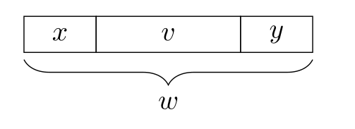

# Definitionen

## Alphabet

> Ein Alphabet ist ein endliche, nichtleere Menge von Symbolen.

Als Beispiel: $\Sigma=\{a, b, c\}$ 
$\N$ wäre **kein** Alphabet, das es nicht endlich ist!

## Wörter

> Ein Wort ist eine endliche Folge von Symbolen eines bestimmten Alphabets.
>
> Das leere Wort $\varepsilon$ ist ein Wort, welches keine Symbole enthaltet. Dieses Wort gibt es über jedem Alphabet.

Als Beispiel: $abc$ ist ein Wort über dem Alphabet $\Sigma_{lat}$. Wörter können auch als Mengenschreibweisse dargestellt werden.

### Länge eines Wortes

Der Betrag eines Wortes ist die Länge des Wortes.

Beispiel: 

* $|abc|=3$
* $|\varepsilon|=0$

### Absolute Häufigkeit

> $|w|_x bezeichnet die absolute H$uffigkeit eines Symboles $x$ in einem Wort $w$

Beispiel: 

* $|abc|_a=1$
* $|100111|_1=4$
* $|\varepsilon|_{\varepsilon}=1$

### Spiegelwort

> Mit $w^R$ wird das Spiegelwort zu $w$ bezeichnet.
> $$
> W^R=(x_1, x_2...x_n)^R=(x_n...x_2,x_1)
> $$
> Dabei gilt, dass $|w|=|w^R|$ und $|w|_x=|w^R|_x$
>
> Wenn $w=w^R$ gilt, dann wird $w$ als **Palindrom** bezeichnet

Beispiel:

* $(abc)^R=cba$

### Teile von Wörter

Der start eines Wortes $w$ wird **Präfix** genannt. 
Symbole in der Mitte werden **Infixe** oder auch Teilwörter. 
Das Ende eines Wortes $w$ wird **Suffix** genannt.

Ein Präfix, Infix oder Suffix ist echt, wenn sie nicht gleich das Wort $w$ ist

### Menge aller Wörter mit einer Länge

> Die Menge aller Wörter der Länge $k$ über einem Alphabet $\Sigma$ wird mit $\Sigma^k$ bezeichnet.
>
> $\Sigma^0=\{\varepsilon\}$ Dies ist per Definition für alle Alphabete gegeben.

Beispiel: $\{0, 1\}^2=\{00, 01, 10, 11\}$

### Kleenesche Hülle

> Die Menge aller Wörter $\Sigma^*$ in einem Alphabet wird Kleenesche Hülle genannt und ist abzählbar Unendlich
>
> $\Sigma^+=\Sigma^*\setminus\{\varepsilon\}$  und ist die Menge aller Wörter über $\Sigma$ ohne das leere Wort

### Konkatination

> $x\circ y=xy$ heisst, dass die Wörter $x$ und $y$ zusammen verkettet werden. Die Wörter müssen nicht aus demselben Alphabet kommen.
>
> Es gilt zudem: $|x|+|y|=|xy|=|x\circ y|$

Beispiel: $x=22$ und $y=100$, dann gilt: $xy=x\circ y=22100$

### Wortpotenzen

> Die Wortpotenz ist definiert mit der folgenden Defintion
> $$
> x^0=\varepsilon\\
> x^{n+1}=x^n\circ x
> $$

Beispiel: 

* $a^3=a^2a=a^1aa=a^0aaa=aaa$
* $bbababababaaa=b^2(ab)^4a^3$ (Dies ist nicht die einzige Lösung)

## Sprachen

> Eine Teilmenge von Wörtern nennt man eine Sprache (Dies kann auch als $L\subseteq \Sigma^*$ geschrieben werden)
>
> $\Sigma*$ ist auch eine Sprache über dem Alphabet $\Sigma$
>
> Wenn $\Sigma_1 \subseteq \Sigma_2$ und $L$ eine Sprache über $\Sigma_1$ ist, dann ist $L$ auch eine Sprache  über $\Sigma_2$
>
> $\emptyset$ ist eine leere Sprache; Also eine Sprache ohne Wörter und gilt für jedes Alphabet ($\empty\neq \{\varepsilon\}$) 

Sprache können aus unendlich vielen Wörtern bestehen. Die Wörter müssen aus einem endlichen Alphabet gebildet werden und müssen endlich lang sein.

Darstellungsmöglichkeiten:

* $L=\{\varepsilon, 10, 1100, 111000, ...\}$
* in Prosa
* $L=\{1^n0^n|n\in \N\}$

### Sprachen-Konkatenation

> $A\subset \Sigma^*$ und $B\subset \Gamma^*$ sind zwei Sprachen, dann ist $AB=\{uv|u\in A \text{ und } v \in B\}$
>
> Zudem gilt: Ist $A$ eine Sprache über $\Sigma$ und $B$ eine Sprache über $\Gamma$, dann ist $AB$ eine Sprache über dem Alphabet $\Sigma \cup\Gamma$

### Kleenesche Hülle einer Sprache

> Die Kleenesche Hülle $A*$ einer Sprache $A$  ist durch ${\varepsilon}\cup A \cup AA \cup AAA \cup ...$
>
> Die Kleenische Hèlle einer Sprache ist selbst eine Liste von Wörter, da die Liste aber unendlich ist, ist sie selbst keine Sprache (**stimmt das?**)

### Komplement einer Sprache

> Das Komplement einer Sprache sind alle Wörter, **welche** nicht in der Sprache sind
>
> $\overline L=\Sigma^*-L=\Sigma^*\setminus L$

## Entscheidungsproblem

> Sei eine Sprache $L$ über einem Alphabet $\Sigma$ gegeben. Das Entscheidungsproblem $(\Sigma, L)$ ist die folgende:
>
> Input: Eine Sprache $L$ und ein Wort $x\in\Sigma^*$
> Output: JA, falls $x\in L$ ist und NEIN, falls $x\not \in L$ ist
>
> In Deutsch: "Gehört ein Wort eines Alphabetes zu einer Sprache?"

## Chomsky-Hirarchie

## Fragen

* Ist die Kleenische Hülle einer Sprache wieder eine Sprache? - Ja