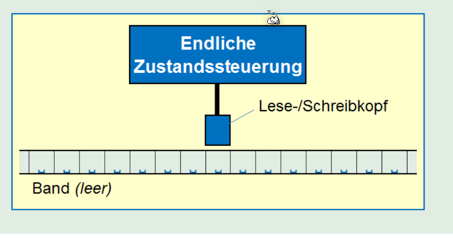
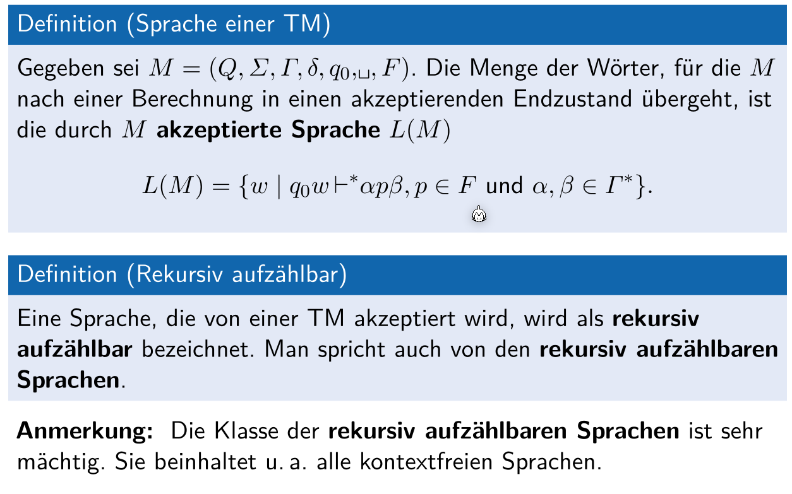
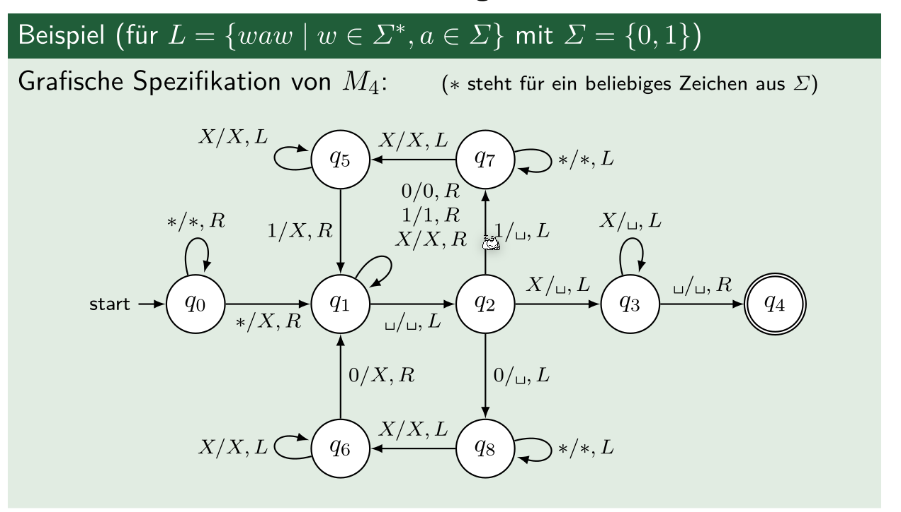

# Turing Maschine

>Eine (determinischtische) Turing-Maschine (DTM) ist ein 7-Tupel: $M=(Q,\Sigma, \Gamma, \delta, \textvisiblespace, F)$
>
>* $Q$: die endliche Menge von Zustände
>* $\Sigma$: das Eingabe Alphabet
>* $\delta: Q\times \Gamma \rightarrow Q\times\Gamma\times D, D=\{L, R\}$: Die Übergangsfunktion, welche den nächsten Zustand, was geschrieben werden soll und ob das Band nach Links (L) oder nach rechts (R) geschoben werden soll
>* $\Gamma$: Das Bandalphabet, dabei muss $\Sigma \subset \Gamma$
>* $\textvisiblespace$: Das Leerzeichen, dabei muss $\textvisiblespace \in \Gamma$ und $\textvisiblespace \not \in \Sigma$
>
>Das Band hat einzelne Zelle, in welchen ein Zeichen von $\Gamma$ enhaltet...

Informell, ist eine Turing Maschine einen endlichen Automat, welche um ein unendliches Band und um einen Lesen-/Schreibkopf ergänzt wurde.

Im folgenden Bild wird eine Übergangsfunktion einer Turing Maschine gezeigt: $\delta(q_1, X)=(q_2, Y, D)$, wobei $D\in\{L, R\}$

## Konfiguration

Eine Konfiguration einer Turing-Maschine ist:

* der aktuelle Zustand $q \in Q$
* die Position des Lese-/Schreibkopf $i$
* der Bandinhalt $X_1,...,X_n \in \Gamma$

Ein Beispiel einer Konfiguration: $X_1,...X_{i-1}qX_iX_{i+1},...,X_n$

Die Startkonfiguration ist: $q_0X_1X_2...X_n$

## Berechnungsschritten

Ein Berechnungsschritt ist der Übergang von einer Konfiguration zur nächsten:

$X_1,...X_{i-1}qX_iX_{i+1},...,X_n\vdash X_1,...X_{i-1}pX_iX_{i+1},...,X_n$

## Berechnungen

Eine Berechnung ist eine **endliche** Menge von Berechnungsschritte: $K_1 \vdash K_2 \vdash ... \vdash K_n$.

Dies kann auch abgekürzt als $K_1\vdash^* K_n$ geschrieben werden.

## Sprache einer Turing Maschine

## Rekursiv aufzählbare Sprachen

Eine Sprache nennt sich rekursive aufzählbar, wenn sie von einer Turing Maschine akzeptiert wird. Eine rekursive aufzählbar...**TODO**

## Turing Maschine mit Speicher

Die Turing Maschine wird mit einem Speicher erweitert.

## Turing Maschine mit mehreren Spuren

Die Turing Maschine wird erweitert mit mehrern Spuren, welche sich synchron bewegen. Das Spur-Alphabet ist nun ein Tupel. 

Wenn so eine Maschine von einer "normalen" Turing Maschine simuliert werden soll, benötigt man die Zustände $Q=Q_{orignal}\times\Gamma_{orginal}$

Als Beispiel, eine Maschine mit 3 Bänder hätte das Band-Alphabet: $\Gamma_{\Gamma_1}=\{0, 1, \textvisiblespace\}\times\{0, 1, \textvisiblespace\}\times\{0, 1, \textvisiblespace\}$. Ein konkreter Wert wäre: $(0, 1, 1)$.

## Turing Maschine mit mehreren Bänder und mehreren Lese-/Schreibköpfe

> Ein Band hat mehrere Spuren. Pro Band gibt es ein Lesekopf. Das heisst eine Maschine mit mehreren Spuren hat nur ein Lese-/Schreibkopf. Eine Maschine mit mehreren Bänder hat mehrere Lese-/Schreibköpfe.

Die Turing Maschine kann auch erweitert werden, dass sie zusätzlich zu den mehr Spuren auch noch mehr Lese-/Schreibköpfe hat. Das heisst, jedes Band kann unabhängig von den anderen Bänder bewegt werden.

Bei der Initialisierung:

* steht die Eingabe auf dem obersten Band
* Alle anderen Bänder sind leer
* Der Lese-/Schreibkopf des ersten Band ist über dem ersten Element des Bandes
* Bei den anderen Lese-/Schreibköpfe ist es irrelevant

Damit dies funktioniert, muss die Übergangsfunktion erweitert werden um: $\delta:Q\times\Gamma^k\rightarrow Q\times \Gamma^k \times \{R, S, L\}^k$, dabei steht $k$ für die Anzahl Bänder, $R$ für Rechts, $S$ für stehen bleiben und $L$ für Links.

Beispiel von einer Maschine mit mehreren Bänder  und mehreren Lese-/Schreibköpfe, welche Subtrahieren kann:

## Nichtdeterministische Turing Maschine (NTM)

Die nichtdeterministische Turing Maschine besteht aus dem selben 7-Tupel, wie eine deterministische Turing Maschine. Der einzige Unterschied ist, dass die Übergangsfunktion $\delta: Q\times \Gamma \rightarrow \mathcal P(Q \times \Gamma \times D)$, wobei $D=\{R, L\}$ ist. $R$ steht für Rechts, $L$ für Links.

Die Übergangsfunktion gibt also eine Liste von Tupeln zurück. Wie auch nichtdeterministische endlichen Automaten, werden alle Möglichkeiten  durch getestet bis ein Resultat gefunden wurde oder keine ungetestet Werte mehr übrigbleiben.

Jede Sprache, welcher von einer NTM akzeptiert wird, wird auch von einer deterministischer Turing Maschine (DTM)             akzeptiert. Es gibt allerdings kein praktisches Verfahren, wie die Teilmengen Konstruktion bei den Endlichen Maschine.

Es folgt der Beweis, dass jede NTM auch als DTM dargestellt werden kann.

Ein Beispiel für eine NTM:

## Turing Maschine mit semi-beschränkten Band

Bei einer Turing Maschine mit einem semi-beschränkten Band, geht das Band nur in eine Richtung ins unendliche. Beim Start ist der Lese-/Schreibkopf am Anfang des Bandes. Der Kopf kann dann nur in eine Richtung sich bewegen.

Dabei wird jede Sprache, welche von einer Turing Maschine akzeptiert werden kann, kann auch von einer Turing Maschine mit einem semi-beschränkten Band akzeptiert werden. Sie sind also gleichwertig.

Die Beweissidee, dass eine Turing Maschine mit semi-beschränkten Band zwei Bänder hat, das einte Band hat die positiven Slots, das andera Band die negativen Slots.

## $k$-Stack Maschine

Dies ist ein eine Deterministischen Keller Automaten, welcher aber mehre Stacks haben.

Dabei sieht die Übergansfunktion folgendermassen aus: $\delta: Q \times \Gamma_1\times...\times\Gamma_n\rightarrow Q\times\Gamma_1^*\times...\times \Gamma^*_k$ 

Mit einer 2-Stack Maschine kann eine Turing Maschine simuliert werden, in dem die Slots des "Bandes" vom einten Stack in den anderen kopiert werden. Eine 2-Stack Maschine kann demnach, dasselbe, wie eine Turing Maschine.

## Zähler Maschine

Eine Zähler Maschine, ist eine $k$-Stack Maschine, welche allerdings Zähler haben, anstatt Stacks. Die Zähler speichern eine natürliche Zahl (<= 0).

Eine 2 Zähler-Maschine ist gleichwertig, wie eine Turing Maschine. Wenn etwas auf den "Stack" gepushed wird, wird das letzte Resultat weiter verrechnet. Dafür wird das letzte Resultat mit den Anzahl Zuständen multipliziert. Darauf wird den Zahlwert des Symbols addiert.

Um nun vom "Stack" zu poppen, wird das letzte Resultat mit der Anzahl Zustände dividiert. Der Rest, welcher übrig bleibt, ist der Zahlenwert des Symboles.

Um aber einen 2-Stack Maschine zu simulieren, benötigt man 3 Counters: 2 Counters für die Stack und der 3. Counter um zu rechnen. 

Diese 3-Zähler Maschine kann nun von einer 2-Zähler Maschinen simuliert werden. Dafür werden die Werte $i$ und $j$ und $k$ in der Zahl mit $2^i\cdot3^j\cdot5^k$ (**ev. auch eine addition?)**. Die Basis zu den Zahlen sind Primzahlen (2, 3, 5, 7, ...). Eine Zahl kann mit einer Primfaktorzerlegung wieder zurück rechnen. 
Im einten Stack werden nun diese Zahlen gespeichert, der andere Stack wird dazu benötigt, zu rechnen.

## Universelle Turing Maschine (UTM)

Eine universelle Turing Maschine kann Turing Maschine simulieren. Dafür muss allerdings eine Turing Maschine codiert werden, so dass sie von einer UTM simuliert werden kann.

Dies kann folgendermassen bewerkstelligt werden:

1. Die Zustände Q einer TM werden codiert als
   $q_1$: der Startzustand
   $q_2$: der Endzustand
   $q_3...q_i$: für alle weiteren Zustande
2. Die Bandsymbole $\Gamma$ einer TM wird:
   $X_1$: das Symbol 0
   $X_2$: Das Symbol 1
   $X_3$: Das Symbol $\textvisiblespace$
   $X_4,...,X_i$: für alle weitere Symbole
3. Codierung der Richtung des Lese-Schreibkopfes D
   $D_1$: Die Richtung $L$ (Links)
   $D_2$ Die Richtung $R$ (Rechts)
4. Die Übergangsfunktionen $\delta(q_i, X_j)=(q_k, X_l, D_m)$ kann codiert werden als $0^i10^j10^l10^m$. Diese sind mit Nullen codiert und getrennt mit `1`.  Die Zahl im Subscript wird jeweil als Exponent gebraucht ($X_2\Rightarrow0^2=00$)
5. Die Übergansfunktionen werden mit `11` getrennt: $C_111C_211...$, wobei $C_i$ eine Übergansfunktion ist. Vor der ersten Übergansfunktion steht noch ein `1`, dass es als eine Zahl dargestellt werden kann.

Die Zahl, welche ein Turing Turing Maschine darstellt, wird auch als Gödelnummer bezeichnet.

Es folgt ein Beispiel, wie eine TM codiert werden könnte:

Damit die UTM weiss, welches Eingabewort $w$ eingegben werden soll, wird dies nach der Turing Maschine $Cod_M$ getrennt mit `111` dargestellt: $Code_m111w$.
