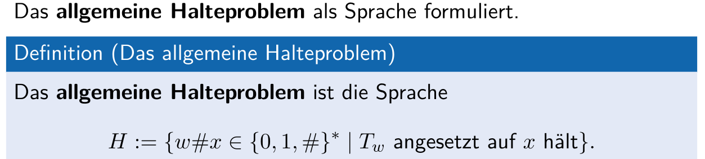
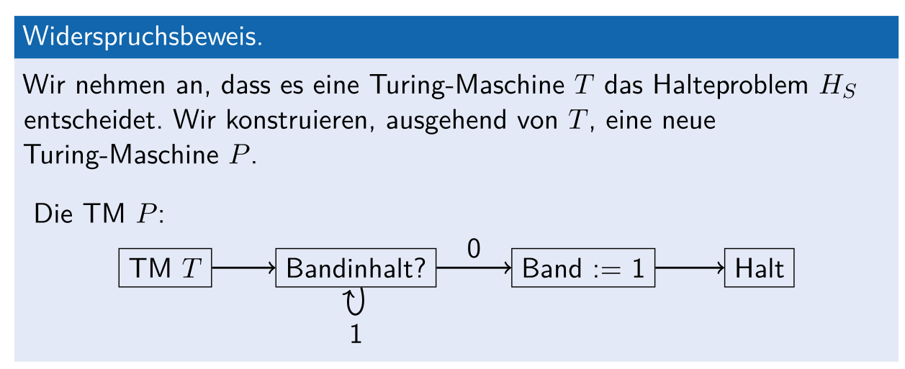

# Entschheidbarkeit

> Eine Sprache $A \subset \Sigma^*$ heisst **entscheidbar**,, wenn eine Turingmaschine $T$ existiert, die das Entscheidungsproblem $(\Sigma, A)$ löst (Dabei ist $A$ die Menge aller akzeptierter Zustände).
>
> Wenn der Bandinhalt $x \in A$ ist, hält $T$ nach endlichen vielen Schritten mit dem Bandinhalt `1` and, wenn der Bandinhalt $x \in \overline A$ ist, dann hält $T$ nach endlichen vielen Schritten mit dem Bandinhalt `0` an. Wichtig: Egal was für ein Input auf dem Band steht, $T$ muss immer anhalten.
>
> Oder anders ausgedrückt, es müssen alle akzeptierte Inputs $A$, wie auch alle nicht akzeptiert Inputs $\overline A$ semi-entscheidbar sein.
>
> Eine Sprache wird **Semi-Entsheidbarkeit** genannt, wenn es eine Turingmachine $T$ gibt, welche bei dem Bandinhalt $x \in A$ ($A$ ist die Menge der akzeptierten Inputs) in endlichen vielen Schritten mit dem Bandinhalt `1` für Ja endet. Wenn der Bandihalt $x \in \Sigma^*\setminus A$ (als x nicht ein akzeptierter Zustand ist), hält die Turingmachine $T$ **nie** an.
>
> Für jede entscheidbare Sprache kann eine Turningmaschine geschrieben werden, welche semi-entscheidbar ist.

## $\cup$ und $\cap$ Satz

Wenn $A$ und $B$ entscheidbar ist, dann ist auch $A\cup B$ und $A\cap B$ entscheidbar. Wenn $A$ und $B$ semi-entscheidbar ist, dann ist auch $A \cup B$ und $A\cap B$ semi-entscheidbar.

## Reduktion

### Sätze

* **Transitivität**:

  Für beliebige Sprachen $A, B$ und $C$ und $A \preceq B$ und $B \preceq C$ gilt, dann gilt auch $A \preceq C$

* Für beliebige Sprachen $A$ und $B$, wenn $B$ entscheidbar ist und $A \preceq B$ gilt, dann ist auch $A$ entscheidbar.

* Für beliebige Sprachen $A$ und $B$, wenn $B$ semi-entscheidbar ist und $A \preceq B$ gilt, dann ist auch $A$ semi-entscheidbar.

## Allgemeine Halteproblem

## Leeres-Band Halteproblem

## Spezielle Halteproblem

## Halteproblem Beweiss

## Satz von Rice

Es gibt eine Menge $R$, in welcher alle berechenbare Funktion sind. Die Menge $S\subset R$ ist eine echte, nicht leere Teilmenge von R. Die folgende Sprache ist nun unentscheidbar:
$$
C(S)=\{w\in\{0,1\}^*\mid F_w\in S\}
$$
