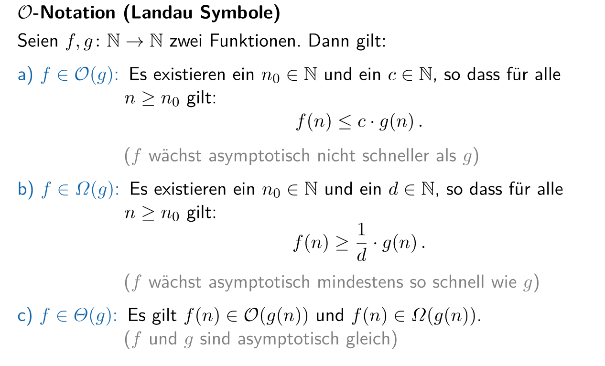
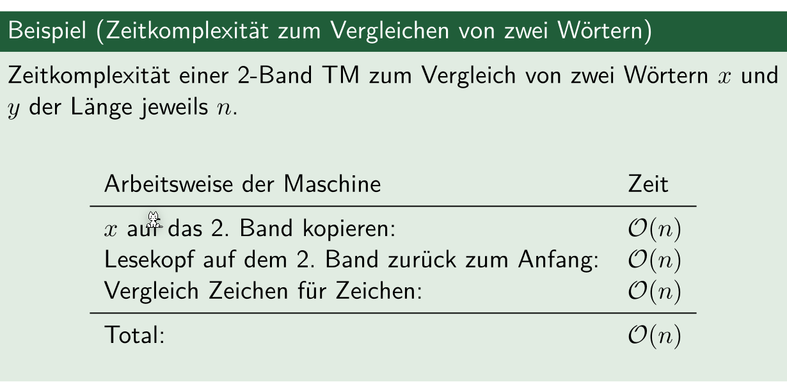
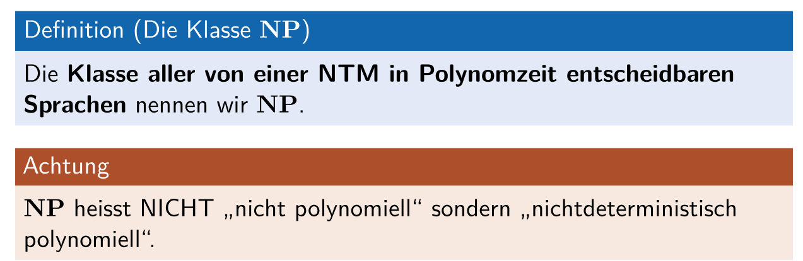

# Komplexitätstheorie

Es gibt mehrere Arten von Komplexität:

* **Zeitkomplexität**: Laufzeit des besten Programms, welche ein Problem löst
* **Platzkomplexität**: Speicherbedarf des bestens Programmes
* **Beschreibungskomplexität**: Länge des kürzesten Programmes

## Big-O-Notation (Landau Symbol)

 	

Im folgende Beispiel gilt: 

* $7n+4\in \mathcal O(n)$ für $n \ge 6 = n_0$
* $0.5n^2+5n - 4 \in \mathcal O(n^2)$

### Bespiel an Turing Maschinen

## 

## Klassifizierung von Problemen (NP vs)

## Polynomzeit Verifizieren

