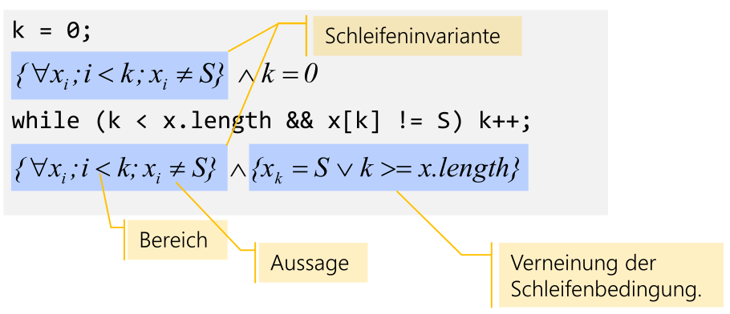
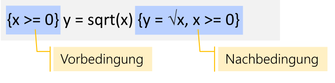

# ADS

## Abstrakter Datentyp

Jede Klasse besteht aus einer sichtbarer Schnittstelle und eine von Aussen, unsichtbare Implementation.

## Big-O Notation

Es existiert ein $n_0\in \N$ und ein $c\in N$, so dass für alle $n\ge n_o$ gilt: $f(n) \le c\cdot g(n)$.

Es gibt einige spezielle Rechenregel zu der Big-O Notation:

* Konstante Vorfaktoren können ignoriert werden (dafür gibt es das $c$)	
* Bei einem Polygon ist nur die höchste Potenz entscheidend

Rechenregeln:

* $O(f\cdot g) = O(f)\cdot O(g)$ (wobei $f$ und $g$ Funktionen sind)
* $O(r\cdot f)=O(f)$ (wobei $r$ eine Konstante ist)
* $O(f+g)=O(f)$, wenn $f >g$ gilt

Beispiele:

* $O(1)$: konstanter Aufwand
* $O(\log n)$: logarithmischer Aufwand
* $O(n)$: linearer Aufwand
* $O(n\cdot \log n)$: linear-logarithmischer Aufwand
* $O(n^2)$: quadratischer Aufwand
* $O(n^k), k>1$: polynomialer Aufwand
* $O(k^n)$: exponentieller Aufwand
* $O(n!)$: faktorieller Aufwand

## Invarianten, Vor- und Nachbedingungen

**Invariante** sind Aussagen, welche über die Ausführung hinweg korrekt bleiben.

**Vorbedingungen** ist eine Aussage, welche vor dem Ausführen einer Programmsequenz gilt. **Nachbedingungen** sind Aussagen, welche nach dem Ausführen einer Programmsequenz gilt.

## Algorithmus

> Ein Algorithmus ist eine Anleitung zur Lösung einer Aufgabenstellung, die so
> präzise formuliert ist, dass sie “mechanisch” ausgeführt werden kann.

Eigenschaft:

* Determinierheit: Identische Eingaben führen zur selben Ausgabe

* Determinismus: Ablauf des Verfahrens ist an jedem Punkt fest vorgeschrieben (keine Wahlfreiheit)

* Terminierung: Für jede Eigenschaft liegt das Ergebnis nach endlich vielen Schritten vor

* Effizienz: Wie wirdschaftlich der Algorithmus ist

  

