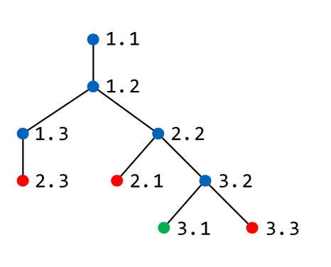
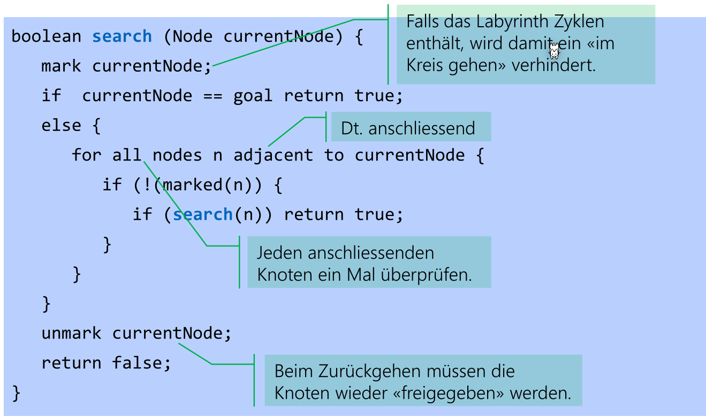
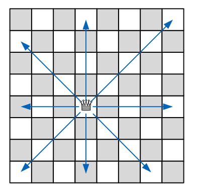

# Backtracking

## Begriffe

* **Eintscheidungsbaum:** Ein virtueller Baum, in welcher jede Entscheidung einem Knoten entsricht
* **Zeitkomplexität mit Entscheidungsbäume:** $O(z^n)$, wobei $z$ die Anzahl Verzweigungen sind und $n$ die Tiefe

## Generellen rekursiven Backtrack Algorithmus

Zeitkomplexität: $O(z^n)$, wobei $z$ den Verzweigungsgrad ist und $n$ die Tiefe

```java
public static boolean versuchen(int k) {
    if (LösungGefunden) 
        return true;
    else {
        for all e in ErweiterungVonTeilloesungen { //Gibt es noch Erweiterungen?
            if (moeglicheErweiterung(e)) {
                hinzufuegenZuLoesung(e)
                if (versuchen(k + 1)) 
                    return true;
                nehmeVonLoesung(e);
            }
        }
        return false;
    }
}
```

## Beispiel: Labyirnth


Eine Maus, welche den Käse in einem Labyrinth sucht. Dabei entsteht ein Eintscheidungsbaum.



Das ist eine Implementation eines Such-Algorithmus:



## Springerproblem


Es soll ein Algorithmus geschrieben werden, bei welchen ein Pfad für ein Springer gefunden wird, in dem alle Zellen besucht werden.

Die Zeit komplexität ist $O(8^{64})\approx 6.3 \cdot 10^{57}$

Datenstruktur ist: `int[][] schachbrett = new int[8][8]`. In `springX` und `springerY` steht, wie sich der Springer bewegen kann.


## Dameproblem



Es soll eine Stellung für 8 Damen gefunden werden, so dass sich keine zwei Damen sich gegenseitig schlagen können.

Die Zeitkomplexität ist $O(n!)$, da für die 1. Dame gibt es 8 Möglichkeit, bei der zweiten 7, bei der dritten 6, ...


```java
int[] dameInDerSpalte = new int[n]; // in welcher Zeile steht die Dame
boolean[] reihe = new boolean[n]; // ist die Reihe besetzt?

int diagN = 2*n - 1; // Anzahl Diagonale

boolean[] diagLinks = new boolean[diagN]; // ist die linke Diagonale besetzt
links = (x + y) % diagN; // Anzahl linke Diagonale

boolean[] diagRechts = new boolean[diagN]; // ist die rechte Diagonale besetzt
rechts = (diagN + x - y) % diagN; // Anzahl rechten Diagonale

// testet ob Position möglich ist
// Wert in einem der 3 Arrays true -> Position besetzt
public static boolean gueltigeDamePosition(int x, int y) {
    return !(reihe[y] || diagLinks[(x + y) % diagN] ||diagRechts[(diagN + x - y) % diagN]);
}

// setzt/löscht die Dame von der Position
// @param val ob der Wert gesetzt oder gelöscht werden soll
public static void setzeDame(int x, int y, boolean val) {
    reihe[y] = val;
    diagLinks[(x + y) % diagN] = val;
    diagRechts[(diagN + x - y) % diagN] = val;
    dameInDerSpalte[x] = (val)?y:-1;
}

/**
* Backtrack algorithmus
* @param x die Spalte die ausprobiert wird
*/
public static boolean versuchen(int x) {
    if (x == n) 
        return true; // Lösung gefunden.
    else {
        // Dame in Spalte x in allen Reihen ausprobieren.
        for (int y = 0; y < n; y++) {
            if (gueltigeDamePosition(x, y)) {
                setzeDame(x, y, true);
                if (versuchen(x + 1)) 
                    return true;
                setzeDame(x, y, false);
            }
        }
        return false;
    }
}
```

## Rucksackproblem

Es geht darum, ein Algorithmus zu schreiben, der $k$ Gegenstände mit underschiedliche Grösse und Wert in einen Rucksack packt, damit der Wert maximal wird.

Die Zeitkomplexität ist $O(2^n)$, da


In der Praxis gibt es Anwendungen dafür. Folgende sind typisch:

* Transportunternehmen: Optimale Beladung eines Lastwagens bei gegebenen Maximalgewicht und
  unterschiedlichen Speditionsgebühren: Optimierung von Gewicht und Gebühren.
* Reederei: Optimale Beladung eines Schiffes mit underschiedlichen Coontainern: Optimierung von Volumen und Transportkosten.
* Kofferproblem: Optimale Beladung eines Reisekoffers für einen Flug.
* Bitcoin: Maximale Befüllung eines Blocks bei unterschiedlichen Gebühren und unterschiedlicher Transaktionsgrösse.

Der folgende Pseudo-Code veranschaulicht ein Algorithmus für dieses Problem:

```java
void teste (Gegenstand k) {
    teste (k + 1) // ohne Gegenstand k
    falls Gegenstand k noch Platz {
        füge Element k zu der Menge hinzu
        falls neue max. Lösung speichere das
        teste (k + 1) // mit Gegenstand k
        nehme Element k aus der Menge weg
    }
}
```

Nun mit Java Code:

```java
double[] volume = {1, 2, 7, 8, 9};
double[] wert = {2000, 3000, 10_000, 11_000, 17_000};
Set<Integer> maxRucksack; // Das Set enthält die Gegenstände zur besten gefundenen Lösung.
final double MAXV = 17;
double maxW = 0;
                 
static public void test(Set<Integer> rucksack, int k, double aktW, double aktV) {
    double newV;
    if (k < volumen.length) {
        test(rucksack, k + 1, aktW, aktV); // Ohne Gegenstand k testen
		newV = aktV + volumen[k];
        if (newV <= MAXV) {
            rucksack.add(k);
            double newW = aktW + wert[k];
            if (newW > maxW) {
                maxRucksack = new HashSet<Integer>(rucksack);
				maxW = newW;
            }
			test(rucksack, k + 1, newW, newV);
			rucksack.remove(k);
        }
    }
}
```

## Zielfunktion

## A-Star Funktion

## Minmax-Algorithmus

```java
Tiefensuche durch den Spielbaum (erstellt den Baum)
Wende Bewertungsfunktion auf Endpositionen (Blätter) an 
Für alle inneren Knoten von unten nach oben:
    Falls beim inneren Knoten Schwarz am Zug war:
    	Wähle das kleinste b(v) für den inneren Knoten. //b(v) = Bewertungsfunktion
    Falls beim inneren Knoten Weiss am Zug war:
    	Wähle das grösste b(v) für den inneren Knoten.
Wähle an der Wurzel den Zug der den höchsten b(v) verspricht.
```

Oder mit java 

```java
```

## Horizont Problem

