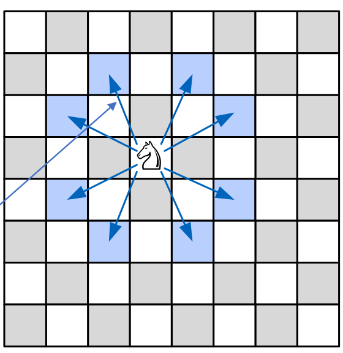

# Backtracking

## Begriffe

* **Eintscheidungsbaum:** Ein virtueller Baum, in welcher jede Entscheidung einem Knoten entsricht
* **Zeitkomplexität mit Entscheidungsbäume:** $O(z^n)$, wobei $z$ die Anzahl Verzweigungen sind und $n$ die Tiefe

## Generellen rekursiven Backtrack Algorithmus

Zeitkomplexität: $O(z^n)$, wobei $z$ den Verzweigungsgrad ist und $n$ die Tiefe

```java
public static boolean versuchen(int k) {
    if (LösungGefunden) 
        return true;
    else {
        for all e in ErweiterungVonTeilloesungen { //Gibt es noch Erweiterungen?
            if (moeglicheErweiterung(e)) {
                hinzufuegenZuLoesung(e)
                if (versuchen(k + 1)) 
                    return true;
                nehmeVonLoesung(e);
            }
        }
        return false;
    }
}
```

## Beispiel: Labyirnth


Eine Maus, welche den Käse in einem Labyrinth sucht. Dabei entsteht ein Eintscheidungsbaum.


Das ist eine Implementation eines Such-Algorithmus:


## Springerproblem



Es soll ein Algorithmus geschrieben werden, bei welchen ein Pfad für ein Springer gefunden wird, in dem alle Zellen besucht werden.

Die Zeit komplexität ist $O(8^{64})\approx 6.3 \cdot 10^{57}$

Datenstruktur ist: `int[][] schachbrett = new int[8][8]`. In `springX` und `springerY` steht, wie sich der Springer bewegen kann.


## Dameproblem


Es soll eine Stellung für 8 Damen gefunden werden, so dass sich keine zwei Damen sich gegenseitig schlagen können.

Die Zeitkomplexität ist $O(n!)$, da für die 1. Dame gibt es 8 Möglichkeit, bei der zweiten 7, bei der dritten 6, ...


```java
int[] dameInDerSpalte = new int[n]; // in welcher Zeile steht die Dame
boolean[] reihe = new boolean[n]; // ist die Reihe besetzt?

int diagN = 2*n - 1; // Anzahl Diagonale

boolean[] diagLinks = new boolean[diagN]; // ist die linke Diagonale besetzt
links = (x + y) % diagN; // Anzahl linke Diagonale

boolean[] diagRechts = new boolean[diagN]; // ist die rechte Diagonale besetzt
rechts = (diagN + x - y) % diagN; // Anzahl rechten Diagonale

// testet ob Position möglich ist
// Wert in einem der 3 Arrays true -> Position besetzt
public static boolean gueltigeDamePosition(int x, int y) {
    return !(reihe[y] || diagLinks[(x + y) % diagN] ||diagRechts[(diagN + x - y) % diagN]);
}

// setzt/löscht die Dame von der Position
// @param val ob der Wert gesetzt oder gelöscht werden soll
public static void setzeDame(int x, int y, boolean val) {
    reihe[y] = val;
    diagLinks[(x + y) % diagN] = val;
    diagRechts[(diagN + x - y) % diagN] = val;
    dameInDerSpalte[x] = (val)?y:-1;
}

/**
* Backtrack algorithmus
* @param x die Spalte die ausprobiert wird
*/
public static boolean versuchen(int x) {
    if (x == n) 
        return true; // Lösung gefunden.
    else {
        // Dame in Spalte x in allen Reihen ausprobieren.
        for (int y = 0; y < n; y++) {
            if (gueltigeDamePosition(x, y)) {
                setzeDame(x, y, true);
                if (versuchen(x + 1)) 
                    return true;
                setzeDame(x, y, false);
            }
        }
        return false;
    }
}
```

## Rucksackproblem

Es geht darum, ein Algorithmus zu schreiben, der $k$ Gegenstände mit underschiedliche Grösse und Wert in einen Rucksack packt, damit der Wert maximal wird.

Die Zeitkomplexität ist $O(2^n)$, da


In der Praxis gibt es Anwendungen dafür. Folgende sind typisch:

* Transportunternehmen: Optimale Beladung eines Lastwagens bei gegebenen Maximalgewicht und
  unterschiedlichen Speditionsgebühren: Optimierung von Gewicht und Gebühren.
* Reederei: Optimale Beladung eines Schiffes mit underschiedlichen Coontainern: Optimierung von Volumen und Transportkosten.
* Kofferproblem: Optimale Beladung eines Reisekoffers für einen Flug.
* Bitcoin: Maximale Befüllung eines Blocks bei unterschiedlichen Gebühren und unterschiedlicher Transaktionsgrösse.

Der folgende Pseudo-Code veranschaulicht ein Algorithmus für dieses Problem:

```java
void teste (Gegenstand k) {
    teste (k + 1) // ohne Gegenstand k
    falls Gegenstand k noch Platz {
        füge Element k zu der Menge hinzu
        falls neue max. Lösung speichere das
        teste (k + 1) // mit Gegenstand k
        nehme Element k aus der Menge weg
    }
}
```

Nun mit Java Code:

```java
double[] volume = {1, 2, 7, 8, 9};
double[] wert = {2000, 3000, 10_000, 11_000, 17_000};
Set<Integer> maxRucksack; // Das Set enthält die Gegenstände zur besten gefundenen Lösung.
final double MAXV = 17;
double maxW = 0;
                 
static public void test(Set<Integer> rucksack, int k, double aktW, double aktV) {
    double newV;
    if (k < volumen.length) {
        test(rucksack, k + 1, aktW, aktV); // Ohne Gegenstand k testen
		newV = aktV + volumen[k];
        if (newV <= MAXV) {
            rucksack.add(k);
            double newW = aktW + wert[k];
            if (newW > maxW) {
                maxRucksack = new HashSet<Integer>(rucksack);
				maxW = newW;
            }
			test(rucksack, k + 1, newW, newV);
			rucksack.remove(k);
        }
    }
}
```

## Zielfunktion

Wenn etwas in einem Baum gesucht werden soll, dann kann eine Zielfunktion $f(v)\to s$ definiert werde, welche einen Knoten $v$ nimmt und ein Score $s\in\mathbb N$ zurück gibt. Um nun den Wert im Baum zu finden, geht der Algorithmus einfach den höchsten Scores nach. So ist die Zeitkomplexität $O(\log n)$. Solche Funktionen gibt es aber selten. 

Anstelle von $f(x)$ kann aber eine upper-bound Funktion $b(x)$ definiert werden, für welche gilt $\forall x f(x)\le b(x)$.

Nun wird dem höchsten $b(x)$ Wert gefolgt und dabei wird den Score auf den korrekten Wert korrigiert. Dies wiederholt man nun bis es keine bessere Alternative mehr gibt. 


Falls es beim Wiederholen einen Ast gibt, für welcher die obere Schranke $b(x)$ kleiner ist, als der korrigierte Wert, kann der Ast "abgeschnitten" werden. Dies wird auch Pruning genannt.


### A-Star Funktion


Der A-Star Algorithmus kann der kürzeste Weg zwischen zwei Punkte finden. Dabei ist dieser Algorithmus eine mögliche Implementation für das Zielfunktion-Verfahren. 

Die Funktion $b(x)$ ist dabei eine Lower-Bound Funktion, welche den geschätzen Weg zwischen zwei Punkte zurück gibt. Eine mögliche Implementation benützt die Luftlinie.

Der Algorithmus startet beim Endknoten, welcher zu Beginn der Ausführung der aktuelle Knoten ist.

1. Es werden alle nicht untersuchte Nachbarn des aktuellen Knoten untersucht. Für jeden Knoten wird den Schätzwert $Luftlinie(Nachbar, Start)+Strecke(Aktuell, Nachbar)+Strecke(Aktuell, Ende)$ gerechnet und falls der tiefer ist als der aktuelle Schätzwert des Nachbars wird er gespeichert als neuer Schätzwert.
2. Es wird nun den Nachbar als den aktuellen Knoten ausgewählt, mit der tiefsten geschätzten gesamt Strecke.
3. Nun wird dies wiederholt bis der aktuelle Knoten den Endknoten ist.
4. Es werden alle Strecken gestrichen (Pruning), welche eine höhere geschätzte Strecke haben, als die letzt gefundene.
5. Es wird 1. wiederholt und bis alle Möglichkeiten gestrichen wurden.

#### Beispiel

1. Der aktuelle Knoten ist Winterthur. Alle, nicht untersuchte, Nachbarknoten werden untersucht. In diesem Fall gibt es nur Zürich. In Blau steht $154km + 25km + 0km=179km$
   
2. Der aktuelle Knoten ist Zürich. Für alle nicht untersuchten Knoten wird die Rechung $Luftlinie(Nachbar, Start)+Strecke(Aktuell, Nachbar)+Strecke(Aktuell, Ende)$ durchgeführt. Als Beispiel gilt für Chur: $25km+121km+104km=250km$. Der tiefste Knoten ist Luzern und wird als nächster aktuelle Knoten ausgewählt.
   
3. Der aktuelle Knoten ist Luzern. Es werden alle Nachbarn von Luzern untersucht. Kein Schätzwert, ausser den von Lugano, wird angepasst, da alle bereits existierende Schätzwerte kleiner sind (z.B. Churs neuer Schätzwert wäre: $25km+54km+146km+104km=329km > 250km$). Alle Knoten nicht besuchten Knoten, welche einen höheren Schätzwert als $285km$ haben, werden entfernt (Pruning).
   
4. Der aktuelle Knoten ist Chur. Der einzige nicht besuchten Konten ist Lugano. Die Strecke über Chur ist $25km+121km+152km=298km$ was grösser als $285km$ ist.
5. Die Suche ist abegschlossen da keine nicht entfernte Knoten verbleiben.

### Minmax-Algorithmus

```java
Tiefensuche durch den Spielbaum (erstellt den Baum)
Wende Bewertungsfunktion auf Endpositionen (Blätter) an 
Für alle inneren Knoten von unten nach oben:
    Falls beim inneren Knoten Schwarz am Zug war:
    	Wähle das kleinste b(v) für den inneren Knoten. //b(v) = Bewertungsfunktion
    Falls beim inneren Knoten Weiss am Zug war:
    	Wähle das grösste b(v) für den inneren Knoten.
Wähle an der Wurzel den Zug der den höchsten b(v) verspricht.
```

Oder mit Java 

```java
public static int minimax(position, depth, maximizingPlayer) {
    if(depth == 0 || gameOver()) { 
        return b(position); 
    }
    if(maximizingPlayer) {
        int maxEval = Integer.MIN_VALUE;
        for(var child : position) { // alle möglichen Züge
            maxEval = max(maxEval, minimax(child, depth – 1, false));
        }
        return maxEval;
    }
    else {
        int minEval = Integer.MAX_VALUE;
        for(var child : position) { // alle möglichen Züge
            minEval = min(minEval, minimax(child, depth – 1, true);
		}
		return minEval;
    }
}
```

#### Alpha-Beta-Pruning

Mit dem Alpha-Beta-Pruning kann der Minmax optimiert werden. Beim Alpha-Pruning werden Äste entfernt, welche für Schwarz keine Option mehr sind, da es eine bessere gibt. Beta-Pruning entfernt Äste, welche Weiss nicht mehr wählen würde, da es eine bessere Option gibt.


### Horizont-Problem

Das Horizont-Problem beschreibt, dass wenn ein Algorithmus, welcher $n$ Schritte rechnet, ev. nach $n+1$ Schritte die Lösung findet. Als Metapher: Gleich hinter dem Horizont könnte die Lösung liegen.

Eine mögliche Lösung um das Problem zu dämpfen ist, dass die ausgewählte Lösungsrichtung  (und nur diese) noch einige Schritte weiter berechnet wird.
