# Graph

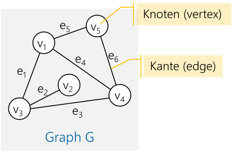

Ein **Knoten** ist ein Objekt mit einem Namen, welches mit einer oder mehreren Kanten verbunden werden. **Kanten** sind dabei eine gerichtete Verbindung zwischen zwei Knoten.

Begriffe:

* **Einfacher Pfad**: Eine Sequenz von Knoten ohne doppelte Knoten
* **Geschlossener oder zyklischen Pfad**: Ein Pfad, welcher die selben Anfangs- und Endknoten hat
* **Pfadlänge**: Die Anzahl **Kanten** des Pfads (Achtung, **nicht** Knoten)
* **Benachbarte Knoten**: Zwei Knoten, welche mit einer Kante verbunden sind
* **Vollständiger (oder kompletter) Graph**: Jeder Knoten ist mit jedem Knoten **direkt** verbunden
* **Verbundener Graph**: Jeder Knoten ist mit jedem anderen Knoten **mit einem Pfad** verbunden
* **Dichte des Graphen**: Das Verhältnis von Anzahl Kanten zu der Anzahl möglichen Kanten
* **Dichter Graph** (dense graph): Nur wenige Kanten fehlen
* **Dünner oder lichter Graph** (sparse graph): Nur wenige Kanten im Graph sind vorhanden
* **ungerichteten Graph**: Normallerweise sind Kanten gerichtet. Bei einem ungerichteten Graph gibt es immer Kanten in beide Richtungen
* **gewichteten Graphen** (auch Netzwerk): Graphen, bei welchen die Kanten ein Gewicht oder Kosten haben
* **gewichtete Pfadlänge**: Die Summe der Pfadgewichte
* **zyklenfreier Graph**: Ein Graph, ohne Loops
* Speziallfall des Baumes: Ein gerichteter zyklenfreier, verbundener Graph, bei welchem jeder Knoten genau eine eingehende Verbindung hat, ausser der Wurzelknoten, ist ein Baum
* **Wald**: Eine Gruppe von nicht zusammenhängender Bäume

## Implementation 1: Adjazenz-Liste

Jede Implementation hat eine Liste von Kanten zu den benachbarten Knoten (die Adjazenz-Liste)

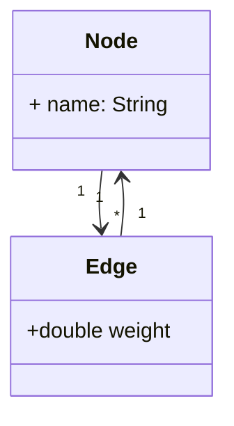

## Implementation 2: Adjazenz-Matrix

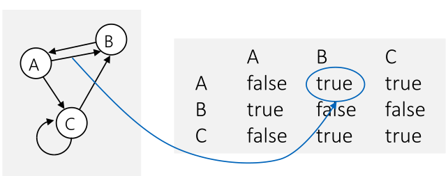

Es gibt eine $N\times N$ Boolean-Matrix, in welcher alle Kanten als `boolean` representiert sind. Falls die Kanten gewichtet sind, kann das `boolean` durch ein `double` ersetzt werden.


## Suchstrategien

### Tiefesuche

Bei der Tiefesuche wird soweit zum nächsten Node gegangen, bis dies nicht mehr möglich ist. Dann wird den Pfad zurück gegangen, bis ein anderen Pfad eingeschlagen werden kann.

```java
void depthFirstSearch(startNode: Node) {
    Stack<Node> stack = new Stack<>();
    startNode.marked = true;
    stack.push(startNode);
    while(!stack.isEmpty()) {
        Node current = stack.pop();
        current.marked = true
        for(Edge edge : current.edges) {
            if(!edge.nextNode.marked) {
                stack.push(edge.nextNode)
            }
        }
    }
}
```

### Breitesuche

Bei der Breitensuche wird zuerst alle Nachbarn eines Nodes besucht, danach die Nachbarn der Nachbarn

```java
void breadthFirstSeach(startNode: Node) {
    Queue<Node> queue = new Queue<>();
    startNode.marked = true;
    queue.enqueue(startNode);
    while(!queue.isEmpty()) {
        Node current = stack.dequeue();
        current.marked = true
        for(Edge edge : current.edges) {
            if(!edge.nextNode.marked) {
                stack.enqueue(edge.nextNode)
            }
        }
    }
}
```

Der einzige Unterschied in der Implementation zwischen der Tiefen- und der Beritensuche, ist der Datentyp. Bei der Tiefensuche wird ein `Stack` und bei der Breitensuche eine `Queue` verwendet.

## Kürzester, ungewichteter Pfad


Der Graph wird mit der Breitesuche durchsucht. Bei jedem Knoten wird hingeschrieben, von welchem Knoten gekommen wurde.

## Kürzester, gewichteter Pfad

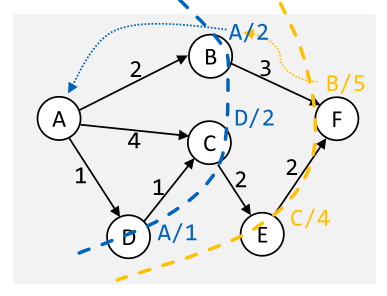

## Dijkstra

Der Dijkstra-Algorithmus funktioniert wie eine Breitensuche, aber es wird eine Priority-Queue verwendet, in welcher alle noch nicht besuchten Nodes stehen. Diese Queue wird sortiert nach der Strecke um zum Node vom Start zu gelangen.

## Greedy Algorithmen


## Topologisches Sortieren

Bei einem gerichteten, unzyklischen Graphen gibt es eine topologische Sortierung. Diese ist die Reihenfolge von den Knoten, dass alle Abhängigkeiten eines Knoten zuerst bearbeitet werden.

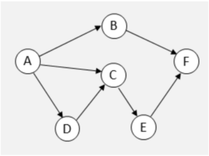

In diesen Graph kommt `A` immer zuerst, da es für jeden Knoten benötigt wird, danach könnte `D` oder `B` kommen. `C` kann noch nicht kommen, da `D` noch nicht bearbeitet wurde.

Es gäbe folgende topologische Sortierungen:

* A B D C E F
* A D C E B F
* A D B C E F
* A D C B E F
* A D C E B F

Der folgende Code druckt eine mögliche topologische Sortierung von einem Graphen aus.

```java
public void printTopologicalSorting(Graph graph) {
    while(!graph.isEmpty())
        for(Node node : graph) {
            if(node.incomming == 0) {
                System.out.println(node.name);
                for(Node nextNode : node.outgoingNodes) {
                    nextNode.incomming--;
                }
                graph.removeNode(node);
            }
        }
    }
}
```

## Maximaler Fluss

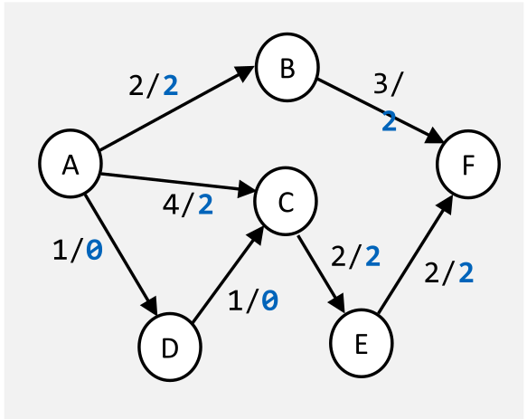

Um den maximalen Fluss durch ein Graphen zu finden kann folgender Algorithmus verwendet werden:

Es werden drei Graphen geführt:

1. Ein Graph mit den orginalen Fluss-Daten
   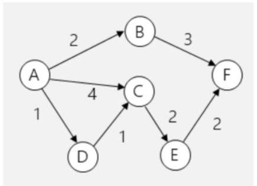
2. Ein Graph mit den provisorischen Fluss-Daten
   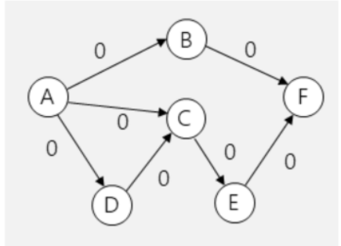
3. Ein Graphen mit den verbleibenden Fluss-Daten (auch Residualgraph gennant)
   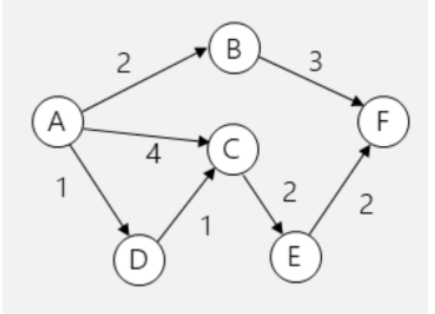

Bei jeder Iteration werden im provisorischen Graphen die provisorischen Fluss-Daten eingeschrieben und die Differenz zwischen dem Original und dem provisorischen Graphen in den Residualgraphen übertragen.

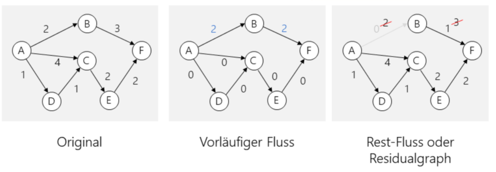

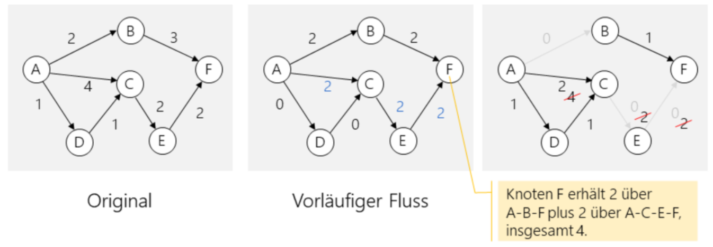

## Traveling Salesman Problem

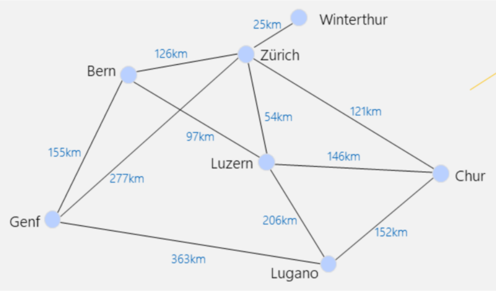

Finde den kürzesten Pfad, der jede Stadt genau einmal besuchen wird. Dieses Problem hat die Big-O-Notation $O(n!)$. Um das Problem in nützlicher Zeit zu lösen müssen heuristische Algorithmen eingesetzt werden.

Ein möglichen Algorithmus ist der folgenden:

1. Die Kanten werden nach ihren Kosten sortiert
2. Die "billigste" Kante wird ausgewählt unter der Bedinungen:
   1. dass keine Zyklen entstehen dürfen
   2. dass kein Knoten mit mehr als zwei Kanten verbunden sein darf

Diesen Algorithmus führt zu einer Laufzeit von $O(n^2\log(n^2))$
