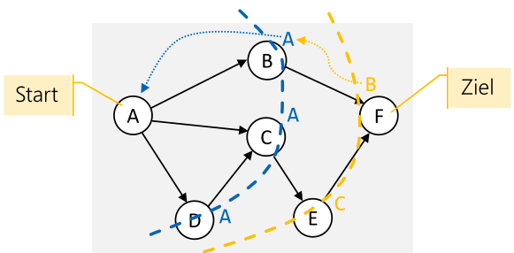

# Graph


Ein **Knoten** ist ein Objekt mit einem Namen, welches mit einer oder mehreren Kanten verbunden werden. **Kanten** sind dabei eine gerichtete Verbindung zwischen zwei Knoten.

Begriffe:

* **Einfacher Pfad**: Eine Sequenz von Knoten ohne doppelte Knoten
* **Geschlossener oder zyklischen Pfad**: Ein Pfad, welcher die selben Anfangs- und Endknoten hat
* **Pfadlänge**: Die Anzahl **Kanten** des Pfads (Achtung, **nicht** Knoten)
* **Benachbarte Knoten**: Zwei Knoten, welche mit einer Kante verbunden sind
* **Vollständiger (oder kompletter) Graph**: Jeder Knoten ist mit jedem Knoten **direkt** verbunden
* **Verbundener Graph**: Jeder Knoten ist mit jedem anderen Knoten **mit einem Pfad** verbunden
* **Dichte des Graphen**: Das Verhältnis von Anzahl Kanten zu der Anzahl möglichen Kanten
* **Dichter Graph** (dense graph): Nur wenige Kanten fehlen
* **Dünner oder lichter Graph** (sparse graph): Nur wenige Kanten im Graph sind vorhanden
* **ungerichteten Graph**: Normallerweise sind Kanten gerichtet. Bei einem ungerichteten Graph gibt es immer Kanten in beide Richtungen
* **gewichteten Graphen** (auch Netzwerk): Graphen, bei welchen die Kanten ein Gewicht oder Kosten haben
* **gewichtete Pfadlänge**: Die Summe der Pfadgewichte
* **zyklenfreier Graph**: Ein Graph, ohne Loops
* Speziallfall des Baumes: Ein gerichteter zyklenfreier, verbundener Graph, bei welchem jeder Knoten genau eine eingehende Verbindung hat, ausser der Wurzelknoten, ist ein Baum
* **Wald**: Eine Gruppe von nicht zusammenhängender Bäume

## Implementation 1: Adjazenz-Liste

Jede Implementation hat eine Liste von Kanten zu den benachbarten Knoten (die Adjazenz-Liste)


## Implementation 2: Adjazenz-Matrix


Es gibt eine $N\times N$ Boolean-Matrix, in welcher alle Kanten als `boolean` representiert sind. Falls die Kanten gewichtet sind, kann das `boolean` durch ein `double` ersetzt werden.


## Suchstrategien

### Tiefesuche

Bei der Tiefesuche wird soweit zum nächsten Node gegangen, bis dies nicht mehr möglich ist. Dann wird den Pfad zurück gegangen, bis ein anderen Pfad eingeschlagen werden kann.

```java
void depthFirstSearch(startNode: Node) {
    Stack<Node> stack = new Stack<>();
    startNode.marked = true;
    stack.push(startNode);
    while(!stack.isEmpty()) {
        Node current = stack.pop();
        current.marked = true
        for(Edge edge : current.edges) {
            if(!edge.nextNode.marked) {
                stack.push(edge.nextNode)
            }
        }
    }
}
```

### Breitesuche

Bei der Breitensuche wird zuerst alle Nachbarn eines Nodes besucht, danach die Nachbarn der Nachbarn

```java
void breadthFirstSeach(startNode: Node) {
    Queue<Node> queue = new Queue<>();
    startNode.marked = true;
    queue.enqueue(startNode);
    while(!queue.isEmpty()) {
        Node current = stack.dequeue();
        current.marked = true
        for(Edge edge : current.edges) {
            if(!edge.nextNode.marked) {
                stack.enqueue(edge.nextNode)
            }
        }
    }
}
```

Der einzige Unterschied in der Implementation zwischen der Tiefen- und der Beritensuche, ist der Datentyp. Bei der Tiefensuche wird ein `Stack` und bei der Breitensuche eine `Queue` verwendet.

## Kürzester, ungewichteter Pfad



Der Graph wird mit der Breitesuche durchsucht. Bei jedem Knoten wird hingeschrieben, von welchem Knoten gekommen wurde.

## Kürzester, gewichteter Pfad


## Dijkstra

## Greedy Algorithmen

## Topologisches Sortieren

## Maximaler Fluss

## Traveling Salesman

