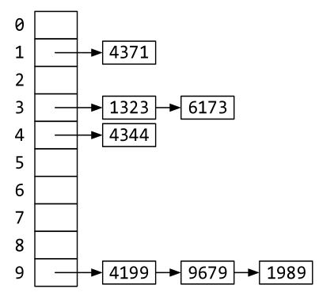
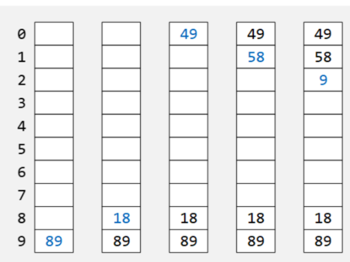
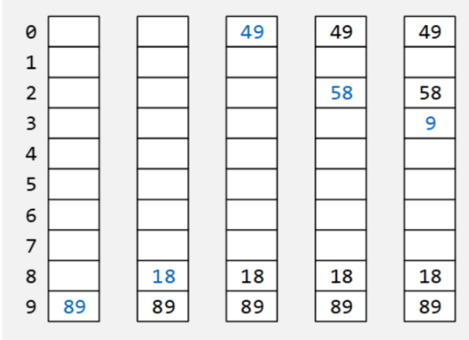
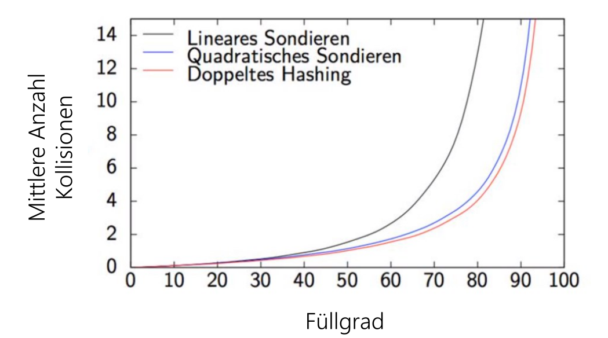
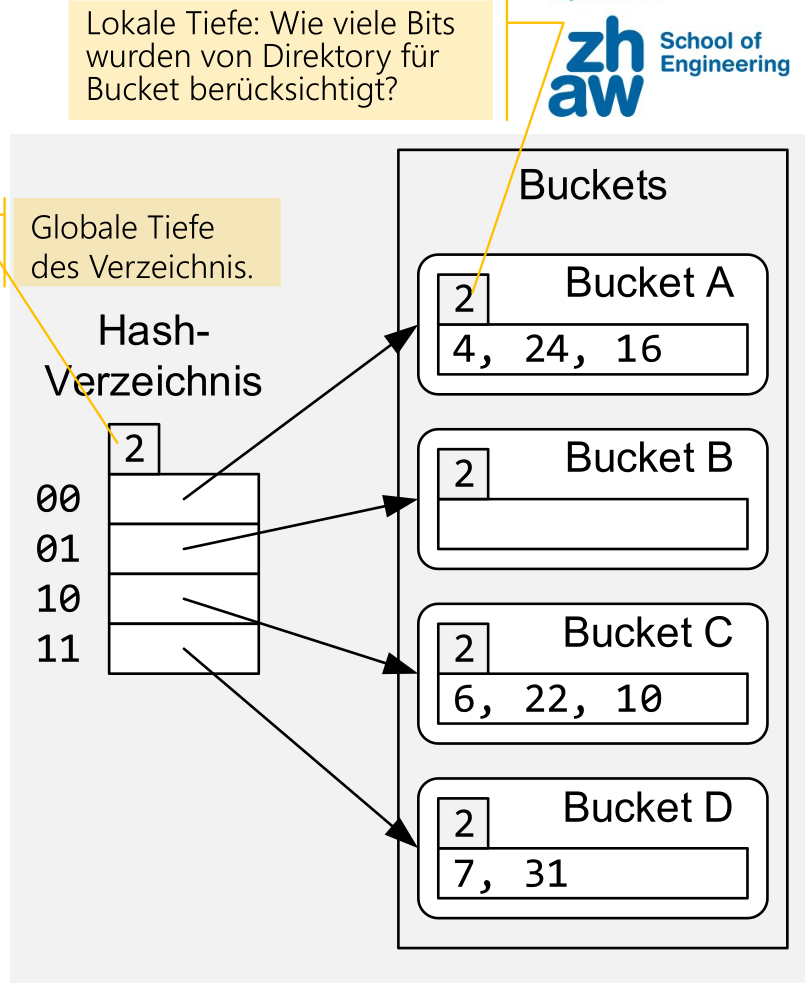
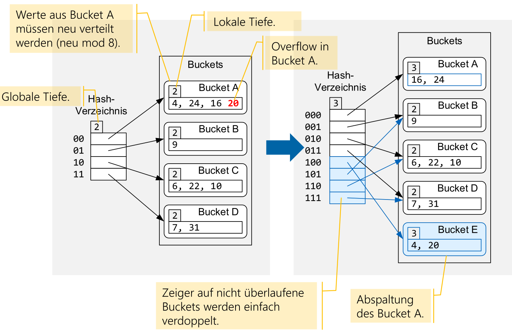

# HashMap

## String Hashing

Strings werden oft mit einem Horner-Schema und einer Modulo-Operation generiert: $(((A_3x+ A_2)x + A_1)x + A_0) \mod n$

## Hashing in Java

Die `Object.hashCode()` Funktion muss folgende Eigenschaften erfüllen:

* Solange sich der Zustand eines Objektes nicht verändert muss der Hash gleich bleiben
* Wenn `o1.equals(o2) == true` zutrifft, dann muss auch `o1.hashCode() == o2.hashCode()` zutreffen
* Wenn `o1.equals(o2) == false` ist, dann **sollten** `o1.hashCode() != o2.hashCode()` sein

Eine Hash-Methode sollte folgendermassen implementiert werden:

```java
public class Emplyee {
    private int employeeId;
    private String name;
    private Department dept;
    
    @Override
    public int hashCode() {
        // 13, 17 and 31 are prime numbers
        int hash = 1;
        hash = hash * 13 + employeeId;
        hash = hash * 17 + name.hashCode();
        hash = hash * 31 + (dept == null? 0: dept.hashCode());
        return hash;
    }
}
```

## Kollisionen

Bei Kollisionen in einer Hash-Map gibt es mehere Möglichkeiten, diese aufzulösen:

### Überlaufsliste

Es kann eine Überlaufsliste geführt werden. Wenn eine Hash-Kollision auftrit, wird ein neuer Eintrag in einer Liste hinzugefügt.



### Open Addressing 

#### Open Addressing: Lineares Sondieren

Beim Linearen-Sondieren wird bei einer Kollision einfach `+1` gerechnet, bis keine Kollision mehr auftritt. Damit die HashMap immer noch effizient ist, sollte der Loadfaktor unter 0.8 bleiben ($< 0.8$)

Im folgenden Beispiel werden 89, 18, 49, 58 und 9 mit einer Hash-Funktion `x % 10` eingefügt:



Beim Linearen-Sondieren kann Primary-Clustering auftreten und bedeuetet, dass sich Gruppen um Hash-Werte bilden. Dies beinflusst das Wiederfinden negativ.

#### Open Addressing: Quadratisches Sondieren

Beim Quadratischen-Sondieren wird der Hashwert `+1`, `+4`, `+9`, `F+i²` gerechnet. Dies wirkt dem Primary-Clustering entgegen.

Es werden wieder 89, 18, 49, 58 und 9 mit einer Hash-Funktion `x % 10` eingefügt:



#### Performance

Wie in der folgenden Graphik erkentlich ist, nimmt die Anzahl Kollisionen bei einem steigenden Füllgrad exponenziell zu.



#### Löschen

Wenn ein Wert gelöscht wird, kann er nicht einfach entfernt werden, da dies das Wiederfind-Verhalten ändert wurde. Es gibt zwei Möglichkeiten:

1. Das Objekt wird nicht gelöscht, sonder nur als gelöscht markiert.
2. Alle folgende Werte bis zur nächsten leeren Zelle müssen erneut eingefügt werden (rehashing)

## Extensible Hashing

Dies ist eine Möglichkeit, wie HashMaps dynamisch vergrössert werden können.

Es gibt ein Hash-Verzeichniss, welches auf Bucket verweisst. In diesem Bucket sind alle Objekte, welche einen Hash haben, welcher mit dem entsprechenden Bits beginnt. 

Um den Bucket eines Hashes zu finden, wird folgendes gerechnet: $Hash \mod {2^{GlobaleTiefe}}$



Wenn nun ein Bucket überlauft, dann wird geschaut, ob die lokale Tiefe kleiner ist als die globale Tiefe. Wenn nicht, wird  die globale Tiefe um eins erhöht. Somit wird das Hash-Verzeichniss doppelt so gross und hat Platz für zusätzliche Buckets.



Wenn die lokale Tiefe kleiner ist als die globale Tiefe, dann gibt es mehrere Zeiger, welche auf den überlaufenden Bucket zeigen. Es wird ein neuer Bucket erstellt und einer der Zeiger auf den neuen Bucket umgebogen.