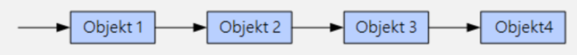
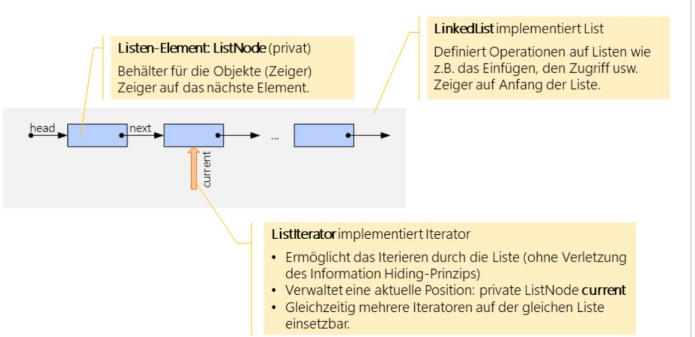
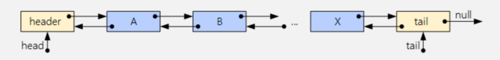
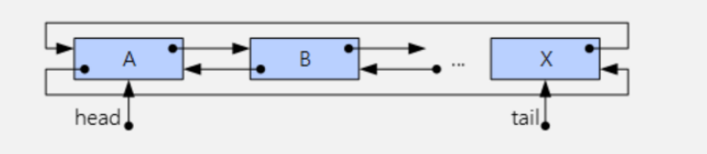

# List

In ADS ist mit einer Liste **immer** eine linked list.

## Methoden

* `void add (T obj)`
* `void add(int pos, T obj)`
* `T get(int pos)`
* `T remove(int pos)`
* `int size()`
* `boolean isEmpy()`

## Zwei Listen vergleichen

**TODO**

## Doppelt verkettete Liste

Einfach verkettete Liste können nur in eine Richtung effizient iteriert werden. Mit einer doppelt verkettete Liste kann ein Iterator in beide Richtungen gehen. Dafür wird beim hinzufügen und löschen bezahlt, da zwei Pointers abgeändert werden müssen.

## Zirkuläre Liste

Eine Liste kann zirkulär verbunden werden. Dies hat den Vorteil, dass der Fall von einer leeren Liste kein spezial Fall ist.

## Sortierte Liste

Eine Liste kann kontinuierlich sortiert werden.

Wenn eine Liste, welche nicht automatisch sortiert ist, sortiert werden soll, kann `Collections.sort(List<?> list)` benützt werden

## Arrays

Arrays sind sehr effizient bei Zugriffen, dafür schrecklick für das hinzufügen und löschen von Elemente.

## Listenimplementationen im Vergleich

| Operation      | Arraylist | LinkedList | Vector     |
| -------------- | --------- | ---------- | ---------- |
| Mutationen     | langsam   | schnell    | langsam    |
| Zugriff        | schnell   | langsam    | langsam    |
| Synchronisiert | nein      | nein       | ja         |
| Bemerkung      | -         | -          | Deprecated |

