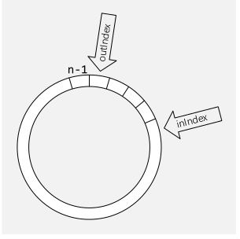

# Queue

Queues sind eine FIFO-Collection und werden oft für Warteschlangen verwendet.

Queues können mittels Array implementiert, in diesem Fall wird das Array als Ringbuffer gebraucht. 

Queues können eine fixe Kapazität haben, in welche Fall `enqueue(T obj)` ein Fehler ausgeben würde.

## Methoden

* `void enqueue(T obj)`
* `T dequeue()`
* `T peek()`
* `void removeAll()`
* `boolean isEmpty()`
* `boolean isFull()`

## Priority Queue

Bei einer Priority Queue werden Objekte beim einfügen nach einer Priorität sortiert. Eine Priority Queue wird z.B. für das Scheduling von Prozessen in Betriebsystemen, Tasklisten nach Priorität, etc. benützt.