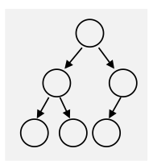
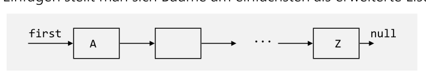
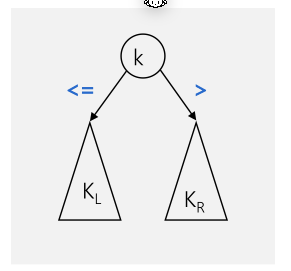
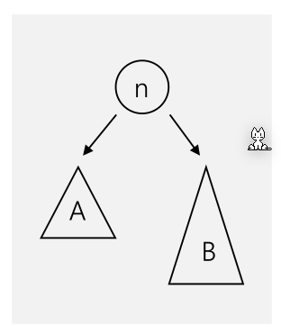
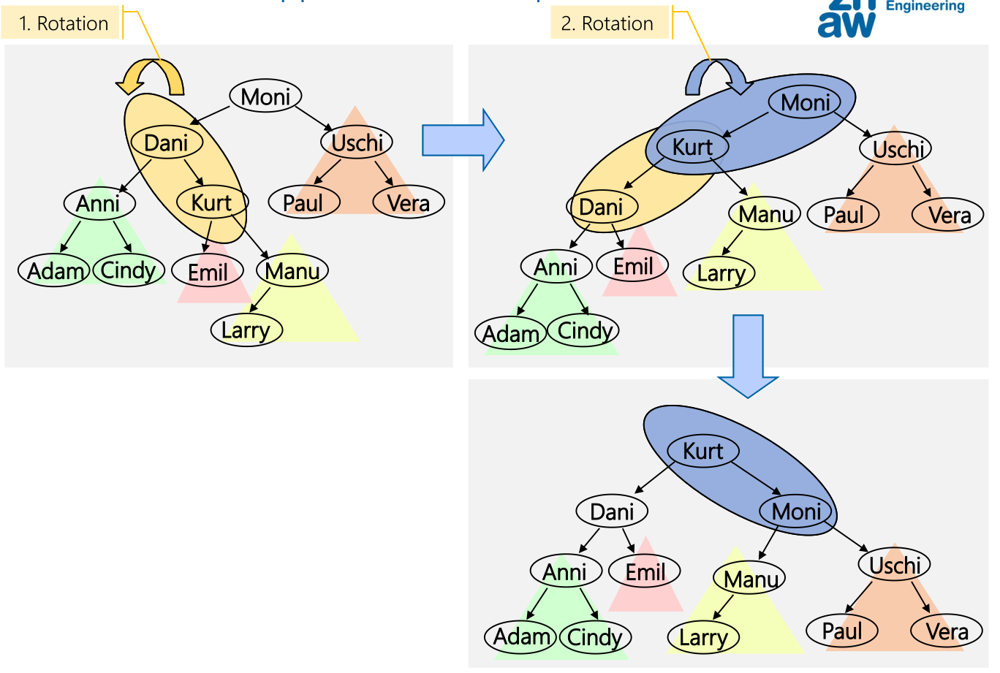
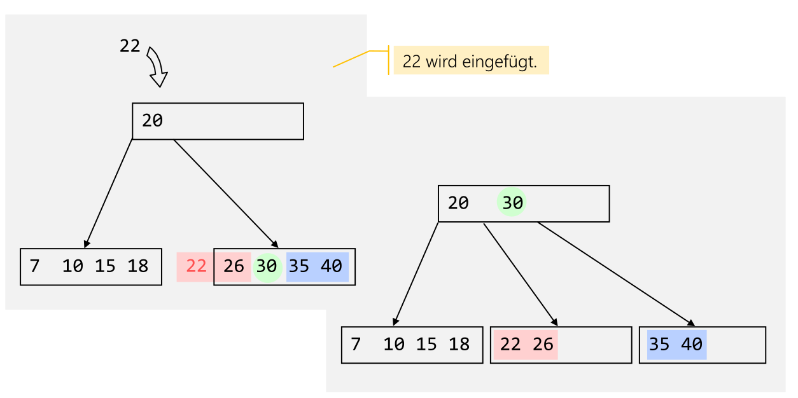
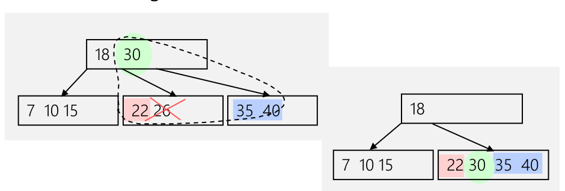
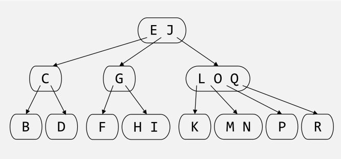
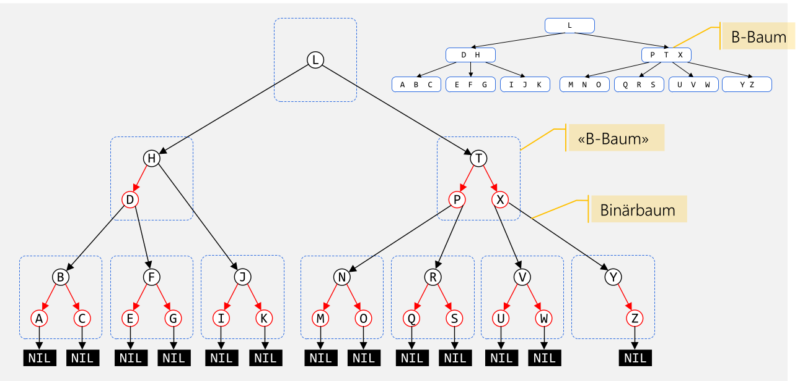

# Tree

```
Tree = Empty
Tree = Node(List<Tree)
```

Eigenschaften:

* Knoten mit dem gleichen Vorgänger-Knoten sind **Geschwisterknoten**
* Es gibt genau einen Pfad von der Wurzel zu jedem Knoten, wobei die Weglänge die Anzahl Kanten zum Konten darstellt
* Die **Höhe** des Baumes sind die Anzahl Ebenen im Baum (`Anzahl Kannten + 1`)
* Das **Gewicht** oder **Grösse** ist die Anzal der Knoten

## Binary Tree

```
Tree = Empty
Tree = Node(Tree, Value, Tree)
```

Eigenschaften:

* Die **Höhe/Tiefe** ist die Anzahl Ebenen im Baum (`Anzahl Kanten + 1`)
* Auf jeder Ebene $h$ gibt es maximal $2^{h-1}$ Knoten
* Die Anzahl Konten sind $n=2^h-1$, wobei $h$ die Höhe des Baums ist 
* Die Anzahl Ebenen/Höhe sind $h=\log_2(n+1)$
* Ein Binary-Tree ist **voll**, wenn jeder Knoten entweder Blatt ist oder zwei Kinder besitzt
  
* Ein Binary-Tree ist **vollständig/komplett**, wenn alle Ebenen bis auf die letzte Ebene gefüllt ist und die Bläter linksbündig angeordnet sind
  
* Ein vollständigen (bzw. kompletten) sortierten Binärbaum kann in $O(\log_2 n)$ Schritten durchsucht werden (für 1000 Elemente werden 10 Schritte benötigt)

### Traversieren


| Methode    | Beschreibung                                                 | Beispiel                    |
| ---------- | ------------------------------------------------------------ | --------------------------- |
| Preorder   | `Value, Left, Right`                                         | `h, d, b, a, c, f, e, g, i` |
| Inorder    | `Left, Value, Right`                                         | `a, b, c, d, e, f, g, h, i` |
| Postorder  | `Left, Right, Value`                                         | `a, c, b, e, g f, d, i, h`  |
| Levelorder | Jede Ebene wird Ausgedruckt: $n, a_0, b_0, a_1, a_2, b_1, b_2$ | `h, d, i, b, f, a, c, e, g` |

### Übungung

Es ist geben: 

* Preorder-Traversierung: 10, 3, 1, 4, 2, 9, 7, 5, 8
* Inorder-Traversierung: 3, 4, 1, 10, 9, 7, 2, 8, 5

Daraus soll der Baum wieder hergestellt werden:

```mermaid

```

### Immer Rechts oder immer Links Einfügen

Der folgende Code erstellt eine LinkedList als Binary-Tree:


```java
class BinaryTree<T> implements Tree<T>{
    private TreeNode<T> root;
    private TreeNode insertAt(TreeNode node, T x) {
        if (node == null) {
       		return new TreeNode(x);
        }
        else {
            // ACHTUNG: Der rechte Node wird ersetzt
            node.right = insertAt(node.right, x);
            // or 
            //node.left = insertAt(node.left, x);
        	return node;
        }
    }
    
    public void insert (T x) {
    	root = insertAt(root, x);
    }
}
```

### Sortierte Bäume

Bei einem sortierten Baum gilt dass der linke Node kleinere oder gleiche Elemente ($\le$) enthält und der rechte Node alle grössere Elemente.



Dies erleichtert das Suchen enorm. Bei einem vollständigen gefülltem Binär-Baum ist $O(\log(n))$ die Zeitkomplexität.

```java
public Object search(TreeNode<T> node, T x) {
    if (node == null) return node;
    else if (x.compareTo(node.element) == 0) return node;
    else if (x.compareTo(node.element) <= 0) return search(node.left,x);
    else return search(node.right,x);
}
```

#### Konten hinzufügen

Dafür ist das Einfügen komplexer. Mit folgendem Alogirthmus wird kein vollständigen Binär-Baum erzeugt und somit auch nicht die idalle Zeitkomplexität von $O(\log(n))$ erreicht.

```java
private TreeNode<T> insertAt(TreeNode<T> node, T x) {
    if (node == null) 
        return new TreeNode(x);
    else if (x.compareTo(element) <= 0) 
        node.left = insertAt(node.left, x);
    else
    	node.right = insertAt(node.right, x);
    return node;
}
```

#### Knoten löschen

1. Knoten finden
2. Knoten löschen
   1. Fall: der Knoten hat keine Kindern: Knoten einfach löschen
   2. Fall: der Konten hat genau einen Teilbaum: Knoten löschen und Referenz neu setzen
   3. Fall: der Knoten hat zwei Teilbäume: Es muss ein Ersatz-Knoten gefunden werden. Dafür muss der grösste Wert des linken Baums oder der grösste Wert des rechtem Baum 

```java
private TreeNode<T> removeAt(TreeNode<T> node, T x) {
    if (x.compareTo(node.element) == 0) { // delete this node
        if (node.left == null) {
        	node = node.right; // no left subtree -> case 1 or 2
        } else if (node.right == null) {
            node = node.left; // no right subtree -> case 2
        } else {
            // two subtrees -> case 3
            // node.left is root of left subtree
            node.left = findRepAt(node.left, node);
        }
    } else if (x.compareTo(node.element) < 0) {
        node.left = removeAt(node.left, x);
        // search in left subtree
    } else {
    	node.right = removeAt(node.right, x); // search in right subtree
    }
    return node;
}

private TreeNode<T> findRepAt(TreeNode<T> node, TreeNode<T> rep) {
    if (node.right == null) {
        // node is the rightmost node, the node that should be replaced gets its element
        rep.element = node.element;
        // remove rightmost node of left subtree (return value is the 'new' node)
        node = node.left;
    } else {
        // more nodes on the right side of left subtree
        node.right = findRepAt(node.right, rep);
    }
    return node;
}
```

## Vollständig Balancierter Baum

Ein vollständig balancierter Baum (oder vollständig ausgeglichener Baum) hat, abgesehen von der untersten Ebenen, alle Ebenen vollständig (mit Knoten) besetzt.

Mit dieser Definition kommen einige Eigenschaft mit:

* Tiefe ist $\log_2(n+1)$
* Binärsuche: $O(\log_2(n))$
* Beim Einfügen, Löschen und Ändern: $O(n)$

## Balancierte Bäume



Ein nicht-vollständig balancierter Baum hat die maximale Höhe von $c_1\cdot \log(n)+c_2$ ($c_1$ und $c_2$ sind Konstante). Nun ist eine Suche immer $O(\log(n))$.

Es gibt verschiedene Möglichkeiten die Bedingung $c_1\cdot \log(n)+c_2$ umzusetzten.

## AVL-Baum

Ein AVL-Baum ist eine Art eines (nicht-vollständig) balancierter Baum. Bei jedem Knoten gilt, dass sich die Höhe der beiden Teilbäumen um höchstens eins unterscheidet.

Die Konstanten in $c_1 \cdot \log(n)+c_2$ sind ca. $c_1 \approx 1.44$ und $c_2\approx -0.33$. Daraus geht, dass ein AVL durchschnittilch 44% höher als ein vollständiger ausgeglichener Baum ist.

### Rotationen

Wenn ein Teilbaum um zwei höher als der zweite Teilbaum ist, muss ein Teil des Baumes rotiert werden.


Es gibt aber Situationen, wo nach einer Rotation immer noch eine Höhendifferenz von zwei existiert. In diesen Fällen muss doppelt rotiert werden.



## B-Baum


Ein B-Baum ist ein vollständig balancierten Baum, welcher optimiert ist für das Speichern auf Block-Speicher (HDD, SSD, Filesysteme).

Jedes Element hat Schlüssel, bzw. Werte, und Verweisse auf weitere Blöcke. Die Schlüssel sind sortiert. Zudem gilt, dass ein Block mit einem Verweiss zwischen dem Schlüssel $s_i$ und $s_j$, Werte zwischen $s_i$ und $s_j$ hat.

Ein B-Baum hat die Ordnung $n$, wenn die maximale Anzahl von Kinder  eines Nodes $n-1$ ist und alle Knoten, ausser der Wurzel, mindestens $\left\lfloor\frac{(n-1)} 2\right\rfloor$ Knoten haben. Die Wurzel hat zwischen $1$ und $n-1$ Schlüssel.

Die Tiefe des Baumes ist ca. $\log_{\text{Anzahl Verweisse}}(\text{Anzahl Elemente})$.

Wenn Informationen nur in Blättern gespeichert wird, wird dies ein **B+-Baum** genannt.

Hier gibt es eine Visualisierung eines B-Tree: https://www.cs.usfca.edu/~galles/visualization/BTree.html

### Element Einfügen

Ein Schlüssel, bzw. Wert, wird immer in den Blättern eingefügt. Wenn ein Blatt voll ist, gibt es ein Überlauf. 

Bei einem Überlauf wird das mittlere Element des überlaufendem Knoten geteilt und in den Vater-Knoten hochgezogen. Danach wird der zweite Teil in ein neues Geschwister-Element bewegt und an den Vater gehängt. Wenn das Vater-Element ebenfalls überlauft, wiederholt sich dieser Prozess bis entweder ein Vater-Element nicht mehr überlauft oder bei der Wurzel angelangt wird. 

Falls die Wurzel überlauft, wird der selbe Prozess wiederholt, aber mit einem neuen Element als neue Wurzel. Der Baum wird dann um eins höher.



### Element Löschen

Wenn das zu löschende Element in einem Blatt-Knoten ist und kein Unterlauf dabei entsteht, kann das Element einfach gelöscht werden.

Wenn dabei ein Unterlauf entsteht (weniger als $\frac n 2$ Schlüsselt), kann ein Eltern-Element in das unterlaufene Kind gezogen werden und mit einem Geschwister-Element ersetzt werden.


Alternative können zwei Knoten verschmolzen werden:



Wenn das zu löschende Element kein Blatt-Knoten ist, dann muss ein Ersatz-Element in den Kinder gefunden werden. Dafür kann entweder das höchste Element aus dem linken Kind oder das tiefste Element aus dem rechten Kind genommen werden. Wenn dabei ein Unterlauf entsteht, muss die Regel von oben angewendet werden.


## 2-3-4-Baum



Der 2-3-4-Baum ist ein Spezialfall des B-Baums mit der Ordnung 4 (Jeder Knoten, ausser der Wurzel, hat zwei, drei oder 4 Kinder). Obwohl dies ein B-Baum ist, eignet sich diese Datenstruktur für Memory.

## Rot-Schwarz-Baum

Ein Rot-Schwarz-Baum ist ein Spezialfall des 2-3-4-Baums, bei welchem die Knoten mit 2 oder mehr Schlüsseln durch Binärbäume implementiert werden.



Es hat die maximale Höhe von $2\cdot \log_2(n+2) - 2$ und einen Such-Aufwand von $O(\log(n))$

Dabei vereint der Rot-Schwarz-Baum die Einfachheit des Binärbaumes und die Ausgeglichenheit des B-Baumes. Er ist weniger gut balanciert als ein AVL-Baum, aber Einfüg- und Lösch-Operationen sind schneller.