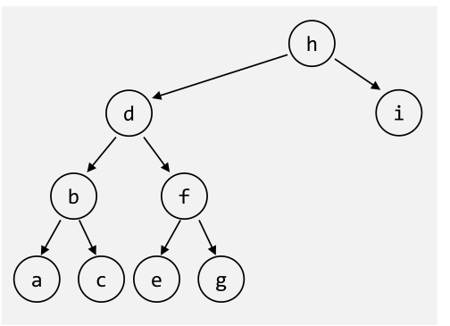

# Tree

```
Tree = Empty
Tree = Node(List<Tree)
```

Eigenschaften:

* Knoten mit dem gleichen Vorgänger-Knoten sind **Geschwisterknoten**
* Es gibt genau einen Pfad von der Wurzel zu jedem Knoten, wobei die Weglänge die Anzahl Kanten zum Konten darstellt
* Die **Höhe** des Baumes sind die Anzahl Ebenen im Baum (`Anzahl Kannten + 1`)
* Das **Gewicht** oder **Grösse** ist die Anzal der Knoten

## Binary Tree

```
Tree = Empty
Tree = Node(Tree, Value, Tree)
```

Eigenschaften:

* Die **Höhe/Tiefe** ist die Anzahl Ebenen im Baum (`Anzahl Kanten + 1`)
* Auf jeder Ebene $h$ gibt es maximal $2^{h-1}$ Knoten
* Die Anzahl Konten sind $n=2^h-1$, wobei $h$ die Höhe des Baums ist
* Die Anzahl Ebenen/Höhe sind $h=\log_2(n+1)$
* Ein Binary-Tree ist **voll**, wenn jeder Knoten entweder Blatt ist oder zwei Kinder besitzt
  
* Ein Binary-Tree ist **vollständig/komplett**, wenn alle Ebenen bis auf die letzte Ebene gefüllt ist und die Bläter linksbündig angeordnet sind
  

### Traversieren



| Methode    | Beschreibung                                                 | Beispiel                    |
| ---------- | ------------------------------------------------------------ | --------------------------- |
| Preorder   | `Value, Left, Right`                                         | `h, d, b, a, c, f, e, g, i` |
| Inorder    | `Left, Value, Right`                                         | `a, b, c, d, e, f, g, h, i` |
| Postorder  | `Left, Right, Value`                                         | `a, c, b, e, g f, d, i, h`  |
| Levelorder | Jede Ebene wird Ausgedruckt: $n, a_0, b_0, a_1, a_2, b_1, b_2$ | `h, d, i, b, f, a, c, e, g` |

### Übungung

Es ist geben: 

* Preorder-Traversierung: 10, 3, 1, 4, 2, 9, 7, 5, 8
* Inorder-Traversierung: 3, 4, 1, 10, 9, 7, 2, 8, 5

Daraus soll der Baum wieder hergestellt werden:

```mermaid

```

### Immer Rechts oder immer Links Einfügen

Der folgende Code erstellt eine LinkedList als Binary-Tree:


```java
class BinaryTree<T> implements Tree<T>{
    private TreeNode<T> root;
    private TreeNode insertAt(TreeNode node, T x) {
        if (node == null) {
       		return new TreeNode(x);
        }
        else {
            // ACHTUNG: Der rechte Node wird ersetzt
            node.right = insertAt(node.right, x);
            // or 
            //node.left = insertAt(node.left, x);
        	return node;
        }
    }
    
    public void insert (T x) {
    	root = insertAt(root, x);
    }
}
```

### Sortierte Bäume

Bei einem sortierten Baum gilt dass der linke Node kleinere oder gleiche Elemente ($\le$) enthält und der rechte Node alle grössere Elemente.


Dies erleichtert das Suchen enorm. Bei einem vollständigen gefülltem Binär-Baum ist $O(\log(n))$ die Zeitkomplexität.

```java
public Object search(TreeNode<T> node, T x) {
    if (node == null) return node;
    else if (x.compareTo(node.element) == 0) return node;
    else if (x.compareTo(node.element) <= 0) return search(node.left,x);
    else return search(node.right,x);
}
```

#### Konten hinzufügen

Dafür ist das Einfügen komplexer. Mit folgendem Alogirthmus wird kein vollständigen Binär-Baum erzeugt und somit auch nicht die idalle Zeitkomplexität von $O(\log(n))$ erreicht.

```java
private TreeNode<T> insertAt(TreeNode<T> node, T x) {
    if (node == null) 
        return new TreeNode(x);
    else if (x.compareTo(element) <= 0) 
        node.left = insertAt(node.left, x);
    else
    	node.right = insertAt(node.right, x);
    return node;
}
```

#### Knoten löschen

1. Knoten finden
2. Knoten löschen
   1. Fall: der Knoten hat keine Kindern: Knoten einfach löschen
   2. Fall: der Konten hat genau einen Teilbaum: Knoten löschen und Referenz neu setzen
   3. Fall: der Knoten hat zwei Teilbäume: Es muss ein Ersatz-Knoten gefunden werden. Dafür muss der grösste Wert des linken Baums oder der grösste Wert des rechtem Baum 

```java
private TreeNode<T> removeAt(TreeNode<T> node, T x) {
    if (x.compareTo(node.element) == 0) { // delete this node
        if (node.left == null) {
        	node = node.right; // no left subtree -> case 1 or 2
        } else if (node.right == null) {
            node = node.left; // no right subtree -> case 2
        } else {
            // two subtrees -> case 3
            // node.left is root of left subtree
            node.left = findRepAt(node.left, node);
        }
    } else if (x.compareTo(node.element) < 0) {
        node.left = removeAt(node.left, x);
        // search in left subtree
    } else {
    	node.right = removeAt(node.right, x); // search in right subtree
    }
    return node;
}

private TreeNode<T> findRepAt(TreeNode<T> node, TreeNode<T> rep) {
    if (node.right == null) {
        // node is the rightmost node, the node that should be replaced gets its element
        rep.element = node.element;
        // remove rightmost node of left subtree (return value is the 'new' node)
        node = node.left;
    } else {
        // more nodes on the right side of left subtree
        node.right = findRepAt(node.right, rep);
    }
    return node;
}
```

## Vollständig Balancierter Baum


## Balancierte Bäume


Ein balancierten Baum (aber nicht balansierhat die maximale Höhe von $c_1\cdot log(n)+c_2$ ($c_1$ und $c_2$ sind Konstante). Nun ist eine Suche immer $O(\log(n))$

## AVL-Baum

## B-Baum


Ein B-Baum ist ein vollständig balancierten Baum, welcher optimiert ist für das Speichern auf Block-Speicher (HDD, SSD, Filesysteme).

Ein B-Baum hat die Ordnung $n$, wenn die maximale Anzahl von Kinder  eines Nodes $n$ ist. Alle Knoten, ausser der Wurzel, hat mindestens $\left\lfloor\frac{(n-1)} 2\right\rfloor$

## 2-3-4-Baum


Der 2-3-4-Baum ist ein Spezialfall des B-Baums mit der Ordnung 4 (Jeder Knoten, ausser der Wurzel, hat zwei, drei oder 4 Kinder).

## Rot-Schwarz-Baum

