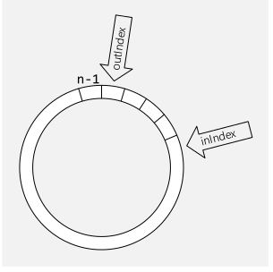

# Datentypen

## Abstrakter Datentyp

Jede Klasse besteht aus einer sichtbarer Schnittstelle und eine von Aussen, unsichtbare Implementation.

## Big-O Notation

## Algorithmus

Eigenschaft:

* Determinierheit: Identische Eingaben führen zur selben Ausgabe
* Determinismus: Ablauf des Verfahrens ist an jedem Punkt fest vorgeschrieben (keine Wahlfreiheit)
* Terminierung: Für jede Eigenschaft liegt das Ergebnis nach endlich vielen Schritten vor
* Effizienz: Wie wirdschaftlich der Algorithmus ist

## Stack

Stack ist eine LIFO-Collection und ist in Java mit dem Interface `Dequeue` implementiert.

### Methoden

* `void push(T obj)`
* `T pop()`
* `boolean isEmpty()`
* `void removeAll()`
* `bool isFull()`

### Anwendungsfälle

Ein Stack wird oft für das Parsen von z.B. Klammern oder XML-Tags verwendet. Ebenfalls benützen alle Programme einen Stack für Methoden-Aufrufe.

## List

### Methoden

* `void add (T obj)`
* `void add(int pos, T obj)`
* `T get(int pos)`
* `T remove(int pos)`
* `int size()`
* `boolean isEmpy()`

## Queue

Queues sind eine FIFO-Collection und werden oft für Warteschlangen verwendet.

Queues können mittels Array implementiert, in diesem Fall wird das Array als Ringbuffer gebraucht. 

### Methoden

* `void enqueue(T obj)`
* `T dequeue()`
* `T peek()`
* `void removeAll()`
* `boolean isEmpty()`
* `boolean isFull()`