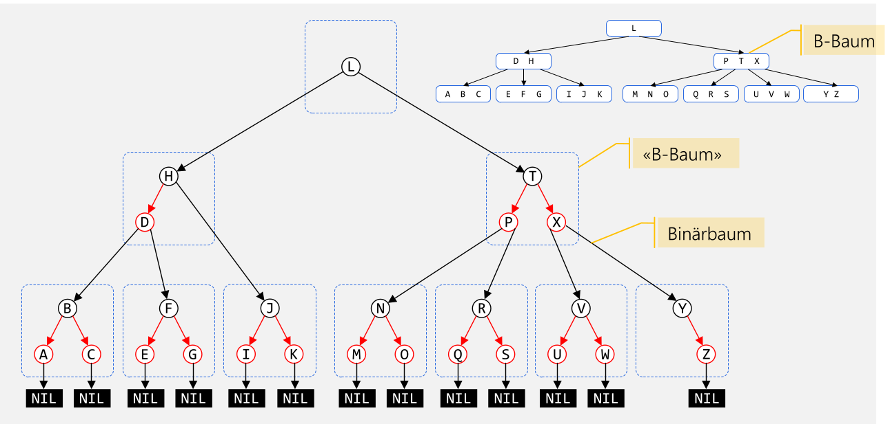

# Datentypen

## Abstrakter Datentyp

Jede Klasse besteht aus einer sichtbarer Schnittstelle und eine von Aussen, unsichtbare Implementation.

## Big-O Notation


## Algorithmus

Eigenschaft:

* Determinierheit: Identische Eingaben führen zur selben Ausgabe
* Determinismus: Ablauf des Verfahrens ist an jedem Punkt fest vorgeschrieben (keine Wahlfreiheit)
* Terminierung: Für jede Eigenschaft liegt das Ergebnis nach endlich vielen Schritten vor
* Effizienz: Wie wirdschaftlich der Algorithmus ist

## Stack

Stack ist eine LIFO-Collection und ist in Java mit dem Interface `Dequeue` implementiert.

### Methoden

* `void push(T obj)`
* `T pop()`
* `boolean isEmpty()`
* `void removeAll()`
* `bool isFull()`

### Anwendungsfälle

Ein Stack wird oft für das Parsen von z.B. Klammern oder XML-Tags verwendet. Ebenfalls benützen alle Programme einen Stack für Methoden-Aufrufe.

## List

### Methoden

* `void add (T obj)`
* `void add(int pos, T obj)`
* `T get(int pos)`
* `T remove(int pos)`
* `int size()`
* `boolean isEmpy()`

## Queue

Queues sind eine FIFO-Collection und werden oft für Warteschlangen verwendet.

Queues können mittels Array implementiert, in diesem Fall wird das Array als Ringbuffer gebraucht. 


### Methoden

* `void enqueue(T obj)`
* `T dequeue()`
* `T peek()`
* `void removeAll()`
* `boolean isEmpty()`
* `boolean isFull()`

## Tree


```
Tree = Empty
Tree = Node(List<Tree)
```

Eigenschaften:

* Knoten mit dem gleichen Vorgänger-Knoten sind **Geschwisterknoten**
* Es gibt genau einen Pfad von der Wurzel zu jedem Knoten, wobei die Weglänge die Anzahl Kanten zum Konten darstellt
* Die **Höhe** des Baumes sind die Anzahl Ebenen im Baum (`Anzahl Kannten + 1`)
* Das **Gewicht** oder **Grösse** ist die Anzal der Knoten

## Binary Tree

```
Tree = Empty
Tree = Node(Tree, Value, Tree)
```

Eigenschaften:

* Die **Höhe/Tiefe** ist die Anzahl Ebenen im Baum (`Anzahl Kanten + 1`)
* Auf jeder Ebene $h$ gibt es maximal $2^{h-1}$ Knoten
* Die Anzahl Konten sind $n=2^h-1$, wobei $h$ die Höhe des Baums ist
* Die Anzahl Ebenen/Höhe sind $h=\log_2(n+1)$
* Ein Binary-Tree ist **voll**, wenn jeder Knoten entweder Blatt ist oder zwei Kinder besitzt
  
* Ein Binary-Tree ist **vollständig/komplett**, wenn alle Ebenen bis auf die letzte Ebene gefüllt ist und die Bläter linksbündig angeordnet sind
  

### Traversieren


| Methode    | Beschreibung                                                 | Beispiel                    |
| ---------- | ------------------------------------------------------------ | --------------------------- |
| Preorder   | `Value, Left, Right`                                         | `h, d, b, a, c, f, e, g, i` |
| Inorder    | `Left, Value, Right`                                         | `a, b, c, d, e, f, g, h, i` |
| Postorder  | `Left, Right, Value`                                         | `a, c, b, e, g f, d, i, h`  |
| Levelorder | Jede Ebene wird Ausgedruckt: $n, a_0, b_0, a_1, a_2, b_1, b_2$ | `h, d, i, b, f, a, c, e, g` |

### Übungung

Es ist geben: 

* Preorder-Traversierung: 10, 3, 1, 4, 2, 9, 7, 5, 8
* Inorder-Traversierung: 3, 4, 1, 10, 9, 7, 2, 8, 5

Daraus soll der Baum wieder hergestellt werden:

```mermaid
```

### Immer Rechts oder immer Links Einfügen

Der folgende Code erstellt eine LinkedList als Binary-Tree:


```java
class BinaryTree<T> implements Tree<T>{
    private TreeNode<T> root;
    private TreeNode insertAt(TreeNode node, T x) {
        if (node == null) {
       		return new TreeNode(x);
        }
        else {
            // ACHTUNG: Der rechte Node wird ersetzt
            node.right = insertAt(node.right, x);
            // or 
            //node.left = insertAt(node.left, x);
        	return node;
        }
    }
    
    public void insert (T x) {
    	root = insertAt(root, x);
    }
}
```

### Sortierte Bäume

Bei einem sortierten Baum gilt dass der linke Node kleinere oder gleiche Elemente ($\le$) enthält und der rechte Node alle grössere Elemente.


Dies erleichtert das Suchen enorm. Bei einem vollständigen gefülltem Binär-Baum ist $O(\log(n))$ die Zeitkomplexität.

```java
public Object search(TreeNode<T> node, T x) {
    if (node == null) return node;
    else if (x.compareTo(node.element) == 0) return node;
    else if (x.compareTo(node.element) <= 0) return search(node.left,x);
    else return search(node.right,x);
}
```

#### Konten hinzufügen

Dafür ist das Einfügen komplexer. Mit folgendem Alogirthmus wird kein vollständigen Binär-Baum erzeugt und somit auch nicht die idalle Zeitkomplexität von $O(\log(n))$ erreicht.

```java
private TreeNode<T> insertAt(TreeNode<T> node, T x) {
    if (node == null) 
        return new TreeNode(x);
    else if (x.compareTo(element) <= 0) 
        node.left = insertAt(node.left, x);
    else
    	node.right = insertAt(node.right, x);
    return node;
}
```

#### Knoten löschen

1. Knoten finden
2. Knoten löschen
   1. Fall: der Knoten hat keine Kindern: Knoten einfach löschen
   2. Fall: der Konten hat genau einen Teilbaum: Knoten löschen und Referenz neu setzen
   3. Fall: der Knoten hat zwei Teilbäume: Es muss ein Ersatz-Knoten gefunden werden. Dafür muss der grösste Wert des linken Baums oder der grösste Wert des rechtem Baum 

```java
private TreeNode<T> removeAt(TreeNode<T> node, T x) {
    if (x.compareTo(node.element) == 0) { // delete this node
        if (node.left == null) {
        	node = node.right; // no left subtree -> case 1 or 2
        } else if (node.right == null) {
            node = node.left; // no right subtree -> case 2
        } else {
            // two subtrees -> case 3
            // node.left is root of left subtree
            node.left = findRepAt(node.left, node);
        }
    } else if (x.compareTo(node.element) < 0) {
        node.left = removeAt(node.left, x);
        // search in left subtree
    } else {
    	node.right = removeAt(node.right, x); // search in right subtree
    }
    return node;
}

private TreeNode<T> findRepAt(TreeNode<T> node, TreeNode<T> rep) {
    if (node.right == null) {
        // node is the rightmost node, the node that should be replaced gets its element
        rep.element = node.element;
        // remove rightmost node of left subtree (return value is the 'new' node)
        node = node.left;
    } else {
        // more nodes on the right side of left subtree
        node.right = findRepAt(node.right, rep);
    }
    return node;
}
```

### Vollständig Balancierter Baum


### Balancierte Bäume


Ein balancierten Baum (aber nicht balansierhat die maximale Höhe von $c_1\cdot log(n)+c_2$ ($c_1$ und $c_2$ sind Konstante). Nun ist eine Suche immer $O(\log(n))$

### AVL-Baum

### B-Baum


Ein B-Baum ist ein vollständig balancierten Baum, welcher optimiert ist für das Speichern auf Block-Speicher (HDD, SSD, Filesysteme).

Ein B-Baum hat die Ordnung $n$, wenn die maximale Anzahl von Kinder  eines Nodes $n$ ist. Alle Knoten, ausser der Wurzel, hat mindestens $\left\lfloor\frac{(n-1)} 2\right\rfloor$

### 2-3-4-Baum


Der 2-3-4-Baum ist ein Spezialfall des B-Baums mit der Ordnung 4 (Jeder Knoten, ausser der Wurzel, hat zwei, drei oder 4 Kinder).

### Rot-Schwarz-Baum



## Graphen


Ein **Knoten** ist ein Objekt mit einem Namen, welches mit einer oder mehreren Kanten verbunden werden. **Kanten** sind dabei eine gerichtete Verbindung zwischen zwei Knoten.

Begriffe:

* **Einfacher Pfad**: Eine Sequenz von Knoten ohne doppelte Knoten
* **Geschlossener oder zyklischen Pfad**: Ein Pfad, welcher die selben Anfangs- und Endknoten hat
* **Pfadlänge**: Die Anzahl **Kanten** des Pfads (Achtung, **nicht** Knoten)
* **Benachbarte Knoten**: Zwei Knoten, welche mit einer Kante verbunden sind
* **Vollständiger (oder kompletter) Graph**: Jeder Knoten ist mit jedem Knoten **direkt** verbunden
* **Verbundener Graph**: Jeder Knoten ist mit jedem anderen Knoten **mit einem Pfad** verbunden
* **Dichte des Graphen**: Das Verhältnis von Anzahl Kanten zu der Anzahl möglichen Kanten
* **Dichter Graph** (dense graph): Nur wenige Kanten fehlen
* **Dünner oder lichter Graph** (sparse graph): Nur wenige Kanten im Graph sind vorhanden
* **ungerichteten Graph**: Normallerweise sind Kanten gerichtet. Bei einem ungerichteten Graph gibt es immer Kanten in beide Richtungen
* **gewichteten Graphen** (auch Netzwerk): Graphen, bei welchen die Kanten ein Gewicht oder Kosten haben
* **gewichtete Pfadlänge**: Die Summe der Pfadgewichte
* **zyklenfreier Graph**: Ein Graph, ohne Loops
* Speziallfall des Baumes: Ein gerichteter zyklenfreier, verbundener Graph, bei welchem jeder Knoten genau eine eingehende Verbindung hat, ausser der Wurzelknoten, ist ein Baum
* **Wald**: Eine Gruppe von nicht zusammenhängender Bäume

### Implementation 1: Adjazenz-Liste

Jede Implementation hat eine Liste von Kanten zu den benachbarten Knoten (die Adjazenz-Liste)


### Implementation 2: Adjazenz-Matrix


Es gibt eine $N\times N$ Boolean-Matrix, in welcher alle Kanten als `boolean` representiert sind. Falls die Kanten gewichtet sind, kann das `boolean` durch ein `double` ersetzt werden.


### Suchstrategien

#### Tiefesuche

Bei der Tiefesuche wird soweit zum nächsten Node gegangen, bis dies nicht mehr möglich ist. Dann wird den Pfad zurück gegangen, bis ein anderen Pfad eingeschlagen werden kann.

```java
void depthFirstSearch(startNode: Node) {
    Stack<Node> stack = new Stack<>();
    startNode.marked = true;
    stack.push(startNode);
    while(!stack.isEmpty()) {
        Node current = stack.pop();
        current.marked = true
        for(Edge edge : current.edges) {
            if(!edge.nextNode.marked) {
                stack.push(edge.nextNode)
            }
        }
    }
}
```

#### Breitesuche

Bei der Breitensuche wird zuerst alle Nachbarn eines Nodes besucht, danach die Nachbarn der Nachbarn

```java
void breadthFirstSeach(startNode: Node) {
    Queue<Node> queue = new Queue<>();
    startNode.marked = true;
    queue.enqueue(startNode);
    while(!queue.isEmpty()) {
        Node current = stack.dequeue();
        current.marked = true
        for(Edge edge : current.edges) {
            if(!edge.nextNode.marked) {
                stack.enqueue(edge.nextNode)
            }
        }
    }
}
```

Der einzige Unterschied in der Implementation zwischen der Tiefen- und der Beritensuche, ist der Datentyp. Bei der Tiefensuche wird ein `Stack` und bei der Breitensuche eine `Queue` verwendet.

### Kürzester, ungewichteter Pfad


Der Graph wird mit der Breitesuche durchsucht. Bei jedem Knoten wird hingeschrieben, von welchem Knoten gekommen wurde.

### Kürzester, gewichteter Pfad


### Dijkstra

### Greedy Algorithmen

### Topologisches Sortieren

### Maximaler Fluss

### Traveling Salesman

