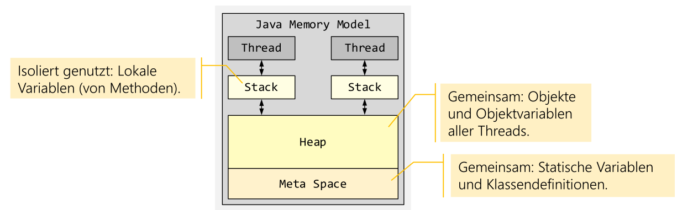
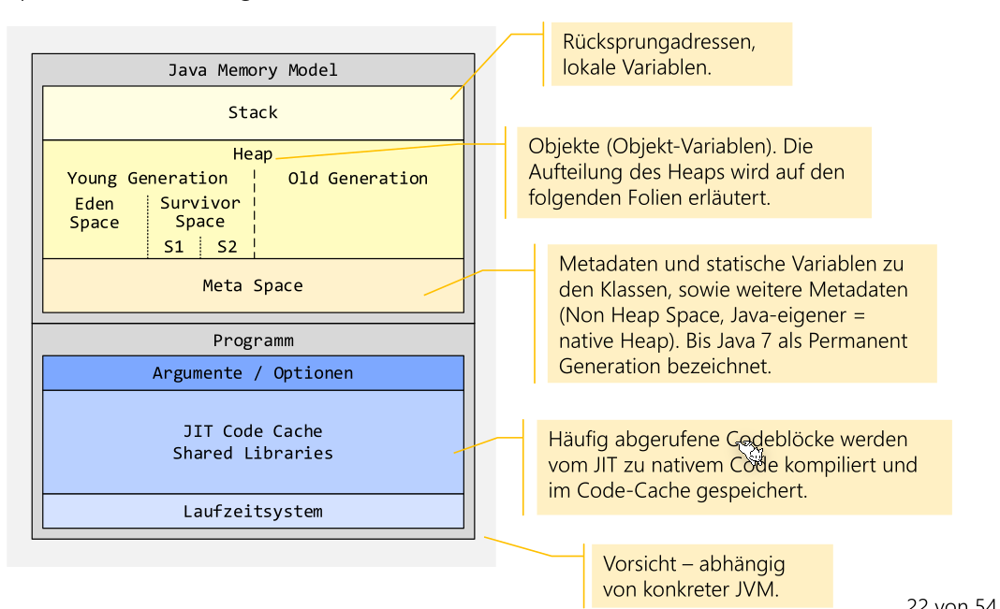
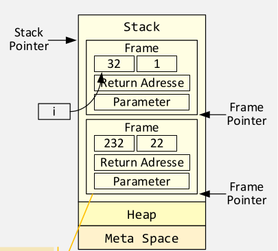
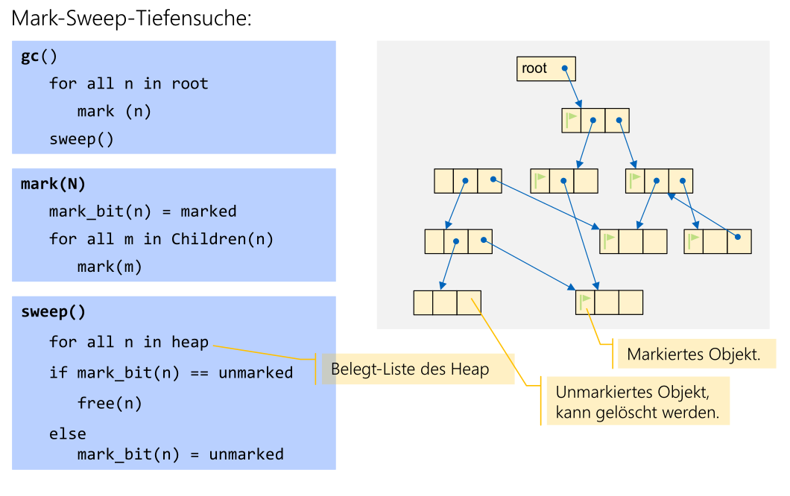
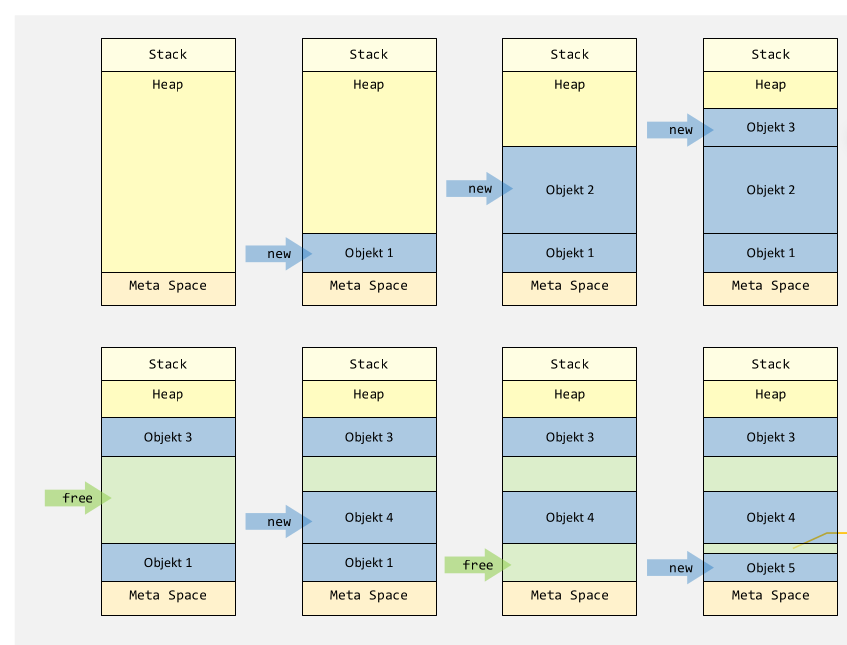
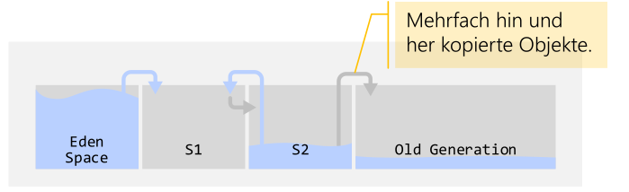

# Java

## Java Memory Model



## Garbage Collector





### Reference Counting

Beim Referencing Counting wird gezählt, wie viel Referenzen es auf ein Objekt gibt. Wenn es keine Referenzen mehr gibt, dann wird das Objekt gelöscht.

```java
class ... {
    void addRef() {
        referenceCount++;
    }

    int release() {
        if (--referenceCount == 0) {
            delete(this);
        }
    }
}
```

* Vorteile:
    * Einfach und geringer verwaltungs Aufwand
    * Speicher wird so schnell wie möglich freigegeben
* Nachteile: 
  * Es muss manuel geführt werden was Bugs einführen kann
  * Zusätzliche Operationen bei jedem Refernzen Zuweiss
  * Zyklische Datenstrukturen sind problematisch

## Smart Pointers

Smart Pointers sind Pointers welche das Reference Counting automatisieren. Aber viele Nachteile bleiben trotzdem bestehen:

* Vorteile:
  * Einfach und geringer verwaltungs Aufwand
  * Speicher wird so schnell wie möglich freigegeben
  * Ist automatisiert
* Nachteile: 
  * Zusätzliche Operationen bei jedem Refernzen Zuweiss
  * Zyklische Datenstrukturen sind problematisch

## Mark Sweep GC Algorithmus

Der Mark-Sweep Algorithmus läuft in zwei Phasen:

1) Mark:
   Es werden alle Objekte traversiert und nicht erreichbare Objekte markiert
2) Sweep
   Alle markierte Objekte löschen und die Markierung entfernen

* Vorteile
  * Keine zusätzlichen Operationen bei Referenzen-Zuweisungen
  * Zyklische Datenstrukturen können gelöscht werden
* Nachteile
  * Aufwand
  * Stop-the-World-Mechanismus bei beiden Phasen
  * Es entstehen Memory-Löscher (Memory-Fragmentierung)





### Mark-Copmact

Funktioniert gleich wie der Mark-Sweep-Algorithmus, aber es werden alle noch referenzierte Objekte zum Begin des Heap kopiert.

+ Vorteile:
  + Analog Mark-Sweep-Algorithmus.
  + Keine Memory-Fragmentierung.
- Nachteil:
- Analog Mark-Sweep-Algorithmus.
- Aufwand ist noch grösser → schlechte Performance.

## Copy-GC

Der Speicher wird unterteilt in zwei Semi-Spaces. Wenn ein Space voll wird, werden alle noch referenzierte Objekte in den zweiten Space überkopiert

+ Vorteil:
  + Es entstehen keine Löcher
  + Die Suche nach freien Blöcken entfällt (belegter Bereich ist kompakt)
- Nachteil:
  - Es wird doppelt so viel Speicher benötigt
  - Aufwändiger Algorithmus
  - Es muss immer der ganze Speicher durchlaufen werden
  - Programm muss während dieser Zeit angehalten werden (Stop-The-World-Mechanismus)

## Generational GC

Die meisten Objekte werden nur kurz gebraucht. Daher wird der Heap in drei oder mehr Teile unterteilt. Wenn ein Teil überfliesst, dann werden lang-lebende Objekte in den nächsten Breich kopiert. Pro Teil kann nun ein anderen Algorithmus angewendet werden.

