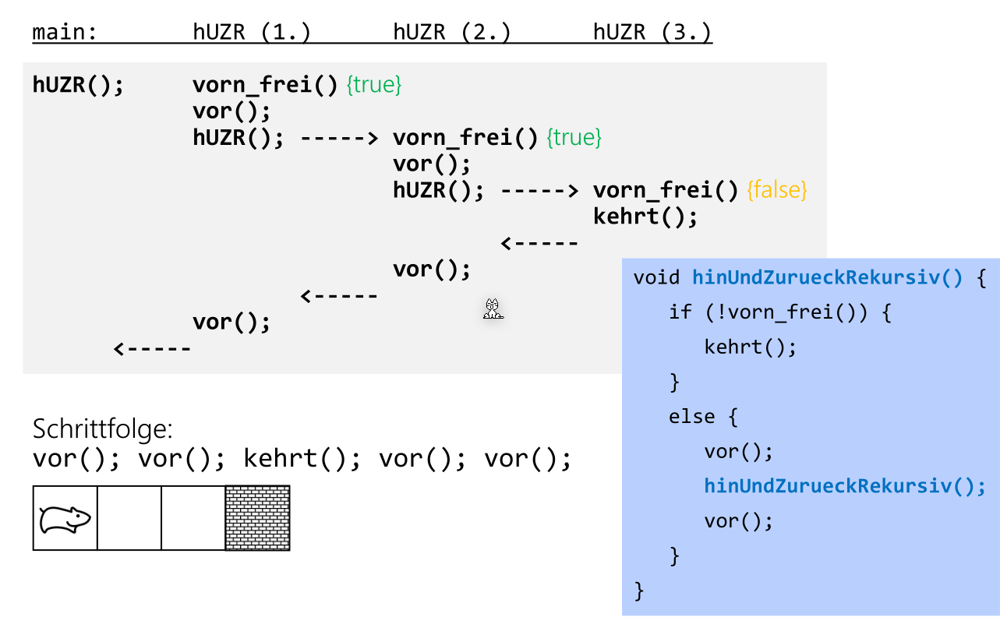

# Rekursive

Jede Rekursion kann in eine iterativen Algorithmus umgewandelt werden.


* **Verankerung:** Die Stopp-Bedingungen
* **Rekursiven-Aufruf**: Die Operation, welche zum rekursiven Aufruft führt

## Rekursionstiefe

Die Rekursionstiefe ist, wie viele Stackframes es maximal gibt.

## Zeitkomplexität und Speicherkapazität

Um die Ordnung von einem rekursiven Algorithmen auszurechnen, kann $T_{n}$ definiert werden und für jeden Aufruf $T_{n - 1}$ einsetzen. Danach einige $T_n$ auflösen und den Trend sehen.

### Zeitkomplexität für Fibonacci

```java
void hanoi (int n, char from, char to, char help) {
    if (n > 0) {
        hanoi(n-1, from, help, to);
    	System.out.println("bewege " + from + " nach " + to); 
    	hanoi(n-1, help, to, from);
    }
}
```


$$

$$


## Indirekte Rekursive

Eine indirekte Rekursive besteht aus zwei Methoden, welche sie sich gegenseitig aufrufen.

```java
public int p(int a) {
    int x = q(a);
}
public int q(int a) {
   	int x = p(a - 1);
}
```

## Tail Recursion

Eine Tail Recursion ist eine Rekursion, bei welcher die letzte Expression den rekursive Aufruf ist. Diese können einfach in einen iterativen Algorithmus umgebaut werden.

```java
int fak(int n) {
    if (n == 0) return 1;
    else return n * fak(n - 1);
}

int fak(int n) {
    if (n == 0) return 1;
    else {
    	int res = n;
        while(n > 1) {
            n--;
            res = n * res;
        }
        return res;
    }
}
```

## Rekursives Beispiel: Vor und Zurück

