# Sortieren

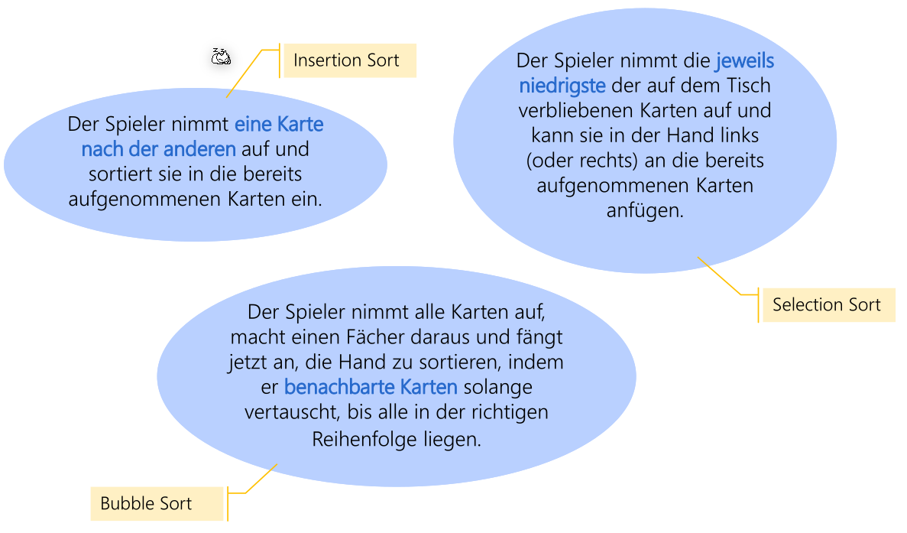

Es gibt das **interne und externe** Sortieren. Beim internen Sortieren werden alle Daten in den RAM geladen. Beim externen Sortieren hingegen werden die Dateien unterteilt, sortiert und danach wieder zusammengefügt.

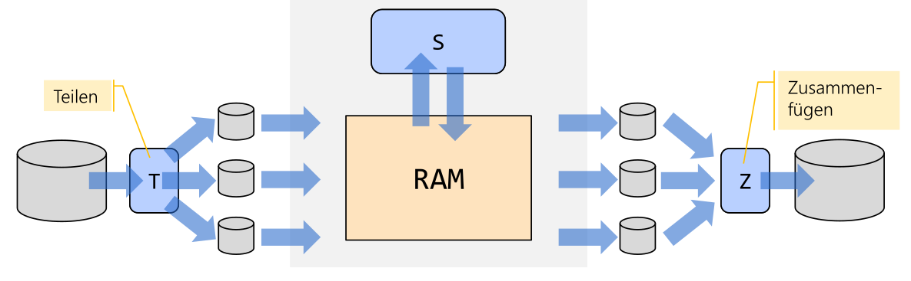

Ein **Sortierschlüssel** ist nach welchem Teilfeld(er) eines Datensatzes die Daten sortiert und gesucht wird. Ein **eindeutiger** Sortierschlüssel ist ein Schlüssel, welche eindeutig ist (z.B. ein Primary Key).

## Sortieren mit Teile und Herrsche

Bei Teile und Herrsche wird das Problem in mehrere kleinere Probleme unterteilt, die Teilprobleme werden gelöst und die Lösungen danach zusammen gefügt. 

Der folgende Pseudo-Code setzt das Teile und Herrsche für das Sortieren:

```java
if (Menge der Datenobjekte klein genug)
	Ordne sie direkt;
else {
    Teilen: Zerlege die Menge in Teilmengen;
    Ausführen: Sortiere jede der Teilmengen;
    Vereinigen: Füge die Teilmengen geordnet zusammen;
}
```

Oft sind diese Teile und Herrsche Algorithmen rekursive:

```java
Sort (Menge a) {
    if (Menge der Datenobjekte klein genug) {
    	Ordne sie direkt;
    } else {
        Zerlege in zwei Teilmengen;
        Sort(Teilmenge1); Sort(Teilmenge2);
        Füge Teilmengen geordnet zusammen;
    }
}
```


## Strings sortieren

Strings sortieren kann problematisch sein. Je nachdem in welcher Region werden Buchstaben verschieden sortiert. Mithilfe einer `Collation` kann dies festgelegt werden.

```java
Locale chLoc = new Locale("de","CH");
Collator chCol = Collator.getInstance(chLoc);
Collator deCol = Collator.getInstance(Locale.GERMAN);
Collections.sort(list, chCol)
```


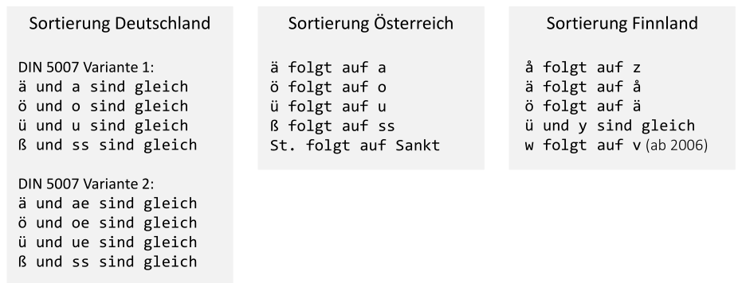

## Stabilität

> Sei S = ((k0, e0), ... , (kn-1, en-1)) eine Sequenz von Elementen:
> Ein Sortieralgorithmus heisst stabil (stable), wenn für zwei beliebige Elemente
> ($k_i$, $e_i$) und ($k_j$, $e_j$) mit gleichem Schlüssel $k_i=k_J$ und $i<j$ (d.h. Element $i$ kommt vor
> Element $j$), $i < j$ auch noch nach dem Sortieren gilt (Element i kommt immer noch
> vor Element j).

Oder: Wenn eine bereits sortierte Liste (z.B. eine Personenliste nach Departemen). Wenn diese nun nach Alter sortiert wird, werden die Sortierung in der einzelnen Klassen erhalten bleiben, wenn der Algorithmus stabil ist.

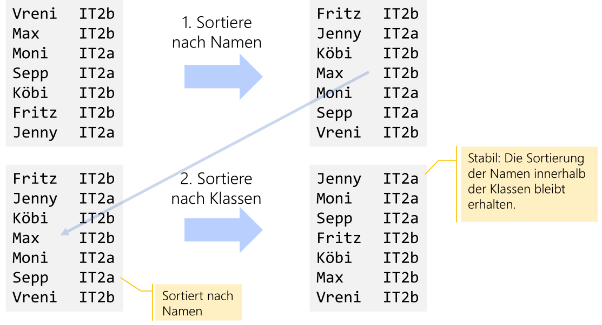

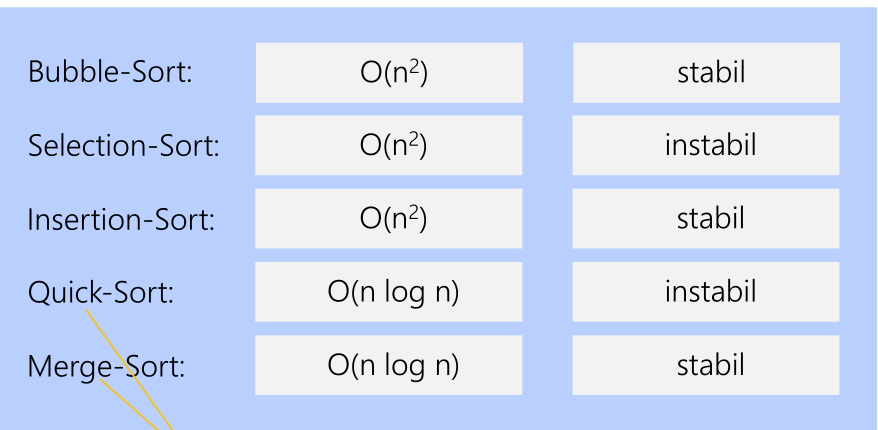

## Bubble Sort

```java
static void bubbleSort(char[] a) {
    for (int k = a.length-1; k > 0; k--) {
        boolean noSwap = true;
        for (int i = 0; i < k; i++) {
            if ( a[i] > a[i + 1]) {
                swap (a, i, i + 1);
                noSwap = false;
            }
        }
        // if nothing was swapped -> array is sorted
        if (noSwap) break;
    }
}
```

Jedes Element wird verglichen mit seinem Nachbar. Wenn der rechte Nachbar kleiner ist, werden sie vertauscht. Es soll noch geführt werden, ob während des Sortierens überhaupt etwas vertauscht wurde. Wenn nicht, dann ist das Array sortiert.

| Best-Case   | Average-Case  | Worst-Case |
| ----------- | ------------- | ---------- |
| $\Omega(n)$ | $\Theta(n^2)$ | $O(n^2)$   |

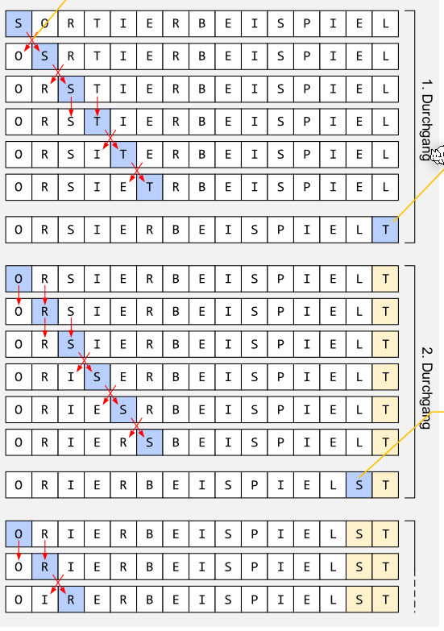

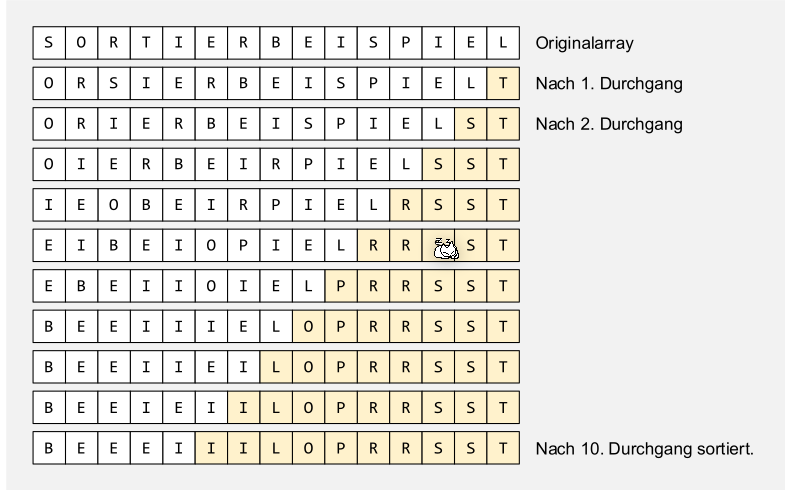

## Selection Sort

```java
static void selectionSort(char[] a) {
    for (int k = 0; k < a.length; k++) {
        int min = k;
        for (int i = k + 1; i < a.length; i ++) {
        	if (a[i] < a[min]) min = i;
        }
        
        if (min != k) swap (a, min, k);
    }
}
```

Beim Selection-Sort wird immer die Frage gestellt, welches ist das kleinste Elemente aus dem unsortiertem Bereich, um den sortierten Bereich um eins zu erweitern. Um damit ein Array zu sortieren wird von rechts angefangen und somit kann es nie vorkommen, dass ein kleinerer Buchstaben im unsortiertem Bereich vorkommt als im Sortiertem.

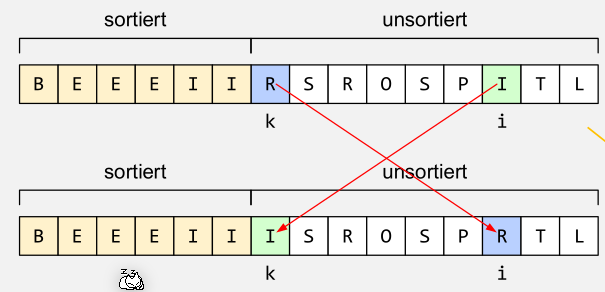

| Best-Case     | Average-Case  | Worst-Case |
| ------------- | ------------- | ---------- |
| $\Omega(n^2)$ | $\Theta(n^2)$ | $O(n^2)$   |

Vorteil: Deutlich weniger Swap-Aufrufe als Bubble Sort
Nachteil: «Vorsortiertheit» kann nicht ausgenutzt werden.

## Insertion Sort

```java
static void insertionSort(char[] a) {
    for (int k = 1; k < a.length; k++) {
        char x = a[k];
        int i = k;
        for (; i > 0 && a[i-1] > x; i--)
            a[i] = a[i-1]; // verschieben
        a[i] = x; // einfügen
    }
}
```

Beim Insertion-Sort wird geschaut, wo das nächste Element im unsortiertem Bereich im sortiertem Bereich kommt. Danach wird solange verschoben, bis das Element an der richtigen Stelle steht.

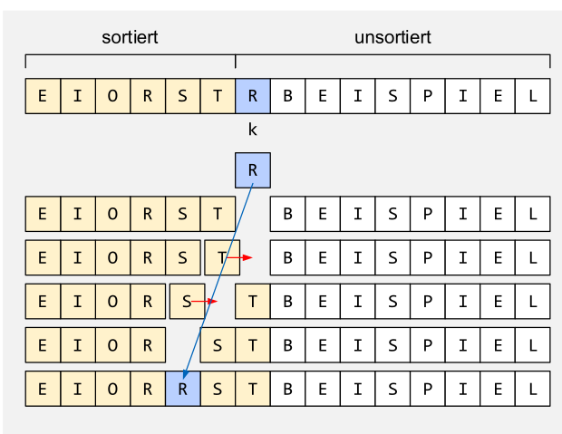

| Best-Case   | Average-Case  | Worst-Case |
| ----------- | ------------- | ---------- |
| $\Omega(n)$ | $\Theta(n^2)$ | $O(n^2)$   |

## Quick Sort

Die grundsätzliche Premise des Quick-Sorts ist, dass das Array in zwei Teile unterteilt wird. Die Elemente im unterem Array sind kleiner als der mittlere Wert, $w$, und die Elemente in oberen Array sind grösser als $w$.

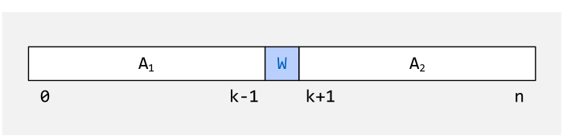

Um nun diesen Zustand zu erreichen, wird in $A_1$ und in $A_2$ jeweils ein Element gesucht, welches auf der falschen Seite ist. Diese zwei Elemente werden nun vertauscht.

Um diesen Mittelpunkt/Pivotpunkt $W$ zu finden gibt es mehrere Strategien:

1. Median (schlecht, da der Laufzeitvorteil verloren geht)
2. Nehme ein Element blind
   1. Das linkeste
   2. Das recheste
   3. Die mitte
3. Nehme das wertmässige mittlere
4. Nehme das arithmetische Mittel der drei Werte als Pivotpunkt

Der folgende Code implementiert den Quick-Sort.

```java
static int partition (int[] arr, int left, int right) {
	int pivot = arr[(left + right) / 2];
    while (left <= right) {
    	while (arr[left] < pivot) { left++; }
		while (arr[right] > pivot) { right--; }
        if (left <= right) {
            swap(arr, left, right);
            left++;
            right--;
        }
    }
    return left;
}

static void quickSort(int[] a){
	quickSort(a, 0, a.length-1);
}

static void quickSort(int[] arr, int left, int right) {
    if (left < right) {
        int mid = partition (arr, left, right);
        quickSort(arr, left, mid - 1);
        quickSort(arr, mid, right);
    }
}
```

### Big-O

Wenn immer die Mitte benützt wird, dann ist die $O(n\cdot \log_2(n))$. Im schlechtesten Fall hat aber Quick-Sort $O(n^2)$, dies ist aber extrem selten.

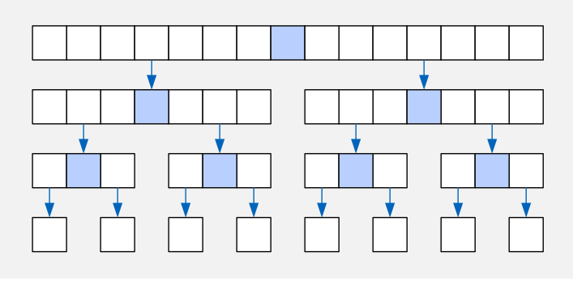

### Quick-Sort optimieren

```java
static void quickerSort(int[] a, int left, int right) {
    if (right - left < THRESHOLD) {
    	insertionSort(a, left, right);
    } else {
        int l = partition (a, left, right);
        quickerSort(arr, left, l - 1);
        quickerSort(arr, l , right);
    }
}
```

## Distribution Sort

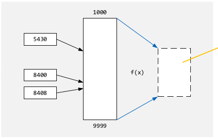

Es wird mithilfe von einer Funktion $f(x)$ den Index im sortierten Array zu finden. Da direkt aus dem Wert die Position bestimmt wird, ist die Komplexität $O(n)$.

## Merge Sort

Beim Merg Sort wird das Array in mehrere sub-Arrays unterteilt, diese werden unabhängig geordnet und danach zusammen gesetzt.

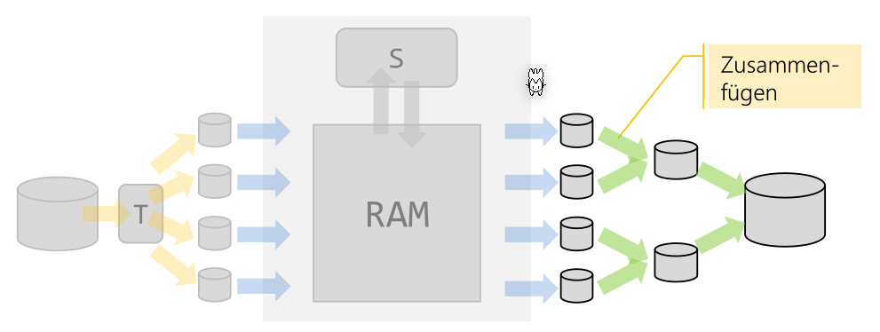

Der folgende Pseudo-Code zeigt eine Implementation eines Merge Sort:

```java
Methode Mergesort (A) {
    if (A.size() <= 1) {
        return A;
    } else {
        halbiere A in A1 und A2;
        A1 = Mergesort(A1);
        A2 = Mergesort(A2);
        return Merge(A1, A2)
    }
}

// Die Merge methode fasst die sortierten Liste linke- und rechteListe in eine sortierte 
// Liste zusammen
Methode Merge(linkeListe, rechteListe); {
    neueListe;
    while (!(linkeListe.isEmpty() OR rechteListe.isEmpty)) {
    	if (linkeListe(0) <= rechteList(0) {
    		neueListe.add(linkeListe(0)); linkeListe.remove(0);
    	}
    	else {
    		neueListe.add(rechteListe(0)); rechteListe.remove(0);
    	}
    }
    
    while (!linkeListe.isEmpty()) {
    	neueListe.add(linkeListe(0)); linkeListe.remove(0);
    }
    while (!rechteListe.isEmpty()) {
    	neueListe.add(rechteListe(0)); rechteListe.remove(0);
    }
    return neueListe;
}
```

Die Komplexistät: $O(n\cdot \log(n))$

## Wahl des Sortierungs Verfahren


## Sortierungs Verfahren Vergleich

Wenn ein Sortierungs-Algorithmus Elemente untereinander verlgeicht, dann ist die min

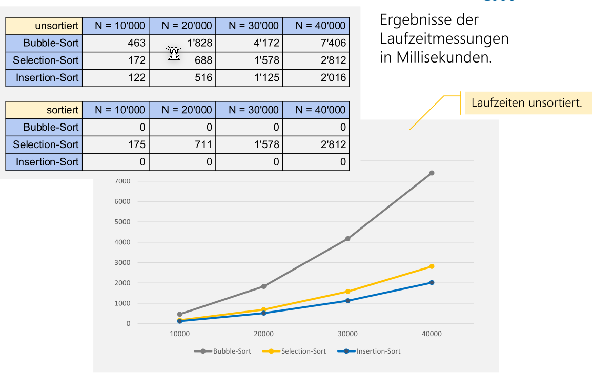

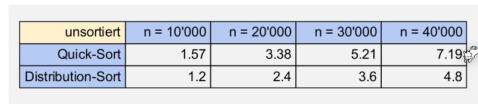

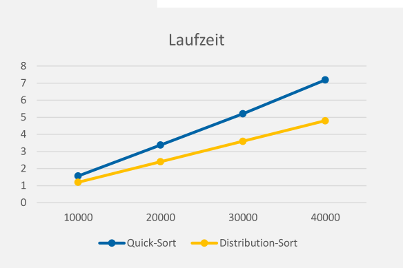

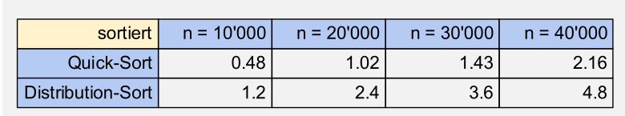

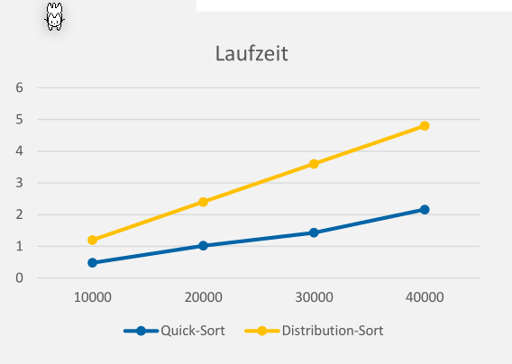

## Sortieren in Java

* Für primitive Arrays (`Arrays.sort(int[] a)`) wird einen Dual-Pivot-Sort verwendet, welcher nicht stabil ist. Dies ist aber für primitive Typen nicht relevant. $O(n\cdot \log(n))$
* Für Objekte () wird ein iterativen Merge-Sort. $O(n\cdot \log(n))$
* Für Objekte `parallelSort()`

## Amdahl's Law

Dieses "Gesetzt" beschreibt, wie viel schneller ein Program laufen wird, wenn es parallelisiert wird:
$$
Speedup = \frac 1 {(1 - p) + \frac p s}\\
\text{, wobei } p \text{ der Anteil des Programmes ist, welcher parallelisiert werden kann}\\
\text{ und } s \text{ die Anzahl Prozessoren}
$$
