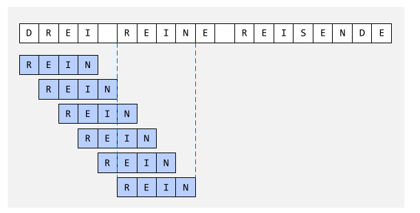
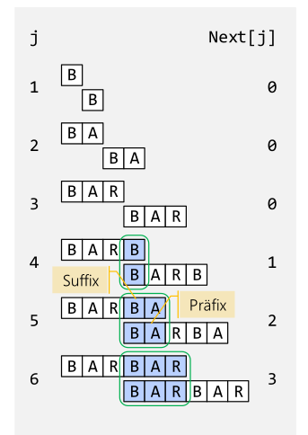
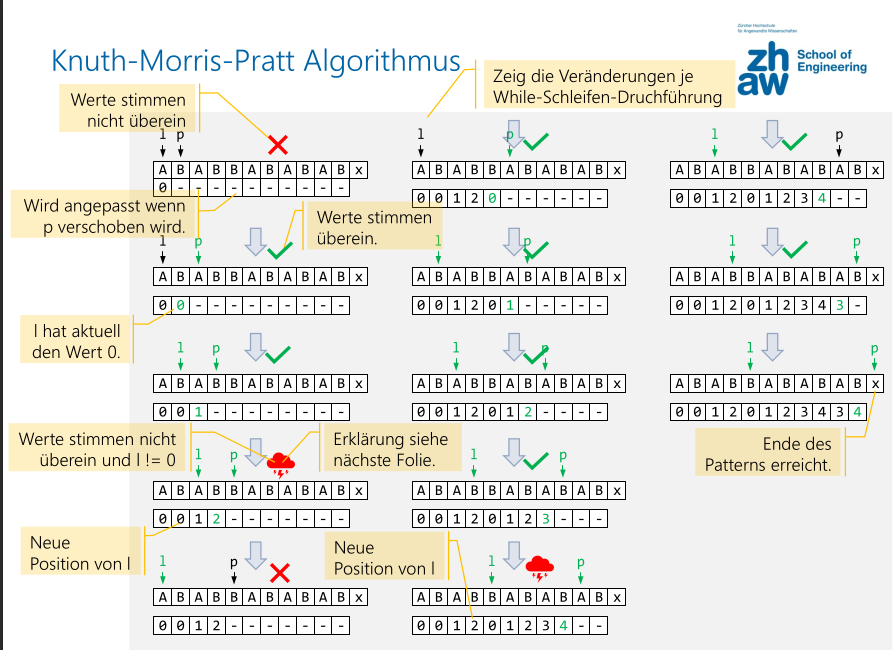
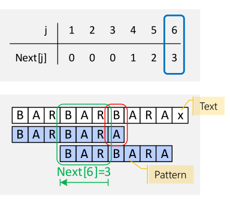
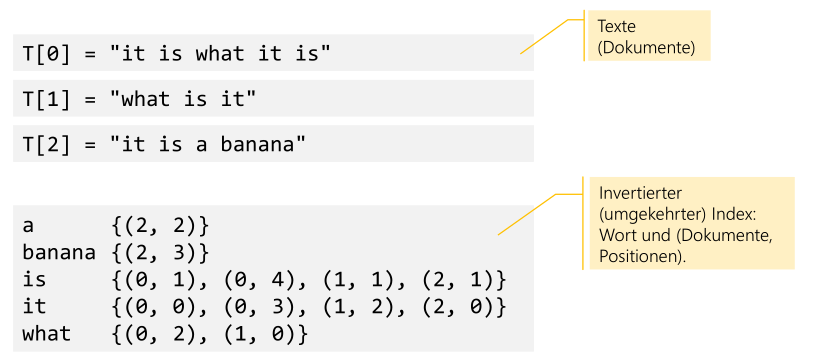
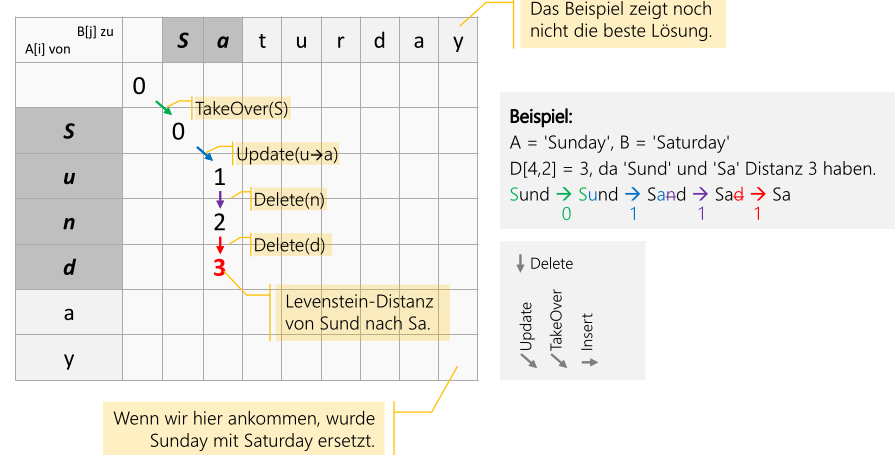
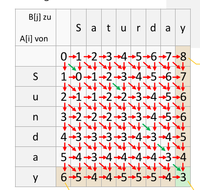
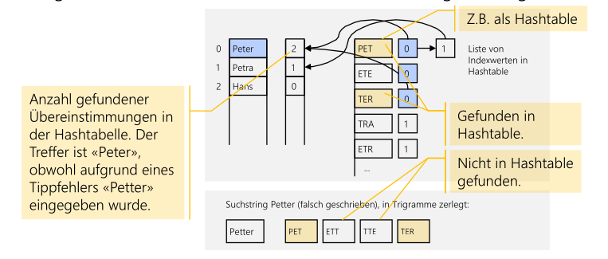
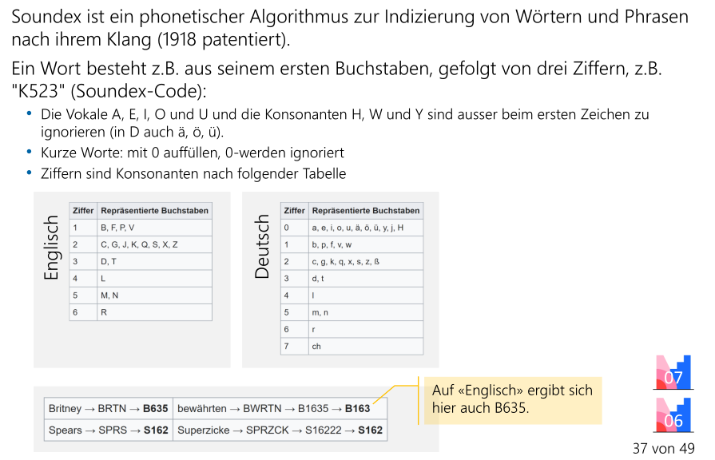

# Textsuche

## Bruteforce



Der Aufwand des folgenden Algorithmus ist $O(n\cdot m)$, wobei $n$ die Anzahl Zeichen im String und $m$ die Anzahl Zeichen im Pattern sind.

```java
static int indexOf(String str, String pattern) {
    int k;
    for (int i = 0; 
         i < str.len() - pattern.len() + 1; 
         i++) 
    {
        
        // Sucht den ersten übereinstimmenden Buchstaben
        while (i < str.len() 
               && str.charAt(i) != pattern.charAt(0)) 
        {
            i++;
        }
        
        if (i + pattern.len() <= str.len()) {
       		for (k = 0; k < pattern.len() && str.charAt(i+k) == pattern.charAt(k); k++) {}
        	if (k == pattern.len()) {
                return i;
            }
        }
    }
    return -1;
}
```

## Knuth-Morris-Pratt Algorithmus

Dieser Algorithmus hat den Aufwand $O(n+m)$. Der Algorithmus ist sinvoll, wenn das Pattern viele Wiederholungen hat oder wenn das Rückspringen aufwändig ist (z.B. bei externen Speichermedien)

Der Knuth-Morris-Pratt Algorithmus wird in zwei Schritten ausgeführt:

### Phase 1: Next-Tabelle bauen

Der Aufwand dieser Phase ist $O(m)$, wobei $m$ die Länge des Pattern ist

1. Subpattern (mögliche Präfixe)
2. 
   

Nun folgt einen effizienteren Algorithmus:



Es gibt drei Situationen:

1. `str[l] == str[p]`:
2. `str[l] != str[p] && l == 0`:
3. `str[l] == str[p] && l > 0`:

### Phase 2: Suche

Diese Phase hat den Aufwand von $O(n)$, wobei $n$ die Länge des Text ist



## Invertierter Index

Es wird einen Index geführt, welche Wörter wo vorkommen (z.B. `banana` kommt im dritten Text an vierter Stelle vor).



Es gibt mögliche Verbesserungen:

* Wörter sortieren und einen binären balancierten Baum benützten: $O(\log(n))$
* Hashtabelle: $O(1)$
* Stopwords entfernen (z.B. `denn`, `die`, ...)
* Wörter normalisieren: Wortstamm bilden (wohn: wohnen, bewohnen, Wohnzimmer, ...)

## Levenshtein-Distanz

Die Levenshtein-Distanz ist die minimale Anzahl Operationen um von Wort-A Wort-B zu erreichen und kann somit als Mass verwendet werden, wie Ähnlich zwei Wörter sind.

Die folgenden Operationen sind erlaubt:

* `doNothing()`: Der Buchstabe wird übernommen
* `insert(c)`: Ein Buchstabe an einer Position einfügen
* `update(c -> d)`: Ein Buchstaben an einer Position ersetzten
* `delete(c)`: Ein Buchstaben löschen





```java
public static int computeLevenshteinDistance(String str1,String str2) {
	int[][] distance = 
        new int[str1.len() + 1][str2.len() + 1];
    
    // initialisierung
	for (int i = 0; i <= str1.len(); i++)
        distance[i][0] = i;
    for (int j = 1; j <= str2.len(); j++) 
        distance[0][j] = j;
    
    for (int i = 1; i <= str1.len(); i++) {
		for (int j = 1; j <= str2.len(); j++) {
            int minEd = (str1.charAt(i - 1) == str2.charAt(j - 1)) ? 0 : 1;
			distance[i][j] = minimum(distance[i - 1][j] + 1,
			distance[i][j - 1] + 1, distance[i - 1][j - 1]+ minEd);
        }
    }
    return distance[str1.len()][str2.len()];
}
```

## Trigramm-Suche



## Phonetische Suche



## Regex

Mit `Pattern pattern = Pattern.compile(String patternStr)` kann ein Pattern vorbereitet werden.

```java
// create Pattern object
Pattern pat = Pattern.compile("ZHAW");
// do the actual matching
Matcher matcher = pat.matcher("Willkommen an der ZHAW");

// find() finds the next match
while (matcher.find()) {
    String group = matcher.group(); // the found string
    int start = matcher.start(); // the start position
    int end = matcher.end(); // the end position
}
```

| Platzhalter | Bedeutung                                                 | Beispiel |
| ----------- | --------------------------------------------------------- | -------- |
| `.`         | Ein beliebiges Zeichen                                    |          |
| `\d`        | Digit [0-9]                                               |          |
| `\D`        | Keine Digit                                               |          |
| `\w`        | ein Buchstabe, eine Ziffer oder einen Unterstrich         |          |
| `\W`        | Weder Buchstaben, Ziffer, noch Unterstrich                |          |
| `\s`        | Leerzeichen (Blank, etc)                                  |          |
| `\S`        | Kein Leerzeichen                                          |          |
| `[^s]`      | Alle Zeichen, ausser in `s` enthaltene Zeichen            |          |
| `s?`        | `s` kann 0 oder einmal auftreten                          |          |
| `s*`        | `s` kann 0 oder mehrmals auftreten                        |          |
| `s+`        | `s` muss 1 oder mehrmals auftreten                        |          |
| `s{n}`      | `s` muss `n`-mal auftreten                                |          |
| `s{m, n}`   | `s` muss mindestens `m`-mal und maximal `n`-mal auftreten |          |

