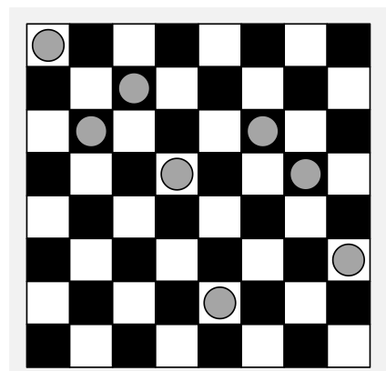
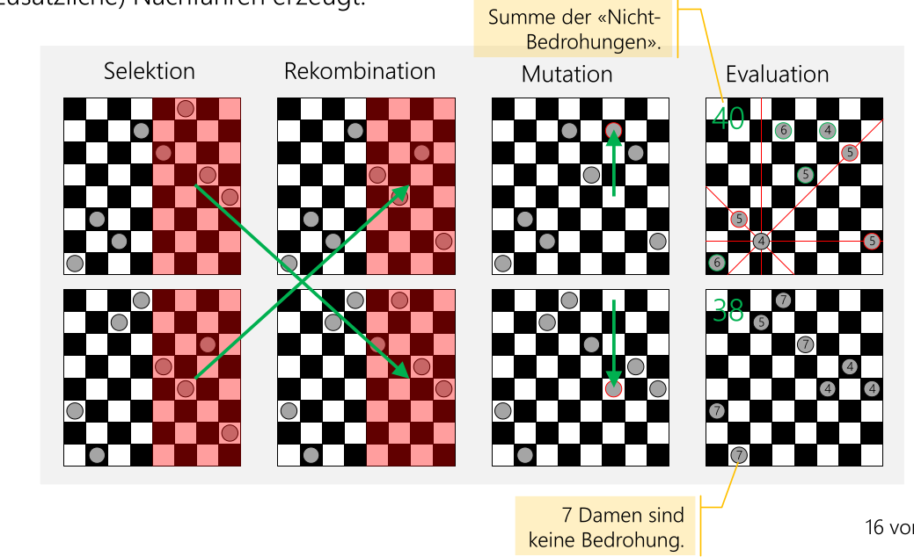
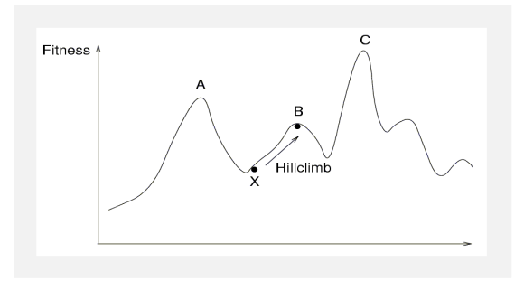

# Zufall

Der folgende Algorithmus zeigt, wie Java Zufallszahlen generiert.

```java
long seed;
double random() {
    long a = 25214903917; c = 11; p = Math.pow(2, 48);
    seed = (a*seed + c) % p;
    return z/p;
}
```

## Las-Vegas-Algorithmen

Ein Las-Vegas-Algorithmus liefert nie ein falschen Wert und der Zufall bestimmt nur die Richtung des Alogirthmus.

* Beim Quicksort wird das Pivot-Element zufällig bestimmt
* Beim Königin-Problem

## Monte-Carlo-Algorithmen

Beim Monte-Carlo-Algorithmus steuert der Zufall das Resultat:

* Um ein Integral zu berechnen, werden Proben an zufälligen Orten genommen und es wird geschaut, welche Proben unterhalb des Integrals sind.

## Heuristische Approximationsverfahren

### Genetische Algorithmen

Ein genetischer Algorithmus wird über mehrere Generationen verändert um deren Effektivität zu verbessern.


#### n-Damen-Problem

Beim Damen-Problem können n Damen aufs Board gesetzt werden und keine darf sich bedrohen. In diesem Fall erfüllt eine Damen-Konfiguration das Problem oder nicht. Die Sektions-Funktion muss trotzdem ein Score bilden können, welcher nicht `0` oder `1` ist.



Der Fittness-Score kann z.B. sein, wie viele Damen nicht bedroht sind. 

Im folgenden Bild sind die weiteren Schritte visualisiert.



### Simulated Annealing

*(Annealing heisst Aushärten und kommt davon, wie Glass hergestellt wird)*

1. Start mit einer (zufälligen) Initial-Konfiguration
2. Wiederholtes Durchsuchen der Nachbarschaft und Auswahl eines Kandidaten
3. Evaluiere die Kostenfunktion (oder Fitnessfunktion) und akzeptiere den
    Kandidaten, wenn er «besser» ist; wenn nicht, wähle einen anderen Nachbarn
4. Stoppe, wenn die Qualität ausreichend hoch ist, wenn keine Verbesserung
    gefunden werden kann oder nach einer festgelegten Zei

Für diesen Algorithmus wird folgendes benötigt:

* Eine Methode zur Erzeugung der Anfangskonfiguration
* Eine Übergangs- oder Generationenfunktion, um einen Nachbarn als nächsten Kandidaten zu finden
* Eine Kostenfunktion
* Ein Auswahlkriterium
* Ein Stopp-Kriterium

Ein Problem kann sein, dass es bei der Fittnessfunktion es lokale Maximume und Minimume haben kann. Um diese abzuwschächen, sollte ein Algorithmus das letzte Maximum merken und zu Beginn grössere Schritte neben.



#### Beispiel: Traveling Salesmen

1. Eine zufällige Tour wird gestartet
2. Nach dem Zufallsprinzip wird die Tour mutiert abhängig von der Glühtemperatur (bzw. Fittnessfunktion). Eine Möglichkeit wäre, zwei zufällige Städte auf der Tour umzudrehen
3. Wenn die Kandidatentour besser ist, als die neue Tour akzeptieren
4. Wenn die Kandidaten-Tour schlechter ist, Tour mit einer gewissen Wahrscheinlichkeit trotzdem akzeptieren. Die Wahrscheinlichkeit, eine minderwertige Tour zu akzeptieren, hängt davon ab, wie viel länger der Kandidat ist, und von der «Temperatur des Glühprozesses». Eine höhere Temperatur macht es wahrscheinlicher, eine minderwertige Tour zu akzeptieren
5. Zurück zu Schritt 2 um die Glühtemperatur bei jeder Iteration zu senken. Wenn die Temperatur tief genug wird und somit ein (lokales) Minimum gefunden wurde, wird der Loop gestoppt.