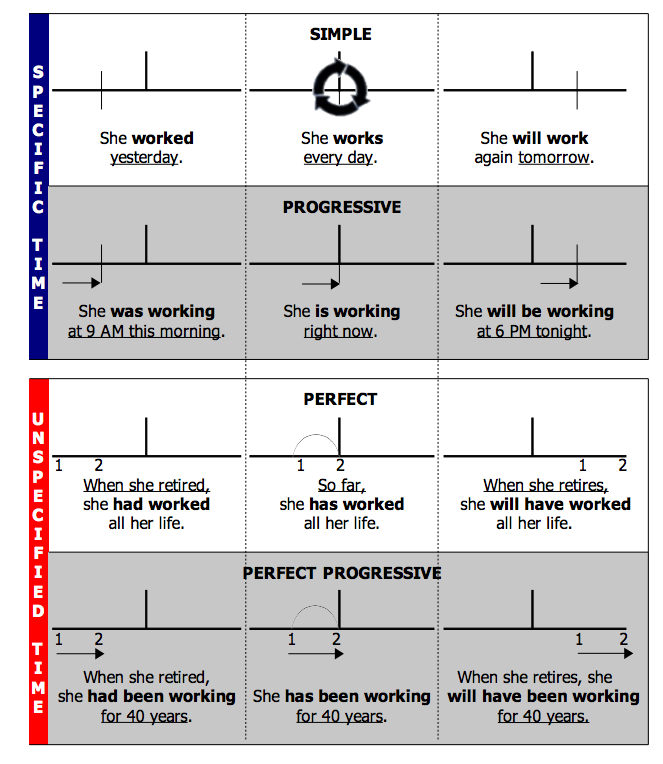
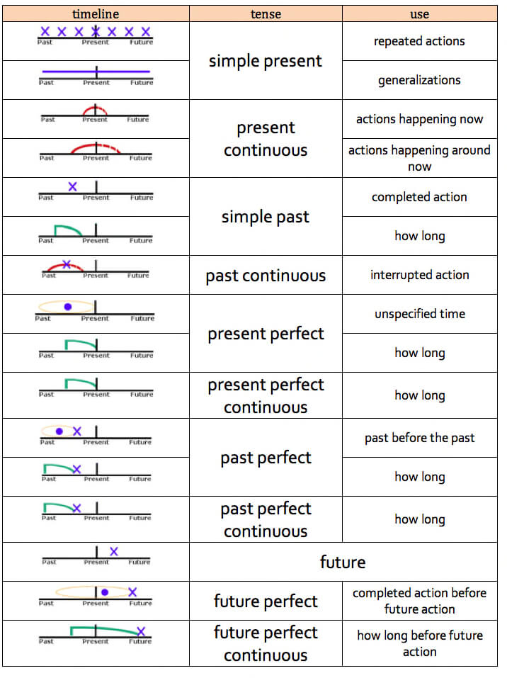

# Tenses

## Present

### Present Simple

> I work everyday.
>
> Water is wet.
>
> My plane leaves at eight o'clock.

* Something happens repeatedly
* A generalisation
* One action follows another
* A future action which follows a timetable

#### Stative Verbs

Stative verbs require the present simple tense and can't be used with any continuous tense.

* **thoughts and opinions**: agree, belive, doubt, guess, imagine, know, mean ,recognise, remember, suspect, think, understand
* **feelings and emotions:** dislike, hate, like, love, prefer, want, wish
* **senses and perceptions:** appear, be, feel, hear, look, see, seem, smell, taste
* **possession and measurement:** belong, have, measure, own, possess, weigh

There are verbs which can be both stative and dynamic depending on the meaning in the context.

* **be**: When it's used in the continuous form, it means 'behaving' or 'acting'
  * `you are stupid` = it's part of your personality
  * `you are being stupid` = only now, not usually
* **think**: 
  * `I think the coffee is great` = I'm of the opinion, that coffee is great
  * `I'm thinking about my next holiday` = I'm considering my next holiday
* **have**
  * `I have a car` = I own a car
  * `I'm having a party/a good time/a bath`  = having is part of an expression
* **see**
  * `I see a house` = I see something with my eyes
  * `I've been seeing my boyfriend for two years` = I've been dating somebody for two years
  * `I'm seeing Robert tomorrow` = I'm going to meet Robert tomorrow

### Present Continuous

> Peter is phoning his grandparents (meaning: He is doing it right now)
>
> They are dating on Saturday (A plan, scheduled in advance)
>
> Julie is living in Paris for a few months

* Something is happening while speaking
* Something in the future which is already scheduled
* When something is temporary

### Present Perfect

> I have been working (meaning: I started working earlier and stopped now)
>
> I've cleaned my room. (meainig: I cleaned my room and the result, the clean room, is now relevant)
>
> I just played football.
>
> We have lived in Canada since 2012. (Has an connection to the present, as "we" are still living there)

* An action which started in the past and continues up to the present 
* A recently completed action
* Am action in the past which has a connection to the present
* An experience you had in the past but doesn't have to be recent

Signal words: just, already, up to now, until now / till now, ever, (not) yet, so far, lately / recently

### Present Perfect Continuous 

> She has been writing for to hours. (Puts emphasis on the duration or course of action, but not on the result)
>
> I have been living here since 2001. (Action that recently stopped or is still going on)
>
> I have been working all afternoon. (finished action which influenced the present)
>
> Why are you so wet? - I've been washing my car.

* Emphasises the length of time of an recently stopped action or an action which is still going on
* How long an action has been happening
* A unwanted side effect

Link Simple vs Continuous: https://www.ego4u.com/en/cram-up/grammar/prepersim-preperpro

Signal words: how long since, for

### Present Perfect

## Past

### Past Simple

> I worked (meaning: I started and stopped working in the past)
>
> When I was having breakfast, the phone suddenly rang.

* An action which finished in the past and isn't connected to the present
* An action in the past which takes place in the middle of another action
* Signal Words:
  * A time expression in the past

### Past Continuous

> While I was working, I met a child hood friend.
>
> Kim was helping my parents moving today in the morning. (meaning: Kim was helping and might still be helping, but the speaker doesn't know)
>
> While she was preparing dinner,  he was washing the dishes.

* An action in the middle of another action (often with `while`)
* An action which started in the past at a certain time, but the speaker doesn't know if it was finished or not
* Two simultaneously actions in the past

### Past Perfect Simple

> Mary had read the book before she watched the film.
>
> If I had seen him, I would have talked to him (conditional sentence III)

* When an action (past perfect) which has already happened, is followed by another action
* Conditional Sentences Type III

Signal words: already, just never, not yet, once, until that day

### Past Perfect Continuous

> He had been talking for two hours straight when the bell finally rang.

* Puts emphasis on the course or duration of an action taking place before a certain time in the past
* But like the past perfect simple, it is used when talking about an action before another action

## Future

In the case the an action was scheduled, a sentence can be formed with the present continuous or the going to (I'm having a party. $\a$ I'm going to have a party.)

### Will-Future

> It will rain later. (A prediction made by the speaker)
>
> I will bet on red (meaning: I decided while speaking that I will bet on read)
>
> If I study, I will pass the exams

* A prediction about the future
* When saying somthing about the future, which is almost certain
* When a decision was spontaneously made at the time of speaking
* The main clause in the type 1 if-clause

### Future Continuous

> When I come to school, the other kids will be waiting for me

* An action which will be in progress at a certain time in the future (eg. *when I come to school*)

### Going To-Future

> Mary and I are going to see a movie.

* When the speaker already decided to to an action in the future
* What the speaker thinks will happen