# Hardware

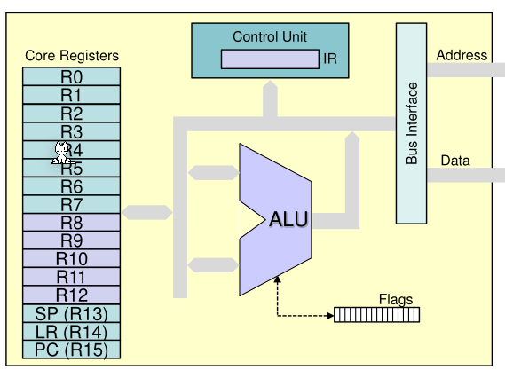

## von Neumann Architeccture

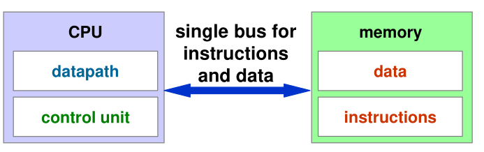

Instructions und Data sind im selben Speicher gespeichert. Von dem datapath Modul werden arithmetik und Logik ausgeführt.  Die Control Unit liest und interpertiert die Instruktionen.

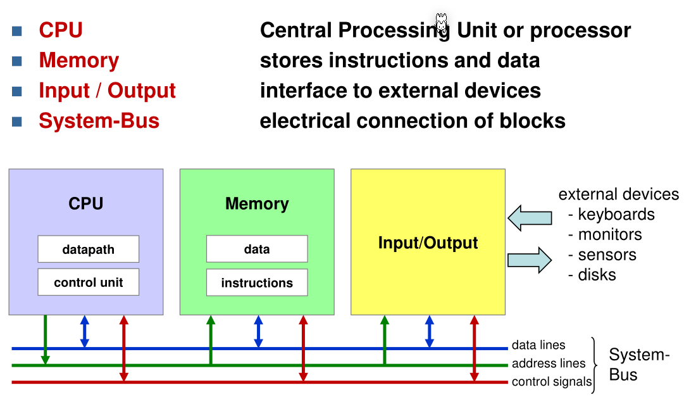

## Komponenten

### CPU

Der CPU ist unterteilt in die  Datapath und die Control Unit (und weitere). 

Den Datapath enthält die ALU und die Registers. 

In der Control Unit führt den fetch-exec Zyklus aus und kann Data-Transfers zwischen Memory und Registern, Arithmetische und Logische Befehle und Sprünge.

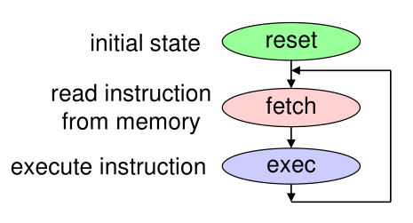

### Memory

Arbeitspeicher wird auf bytes genau adressiert

### I/O

Bei Festplatten oder SSDs wird in Blocks auf Daten zugegriffen.

### System-Bus

Der System-Bus enhält:

* Address-Linien: Welche Adresse geschrieben oder gelesen wird
* Data-Linen: Die Daten
* Control-Signal: Ob geschrieben oder gelesen werden soll

## CPU-Komponente

### Register

Es gibt 16 Registern, davon sind R0 - R12 für allgemeine Daten zuverfügung. Der Stack Pointer (R13) zeigt auf die letzte Adresse des Stacks, der Link Register (R14) zeigt auf die letzte Rücksprung-Adresse, bei Funktionen und der Program Counter (R15) zeigt auf die nächste Instruktion, welche ausgeführt werden soll.

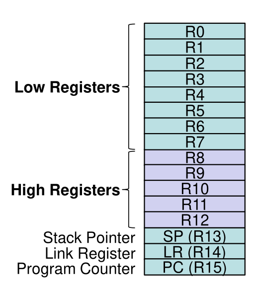

### Arithmetic Logic Unit (ALU)

Die ALU hat zwei 32-bit Inputs und ein 32-bit Output. Die ALU kann Integer-Arithmetik (Plus, Minus, Multiplikation, Division), ebenfalls können And, Or, Not, Xor, right und left Shiften ausgeführt werden.

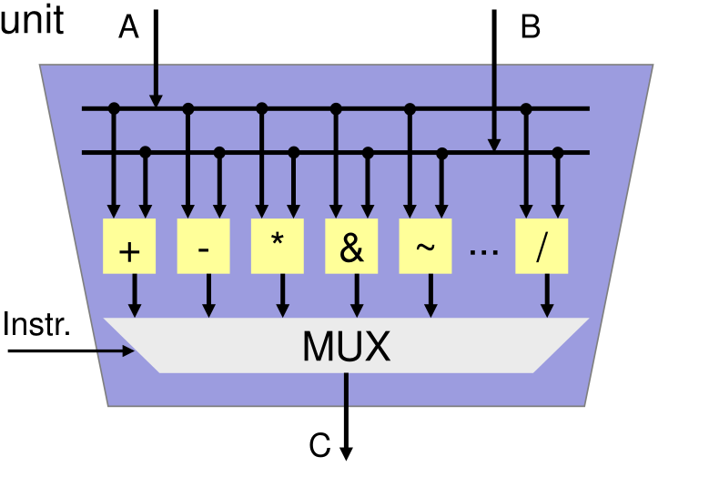 

### Flag Register (APSR)

In diesem Flag stehen Status-Informationen zur letzten Operation

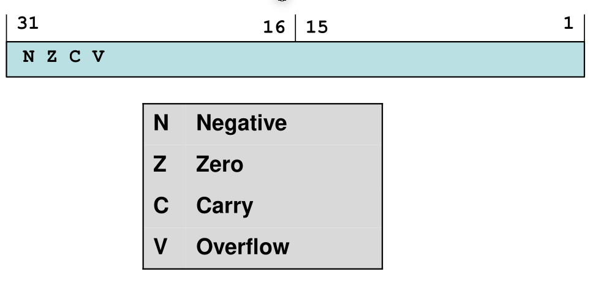

## Instruction Set

Es gibt mehrere Arten von Instructions:

* Data transfer
  * Daten von einem Register in ein anderes Register kopieren
  * Daten vom Speicher in Register laden
  * Vom Register in den Speicher speichern
* Data Processing
  * Arithmetische Operationen
  * Ligische Operatione
  * Shift / Rotate Operationen
* Control Flow:
  * Branches (Jumps)
  * Function calls
* Weiteres Instruktionen

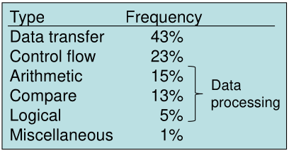

## Program Execution

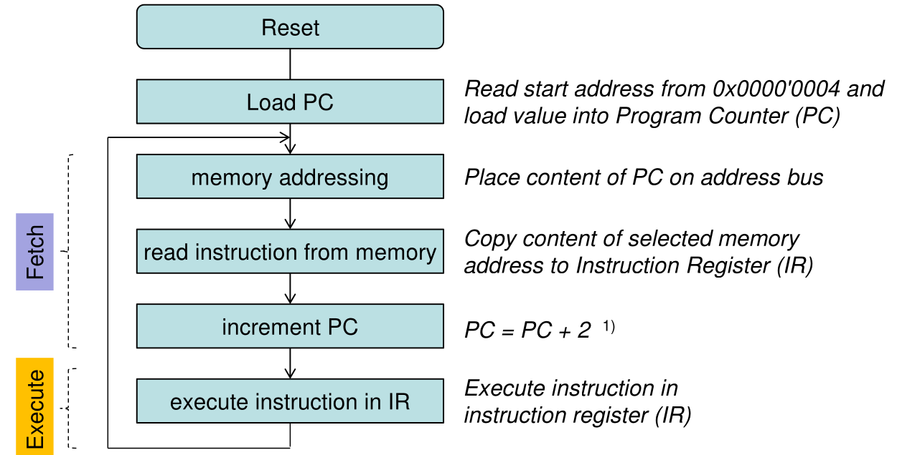

## Memory Map

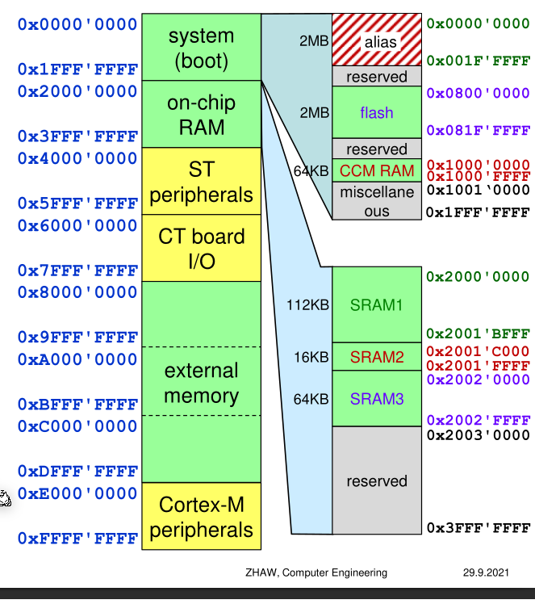

* Flash is non-volatile memory
* CCM RAM stands for Core Coupled Memory and is very fast

## C Integer Typen

Die folgenden Typen sollen in C verwendet werden, da "normale" Typen, wie `int long` Prozessor spezifisch sind.

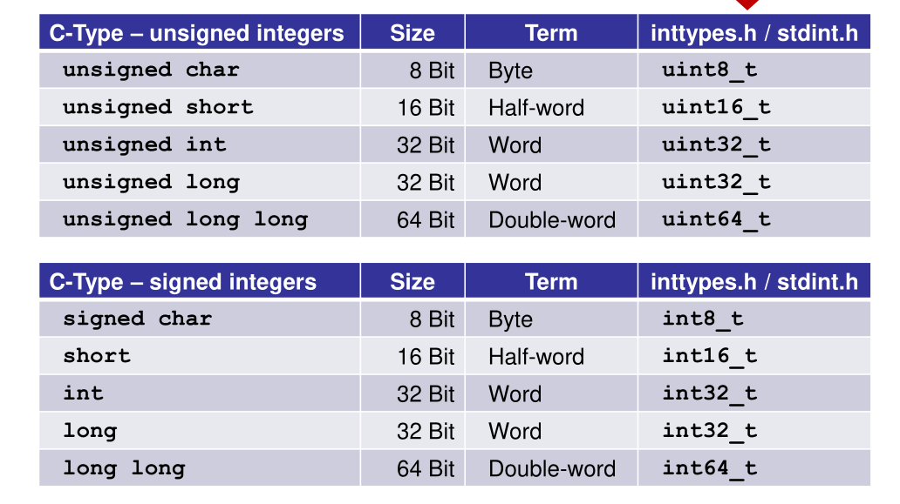

## Multi-byte Integers

Bei **Little Endian** ist das Least-Significant-Byte (LSB) an der tiefereren Adresse. ST ARM benützt dieses Format.

Bei **Big Endian** ist das Most-Significant-Byte (MSB) an der tiefsten Adresse.

Im folgenden Beispiel steht die Zahl `0xA1B2'C3D4`.

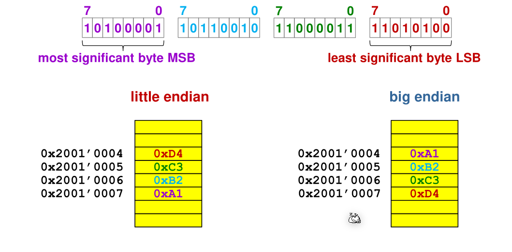

Adressen werden aligniert. **Half-Words** werden auf gerade Adressen aligniert. **Words** werden auf durch 4 teilbare Adressen aligniert.

## Object-File

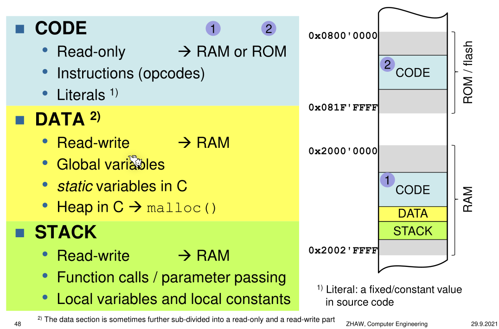

1111 + 1 = 0000 C=1 O=0

0111 + 1 = 1000 C = 0 O = 1

1000 - 1 = 0111 C = 0 O =1