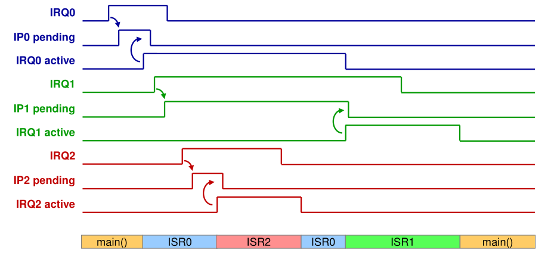

# Assembler

Arm is **little endian**, meaning that the MSB comes first, the LSB comes last.

## Basic Structure

```assembly
				; code area
				AREA	MyCode, CODE, READONLY
				
				ENTRY
start			MOVS 	R4, #12
				ADDS	R3, R4, #5
				B start
				
				; data area (writable)
				AREA 	MyData, DATA, READWRITE
var_byte		DCB		0x0A, 0x12, 0xFF
var_halfword	DCW		0x1234, 0xEEFF
var_word		DCD		0x88776655
space1			SPACE 	256	; allocates 256 bytes
space2			%		256	; same as above
				
				; stack
				AREA	STACK, NOINIT, READWRITE
stack_mem		SPACE	0x00000400 ; 0x0000'0400
```

## Data Types

There are bytes (`DCB` = 1 byte), halfwords (`DCW` = 2 bytes) and words (`DCD` = 4 bytes). They are layed out with LSB in the lowest address (little endian)

For example, `0x1A2B'3C4D` is stored as 

Another restriction is that halfwords addresses have to be divisable by 2 (address ends in even number), and word-addresses by 4 (address ends in `0`, `4`, `8` or `C`)


```assembly
		AREA 	example1, DATA, READWRITE
var1	DCB		0x1A
var2	DCB		0x2B, 0x3C, 0x4D, 0x5E
var3	DCW		0x6F70, 0x8192
var4	DCD		0xA3B4C5D6
```

The code above produces the following memory map:


## Assembler Instructions

### `EQU`

`EQU` creates a constant like `#define` does in C.

```assembly
MY_CONST	EQU	0x12 ; creates a constant named MY_CONST with the value 0x12
```

### `LDR`

`LDR` can be used to load data from memory. There are multiple forms how `LDR` can be used:

* `LDR R5, mylita`
  The value at the label `mylita` is loaded. The instruction is translated to `LDR R5, [PC, #...]`  where the offset cannot be too large
* `LDR R5, =0x2000`
  This will allocate 4 bytes of space for `0x2000` in the literal pool and translate the instruction to `LDR R5, [PC, #...]`
* `LDR R5, =CONST_A`
  `CONST_A` is defined by a `EQU` statement and will be replaced while compiling resulting in `LDR R5, =0x2000`
* `LDR R5, =mylita`
  This will allocate 4 bytes of space for the **address** of `mylita` in the literal pool and translate the instruction to `LDR R5, [PC, #...]`. The `#...` is stored in 8 bits and can address up to the address of `4 x 255 = 1020` 
* `LDR R5, [PC, #...]`
  This will load a byte from the address `PC + #...`. The intermediate needs to be word aligned.

The offset can be between `0` and `0x7C` 

There are also `LDRSB` for loading and extending signed bytes and `LDRSH` for loading and extending half words.

The same instruction (except for extending signed integers) also exists for storing data.

### Airthmetic


The carry bit has to meanings depending if adding or subtracting numbers:

* Adding: $C=1$ means an overflow (with unsigned integers)
* Subtraction: $C=0$ means an underflow (with unsigned integers)

When dealing with signed integers then the number only overflowed when $V=1$.

### Multi-Word Arithmetic

If 32bit integers are too small then the `ADCS` and `SBCS` instruction can help to do multi-word arithmetic.

The following will add   `R1R2R3 + R4R5R6`:

```assembly
ADDS	R1, R1, R4
ADDC	R2, R2, R5
ADDC	R3, R3, R6
```


The `ADCS Rdn, Rm` instruction can be translated to $Rdn=Rdn + Rm + C$

The same is possible for subtractions:

```assembly
SUBS	R1, R1, R4
SBCS	R2, R2, R5
SBCS	R3, R3, R6
```


The `SBCS Rdn, Rm` can be translated to $Rdn = Rdn - Rm - \mathrm {not}(C)=Rdn + \mathrm{not}(Rm) + C$

### Multiplication

Only unsigned integer multiplication is supported on the Cortex-M0.

### Branches


## Structures

### Ifs


```assembly
	; if nr >= 0
	CMP	R1, #0x00
	BLT	else ; instead of >=, this inverts it to < but jumps to the else part
	
	; if part
	MOVS R2,#1	; isPositive = 1
	B end
	
else ; else part
	MOVS R2, #0 ; isPositive = 0
end
```

### Do-While


```assembly
	; sum is in R2
	; nr is in R1
	MOVS	R2, #0 ; init sum
	
loop ; do-while body
	ADDS	R2, R2, R1
	
	; condition
	CMP		R2, #100
	BLT		loop
```

### While


```assembly
	; prod is in R2
	; nr is in R1
	MOVS	R2, #1
	
	; jump to condition before executing the body
	B		cond

loop ; while-body
	MULS	R2, R1, R2
	
cond ; condition
	CMP		R2, #100
	BLT		loop
```

### Jump Tables / Switch


```c
uint32_t result, n;
switch (n) {
case 0:
    result += 17;
    break;
        
case 1:
    result += 13;
    //fall through
        
case 3: 
case 5:
    result += 37;
    break;
        
default:
    result = 0;
}
```


```assembly
NR_CASES		EQU		6
case_switch		CMP		R1, #NR_CASES
				BHS		case_default	; R1 >= 6 -> go to case_default
				LSLS	R1, #2			; * 4
				LDR		R7, =jump_table
				LDR		R7, [R7, R1]
				BX		R7				; go to label
				
case_0			ADDS	R2, R2, #17
				B		end_sw_case
				
case_1			ADDS	R2, R2, #13
				; fall through
				
case_3_5		ADDS	R2, R2, #37
				B		end_sw_case
				
case_default	MOVS 	R2, #0
end_sw_case


				AREA	myData, DATA, READWRITE
jump_table		DCD		case_0
				DCD		case_1
				DCD		case_default
				DCD		case_3_5
				DCD		case_default
				DCD		case_3_5
```

## Interrupts

When code wants to react to some event on the system (like a button that's being pressed) then there are two ways to implement this. Either the code can constantly poll the state, checking over and over again if the event occurred. This, however, is inefficient and results in a lot of busy waiting, but it is simple, implicitly synchronised and deterministic.

### Address Table

The following is a table of all important addresses for handling interrupts:

| Name       | Address      | Purpouse                                                     |
| ---------- | ------------ | ------------------------------------------------------------ |
| `SETENA0`  | `0xE000E100` | Enable interrupt                                             |
| `CLRENA0`  | `0xE000E180` | Disable interrupt                                            |
| `CLRPEND0` | `0xE000E280` | Clearing pending interrupt                                   |
| `SETPEND0` | `0xE000E200` | Triggering interrupt by software                             |
| `ACTIVE0`  | `0xE000E300` | Read-only memory to check if interrupt is active             |
| `PL_IRQ0`  | `0xE000E400` | The 4 byte priority level of each interrupt (lower level = higher prio) |

### System Exceptions and Interrupts

Another solutions are interrupts: Arm processor differentiate between system exceptions and interrupts. System exceptions are errors created by events from the CPU (like a fault or the restart of the processor). Interrupts are created by events from peripherals or by a library.

The following system exceptions exists. The interrupts from 0 until 239 are defined and are located after the `SYSTICK` system exception. (eg. `IRQ14` has the exception number `30` at the address  `120=0x78`): 
$$
IrqNr+16=ExceptionNr
$$


### Interrupt Table

In the interrupt table is written where the processor has to jump if an interrupt or a system exception occurred. The interrupt table starts at the address `0x00`, but there is no system exception 0. This is because at the address `0x00` the initial stack pointer is written. This results in when the CPU starts, it first initialise the stack with the initial stack pointer and then calls the reset handler which *coincidentally* is at the next address.

### Example

```assembly
main		
			LDR 	R0, =0xE000E100	; address to enable the interrupt handling
			MOVS	R1, #1
			LSLS	R1, R1, #26		; bit of IRQ26
			STR		R1, [R0]

ISR_Handler	
			LDR 	R0, =0xE000E280 ; address to clear pending interrupt
			MOVS 	R1, #1
			LSLS	R1, R1, #26		; bit of IRQ26
			STR		R1, [R0]
```


### Execution of an Interrupt or System Exception

When an exception occurs then the CPU saves the register `R0` - `R3`, `PC`, `LR`, `R12`,  and `xPSR`. This allows the ISR function to be coded like a regular function. 


The cpu checks when calling `BX LR` if the magic value `EXC_RETURN=0xFFFF'FFF9` is found in the `LR` register. If this is the case, then the previously saved registers are restored from the stack.

The following image shows a interrupt vector table.


The `startup_ctboard.s` initialises  this interrupt vector table and sets default handler (marked with `[WEAK]` to tell the linker only use the default handler if no other definition exists).

Example:

```assembly
; Vector Table Mapped to Address 0 at Reset
AREA RESET, DATA, READONLY
__Vectors	DCD	__initial_sp		; Top of Stack
			DCD	Reset_Handler 		; Reset Handler
			DCD NMI_Handler			; NMI Handler
			DCD	HardFault_Handler	; Hard Fault Handler
			...
			....
			; Interrupts
			DCD IRQ0_Handler		; ISR for IRQ0
			DCD IRQ1_Handler		; ISR for IRQ1
			DCD ...
```

The following is a diagram showing the states of the interrupt handler. 


* Inactive: Exception is not active and not pending
* Pending: Exception occurred and is waiting to be handled by the CPU
* Active: Exception is being handled and has not finished yet
* Active and Pending: An exception is being handled by the CPU and another exception occurred and is waiting to be handled.

To model all possible states, two bits are necessary, one for if an interrupt is pending and one if the interrupt is active.

The following diagram shows the two bits and an interrupt request bit.
When the `IRQn` goes to high and interrupt occured then the Interrupt Controller sets `IPn` to high. As soon as the CPU has finished the context switch, `IAn` will be set to hight by the `CPU` and the interrupt controller will set `IPn` to high. The `IRQn` needs to be reset by the interrupt handler.

 

If the interrupt handler doesn't reset the `IRQn` then the interrupt controller will think that another interrupt is pending and the CPU is caught in an infinite loop.


### Activate and Deactivate all Interrupts

`PRIMASK` is a Bit, which when set to `0` , all interrupts are disabled. The bit can be set with `CPSID i` and unset `CPSIEi `.

### Activate and Deactivate specific Interrupts


```assembly
; enables IRQ16
MOVS	R1, #1
LSLS	R1, R1, #28			; enables IRQ28
LDR		R0, =0xE000E100 	; loads memory to enable interrupts
STR		R1, [R0]			; 

; disables IRQ16
MOVS	R1, #1
LSLS	R1, R1, #16			; enables IRQ28
LDR		R0, =0xE000E180 	; loads memory to disable interrupts
STR		R1, [R0]			; 
```

### Control Interrupts

By writing to the bit of the IRQ number, a interrupt can be created by software (`0xE000E200`), the pending request can be deleted (`0xE000E280`) or test if an interrupt is active ( `0xE000E300`).

### Priority Levels

Each exception has a priority level. A lower priority level translates to a higher priority (`-1` has a higher priority than `10`)

To set the priority a 4-bit value (on the Cortext-M0 a 2-bit value) can be written to an address between `0xE000'E400` and `0xE000'E4EC`.  Only interrupts can be prioritised manually, system exceptions already have predefined priorities.


In the diagram above, a situation where either `ISR0` or `ISR2` has been prioritised. If `ISR2` is prioritised then `ISR0` is paused (but its active bit is still set) and `ISR2` is run.

Below is a more complete diagram. It assumes the following priorities: `RQ0` `PL0` = `0x2`, `IRQ1` `PL1` = `0x3` and `IRQ2` `PL2` = `0x1`



### Nested Vectored Interrupt Controller (NVIC)

The NVIC handles part of the complexity of calling interrupt handlers.


### Interrupts in C

There is a library for C to allow the user to know have to use registers directly but rather just call functions.


### Data Consistency


To fix this issue, the two `write_byte(...)` calls should be wrapped in `__disable_irq()` and `__enable_irq()`.
