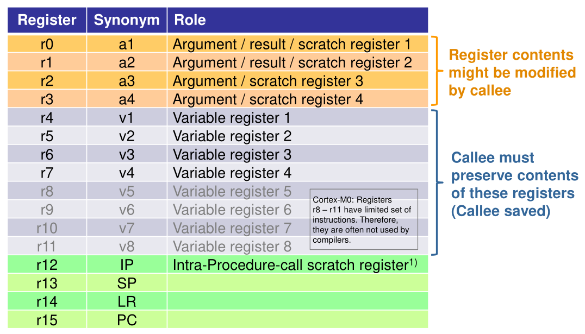
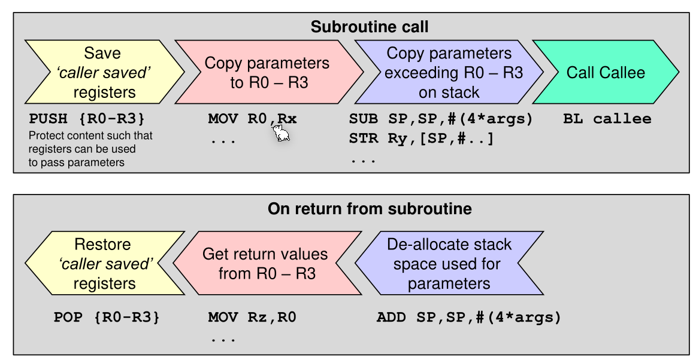
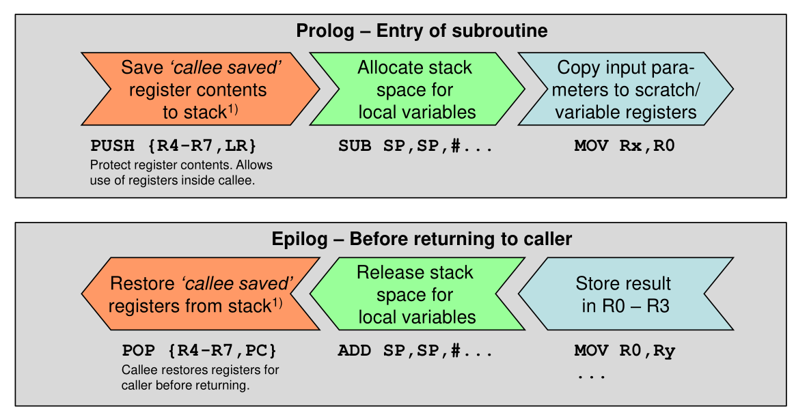
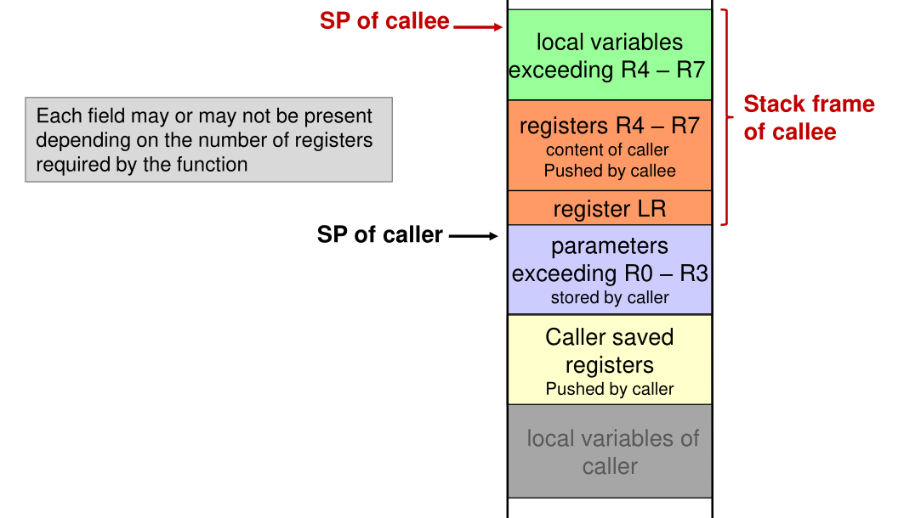

# Functions

With `BL mark` the processor will jump to the given `mark` and store the address of the caller in the link register `LR`. With `BLX Rx` the processor will jump to the address in the given register and storing the address in the link register. When the subroutine is done, it can return with `BX LR`


```assembly
					BL 	display_routine

display_routine
					PUSH {LR}		; save LR register
					; do display stuff
					POP {PC}		; restore LR register into the PC register
```

## Stack

With `PUSH` can the contents of registers be pushed onto the stack. With `POP` can register be popped 

The following example shows `PUSH {R0}`


## Parameters

This tables shows the trade-offs of different techniques for passing a parameter. It also partly explains why AAPCS is designed in the way it is.

|             | Register | Global Variable | Stack |
| ----------- | -------- | --------------- | ----- |
| Speed       | ++       | --              | --    |
| Flexibility | --       | --              | ++    |
| Maintanance | --       | --              | ++    |
| Recursion   | --       | --              | ++    |

### Pass-by-value

```assembly
AREA exData,DATA,...

AREA exCode,CODE,...

        MOVS R1,#0x03
        BL double
        MOVS ...,RO

double
		LSLS RO,R1, #1	
		BX LR
```

### Pass-by-reference

```assembly
TLENGTH EQU 16

AREA exData,DATA,...
plTable SPACE TLENGTH

AREA exCode,CODE, ...

        LDR RO,=plTable
        MOVS R1,#TLENGTH
        BL doubleTableValues

doubleTableValues
		MOVS R2,#0

loop 	LDRB R4,[RO,R2]
        LSLS R4,R4,#1
        STRB R4, [RO,R2]
        ADDS R2,#1
        CMP R2,R1
        BLO loop
        BX LR
```

### Pass-by-global-variables

```assembly
```

### Pass-by-stack

```assembly
```

### ARM Architecture Procedure Call Standard (AAPCS)

The registers R0 - R3 can be used for passing arguments or return values. The callee can change these. R4-R11 have to be preserved. If a function changes these then their original value has to be restored before the function jumps back.



The caller has to do the following:



The callee has the following tasks:



The stack might look like this if the contract specified above is met. A stack frame is a part of the stack 



## Local Variables

