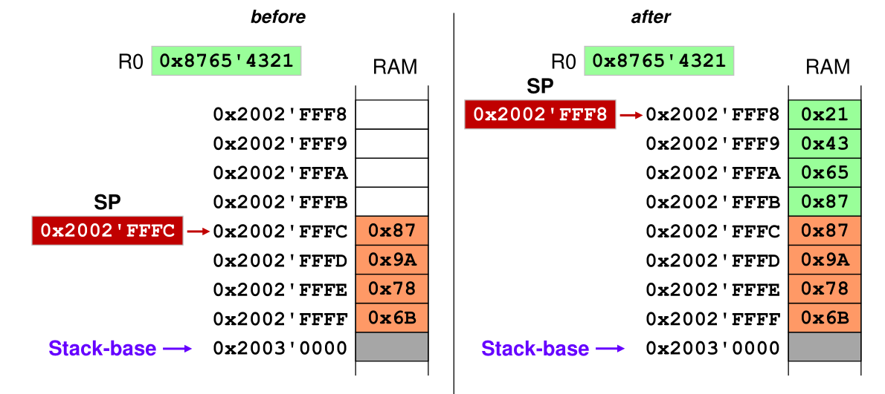

# Functions

With `BL mark` the processor will jump to the given `mark` and store the address of the caller in the link register `LR`. With `BLX Rx` the processor will jump to the address in the given register and storing the address in the link register. When the subroutine is done, it can return with `BX LR`


```assembly
					BL 	display_routine

display_routine
					PUSH {LR}		; save LR register
					; do display stuff
					POP {PC}		; restore LR register into the PC register
```

## Stack

With `PUSH` can the contents of registers be pushed onto the stack. With `POP` can register be popped 

The following example shows `PUSH {R0}`



