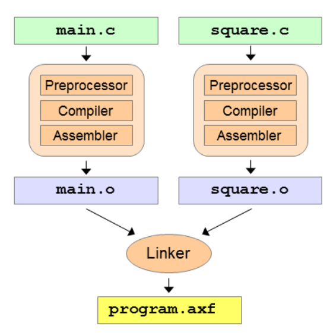
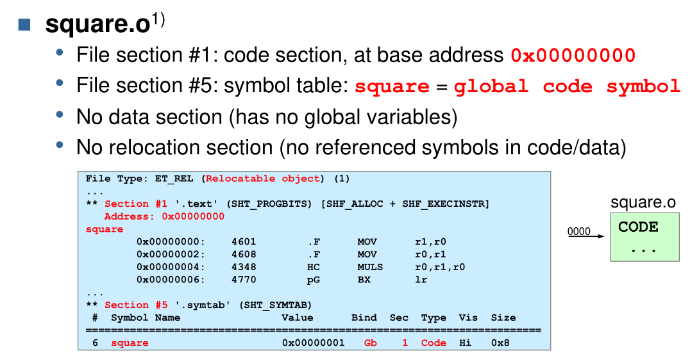
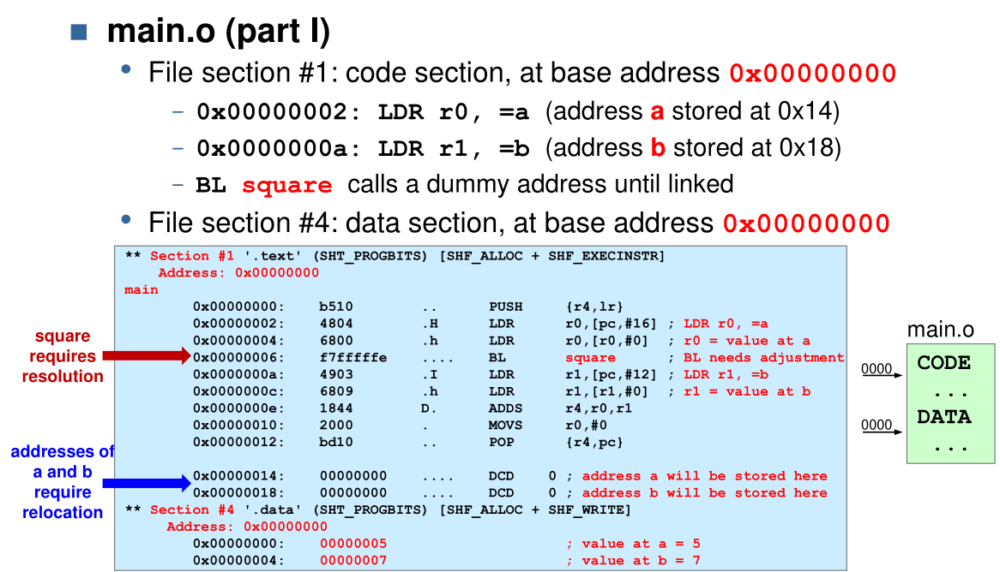
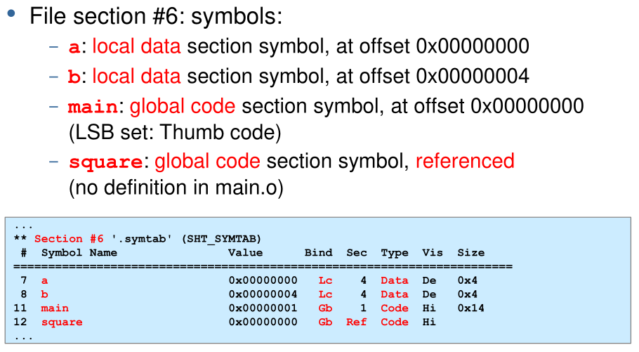
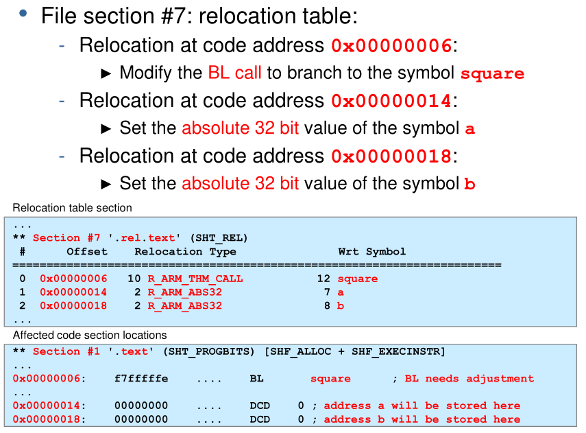
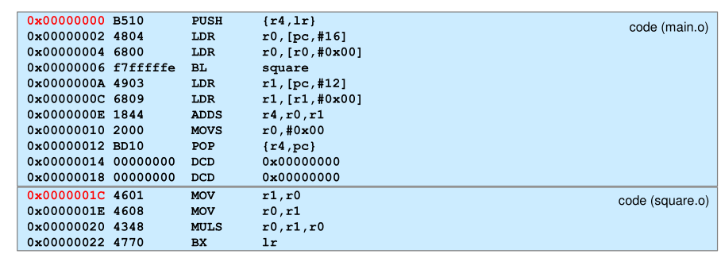
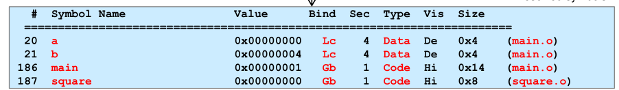
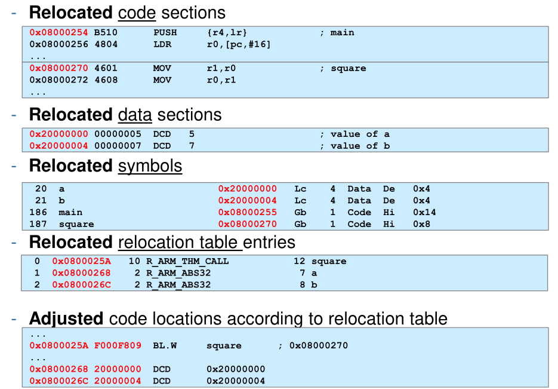

# Tool Chain

A tool chain are the tools required to build an executable from the source code. There are both native and cross compiler tool chain. Native tool chains run on the same environment which the software will run on later, while a cross compiler creates an executable which runs in a different environment.

## Modules



Each c (or assembler) file is viewed as a module and is processed one-by-one by the preprocessor, compiler and the assembler. All compiled modules are combined by the linker.

## C

The two rules of C:

1. Names declared before use
2. One definition rule
   A variable or function can be declared multiple times, but can only be defined once in the same scope

### Declaration vs Definition

The following code only defines the names of a funciton, variable or struct. But their details aren't known to the compiler when compiling this module. (E.g. accessing a field of a struct wouldn't be possible)

```c
uint32_t square(uint32_t v); 	// square function defined elsewhere
extern uint32_t counter; 		// counter variable defined elsewhere
struct S; 						// struct S type defined elsewhere
```

The following code defines the a function, variable or struct with their details.

```c
uint32_t square(uint32_t v) { ... } 	// square function definition
uint32_t counter; 						// counter variable definition
struct S { ... }; 						// struct S type definition
```

### Header Files

```h
// square.h
#ifndef _SQUARE_H_ // incl.-
#define _SQUARE_H_ // guard
// declaration of square
uint32_t square(uint32_t v);
#endif // end of incl.-guard
```

The matching c file is:

```c
// square.c
#include "square.h"
// definition of square
uint32_t square(uint32_t v)
{
	return v*v;
}
```

### Linkage Reference

|                           | C names            | ASM Symbols                         | OBJ Symbols | AXF Executables |
| ------------------------- | ------------------ | ----------------------------------- | ----------- | --------------- |
| external linkage (export) | `extern` (default) | `EXPORT`-labels for exported labels | Global      |                 |
| external linkage (import) | `extern`(default)  | `IMPORT`-labels for imported labels | References  |                 |
| internal linkage          | with `static`      | normal labels                       | Local       |                 |
| no linkage                | local variables    | -                                   | -           |                 |

## Libraries

Libraries can be dynamically or statically linked. 

A static linked executable contains all required libraries. While this results in a bigger file as every executable needs to include the same libraries, it also prevents DLL-Hell.

## Linker

The linker has three tasks: merging code and data sections, resolving symbols to other modules and relocating address.

### Object and ELF Files

Object files are the input to the linker and contain the compiled data of a module:

* Code section
  Code and constants of a module. The addresses start at `0x00`
* Data section
  All global variables of the module. The addresses start at `0x00`
* Symbol table
  All symbols and their attributes (e.g. global, local, reference, etc)
* Relocation table
  Which and how bytes of the data and code sections need to be adjusted after merging the sections

The executable and linkable format (ELF) can contain code sections, data sections and symbol table as well, which might get used on a system with a loader (like linux).

### Example of Linking an Object File

The following shows an example of the object files squere.o and main.o:









#### Merging

In the first step `square.o` and `main.o` are merged. Code sections and data sections are just stitched together. But references within the code sections are still wrong.



#### Resolving

In this step references are resolved. This can be seen in the following symbol table where the reference to `square` has been replaced. However, the relative addresses are not relocated and start at `0x00`.



#### Relocation

In this steps all relative addresses are recalculated to global addresses. This affects the addresses of sections, symbols and offsets. This is done with $GlobalAddress=GlobalBase+MergeOffset+ModuleRelativeOffset$

* The `GlobalBase` is the base address of where the content of the ELF file are loaded. For the STM32 the internal SRAM starts at `0x2000'0000`
* The `MergeOffset` is the offset of the module. E.g. the merge offset of `square.o` is `0x0000'001C`.
* The `ModuleRelativeOffset` is the offset within the module


