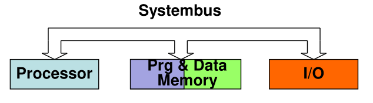
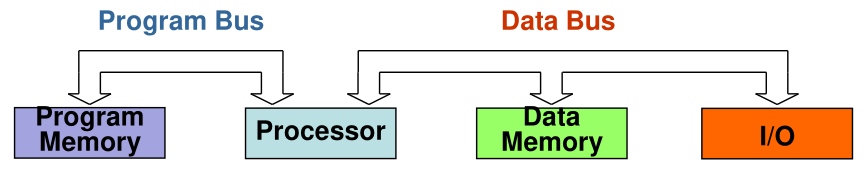
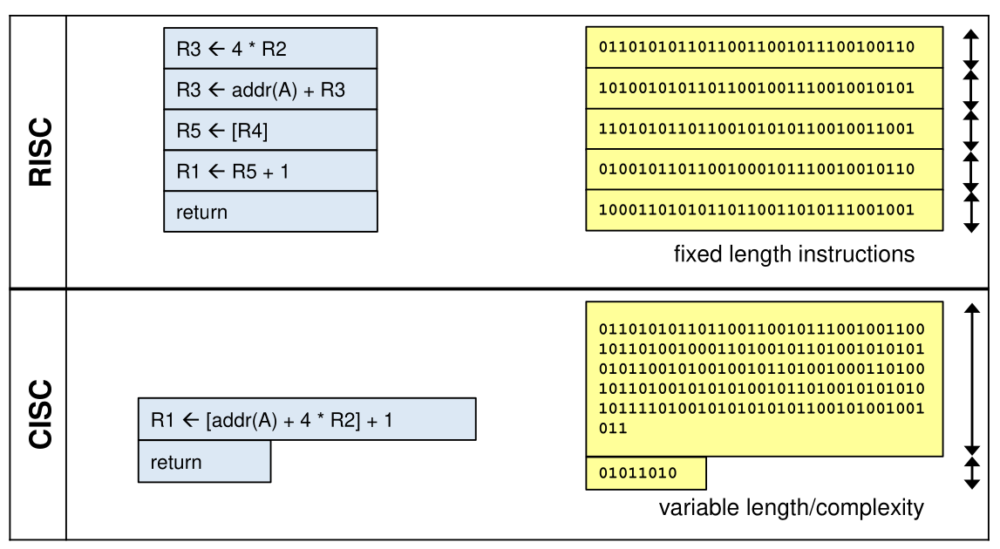
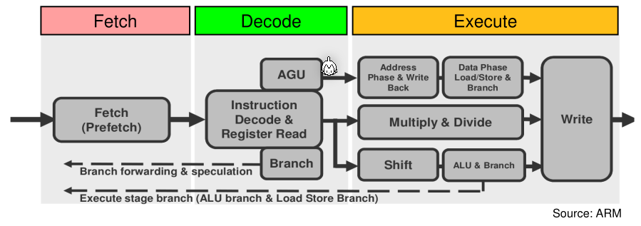
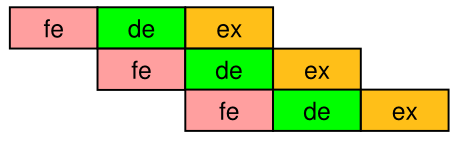
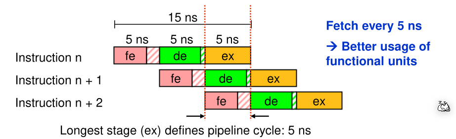
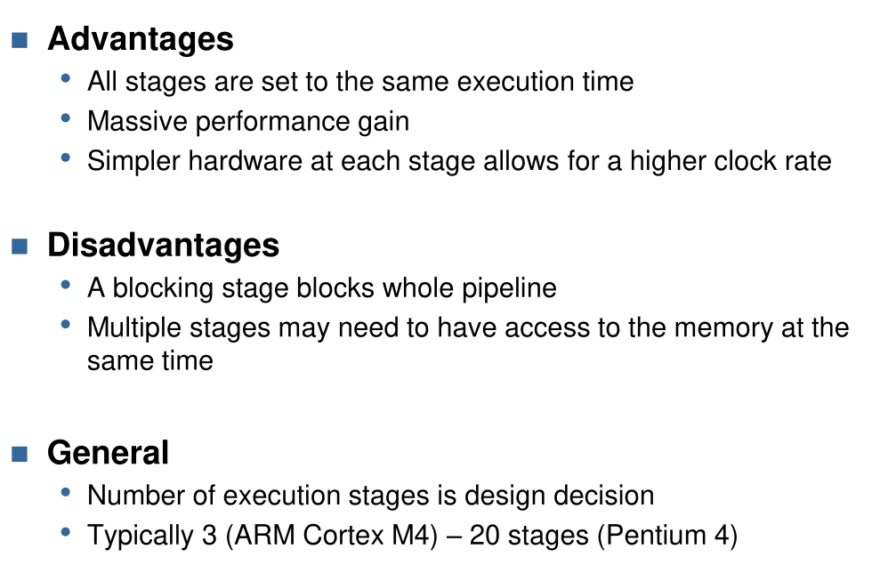
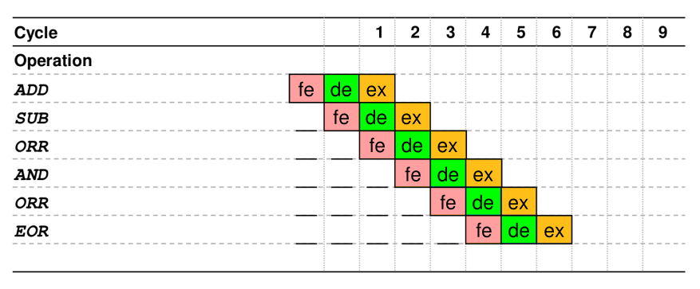
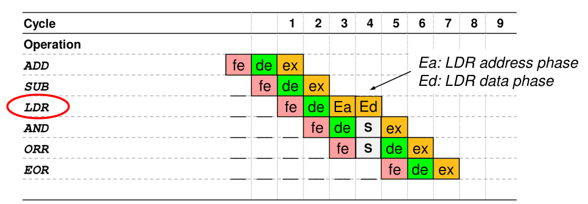
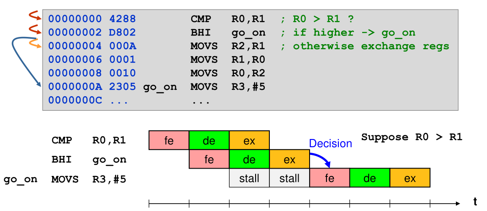

# Optimierung

## Architekturen

* von Neumann Architecture
  This architecture shares the same system bus between the processor, memory and I/O. Additionally, the same memory holds the program and data.
  
* Harvard Architecture
  In this architecture the processor has a separate bus to connect to the memory holding the program. The data memory and I/O are connected through another bus.
  

Because of the separate buses the Harvard architecture can be faster, but also more complex and more expensive.

## Instruction Set Architecture

* RISC (Reduced Instruction Set Computer)
  In RISC only data in register can be processed
* CISC (Complex Instruction Set Computer)
  One operand may be a memory location. Reducing the amount of instruction needed for a program, but increasing the number of instruction the CPU needs to be able to execute.
  Often CISC have variable instructions which puts an additional burden on the CPU.

The simplicity of RISC results in simpler and faster instruction decoding. Compilers can also be more effective optimized because the instructions are more limited and more generic. Pipelining also becomes simpler and shorter.

On the other hand, CISC needs less memory for complex instructions and short programms can be faster with less memory access.

## Pipelining

Instead of fetching, decoding and executing each instruction in sequence, the CPU can already start fetching the next instruction while decoding the current instruction.

However, if multiple stage run simultaneously then each instruction needs to be finished at the same time.   

In the example above, without pipelining the CPU could execute $\frac {1s}{15ns} = 83.3\cdot 10^6 \frac T {sec}$. With pipelining the cpu can execute $\frac {1s}{5ns} = 200\cdot 10^6 \frac T {sec}$. This results in a 140% increase in performance.
$$
InstructionsPerSecond&=\frac 1{InstructionDelay}\\
InstructionsPerSecond &= \frac 1 {MaxStageDelay}
$$

### Problems

In the optimal case, the CPU can move each instruction one stage forward per cycle.

But not each instruction takes only one cycle, like `LDR` or instruction changing the `PC`. This can be mitigated to a degree by out of order execution. By duplicating some elements of the execution unit, the CPU can reorder the `LDR` instruction with an earlier instruction which can run simultaneously. When the requested value is required, the value will already be loaded.

### Branching

### Reducing Stalls

* Reduce the number of conditionals by e.g. fuse loops together
* Branch prediction stores the last decision and assumes that the next will be the same and preload those
* Instruction prefetching fetches instructions before they are used to use the system bus better and enable out of order execution

