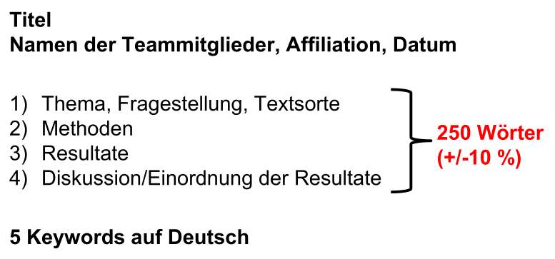

# COM3

## 4 Principles of Negotiation

1. Separate the people from the problem
2. focus on interests, not positions
3. invent options for mutual gain
4. insist on objective criteria

## Summary

Das Ziel einer Zusammenfassung ist es, wesentliche Aussagen, zentrale Argumente und Grundaufbau eines Textes in knapper Form darzustellen. Eine Zusammenfassung muss ohne den grundlegenden Text verständlich sein.

Es sollten folgende Frage beantwortet werden. Jenach Textsorte und Zielpublikum, gibt es ein Schwerpunkt auf gewisse Frage.

* Was? (Thema/Ergebnisse/Kernaussagen)
* Wer? (Autor:innen/Involvierte)
* Warum? (Gründe/Zusammenhänge)
* Wozu? (Ziele/Absichten)
* Wie? (Methoden/Prozesse)
* evtl. Wo? & Wann? (je nach Kontext / Basistextart)

Beim Zusammenfassen soll zuerst **stichwortartig** die wichtigsten Kernaussagen zusammengefasst und danach einen Satz daraus gebildet werden soll. 

Eine Zusammenfassung soll im **Präsens** sein und keine Nacherzählung (keine Infos zum zeitlichen Ablauf oder handelnden Personen). Zudem soll eine Zusammenfassung **nicht wertend** sein.

### Aufbau

1) Ausgangslage, Thema, die Angabe des Ziels bzw. der
    untersuchten Fragestellung des Basistexts, Textsorte
2) eine Angabe der genannten Methode(n) zur Beantwortung der
    Fragestellung
3) die Verdeutlichung der Resultate
4) eine Diskussion (Einordnung) der Ergebnisse, ggf. einen
    abschliessenden Satz zur Anwendung

### Aufbau in COM3

Affiliation ist ZHAW

## Argumentation

### LWN 2

- 20 min / 4-5 people
- speak freely, but notes are allowed (A5 sheet)
- The lecturer might send a message to a participant with instructions which needs to be incomperated
- Harvard Principles need to be incorporated 
- Don't use every argument at the same time. The participants should stick to the current topic
- CEO should welcome everybody and state the aim of the meeting
- Participants should be introduced with their role that the prof knows who does what

Preperation:

* What is your own position?
* What is your bottom line?
* Where are you prepared to compromise?
  * What is the minimal goal?
  * What is the maximal goal?
* Review the Harvard Principles

### Chemical Engineer - Notes

* **Position**: With my recently earned degree, I'm extremely cautious about the environment. The fact that the supplier knew about the pollution doesn't help. I think that the company should be transparent about this issue. 

  My trust in the supplier is low and I rather change supplier than continuing working with the current one

* **Bottom line**: Change supplier and tell the public and employees about it. The river shouldn't be polluted and the slightly toxic gas should be filtered

* **Minimal Goal**: The supplier either has to be dropped or change its process immediately (ultimatum) 

* **Maximal Goal**: In addition to changing the supplier, a company internal memo should be sent to inform employees about this grave misconduct of our partner. Along this memo, a press release should be released which states the facts and promises changes (aka dropping the supplier). Both things have to be done immediately.

#### Knowledge

* About 25 tons of acid waste drains into a river near the Chinese plant every
  year. This waste is an inevitable part of the manufacturing process. It kills
  animal and plant life for some distance downstream.
* Slightly toxic gas is released, but nobody seems to notice, probably because
  the plant is in a major industrial region.
* The gas would have to be filtered, adding a further 5% to production costs.

#### Position

* How serious the problem is: 
  * very serious: there is only one planet
* Which actions should be taken
  * Tell employees and the public (customers)
  * drop the supplier (or maybe demand change from the supplier)

#### Arguments

* Tell the public
  * This scandal will eventually come out. We should tell our side of the story to control the narrative
  * Raise awareness about our company's ecological mission by announcing swift actions
  * No news is bad news
  * Use an ad campaign to control the narative
  * If reported by the independent media, the story could tarnish our brand a lot more
* To the employee
  * They have right to know (they might work for us because we're brand ourselves as ecological)
  * They trust us to lead this ecological oriented company actually ecological
    * Loosing that trust could lead to strikes and mass-quitting. This can be averted by informing them about the situation and future plans to remedy the issue
* Change supplier
  * The supplier can't be trusted as they already knowingly polluted the river
  * Sourcing batteries from multiple supplier could lead to more leverage while negotiation leading to lower prices. The supplier could also be in China. Eventually the problematic supplier could be dropped.
    * Future prove: If something similar happens again, the supplier could be dropped (relatively) quickly
* Ultimatum to supplier
  * Find another supplier to have more leverage

#### Con Arguments

* Changing the mission statement
  * Customers have bought our products thinking they bought something green
  * Employees work for us because they identify with our brand
* Waiting with the announcement until after the IPO
  * Will crash the stock price. We better get it over with now
  * Trust of employees, customers and shareholders after the IPO

## Numbers

* 1x Scooter: 900CHF / bom: 400 CHF (with battery)
* profit: +10 million
* revenue impact from making it public: -8 milion / -10%
* After ZüriScoot: 200 million revenue / 30 million profit

- 
