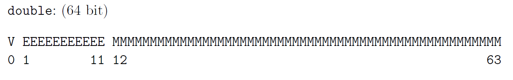

# Gleitkommazahlen

## Mantis

$$
x=m\cdot B^e\\
12000 = 1.2 \cdot 10^4
$$

Dabei gilt $x\in \R$, die Mantis  $m \in R$, die Basis $B \in \N$  und den Exponent $e\in \Z$ 

Eine Zahl kann folgendermassen Dargestellt werden:
$$
m=\pm0.m_1m_2m_3m_n\\
e=\pm e_1e_2e_3e_l
$$
Dabei ist der Bereich der darstellbaren Zahlen folgendermassen: 
$$
M=\{x \in \R \vert x=\pm0.m_1m_2m_3...m_n\cdot B^{\pm e_1e_e...e_m}\}
$$

Eine Zahl wird **machinendarstellbar** genannt, wenn $m_1\neq 0$ ist

Die Anzahl Zahlen kann mit $2\cdot B^{n-1}\cdot (2\cdot B^e-1)+1$, wenn der Exponent und Mantis ein Vorzeichen hat. Falls die Mantis kein Vorzeichen hat, gibt es: $B^{n-1}\cdot (2\cdot B^e-1)+1$. Wenn der Exponent auch kein Vorzeichen hat, dann wird daraus $B^{n-1}\cdot B^e+1$.

## Minimum und Maximum

$$
x_{max}=B^{e_{max}}-B^{e_{max}-n}=(1-B^{-n})\cdot B^{e_{max}}\\
x_{min}=B^{e_{min}-1}
$$

Hier ist ein Beispiel:
$$
B=2, n=4, 0 \le e \le 3\\
x_{max}=0.1111_2\cdot 2^3=111.1_2=7.5_{10}\\
x_{max}=2^3-2^{3-4}=8-0.5=7.5_{10}\\
\\
x_{min}=0.1000_2 \cdot 2^0 = 0.1_2=0.5_{10}\\
X_{min}=2^{0-1}=2^{-1}=0.5_{10}
$$

## Rundungsfehler

Der **absolute Fehler** bei einer Rundung von $x$ zu der Näherung $\tilde x$ ist definiert als $\vert \tilde x - x \vert$. Der **relative Fehler** ist $\left\vert \frac{\tilde x - x}{x} \right\vert$.

Wenn $\tilde x=rd(x)$ gilt, wobei $rd(x)$ die Zahl $x$ rundet, dann ist der höchste absolute Fehler: $\vert rd(x)-x\vert \le 0.\underbrace{00...00}_{n}\frac B 2\cdot B^e=\frac B 2\cdot B^{e-n-1}$

Als Beispiel mit der Basis $B=10$, eine siebenstellige Mantisse $n=7$ und $x=180.1234567=0.1801234567\cdot 10^3$: $\vert rd(x)-\tilde x\vert \le 0.\underbrace{0000000}_{n=7}5\cdot 10^3=0.5\cdot 10^{3-7}=0.5\cdot10^{-4}$

## Konditionierung: Fortpflanzung von Fehler

Der absolute Fehler von einer Operation $f(x)$  kann als $|f'(x)|\cdot |\tilde x - x|$ angenähert werden. Beim relativen Fehler gilt $\frac{|f'(x)|\cdot|x|}{|f(x)|}\cdot \frac{|\tilde x - x|}{|x|}$ 

Den Faktor $K:= \frac{|f'(x)|\cdot|x|}{|f(x)|}$ nennt sich Konditionszahl und sagt aus, um wie viel sich der **relativen Fehler** von $x$ bei einer Funktionsauswertung von $f(x)$ verändert. Dabei wird zwischen **gut konditionierten Problemen**, bei welchen die Konditionszahl klein ist, und **schlecht konditionierten Problemen,** bei welchen die Konditionszahl gross ist, unterschieden.

### Fehlerfortpflanzung bei SummationK:= \frac{|f'(x)|\cdot|x|}{f(x)}

Für $f(x)=x+c$, gilt $f'(x)=1$ und folgendes für $K$:
$$
K=\frac{|x|}{|x+c|}
$$
An dieser Formel kann das Problem der Auslöschung beobachtet werden: Wenn von $x$ eine ähliche Zahl $c$ subrahiert wird, dann wird $K$ sehr gross. 

Oder allgemeiner formuliert, wird von einer Zahl eine zweite ähnliche grosse Zahl subtrahiert, wird der relative Fehler sehr hoch. Dies kann zum Teil durch geschicktes Umformen vermieden werden. Meist entstehen aber andere Auslöschungs-Zentren.

### Fehlerfortpflanzungs-Tabelle

## Maschinengenauigkeit (max. relativer Fehler)

Die Maschinengenauigkeit ist der maximale **relative** Fehler, der beim Runden entstehen kann.
$$
eps = \frac B 2\cdot B^{-n}=\frac 1 2 \cdot B^{1-n}
$$

$eps$ kann auch definiert werden, als die kleinste Zahl bei der $1+eps>1$ noch gilt

## IEC / IEEE Gleitkommazahlen

IEEE definiert eine `single` Gleitkommazahl, welche 32bit lang ist und das folgende Schema besitzt:

Ebenfalls gibt es eine `double` Gleitkommazahl, welche aus 64bit besteht und folgendes Schema besitzt: 
