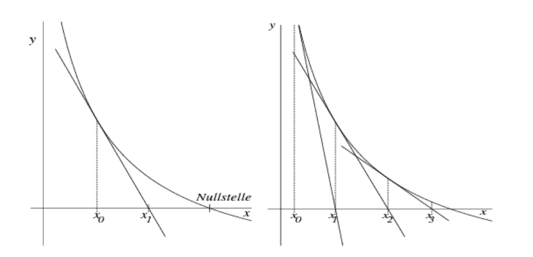
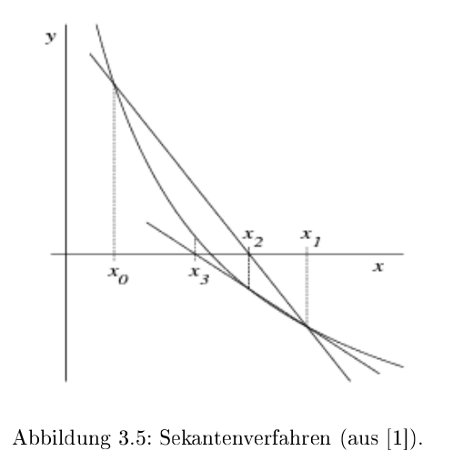

# Nullstellen

## Fixpunktiteration

Für das benützten der Fixpunktiteration muss die Gleichung in der Fixpunktform $F(x)=x$ sein.
$$
x_{n+1}=F(x_n)
$$

Damit die Fixpunktiteration zum Resultat konvergiert, muss für die Ableitung $F'(x)<1$  gelten. Dies wird auch im Banachscher Fixpunktsatz wiedergespiegelt.

### Banachscher Fixpunktsatz

Es gilt folgendes für $F: [a, b] \to [a, b]$ und die Konstante $\alpha \in ]0, 1[$
$$
|F(x) - F(y)|\le \alpha\cdot |x - y| \text{ wobei gilt: } x, y\in [a, b]\\
\text{oder}\\
\frac{|F(x)-F(y)|}{|x - y|} \le \alpha
$$
In Deutsch heisst dies, dass die Differenz $F(x) - F(y)$ nie grösser als $x-y$ sein darf, oder dass die Steigung nicht grösser als $1$ darf sein und muss grösser als 0 sein.

Mathematischer: $F$ muss Lipschitz-stetig (selbst-abbildend) und kontraktiv sein. Zum argumentieren, dass es selbst abbildend ist, $F(x)$ muss monoton steigend sein (darf nie sinken) und $F(a)$ und $F(b)$ müssen zwischen $a$ und $b$ sein.

Zum argumentieren, dass es kontraktiv ist, muss $F(x)$ 

Wenn dies gegeben ist, 

* hat $F$ genau einen Fixpunkt $\overline x$ in $[a, b]$
* konvergiert die Fixpunktiteration $x_{n+1}=F(x_n)$ gegen $\overline x$ für alle Startwerte $x_0\in [a, b]$
* Die a-priori und a-posteriori Abschätzungen gelten

$\alpha$ kann auch als die grösstmögliche Steigung definiert werden:
$$
\alpha \in ]0, 1[\\
\alpha =\max_{x_0\in[a, b]} |F'(x_0)|
$$

## Newton-Verfahren

$$
x_{n+1}=x_n-\frac{f(x_n)}{f'(x_n)}
$$
Um sicherzustellen, dass das Newton-Verfahren für einen Startwert $x_0$ zum Resultat konvergiert, sollte die folgende Bedingung zutreffen:
$$
\left|\frac{f(x) \cdot f''(x)}{[f'(x)]^2}\right|< 1	
$$
Diese Bedingung wird typischerweise für den Startwert $x_0$ überprüft.

### Vereinfachtes Newton-Verfahren

Beim vereinfachten Newton-Verfahren wird die Steigung von $x_0$ für alle Iterationen verwendet:
$$
x_{n+1}=x_n-\frac{f(x_n)}{f'(x_0)}
$$

## Sekanten-Verfahren

$$
x_{n+1}=x_n-\frac{x_n-x_{n-1}}{f(x_n)-f(x_{n-1})}\cdot f(x_n)
$$

Beim Sekanten-Verfahren wird die Ableitung von $f$ nicht benötigt, da die Steigung mit $\frac{f(x_1) - f(x_0)}{x_1 - x_0}$ berechnet wird.

## Konvergenzordnung

$$
|x_{n+1}-\overline x|\le c \cdot |x_n-\overline x|^q
$$

Das $c \in ]0, \infty[$ ist eine Konstante (wie bei Big-O).  $|x_{n+1}-\overline x|$ ist der absoluten Fehler von $x_{n+1}$. Wenn $q=1$ ist, dann konvergiert es linear (meist wird dabei auch noch $c < 1$ verlangt). Bei $q=2$, quadratisch, und so weiter.

## Fehlerabschätzung

$x_n$ ist eine mit iterieren erreichte Nullstelle, $\varepsilon$ ist ein maximalen Fehler, welcher Verlangt ist und $\overline x$ ist die exakte Nullstelle.
$$
f(x_n+\varepsilon)\cdot f(x_n-\varepsilon)<0 \Rightarrow \vert x_n - \overline x\vert < \varepsilon
$$
Oder auf Deutsch: Wenn es einen Vorzeichenwechsel zwischen $[x_n-\varepsilon; x_n + \varepsilon]$ gibt, dann gibt es eine Nullstelle $\overline x$ in diesem Intervall. Aus dem ergibt sich, dass die Differenz zwischen der Nullstelle $\overline x$ und $x_n$ muss kleiner als $\varepsilon$ sein

### a-priori und a-posteriori Abschätzung

Mit der a-priori Abschätzung kann der maximale absolute Fehler nach $n$ Iterationen von den ersten zwei Iterationen $x_0$ und $x_1$ geschätzt werden:
$$
|x_n-\overline x|\le \frac{\alpha^n}{1-\alpha}\cdot |x_1 - x_0|\\
n=\log_\alpha\left ( \frac{|x_n - \overline x|\cdot (1-\alpha)}{|x_1 - x_0|}\right )
$$
Mit der a-posteriori Abschätzung kann der maximale absoluten Fehler nach $n$  Iterationen von der $n$-ten und $n-1$-te Iteration abschätzen:
$$
|x_n-\overline x|\le \frac \alpha {1- \alpha}\cdot|x_n - x_{n-1}|
$$

