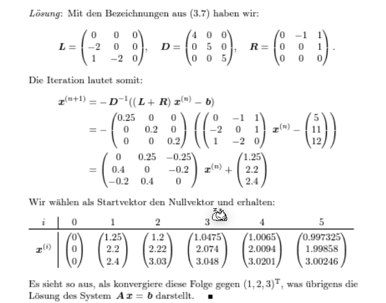

# Lineare Gleichungssysteme

## Gaus

## LR-Zerlegung

$$
\underbrace{A}_{LR}x=b\\
L\underbrace{R\cdot x}_y=b\\
Ly=b\\
Rx=y
$$

## QR-Zerlegung

### Orthoggonalmatrix

Dafür eine Matrix eine Orthogonalmatrix ist, muss folgendes gelten:
$$
Q^T\cdot Q=I \Leftrightarrow Q^T = Q^{-1}
$$

### Householder-Matrix

$$
\vec u=\pmatrix{1 \\ 2 \\ 3}\\
\vec u \text{ ist nicht normiert, daher:}\\
\tilde u = \frac {\vec u}{|\vec u|}=\frac 1 {\sqrt{14}}\pmatrix{1 \\ 2 \\ 3}\\
H = I_n - 2\tilde u \tilde u ^T\\ = 
\pmatrix{1 & 0 & 0\\ 0 & 1 & 0 \\ 0 & 0 & 1} - 2\cdot \frac 1 {\sqrt{14}} \pmatrix{1 \\ 2 \\ 3} \cdot \pmatrix{1 & 2 & 3}
$$

### Lösungsverfahren

## Fehlerrechnungen

$$
A\tilde x=\tilde b = b + \Delta b
$$

* $\Delta b$ = Residuum oder Defekt
* $\Delta x = \tilde x - x$ =Fehler

### Vektornorm

$$
||.|| : \R^n \to \R\\ 
\text{Dies ist definiert durch:}\\
||x|| \ge 0 \text{ und } ||x|| = 0 \Leftrightarrow x = 0\\
||\lambda x|| = |\lambda| \cdot ||x||\\
||x + y || \le ||x|| + ||y||
$$

 

Es gibt mehrere Normen für Vektoren, welche diese Definition erfüllt:

* Erste-Norm, Summennorm:
* Zweite-Norm - Euklidischenorm:
* $\infty$-Norm - Maximumnorm

Ebenfalls gibt es mehrere Normen für Matrixen:

* Erste-Norm, Spaltensummennorm:
* Zweite-Norm: Spektralnorm: $||A||_2=\sqrt {(p(A^TA))}$
* $\infty$-Norm: Zeilensummennorm: $||A||_\infty=\max_{i=1,..n}\sum^n_{j=1} |a_{ij}|$

## Iterative Verfahren

### Jacobi Verfahren

Die Gleichung $Ax=b$ soll in $(L + D + R)x=b$ umgewandlet werden.

Danach sagt das Verfahren vor:
$$
x^{(k+1)}=-D^{-1}(L + R)x^{(k)}+D^{-1}b\\
\text{oder in der Summenform:}\\
x_i^{(k+1)}=\frac 1{a_{ii}}\cdot\left(b_i - \sum^n_{j_1, j \neq i}a_{ij}x_j^{(k)}\right)\\
\text{Dabei ist } i \text{ die Zeile in der Matrix}
$$

> Notiz: Eine **Diagonalmatrix** (wie $D$) zu invertieren ist trivial:
> $$
> D=\pmatrix{2 & 0\\ 0  & 5} \to 
> D^{-1}=\pmatrix{\frac 1 2 & 0 \\ 0 & \frac 1 5}
> $$
> 

#### Beispiel - Jacobi-Verfahren

### Gaus-Seidel-Verfahren

$$
x^{(k+1)}=-(D+L)^{-1}Rx^{(k)}+(D+L)^{-1}b\\
\text{oder in der Summenform:}\\
x_i^{(k+1)}=\frac 1{a_{ii}}\cdot\left(b_i - \sum^{i-1}_{j=1}a_{ij}x_j^{(k+1)} - \sum^{n}_{j=i+1}a_{ij}x_j^{(k)}\right)\\
\text{Dabei ist } i \text{ die Zeile in der Matrix}
$$

## Konvergenz

Mit der folgenden Fixpunktiteration $x^{(k+1)}=Bx^{(n)}+c$ ist die Konvergenz definiert als:

* $\overline x$ ist anziehend, wenn $||B|| < 1$
* $\overline x$ ist abstossend, wenn $||B|| > 1$

Für Jacobi-Verfahren ist $B$ und $c$ folgendermassen definiert: $x^{(k+1)}=-\underbrace{D^{-1}(L + R)}_B\cdot x^{(k)}+\underbrace{D^{-1}}_c \cdot b$

Für das Gaus-Seidel-Verfahren ist $B$ und $c$ definiert als: $x^{(k+1)}=\underbrace{-(D+L)^{-1}R}_B\cdot x^{(k)}+\underbrace{(D+L)^{-1}}_c \cdot b$

## Abschätzung

