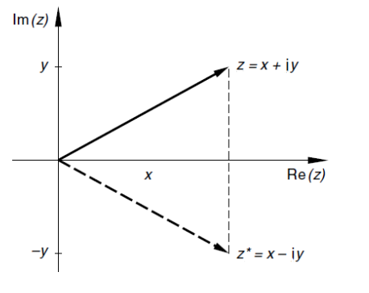

# Komplexe Zahlen

Eine Komplexe Zahl hat einen imaginären und einen realen Komponent. Diese werden entweder in der Form $z=x+iy$ oder der Form $P(x, y)$ geschrieben, wobei gilt $x, y \in \R$.

$i$ ist definiert als $i^2=-1$

Die Definition von $\C$ ist $\C=\{z | z = x+iy \wedge x,y \in \R \}$

Es gibt zudem noch die Funktionen $\Re(z)=x$ und $\Im(z)=y$ (für $z = x+iy$)

Da eine komplexe Zahl als Punkt dargestellt werden, kann auch der Betrag berechnet werden: $|z|=\sqrt{x^2+y^2}=\sqrt{z\cdot z^*}$

## Konjugierte Komplexe Zahlen

Die konjugierte komplexe Zahl von $z = x + yi$ ist $z^*=x-iy$ und ist entlang der x-Achse gespiegelt.

Der Term $z\cdot z^*=(x+yi)\cdot(x-yi)=x^2-i^2y^2=x^2-(-1)y^2=x^2+y^2$ zeigt, wie $\sqrt{z\cdot z^*}=|z|$ und $z\cdot z^*=|z|^2$ (Achtung: Der Betrag ist wichtig!)

## Darstellungs Formen

* Koordinaten-Form: $P(x, y)$
* Normal-Form: $z = x + yi$
* Trigometrische-Form (aka Polar-Form): $z=r\cdot (\cos \phi + i\cdot \sin \phi)$ ($r$ ist dabei die Länge)
* Exponential-Form: $re^{i\varphi}$ ($r$ ist dabei die Länge)

Als Beispiel: $z = 1 + 1i = \sqrt 2 (\cos{\frac \pi 4} + i \sin{\frac \pi 4}) = \sqrt 2 \cdot e^{i\cdot \frac \pi 4} $

Um zwischen der Exponetialform und der Koordinationsform zu konvertieren, gilt:
$$
\text{Für: } z=x+y\\
x = r\cdot \cos(\varphi)\\
y = r\cdot \sin(\varphi)
$$

## Grundrechungsarten

* Summieren: $z_1 + z_2 = (x_1 + x_2) + i(y_1 + y_2)$
* Subtrahieren: $z_1 - z_2 = (x_1 - x_2) + i(y_1 - y_2)$
* Multiplizieren: $z_1 \cdot z_2 = (x_1 \cdot x_2 - y_1\cdot y_3) + i(x_1\cdot y_2 +x_2 \cdot y_1)$
* Dividieren: $\frac {z_1}{z_2}=\frac {z_1\cdot z_2^*}{z_2 \cdot z_2^*}=\frac {(x_1 + iy_1)(x_2-iy_2)}{(x_2 + iy_2)(x_2 - iy_2)}=\frac {(x_1 + iy_1)(x_2-iy_2)}{x_2^2-y_2^2}$
* Potenzieren: $z^n=(re^{i\varphi})^n=r^n\cdot e^{i\varphi n}$
* Wurzel-Ziehen: $\sqrt[n]{z}=z^{\frac 1 n}=r^{\frac 1 n}\cdot e^{\frac {i\varphi + 2\pi \cdot k} n}$, wobei $k=0, 1, 2, ..., n-1$ (Bei $k\ge n$ wiederholen sich die Lösungen)

Ein Vorteil der Exponential-Form ist, dass Rechnungen um einiges einfacher von der Hand gehen: 
$$
z_1=r_1e^{i\varphi_1}\\
z_2=r_2e^{i\varphi_2}\\
z_1z_2=r_1e^{i\varphi_1}\cdot r_2e^{i\varphi_2} = r_1r_2\left(e^{i\varphi_1+i\varphi_2}\right)
$$

## Polynome Lösen

Für das Polynom $a_nx^n+a_{n-1}x^{n-1}+...+a_1x^1+a_0=0$ und $a_i, x \in \R$, dann gibt es genau $n$ Lösungen und kann maximal $n$ reale Lösungen geben.
$$
z^6=1
$$

## Eigenwerte

Für eine Matrix $A \in R^{n\times n}$ nennt sich $\lambda \in \C$ Eigenwert und den Vektor $x\in \C^n\setminus \{0\}$ Eigenvektor, wenn folgendes gilt:
$$
\begin{align}
A\vec x &= \lambda \vec x \\
\Rightarrow A\vec x - \lambda \vec x &= 0 \\
\Rightarrow (A-\lambda I_n)\vec x &= 0
\end{align}
$$
Wenn $A$ bekannt ist und $\lambda$ und $\vec x$ ausgerechnet werden soll, kann mithilfe dem charakteristischem Polynom berechnet werden.

Die Eigenwerte von $A^{-1}$ sind die Kehrwerte $\frac 1 {\lambda_i}$ .

### Spektrum

Das Spektrum $\sigma(A)$ ist die Menge aller Eigenwerte von der Matrix $A$.

### Spur und Determinante

Die Spur und Determinante von $A$ (nicht $A-\lambda I_n$) kann mit den Eigenwerten ausgerechnet werden.
$$
\DeclareMathOperator{\tr}{tr}
\begin{align}
\det(A)&=\lambda_1\cdot \lambda_2 \cdot \cdot \cdot \lambda_n\\
\tr(A)&=a_11 + a_22 + ... + a_nn = \lambda_1 + \lambda_2 + ... + \lambda_n
\end{align}
$$

### Charakteristisches Polynom

$$
p: \lambda \mapsto \det(A-\lambda I_n)
$$

Das charakteristische Polynom ist definiert das Polynom zum berechnen der Determinante von $A-\lambda I_n$.  Um $\lambda$ auszurechnen, kann das charakteristische Polynom mit $0$ gleichgesetzt werden. Das Polynom ist vom Grad $n$ und hat somit auch $n$ Lösungen.

Wenn $A-\lambda I_n$ eine Diagonalmatrix, obere Dreiecksmatrix oder untere Dreiecksmatrix ist, dann gilt:
$$
\det(A-\lambda I_n)=(a_{11}-\lambda)(a_{22}-\lambda)...(a_{nn}-\lambda)
$$

#### Determinante

Für $A\in \R^{2\times 2}$ gilt:
$$
\det(A)= a_{11}\cdot a_{22}- a_{12}\cdot a_{21}
$$
Für $A \in R^{3\times 3}$ gilt:
$$
\det(A)=b_{11} (b_{22}b_{33} - b_{23}b_{32})-b_{12}(b_{21}b_{33}-b_{23}b_{31}) + b_{13}(b_{21}b_{32} - b_{22}b_{31})
$$

### Konditionierung

Da, wenn die Eigenwerte mit dem charakteristischen Polynom ausgerechnet werden, ein schlecht konditioniertes Problem entsteht, sollten in der Praxis nie Eigenwerte für $A$ mit $n>3$ mit dem charakteristischen Polynom und dessen Nullstellen berechnet werden.

## Eigenvektoren & Eigenraum

Die Eigenvektoren können ausgerechnet werden, in dem die Eigenwerte $\lambda$ in die Matrix $A-\lambda I_n$ eingesetzt werden. Es gibt für eine Matrix $A\in R^{n\times n}$ ein Gleichungssystem mit $n-\rg(A-\lambda I_n) \DeclareMathOperator{\rg}{rg}$ freien Parametern.

## Vielfachheit

Die **geometrische** Vielfachheit ist definiert als die Dimension des Eigenraums von $\lambda$. Sie gibt die Anzahl der linearen unabhängigen Eigenvektoren zum Eigenwert an und kann mit $n - \rg(A-\lambda I_n)$ berechnet werden

Die **algebraische** Vielfachheit ist die Multiplizität eines Eigenwertes, bzw. wie oft ein Eigenwert auf taucht. 

Die geometrische Vielfachheit ist immer gleich oder kleiner als die algebraische Vielfachheit. Dies heisst, dass wenn ein Eigenwert $\lambda$ $k$-fach auftritt und somit eine algebraische Vielfachkeit $k$ hat, dann gehören mindestens ein und höchstens $k$ linear unabhängige Eigenvektoren zu $\lambda$.

Wenn alle $n$ Eigenwerte verschieden sind, so gehört zu jedem Eigenwert $\lambda$ genau ein linear unabhängiger Eigenvektor, welcher bis einen Faktor eindeutig bestimmbar ist.

## Numerische Berechnung von Eigenwerte und Eigenvektoren

Es gilt, wenn zwei Matrizen $A, B \in \R^2$ zueinander ähnlich sind, dann gilt das $A$ und $B$ die selben Eigenwerte inkl. deren algebraischen Vielfachen.

### Ähnliche Matrix

### Diagonalisierbare Matrix

## Spektralradius (und Spektralnorm)

## Mises-Iteration
