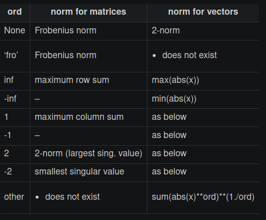

# SymPy

## Matrizen

### Normalisieren

```py
A.norm(ord=None)
```



### Gaus-Jordan

```py
A.gauss_jordan_solve(B, freevar=False)
```

### QR-Solve

```py
Q, R = A.QRdecomposition() 	# to only do the QR decompostion
A.QRsolve(b)				# to solve A|b with the QR decomposition
```

## Vereinfachen 

* Mit `simplify(<expr>)` kann eine SymPy Ausdruckt vereinfacht werden.
* `expand(<polynom>)` kann ein Polynom expandieren: `expand((x+1)**2)` ergibt `x + 2*x + 1`
* `factor(<expandiertes polynom>)` ist die Umkehrfunktion von `expand(<polynom>)`: `factor(x + 2*x + 1)` ergibt `(x+1)**2`
* `cancel(<bruch>)` nimmt ein Bruch und vereinfacht diesen

## Integrieren und Ableiten

`diff(<expr>, <var>)` leitet den angegebenen Ausdruck ab.

```py
diff(x**4 + 2*x**3 + 9, x) 	# returns 4x**3 + 6*x**2
(x**4 + 2*x**3 + 9).diff(x)	# does the same thing
```

Mit `integrate(<expr>, <var>)` kann einen Ausdruckt integriert werden.

```py
integrate(x**4+2*x**3 + 9, x)	# returns x**5/5+x**4/2 + 9*x
(x**4+2*x**3 + 9).integrate(x) 	# does the same thing
```

Wenn über ein bestimmten Bereich integriert werden soll, kann `integrate(expr, (<var>, <start>, <end>))` verwendet werden.

```py
integrate(x**4+2*x**3 + 9, (x, 0, 1))		# returns 9.7
(x**4 + 2*x**3 + 9).integrate((x, 0, 1))	# does the same thing
```

## Solvers

Mit `solveset(<expr>, <var>)` kann einen Ausdruck nach einer Variabel aufgelöst werden.

```py
solveset(x**2 - x, x) # returns {0, 1}
```

