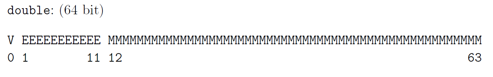
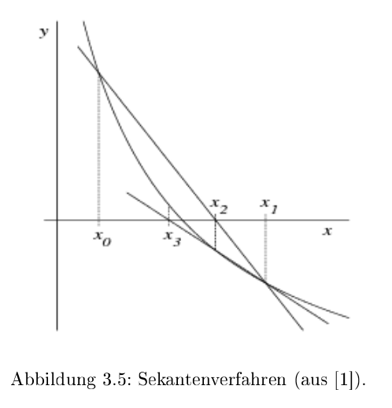
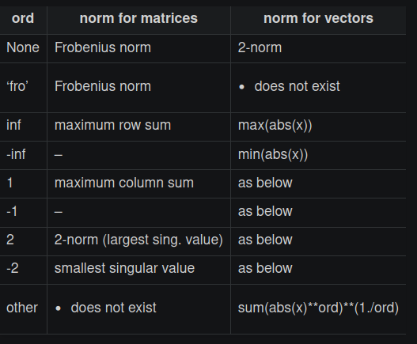

[TOC]

# Gleitkommazahlen

## Mantis

$$
x=m\cdot B^e\\
12000 = 1.2 \cdot 10^4
$$

Dabei gilt $x\in \R$, die Mantis  $m \in R$, die Basis $B \in \N$  und den Exponent $e\in \Z$ 

Eine Zahl kann folgendermassen Dargestellt werden:
$$
m=\pm0.m_1m_2m_3m_n\\
e=\pm e_1e_2e_3e_l
$$
Dabei ist der Bereich der darstellbaren Zahlen folgendermassen: 
$$
M=\{x \in \R \vert x=\pm0.m_1m_2m_3...m_n\cdot B^{\pm e_1e_e...e_m}\}
$$

Eine Zahl wird **machinendarstellbar** genannt, wenn $m_1\neq 0$ ist

Die Anzahl Zahlen kann mit $2\cdot B^{n-1}\cdot (2\cdot B^e-1)+1$, wenn der Exponent und Mantis ein Vorzeichen hat. Falls die Mantis kein Vorzeichen hat, gibt es: $B^{n-1}\cdot (2\cdot B^e-1)+1$. Wenn der Exponent auch kein Vorzeichen hat, dann wird daraus $B^{n-1}\cdot B^e+1$.

## Minimum und Maximum

$$
x_{max}=B^{e_{max}}-B^{e_{max}-n}=(1-B^{-n})\cdot B^{e_{max}}\\
x_{min}=B^{e_{min}-1}
$$


Hier ist ein Beispiel:
$$
B=2, n=4, 0 \le e \le 3\\
x_{max}=0.1111_2\cdot 2^3=111.1_2=7.5_{10}\\
x_{max}=2^3-2^{3-4}=8-0.5=7.5_{10}\\
\\
x_{min}=0.1000_2 \cdot 2^0 = 0.1_2=0.5_{10}\\
X_{min}=2^{0-1}=2^{-1}=0.5_{10}
$$

## Rundungsfehler

Der **absolute Fehler** bei einer Rundung von $x$ zu der Näherung $\tilde x$ ist definiert als $\vert \tilde x - x \vert$. Der **relative Fehler** ist $\left\vert \frac{\tilde x - x}{x} \right\vert$.

Wenn $\tilde x=rd(x)$ gilt, wobei $rd(x)$ die Zahl $x$ rundet, dann ist der höchste absolute Fehler: $\vert rd(x)-x\vert \le 0.\underbrace{00...00}_{n}\frac B 2\cdot B^e=\frac B 2\cdot B^{e-n-1}$

Als Beispiel mit der Basis $B=10$, eine siebenstellige Mantisse $n=7$ und $x=180.1234567=0.1801234567\cdot 10^3$: $\vert rd(x)-\tilde x\vert \le 0.\underbrace{0000000}_{n=7}5\cdot 10^3=0.5\cdot 10^{3-7}=0.5\cdot10^{-4}$

## Konditionierung: Fortpflanzung von Fehler

Der absolute Fehler von einer Operation $f(x)$  kann als $|f'(x)|\cdot |\tilde x - x|$ angenähert werden. Beim relativen Fehler gilt $\frac{|f'(x)|\cdot|x|}{|f(x)|}\cdot \frac{|\tilde x - x|}{|x|}$ 

Den Faktor $K:= \frac{|f'(x)|\cdot|x|}{|f(x)|}$ nennt sich Konditionszahl und sagt aus, um wie viel sich der **relativen Fehler** von $x$ bei einer Funktionsauswertung von $f(x)$ verändert. Dabei wird zwischen **gut konditionierten Problemen**, bei welchen die Konditionszahl klein ist, und **schlecht konditionierten Problemen,** bei welchen die Konditionszahl gross ist, unterschieden.
$$
K:= \frac{|f'(x)|\cdot|x|}{|f(x)|}
$$

### Fehlerfortpflanzung bei Summation

Für $f(x)=x+c$, gilt $f'(x)=1$ und folgendes für $K$:
$$
K=\frac{|x|}{|x+c|}
$$
An dieser Formel kann das Problem der Auslöschung beobachtet werden: Wenn von $x$ eine ähliche Zahl $c$ subrahiert wird, dann wird $K$ sehr gross. 

Oder allgemeiner formuliert, wird von einer Zahl eine zweite ähnliche grosse Zahl subtrahiert, wird der relative Fehler sehr hoch. Dies kann zum Teil durch geschicktes Umformen vermieden werden. Meist entstehen aber andere Auslöschungs-Zentren.

### Fehlerfortpflanzungs-Tabelle


## Maschinengenauigkeit (max. relativer Fehler)

Die Maschinengenauigkeit ist der maximale **relative** Fehler, der beim Runden entstehen kann.
$$
eps = \frac B 2\cdot B^{-n}=\frac 1 2 \cdot B^{1-n}
$$

$eps$ kann auch definiert werden, als die kleinste Zahl bei der $1+eps>1$ noch gilt

## IEC / IEEE Gleitkommazahlen

IEEE definiert eine `single` Gleitkommazahl, welche 32bit lang ist und das folgende Schema besitzt:

Ebenfalls gibt es eine `double` Gleitkommazahl, welche aus 64bit besteht und folgendes Schema besitzt: 
# Nullstellen

## Fixpunktiteration

Für das benützten der Fixpunktiteration muss die Gleichung in der Fixpunktform $F(x)=x$ sein.
$$
x_{n+1}=F(x_n)
$$

Damit die Fixpunktiteration zum Resultat konvergiert, muss für die Ableitung $F'(x)<1$  gelten. Dies wird auch im Banachscher Fixpunktsatz wiedergespiegelt.

### Banachscher Fixpunktsatz

Es gilt folgendes für $F: [a, b] \to [a, b]$ und die Konstante $\alpha \in ]0, 1[$
$$
|F(x) - F(y)|\le \alpha\cdot |x - y| \text{ wobei gilt: } x, y\in [a, b]\\
\text{oder}\\
\frac{|F(x)-F(y)|}{|x - y|} \le \alpha
$$
In Deutsch heisst dies, dass die Differenz $F(x) - F(y)$ nie grösser als $x-y$ sein darf, oder dass die Steigung nicht grösser als $1$ darf sein und muss grösser als 0 sein.

Mathematischer: $F$ muss Lipschitz-stetig (selbst-abbildend) und kontraktiv sein. Zum argumentieren, dass es selbst abbildend ist, $F(x)$ muss monoton steigend sein (darf nie sinken) und $F(a)$ und $F(b)$ müssen zwischen $a$ und $b$ sein.

Zum argumentieren, dass es kontraktiv ist, muss $F(x)$ 

Wenn dies gegeben ist, 

* hat $F$ genau einen Fixpunkt $\overline x$ in $[a, b]$
* konvergiert die Fixpunktiteration $x_{n+1}=F(x_n)$ gegen $\overline x$ für alle Startwerte $x_0\in [a, b]$
* Die a-priori und a-posteriori Abschätzungen gelten

$\alpha$ kann auch als die grösstmögliche Steigung definiert werden:
$$
\alpha \in ]0, 1[\\
\alpha =\max_{x_0\in[a, b]} |F'(x_0)|
$$

## Newton-Verfahren


$$
x_{n+1}=x_n-\frac{f(x_n)}{f'(x_n)}
$$
Um sicherzustellen, dass das Newton-Verfahren für einen Startwert $x_0$ zum Resultat konvergiert, sollte die folgende Bedingung zutreffen:
$$
\left|\frac{f(x) \cdot f''(x)}{[f'(x)]^2}\right|< 1	
$$
Diese Bedingung wird typischerweise für den Startwert $x_0$ überprüft.

### Vereinfachtes Newton-Verfahren

Beim vereinfachten Newton-Verfahren wird die Steigung von $x_0$ für alle Iterationen verwendet:
$$
x_{n+1}=x_n-\frac{f(x_n)}{f'(x_0)}
$$

## Sekanten-Verfahren


$$
x_{n+1}=x_n-\frac{x_n-x_{n-1}}{f(x_n)-f(x_{n-1})}\cdot f(x_n)
$$


Beim Sekanten-Verfahren wird die Ableitung von $f$ nicht benötigt, da die Steigung mit $\frac{f(x_1) - f(x_0)}{x_1 - x_0}$ berechnet wird.

## Konvergenzordnung

$$
|x_{n+1}-\overline x|\le c \cdot |x_n-\overline x|^q
$$


Das $c \in ]0, \infty[$ ist eine Konstante (wie bei Big-O).  $|x_{n+1}-\overline x|$ ist der absoluten Fehler von $x_{n+1}$. Wenn $q=1$ ist, dann konvergiert es linear (meist wird dabei auch noch $c < 1$ verlangt). Bei $q=2$, quadratisch, und so weiter.

## Fehlerabschätzung

$x_n$ ist eine mit iterieren erreichte Nullstelle, $\varepsilon$ ist ein maximalen Fehler, welcher Verlangt ist und $\overline x$ ist die exakte Nullstelle.
$$
f(x_n+\varepsilon)\cdot f(x_n-\varepsilon)<0 \Rightarrow \vert x_n - \overline x\vert < \varepsilon
$$
Oder auf Deutsch: Wenn es einen Vorzeichenwechsel zwischen $[x_n-\varepsilon; x_n + \varepsilon]$ gibt, dann gibt es eine Nullstelle $\overline x$ in diesem Intervall. Aus dem ergibt sich, dass die Differenz zwischen der Nullstelle $\overline x$ und $x_n$ muss kleiner als $\varepsilon$ sein


### a-priori und a-posteriori Abschätzung

Mit der a-priori Abschätzung kann der maximale absolute Fehler nach $n$ Iterationen von den ersten zwei Iterationen $x_0$ und $x_1$ geschätzt werden:
$$
|x_n-\overline x|\le \frac{\alpha^n}{1-\alpha}\cdot |x_1 - x_0|\\
n=\log_\alpha\left ( \frac{|x_n - \overline x|\cdot (1-\alpha)}{|x_1 - x_0|}\right )
$$
Mit der a-posteriori Abschätzung kann der maximale absoluten Fehler nach $n$  Iterationen von der $n$-ten und $n-1$-te Iteration abschätzen:
$$
|x_n-\overline x|\le \frac \alpha {1- \alpha}\cdot|x_n - x_{n-1}|
$$

# Lineare Gleichungssysteme

## Definitionen

* **Untere Dreiecksmatrix**
  Eine $n\times n$-Matrix $L=(l_{ij})$ für welche gilt $l_{ij}=0$ für $j > i$. Sie ist **normiert**, wenn $l_{ii}=1$ gilt
  

* **Obere Dreiecksmatrix**

  Eine $n\times n$-Matrix $L=(l_{ij})$ für welche gilt $l_{ij}=0$ für $i > j$. Sie ist **normiert**, wenn $l_{ii}=1$ gilt
  

## Gaus-Algorithmus

Siehe `22FS/LA/01_Lineare Gleichungssysteme.md`

### Fehlerfortpflanzung und Pivotisierung

Beim "normalen" Gaus wird bei jeder Zeile mit $\lambda=\frac{a_{ji}}{a_{ii}}$ multipliziert, was zu grossen Rundungsfehlern führen kann. Um dies zu vermeiden, wird für jeden Schritt $i$ zwei Zeile getauscht, dass die grösste Zahl in der $i$-ten Spalte bei $a_{ii}$ ist.

Im folgende Beispiel wird $A$ pivotisiert:
$$
A=\begin{pmatrix}
1 & 2 & -1\\
4 & -2 & 6 \\
3 & 1 & 0 \\
\end{pmatrix}
\xrightarrow{z_1 \leftrightarrow z_2}
\begin{pmatrix}
4 & -2 & 6 \\
1 & 2 & -1\\
3 & 1 & 0 \\
\end{pmatrix}
\rightarrow
\begin{pmatrix}
4 & -2 & 6 \\
0 & 2.5 & -2.5 \\
0 & 2.5 & -4.5 \\
\end{pmatrix}
\rightarrow
\begin{pmatrix}
4 & -2 & 6 \\
0 & 2.5 & -2.5 \\
0 & 0 & -2 \\
\end{pmatrix}
$$

## LR-Zerlegung

Für die LR-Zerlegung wird die Gleichung $Ax=b$ umgestellt:
$$
\underbrace{A}_{LR}x=b\\
L\underbrace{R\cdot x}_y=b\\
Ly=b\\
Rx=y
$$

Die $L$ und $R$ Matrizen sind die untere-, bzw. obere Dreiecksmatrize von $A$:
$$
L=\begin{pmatrix}
1 & 0 & 0 & 0\\
l_{21} & 1& 0 & 0 \\
l_{31} & l_{32} & 1 & 0\\
l_{41} & l_{42} & l_{4_3} & 1\\
\end{pmatrix}
R=\begin{pmatrix}
r_{11} & r_{12} & r_{13} & r_{14}\\
0  & r_{22} & r_{23} & r_{24} \\
0 & 0 & r_{33} & r_{34}\\
0 & 0 & 0& r_{44}\\
\end{pmatrix}
$$
Dabei wird $R$, wie gewohnt, mit dem Gauss-Algorithmus gebildet. Dabei sind die $\lambda_{ji}$ aus $z_j:=z_j - \lambda_{ji}\cdot z_i$ gerade $l_{ji}=\lambda_{ji}$.

Beispiel:
$$
\begin{align}
A=\begin{pmatrix}
-1 &  1 &  1 \\
 1 & -3 & -2 \\
 5 &  1 &  4 \\
\end{pmatrix}\\
\xrightarrow{z_2 := z_2 - \frac 1 {-1}\cdot z_1 \Rightarrow \lambda_21=\frac{1}{-1}}
\begin{pmatrix}
-1 &  1 &  1 \\
 0 & -2 & -1 \\
 5 &  1 &  4 \\
\end{pmatrix} \\
\xrightarrow{z_3 := z_3 - \frac 5 {-1}\cdot z_1\Rightarrow \lambda_31=\frac{5}{-1}}
\begin{pmatrix}
-1 &  1 &  1 \\
 0 & -2 & -1 \\
 0 &  6 &  9 \\
\end{pmatrix} \\
\xrightarrow{z_3 := z_3 - \frac 6 {-2}\cdot z_2\Rightarrow \lambda_32=\frac{6}{-2}}
\begin{pmatrix}
-1 &  1 &  1 \\
 0 & -2 & -1 \\
 0 &  0 &  6 \\
\end{pmatrix}\\
L=\begin{pmatrix}
 1 &  0 &  0 \\
 \frac{1}{-1} & 1 & 0 \\
 \frac 5 {-1} &  \frac{6}{-2} &  1 \\
\end{pmatrix}
\end{align}
$$


U m nun nach $x$ aufzulösen wird folgendes gerechnet:

1. Das Gleichungssystem $Ly=b$ wird durch Vorwärtseinsetzen nach $y$ aufgelöst.
2. Im Gleichungssystem $Rx=y$ wird nun $y$ eingesetzt und mit Vorwärtseinsetzten nach $x$ gelöst.

### Zeilenvertauschung

Wenn Zeilen vertauscht werden, muss die Permutationsmatrix $P$ berechnet werden. Für jede Vertauschung wird die Matrix $P_i$ erstellt. Alle $P_i$ Matrix werden dann zu der Permutationsmatrix zusammen gerechnet: $P=P_n\cdot P_{n-1} \cdot ... \cdot P_1$

Das Gleichungssystem wird nun zu: 
$$
\begin{align}
PAx&=Pb\\
LRx&=Pb\\
Ly&=Pb\\
Rx&=y
\end{align}
$$
**Achtung:** Bei Zeilenvertauschung werden auch die Zeilen in $L$ vertauscht.

## QR-Zerlegung

$$
\begin{align}
\underbrace{A}_{QR}x&=b\\
QRx&=b\\
R&= Q_n\cdot Q{n-1}\cdot ... \cdot Q_1\cdot A\\
Rx&=Q^Tb\\
\end{align}
$$

Der Gedanke ist, dass eine Orthogonalmatrix $Q$ gefunden wird, für welche gilt $QR=A$. Dabei ist $R$ eine obere Dreiecksmatrix. Danach kann $Rx=Q^Tb$ einfach gelöst werden.

Um $Q$ zu berechne wird die die Householder-Matrix $H$ für jede Spalte schrittweise berechnet, so dass gilt:
$$
H_1\cdot A =H_1\cdot 
\begin{pmatrix}
* & * & * & *\\
* & * & * & *\\
* & * & * & *\\
* & * & * & *\\
\end{pmatrix}
=
\begin{pmatrix}
* & * & * & *\\
0 & * & * & *\\
0 & * & * & *\\
0 & * & * & *\\
\end{pmatrix}
$$
Dies wird erreicht, in dem folgendes gerechnet wird:
$$
\DeclareMathOperator{\sign}{sign}

\sign(x)=
\left \{
\begin{array}{ll}
+1 & \text{für } x \ge 0\\
-1 & \text{für } x < 0
\end{array} 
\right . \\ 
\\
\begin{align}
a_1=&\begin{pmatrix}a_{11}\\a_{21}\\a_{31}\\a_{41}\end{pmatrix}\\
e_1=&\begin{pmatrix}1 \\ 0 \\ 0 \\ 0 \end{pmatrix}\\
v_1 :=& a_1 + \sign(a_{11})\cdot |a_1|\cdot e_1\\
u_1 :=& \frac 1 {|v_1|}\cdot v_1\\
H_1 :=& I_4 - 2\cdot u_1 \cdot u_1^T\\
Q_1 =& H_1
\end{align}
$$
Nun ist $Q_1$ berechnet. Dasselbe wird nun für $Q_2$ wiederholt, aber mit $A_2$:
$$
\begin{align}
H_1\cdot A =&
\left ( \begin{array}{c|ccc}
* & * & * & *\\
\hline
0 \\
0 & & A_2\\ 
0 \\
\end{array}
\right ) \\
a_2=&\begin{pmatrix}a_{22}\\a_{32}\\a_{42}\end{pmatrix}\\
e_2=&\begin{pmatrix}1 \\ 0 \\ 0 \end{pmatrix}\\
v_2 :=& a_2 + \sign(a_{22})\cdot |a_2|\cdot e_2\\
u_2 :=& \frac 1 {|v_2|}\cdot v_2\\
H_2 :=& I_3 - 2\cdot u_2 \cdot u_2^T\\
Q_2 =& \left ( \begin{array}{c|ccc}
1 & 0 & 0 & 0\\
\hline
0 \\
0 & & H_2\\ 
0 \\
\end{array}
\right )
\end{align}
$$
Dies nun für $Q_3$ wiederholt. 

Danach ergibt sich:
$$
\underbrace{Q_4\cdot Q_3 \cdot Q_2 \cdot Q_1}_{Q^{-1}}\cdot A=\begin{pmatrix}
* & * & * & * \\
0 & * & * & * \\
0 & 0 & * & * \\
0 & 0 & 0 & * \\
\end{pmatrix}\\
Q = (Q_3 \cdot Q_2 \cdot Q_1)^{-1}=Q_1^{-1}\cdot Q_2^{-1} \cdot Q_3^{-1}=Q_1^T\cdot Q_2^T \cdot Q_3^T
$$

### Orthoggonalmatrix

Dafür eine Matrix eine Orthogonalmatrix ist, muss folgendes gelten:
$$
Q^T\cdot Q=I \Leftrightarrow Q^T = Q^{-1}
$$

### Householder-Matrix Beispiel

$$
\vec u=\pmatrix{1 \\ 2 \\ 3}\\
\vec u \text{ ist nicht normiert, daher:}\\
\tilde u = \frac {\vec u}{|\vec u|}=\frac 1 {\sqrt{14}}\pmatrix{1 \\ 2 \\ 3}\\
H = I_n - 2\tilde u \tilde u ^T\\ = 
\pmatrix{1 & 0 & 0\\ 0 & 1 & 0 \\ 0 & 0 & 1} - 2\cdot \frac 1 {\sqrt{14}} \pmatrix{1 \\ 2 \\ 3} \cdot \pmatrix{1 & 2 & 3}
$$

## Vektornorm

$$
||.|| : \R^n \to \R\\ 
\text{Dies ist definiert durch:}\\
||x|| \ge 0 \text{ und } ||x|| = 0 \Leftrightarrow x = 0\\
||\lambda x|| = |\lambda| \cdot ||x||\\
||x + y || \le ||x|| + ||y||
$$

 

Es gibt mehrere Normen für Vektoren, welche diese Definition erfüllt:

* Erste-Norm, Summennorm: $||\vec x||_1=\sum^n_{i=1}|x_i|$
* Zweite-Norm - Euklidischenorm: $||\vec x||_2=\sqrt{\sum^n_{i=1}x^2}$
* $\infty$-Norm - Maximumnorm: $||\vec x||_\infty=\max_{i=1,...,n}|x_i|$

Ebenfalls gibt es mehrere Normen für Matrixen:

* Erste-Norm, Spaltensummennorm: $||A||_1=\max_{j=1, ..., n}\sum^n_{i=1}|a_{ij}|$
* Zweite-Norm: Spektralnorm: $||A||_2=\sqrt {(\rho(A^TA))}$
* $\infty$-Norm: Zeilensummennorm: $||A||_\infty=\max_{i=1,..n}\sum^n_{j=1} |a_{ij}|$

## Fehlerrechnungen

Ein gestörtes Gleichunssystem kann folgendermassen definiert werden als $A\tilde x=\tilde b = b + \Delta b$ . Dabei ist  $\Delta b$ das Residuum oder Defekt und  $\Delta x = \tilde x - x$ den Fehler.

Für den absoluten und relativen Fehler gilt nun folgendes:
$$
\begin{align}
||x - \tilde x|| &\le || A^{-1} || \cdot || b - \tilde b || \\
\frac {||x - \tilde x||}{||x||} &\le ||A|| \cdot  || A^{-1} || \cdot \frac{|| b - \tilde b ||}{||b||} \\
\\
\DeclareMathOperator{\cond}{cond}
\cond(A)&=||A|| \cdot || A^{-1} ||
\end{align}
$$
Wenn $\cond(A)$ gross ist, können kleine Fehler in $\vec b$ zu grossen Rundungsfehler im Ergebnis $\vec x$ führen. Die Matrix $A$ ist dann schlecht Konditioniert.

Wenn nicht nur $\vec b$ sonder auch $A$ einen Fehler enthaltet, dann gelten die folgenden Formeln:
$$
\begin{align}
&\text{Wenn } \cond(A) \cdot \frac{||A - \tilde >||}{||A||} < 1 \text{ dann gilt:}\\
&\frac {||x - \tilde x||}{||x||} \le \frac{\cond(A)}{1- \cond(A) \cdot \frac{||A - \tilde A||}{||A||}} \cdot  \left( \frac{|| A - \tilde A ||}{||A||} + \frac{|| b - \tilde b ||}{||b||}\right) 
\end{align}
$$

## Iterative Verfahren

### Jacobi Verfahren

Die Gleichung $Ax=b$ soll in $(L + D + R)x=b$ umgewandlet werden.


Danach sagt das Verfahren vor:
$$
x^{(k+1)}=-D^{-1}(L + R)x^{(k)}+D^{-1}b\\
\text{oder in der Summenform:}\\
x_i^{(k+1)}=\frac 1{a_{ii}}\cdot\left(b_i - \sum^n_{j_1, j \neq i}a_{ij}x_j^{(k)}\right)\\
\text{Dabei ist } i \text{ die Zeile in der Matrix}
$$

> Notiz: Eine **Diagonalmatrix** (wie $D$) zu invertieren ist trivial:
> $$
> D=\pmatrix{2 & 0\\ 0  & 5} \to 
> D^{-1}=\pmatrix{\frac 1 2 & 0 \\ 0 & \frac 1 5}
> $$
> 

#### Beispiel - Jacobi-Verfahren


### Gaus-Seidel-Verfahren

$$
x^{(k+1)}=-(D+L)^{-1}Rx^{(k)}+(D+L)^{-1}b\\
\text{oder in der Summenform:}\\
x_i^{(k+1)}=\frac 1{a_{ii}}\cdot\left(b_i - \sum^{i-1}_{j=1}a_{ij}x_j^{(k+1)} - \sum^{n}_{j=i+1}a_{ij}x_j^{(k)}\right)\\
\text{Dabei ist } i \text{ die Zeile in der Matrix}
$$

## Konvergenz

Mit der folgenden Fixpunktiteration $x^{(k+1)}=Bx^{(n)}+c$ ist die Konvergenz definiert als:

* $\overline x$ ist anziehend, wenn $||B|| < 1$
* $\overline x$ ist abstossend, wenn $||B|| > 1$

Für Jacobi-Verfahren ist $B$ und $c$ folgendermassen definiert: $x^{(k+1)}=-\underbrace{D^{-1}(L + R)}_B\cdot x^{(k)}+\underbrace{D^{-1}}_c \cdot b$

Für das Gaus-Seidel-Verfahren ist $B$ und $c$ definiert als: $x^{(k+1)}=\underbrace{-(D+L)^{-1}R}_B\cdot x^{(k)}+\underbrace{(D+L)^{-1}}_c \cdot b$

$\overline x$ ist ebenfalls anziehend, wenn $\rho(B)<1$ ist ($\rho(B)$ ist der Spektralradius von $B$).
### Abschätzung

$$
\begin{align}
\text{a-priori Abschätzung: }& ||x{(n)}-\tilde x|| \le \frac{||B||^n}{1-||B||}\cdot || x^{(1)}-x^{0}||\\
\text{a-posteriori Abschätzung: }& ||x{(n)}-\tilde x|| \le \frac{||B||}{1-||B||}\cdot || x^{(n)}-x^{n-1}||
\end{align}
$$

$$
n=\log_\alpha\left ( \frac{|x_n - \overline x|\cdot (1-\alpha)}{|x_1 - x_0|}\right )
$$


### Diagonaldominanz

Eine Matrix wird als Diagonaldominanz bezeichnet, wenn entweder

* für alli $i=1,...,n$: $|a_{ii}|> \sum^n_{j=1, j\neq i}|a_{ij}|$
* für alli $j=1,...,n$: $|a_{jj}|> \sum^n_{i=1, i\neq j}|a_{ij}|$


# Komplexe Zahlen

Eine Komplexe Zahl hat einen imaginären und einen realen Komponent. Diese werden entweder in der Form $z=x+iy$ oder der Form $P(x, y)$ geschrieben, wobei gilt $x, y \in \R$.

$i$ ist definiert als $i^2=-1$

Die Definition von $\C$ ist $\C=\{z | z = x+iy \wedge x,y \in \R \}$

Es gibt zudem noch die Funktionen $\Re(z)=x$ und $\Im(z)=y$ (für $z = x+iy$)

Da eine komplexe Zahl als Punkt dargestellt werden, kann auch der Betrag berechnet werden: $|z|=\sqrt{x^2+y^2}=\sqrt{z\cdot z^*}$

## Konjugierte Komplexe Zahlen

Die konjugierte komplexe Zahl von $z = x + yi$ ist $z^*=x-iy$ und ist entlang der x-Achse gespiegelt.


Der Term $z\cdot z^*=(x+yi)\cdot(x-yi)=x^2-i^2y^2=x^2-(-1)y^2=x^2+y^2$ zeigt, wie $\sqrt{z\cdot z^*}=|z|$ und $z\cdot z^*=|z|^2$ (Achtung: Der Betrag ist wichtig!)

## Darstellungs Formen


* Koordinaten-Form: $P(x, y)$
* Normal-Form: $z = x + yi$
* Trigometrische-Form (aka Polar-Form): $z=r\cdot (\cos \phi + i\cdot \sin \phi)$ ($r$ ist dabei die Länge)
* Exponential-Form: $re^{i\varphi}$ ($r$ ist dabei die Länge)

Als Beispiel: $z = 1 + 1i = \sqrt 2 (\cos{\frac \pi 4} + i \sin{\frac \pi 4}) = \sqrt 2 \cdot e^{i\cdot \frac \pi 4} $

Um zwischen der Exponetialform und der Koordinationsform zu konvertieren, gilt:
$$
\text{Für: } z=x+y\\
x = r\cdot \cos(\varphi)\\
y = r\cdot \sin(\varphi)
$$


## Grundrechungsarten

* Summieren: $z_1 + z_2 = (x_1 + x_2) + i(y_1 + y_2)$
* Subtrahieren: $z_1 - z_2 = (x_1 - x_2) + i(y_1 - y_2)$
* Multiplizieren: $z_1 \cdot z_2 = (x_1 \cdot x_2 - y_1\cdot y_3) + i(x_1\cdot y_2 +x_2 \cdot y_1)$
* Dividieren: $\frac {z_1}{z_2}=\frac {z_1\cdot z_2^*}{z_2 \cdot z_2^*}=\frac {(x_1 + iy_1)(x_2-iy_2)}{(x_2 + iy_2)(x_2 - iy_2)}=\frac {(x_1 + iy_1)(x_2-iy_2)}{x_2^2-y_2^2}$
* Potenzieren: $z^n=(re^{i\varphi})^n=r^n\cdot e^{i\varphi n}$
* Wurzel-Ziehen: $\sqrt[n]{z}=z^{\frac 1 n}=r^{\frac 1 n}\cdot e^{\frac {i\varphi + 2\pi \cdot k} n}$, wobei $k=0, 1, 2, ..., n-1$ (Bei $k\ge n$ wiederholen sich die Lösungen)

Ein Vorteil der Exponential-Form ist, dass Rechnungen um einiges einfacher von der Hand gehen: 
$$
z_1=r_1e^{i\varphi_1}\\
z_2=r_2e^{i\varphi_2}\\
z_1z_2=r_1e^{i\varphi_1}\cdot r_2e^{i\varphi_2} = r_1r_2\left(e^{i\varphi_1+i\varphi_2}\right)
$$

## Polynome Lösen

Für das Polynom $a_nx^n+a_{n-1}x^{n-1}+...+a_1x^1+a_0=0$ und $a_i, x \in \R$, dann gibt es genau $n$ Lösungen und kann maximal $n$ reale Lösungen geben.
$$
z^6=1
$$


## Eigenwerte

Für eine Matrix $A \in R^{n\times n}$ nennt sich $\lambda \in \C$ Eigenwert und den Vektor $x\in \C^n\setminus \{0\}$ Eigenvektor, wenn folgendes gilt:
$$
\begin{align}
A\vec x &= \lambda \vec x \\
\Rightarrow A\vec x - \lambda \vec x &= 0 \\
\Rightarrow (A-\lambda I_n)\vec x &= 0
\end{align}
$$
Wenn $A$ bekannt ist und $\lambda$ und $\vec x$ ausgerechnet werden soll, kann mithilfe dem charakteristischem Polynom berechnet werden.

Die Eigenwerte von $A^{-1}$ sind die Kehrwerte $\frac 1 {\lambda_i}$ .

### Spektrum

Das Spektrum $\sigma(A)$ ist die Menge aller Eigenwerte von der Matrix $A$.

### Spur und Determinante

Die Spur und Determinante von $A$ (nicht $A-\lambda I_n$) kann mit den Eigenwerten ausgerechnet werden.
$$
\DeclareMathOperator{\tr}{tr}
\begin{align}
\det(A)&=\lambda_1\cdot \lambda_2 \cdot \cdot \cdot \lambda_n\\
\tr(A)&=a_11 + a_22 + ... + a_nn = \lambda_1 + \lambda_2 + ... + \lambda_n
\end{align}
$$


### Charakteristisches Polynom

$$
p: \lambda \mapsto \det(A-\lambda I_n)
$$

Das charakteristische Polynom ist definiert das Polynom zum berechnen der Determinante von $A-\lambda I_n$.  Um $\lambda$ auszurechnen, kann das charakteristische Polynom mit $0$ gleichgesetzt werden. Das Polynom ist vom Grad $n$ und hat somit auch $n$ Lösungen.

Wenn $A-\lambda I_n$ eine Diagonalmatrix, obere Dreiecksmatrix oder untere Dreiecksmatrix ist, dann gilt:
$$
\det(A-\lambda I_n)=(a_{11}-\lambda)(a_{22}-\lambda)...(a_{nn}-\lambda)
$$

#### Determinante

Für $A\in \R^{2\times 2}$ gilt:
$$
\det(A)= a_{11}\cdot a_{22}- a_{12}\cdot a_{21}
$$
Für $A \in R^{3\times 3}$ gilt:
$$
\det(A)=b_{11} (b_{22}b_{33} - b_{23}b_{32})-b_{12}(b_{21}b_{33}-b_{23}b_{31}) + b_{13}(b_{21}b_{32} - b_{22}b_{31})
$$

### Konditionierung

Da, wenn die Eigenwerte mit dem charakteristischen Polynom ausgerechnet werden, ein schlecht konditioniertes Problem entsteht, sollten in der Praxis nie Eigenwerte für $A$ mit $n>3$ mit dem charakteristischen Polynom und dessen Nullstellen berechnet werden.

## Eigenvektoren & Eigenraum

Die Eigenvektoren können ausgerechnet werden, in dem die Eigenwerte $\lambda$ in die Matrix $A-\lambda I_n$ eingesetzt werden. Es gibt für eine Matrix $A\in R^{n\times n}$ ein Gleichungssystem mit $n-\rg(A-\lambda I_n) \DeclareMathOperator{\rg}{rg}$ freien Parametern.

## Vielfachheit

Die **geometrische** Vielfachheit ist definiert als die Dimension des Eigenraums von $\lambda$. Sie gibt die Anzahl der linearen unabhängigen Eigenvektoren zum Eigenwert an und kann mit $n - \rg(A-\lambda I_n)$ berechnet werden

Die **algebraische** Vielfachheit ist die Multiplizität eines Eigenwertes, bzw. wie oft ein Eigenwert auf taucht. 

Die geometrische Vielfachheit ist immer gleich oder kleiner als die algebraische Vielfachheit. Dies heisst, dass wenn ein Eigenwert $\lambda$ $k$-fach auftritt und somit eine algebraische Vielfachkeit $k$ hat, dann gehören mindestens ein und höchstens $k$ linear unabhängige Eigenvektoren zu $\lambda$.

Wenn alle $n$ Eigenwerte verschieden sind, so gehört zu jedem Eigenwert $\lambda$ genau ein linear unabhängiger Eigenvektor, welcher bis einen Faktor eindeutig bestimmbar ist.

## Numerische Berechnung von Eigenwerte und Eigenvektoren

Es gilt, wenn zwei Matrizen $A, B \in \R^2$ zueinander ähnlich sind, dann gilt das $A$ und $B$ die selben Eigenwerte inkl. deren algebraischen Vielfachen.

### Ähnliche & Diagonalisierbare Matrix

Eine Matrix $A\in R^{n\times n}$ ist **ähnlich** zu der Matrix $B\in R^{n\times n}$, wenn eine reguläre Matrix $T$ existiert, mit welcher gilt:  
$$
B=T^{-1}AT
$$
Ein Spezialfall davon ist, wenn $B$ eine Diagonalmatrix ist. Dann ist $A$ **diagonalisierbar**.

Wenn zwei Matrizen ähnlich zueinander sind, dann gilt:

* Sie haben dieselbe Eigenwerte, inkl. deren algebraischen Vielfachheiten (und auch dem charakteristischen Polynom)
* Ist $\vec x$ ein Eigenvektor zum Eigenwert $\lambda$ von $B$, dann ist $T\vec x$ ein Eigenvektor zum Eigenwert $\lambda$ von $A$
* Wenn $A$ diagonalisierbar ist, dann sind die Diagonalelemente von $B$ die Eigenwerte von $A$ und die linear unabhängige Eigenvektoren von $A$ stehen in den Spalten von $T$

## Spektralradius (und Spektralnorm)

$$
\rho(A)=\max\{ |\lambda| \mid \lambda \text{ ist ein Eigenwert von } A\in \R^{n\times n} \}
$$

Der Spektralradius von der Matrix $A$ ist definiert als der höchste Eigenwert von $A$.

## QR-Verfahren

Das QR-Verfahren ist ein iterativen Algorithmus, mit welchem mithilfe der QR-Zerlerung eine obere Dreiecksmatrix $B$ gefunden wird, welch ähnlich zu $A$ ist und somit die selben Eigenwerte wie $A$ besetitzt.

Zu Beginn ist $A\in \R^{n\times n}=A_0$  und $P_0 \in R^{n\times n}=I_n$. Dann wird für $i=0, 1, 2, ...$ folgende Schritte durchgeführt.
$$
\begin{align}
A_i&:=Q_i\cdot R_i\\
A_{i+1}&:=R_i\cdot Q_i \\
P_{i+1}&:= P_i \cdot Q_i
\end{align}
$$
Die Matrix $A_i$ konvergiert für $i\to \infty$ gegen eine Matrix $A_\infty$, bei welcher die Diagonale nur einzelne Elemente oder $2\times 2$-Blöcke aufweist. Die Eigenwerte sind die einzelnen Elemente und die Eigenwerte der $2\times 2$-Blöcke.

Die $2\times 2$-Blöcke bilden sich, wenn das algebraische Vielfache eines $\lambda$ grösser als $1$ ist. Umgekehrt gilt, wenn alle Eigenwerte betragsmässig verschieden sind (also $\forall i,j \in \N |\lambda_i|\neq |\lambda_j|\wedge i\neq j$), dann gibt es keine $2\times 2$-Blöcke.

Falls $A$ symetrisch ist ($A^T=A$) und $\forall i,j \in \N |\lambda_i|\neq |\lambda_j|\wedge i\neq j$ gilt, dann konvergiert die Folge der Matrizen $P_k=Q_0\cdot Q_1\cdot \cdot \cdot Q_k$ gegen eine orthogonale Matrix ($Q^T=Q^{-1}$), deren Spalten die Eigenvektoren von $A$ bilden.

## von-Mises-Iteration (Power Method)

Für die von-Mises-Iteration muss ein $A\in R^{n \times n}$ diagonalisierbar sein und ein Startvektor $v_0\in \C^n$ mit der Länge $1$ definiert sein. 
$$
\begin{align}
v_{k+1}&=\frac{Av_k}{||Av_k||_2}\\
\lambda_{k+1}&=\frac{v_k^TAv_k}{v_k^Tv_k}
\end{align}
$$
# SymPy

## Matrizen

### Normalisieren

```py
A.norm(ord=None)
```



### Gaus-Jordan

```py
A.gauss_jordan_solve(B, freevar=False)
```

### QR-Solve

```py
Q, R = A.QRdecomposition() 	# to only do the QR decompostion
A.QRsolve(b)				# to solve A|b with the QR decomposition
```

## Vereinfachen 

* Mit `simplify(<expr>)` kann eine SymPy Ausdruckt vereinfacht werden.
* `expand(<polynom>)` kann ein Polynom expandieren: `expand((x+1)**2)` ergibt `x + 2*x + 1`
* `factor(<expandiertes polynom>)` ist die Umkehrfunktion von `expand(<polynom>)`: `factor(x + 2*x + 1)` ergibt `(x+1)**2`
* `cancel(<bruch>)` nimmt ein Bruch und vereinfacht diesen

## Integrieren und Ableiten

`diff(<expr>, <var>)` leitet den angegebenen Ausdruck ab.

```py
diff(x**4 + 2*x**3 + 9, x) 	# returns 4x**3 + 6*x**2
(x**4 + 2*x**3 + 9).diff(x)	# does the same thing
```

Mit `integrate(<expr>, <var>)` kann einen Ausdruckt integriert werden.

```py
integrate(x**4+2*x**3 + 9, x)	# returns x**5/5+x**4/2 + 9*x
(x**4+2*x**3 + 9).integrate(x) 	# does the same thing
```

Wenn über ein bestimmten Bereich integriert werden soll, kann `integrate(expr, (<var>, <start>, <end>))` verwendet werden.

```py
integrate(x**4+2*x**3 + 9, (x, 0, 1))		# returns 9.7
(x**4 + 2*x**3 + 9).integrate((x, 0, 1))	# does the same thing
```

## Solvers

Mit `solveset(<expr>, <var>)` kann einen Ausdruck nach einer Variabel aufgelöst werden.

```py
solveset(x**2 - x, x) # returns {0, 1}
```

