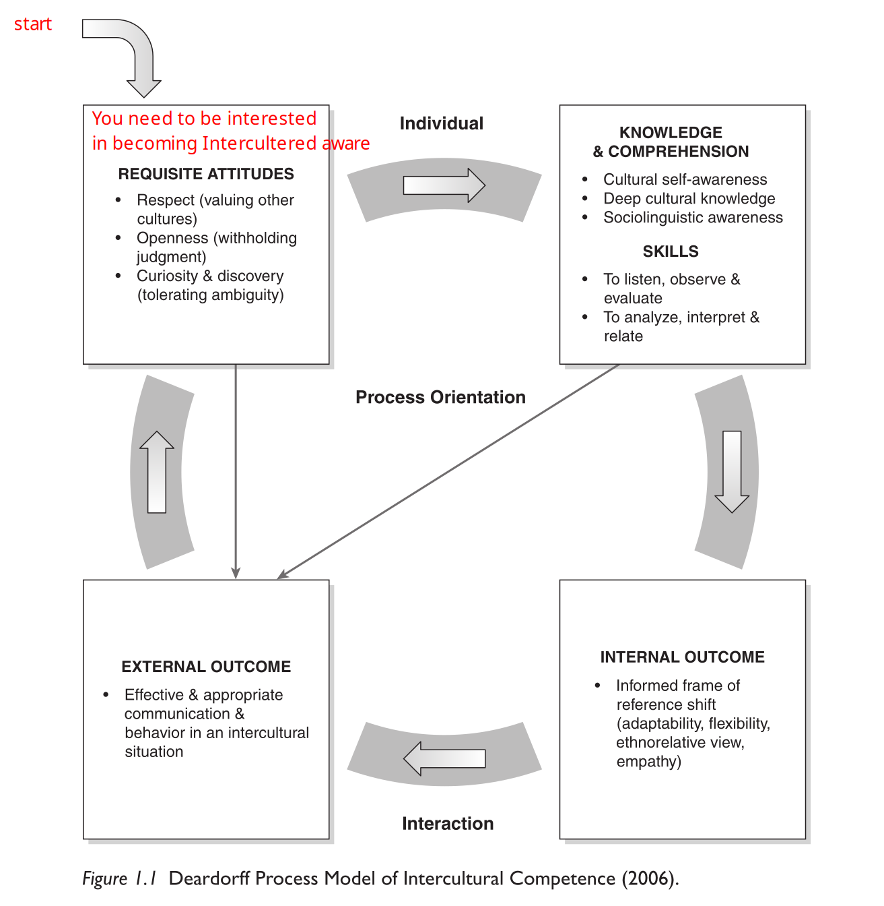

# Intercultural Competence

There is no one definition for what intercultural competence is, but scholar agree that intercultural competence is the appropriate and effective management of interaction between people who ... represent different or divergent affective, cognitive, and behavioural orientations to the world. Intercultural competence always includes multiple people.

## The Process Model of Intercultural Competence

In the top left box, where the start is, the model says that one needs to be interested in becoming intercultural competent. 

The top right box says that in addition to wanting to become intercultural aware, one also needs knowledge about the culture and its contexts. This knowledge can be built up by either listening and observing and then analyse and interpreter the situation. In essence, to be aware about one's surrounding.

The right bottom box says that these two previous box will result in an internal shift in how culture is perceived from always comparing everything with one's own culture to being able to seeing culture more holistic.

The last box in the bottom left says that these steps will manifest them self in an external change in how effective and appropriate one can communicate and behave in an intercultural situation. As shown by the arrows, every box contributes to the "External Outcome" as each has an positive impact on one's intercultural competence.

Finally, this is a never-ending process which will never stop. Therefore there is an arrow connecting "External Outcome" to "Requisite Attitudes".