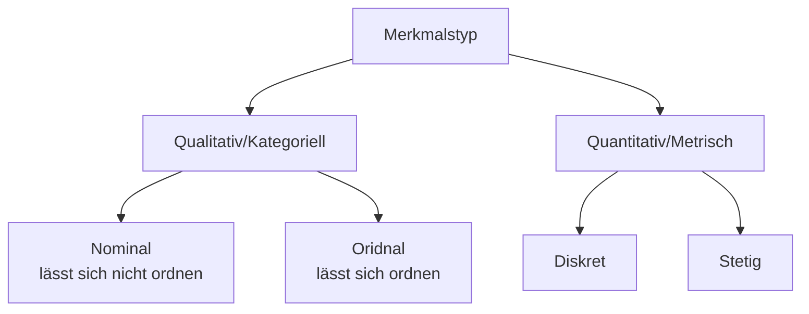

# Deskriptive Statistik

## Begriffe

**TODO**

## Merkmalstyp / Messniveau

## Stichproben

Aus der Grundgesamtheit $\Omega$ können mit einer Stichprobe $n$ Objekte $\omega_1, \omega_2, ..., \omega_n$ entnommen werden und die Merkmale $X(\omega_1),..., X(\omega_n)$ betrachtet werden. Häufig wird dies auch als $x_1, x_2, ..., x_n$ geschrieben.

## Absolute und relative Häufigkeit

Die absolute Häufigkeit $h_i$, ist wie oft ein Wert vorgekommen ist. Die Summe aller $h_i$ ergibt die Anzahl Werte $n$. Die relative Häufigkeit $f_i=\frac{h_i}{n}$, ist, was der Prozent-Anteil eines Wertes ist. Die Summe aller $f_i$ ergibt $1$

## Kumulative absolute und relative Häufigkeit

Die kumulative absolute Häufigkeit $H(x)$, ist definiert als alle Werte von $h_i$ bis und mit $x$. Es kann auch als $H(x)=\sum_{a_i \lt x}h_i$.

Ähnlich ist die kumulative relative Häufigkeit $F(x)$, was alle Werte von $f_i$ bis und mit $x$. Es kann definiert werden als $F(x)=\sum_{a_i}f_i=\frac{H(x)}{n}$

Die kumulative Häufigkeiten zwischen zwei Werte. Zum Beispiel der Anteil von Familien, welche 2 - 4 Flüge pro Jahr kaufen: $F(4) - F(2)$ 

## Beispiel

| Anzahl Flugreisen $a_i$               | 1              | 2               | 3               | 4               | 5              | Total |
| ------------------------------------- | -------------- | --------------- | --------------- | --------------- | -------------- | ----- |
| Absolute Häufigkeit $h_i$             | $9$            | $8$             | $5$             | $7$             | $1$            | $30$  |
| Relative Häufigkeit $f_i$             | $\frac 9 {30}$ | $\frac{8}{30}$  | $\frac{5}{30}$  | $\frac{7}{30}$  | $\frac 1 {30}$ | $1$   |
| Kumulative absolute Häufigkeit $H(x)$ | $9$            | $17$            | $22$            | $29$            | $30$           |       |
| Kumulative relative Häufigkeit $F(x)$ | $\frac 9{30}$  | $\frac{17}{30}$ | $\frac{22}{30}$ | $\frac{29}{30}$ | $1$            |       |

## Kenngrösse

### Median

Der Median ist die Zahl in der "Mitte".
$$
\begin{cases}
\frac 1 2 (x_{[\frac n 2]}+x_{[\frac {n + 1} 2]}) & n \text{ gerade}\\
x_{[\frac n 2]} & n \text{ ungerade}
\end{cases}
$$

### Quantil (STS01/p.17)

Ein Quantil $R_q$ unterteilt die Stichproben in zwei Teile: $n\cdot q$ und $n\cdot (1 - q)$.

Berechnet wird es folgendermassen.
$$
R_q=\begin{cases}
\frac{x_{[n \cdot q]}+x_{[n\cdot q + 1]}}{2} & n \cdot q \text{ ganze Zahl}\\
x_{[\lceil n\cdot q\rceil]} & n\cdot q \text{ keine ganze Zahl}
\end{cases}
$$
Ebenfalls $R_{0.5}$ ist der Median, $R_{0.25}$, $R_{0.5}$ und $R_{0.75}$ werden auch Quartile genannt

Der Abstand zwischen dem -3. und 1. Quartile nennt sich auch Interquartilenabstand (IQR)

### Modus

Der Modus $x_{mod}$ ist der Wert mit der höchsten absoluten Häufigkeit.

### Durchschnitt

$$
\overline x = \frac 1 n \sum^n_{i=1}x_i = \frac 1 n \sum^m_{i=1}h_i\cdot a_i=\sum^m_{i=1}f_i\cdot a_i
$$

### Varianz und Standardabweichu g

$$
s^2 = \frac 1 n \sum^n_{i=1}(x_i - \overline x)^2=\frac 1 n \left (\sum^n_{i=1}x_i^2 \right)- \overline x ^2\\
s = \sqrt{s^2}
$$

Die Varianz und das Streumass gibt an, wie fest die eigentlichen Werte vom Durchschnitt abweichen.  Bei klassierten Daten wird die Klassenmitte genommen (z.B. ist die Klassenmitte für $[200-400[=300$).

Oft werden auch die korrigierte Varianz und die korrigierte Standardabweichu genutzt.
$$
s_{korr}^2=\frac 1 {n-11}\sum^n_{i=1}(x_i - \overline x)^2 
		= \frac n {n - 1}s^2\\
s_{korr} = \sqrt{\frac 1 {n-11}\sum^n_{i=1}(x_i - \overline x)^2}
		= \sqrt{\frac n {n - 1}s^2}
$$

## Boxplot

Der Boxplot besteht aus einer Box und zwei Antennen. Die Box ist zwischen dem $Q_1$ und $Q_3$, wobei der Strich in der Box bei $Q_2$ ist. Die Antennen gehen höchsten bis $1.5 \cdot (Q_3 - Q_1)$ von der Box (also relative zu $Q_1$ oder $Q_3$)

## Form der Verteilung

Für die meisten Verteilungen kann dabei festgehalten werden:

* rechtsschief: $x_{mod}<x_{med}<\overline x$
* symmetrisch: $x_{mod}=x_{med}=\overline x$
* linkschief: $x_{mod > x_{med}> \overline x}$

Ebenfalls kann eine Verteilung uimodal, bimodal oder multimodal sein. 
