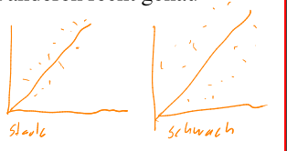
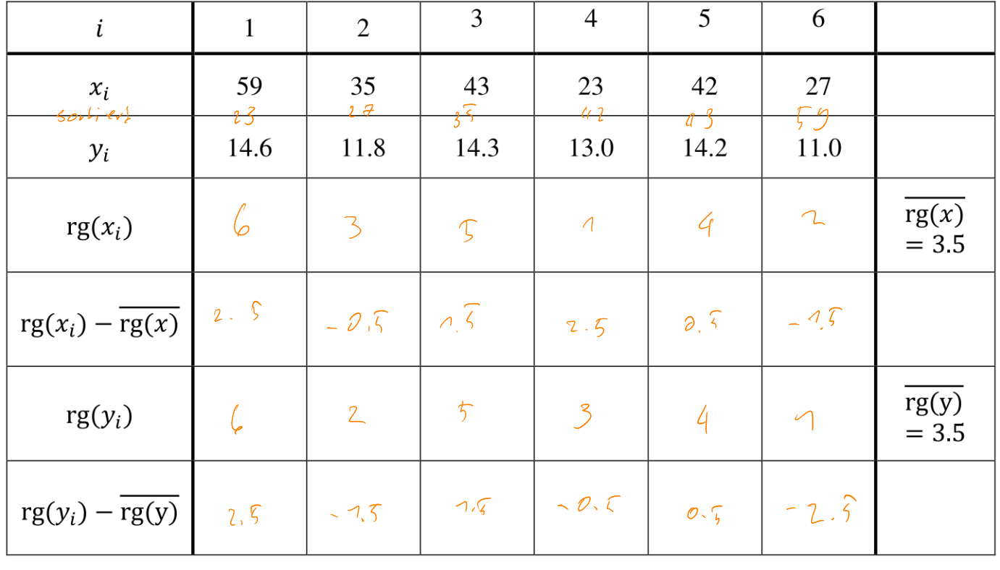

# Deskriptive Statistik

$$
\DeclareMathOperator{\rg}{rg}
$$

## Begriffe

**TODO**

## Merkmalstyp / Messniveau

## Stichproben

Aus der Grundgesamtheit $\Omega$ können mit einer Stichprobe $n$ Objekte $\omega_1, \omega_2, ..., \omega_n$ entnommen werden und die Merkmale $X(\omega_1),..., X(\omega_n)$ betrachtet werden. Häufig wird dies auch als $x_1, x_2, ..., x_n$ geschrieben.

## Absolute und relative Häufigkeit

Die absolute Häufigkeit $h_i$, ist wie oft ein Wert vorgekommen ist. Die Summe aller $h_i$ ergibt die Anzahl Werte $n$. Die relative Häufigkeit $f_i=\frac{h_i}{n}$, ist, was der Prozent-Anteil eines Wertes ist. Die Summe aller $f_i$ ergibt $1$

Die relative Häuffigkeit bei nicht klassierten Daten nennts isch PMF.

## Kumulative absolute und relative Häufigkeit (CDF) bei nicht-klassierten Daten

Die kumulative absolute Häufigkeit $H(x)$, ist definiert als alle Werte von $h_i$ bis und mit $x$. Es kann auch als $H(x)=\sum_{a_i \lt x}h_i$.

Ähnlich ist die kumulative relative Häufigkeit $F(x)$, was alle Werte von $f_i$ bis und mit $x$. Es kann definiert werden als $F(x)=\sum_{a_i}f_i=\frac{H(x)}{n}$

Die kumulative Häufigkeiten zwischen zwei Werte. Zum Beispiel der Anteil von Familien, welche 2 - 4 Flüge pro Jahr kaufen: $F(4) - F(2)$ 

### Beispiel

| Anzahl Flugreisen $a_i$                     | 1              | 2               | 3               | 4               | 5              | Total |
| ------------------------------------------- | -------------- | --------------- | --------------- | --------------- | -------------- | ----- |
| Absolute Häufigkeit $h_i$                   | $9$            | $8$             | $5$             | $7$             | $1$            | $30$  |
| Relative Häufigkeit $f_i$ (PMF)             | $\frac 9 {30}$ | $\frac{8}{30}$  | $\frac{5}{30}$  | $\frac{7}{30}$  | $\frac 1 {30}$ | $1$   |
| Kumulative absolute Häufigkeit $H(x)$       | $9$            | $17$            | $22$            | $29$            | $30$           |       |
| Kumulative relative Häufigkeit $F(x)$ (CDF) | $\frac 9{30}$  | $\frac{17}{30}$ | $\frac{22}{30}$ | $\frac{29}{30}$ | $1$            |       |

## PMF und PDF bei klassierten Daten

Die relative Häufigkeit (PMF) bei klassierten Daten ist für die ganze Klasse definiert.

Wenn nun aber die PMF als Balkendiagramm dargestellt werden würde, würden Klassengrössen die Darstellung verzerren. Dies liegt daran, dass eine grössere Klasse mehr Platz in Anspruch nimmt, da der Balken breiter ist. Dafür gibt es die **PDF**.
$$
PDF(x) = \frac{f_x}{Klassengrösse}=\frac{h_x}{n\cdot Klassengrösse}
$$

Nun folgt ein Beispiel für PDFs.

| $c_i$     | $[4; 6[$              | $[6:8[$               | $[8:12[$              |
| --------- | --------------------- | --------------------- | --------------------- |
| $h_i$     | 1                     | 7                     | 2                     |
| $f_i$     | $\frac 1 {10}$        | $\frac{7}{10}$        | $\frac{2}{10}$        |
| PDF $f$   | $\frac{1}{10\cdot 2}$ | $\frac{7}{10\cdot 2}$ | $\frac{2}{10\cdot 4}$ |
| CDF $F_i$ | $\frac{1}{10}$        | $\frac{8}{10}$        | $\frac{10}{10}=1$     |

## Relative Häufigkeit (CDF) bei klassierten Daten

Wenn die CDF für klassierte Daten gebaut wird, werden die CDF-Werte der Klassengrenzen berechnet, wie bei nicht klassierten Daten. Danach wird eine Linie zwischen den CDF-Werte der Klassengrenzen gezogen.

Die Steigung der Linie ist die $PDF$.

Wenn nun mathematisch ein spezifischen CDF Wert berechnet werden soll, kann dies folgendermassen getan werden:
$$
F(x)=\frac{F(b)-F(a)}{b-a}\cdot (x-a)+F(a)=PMF(x)\cdot(x - a)+F(a)\\
\text{wobei } a \text{ und } b \text{ die underte, bzw. obere Klassengrenzen sind}
$$

## Kenngrösse

### Median

Der Median ist die Zahl in der "Mitte".
$$
\begin{cases}
\frac 1 2 (x_{[\frac n 2]}+x_{[\frac {n} 2 + 1]}) & n \text{ gerade}\\
x_{[\frac {n+1} 2]} & n \text{ ungerade}
\end{cases}
$$

### Quantil (STS01/p.17)

Ein Quantil $R_q$ unterteilt die Stichproben in zwei Teile: $n\cdot q$ und $n\cdot (1 - q)$.

Berechnet wird es folgendermassen.
$$
R_q=\begin{cases}
\frac{x_{[n \cdot q]}+x_{[n\cdot q + 1]}}{2} & n \cdot q \text{ ganze Zahl}\\
x_{[\lceil n\cdot q\rceil]} & n\cdot q \text{ keine ganze Zahl}
\end{cases}
$$
Ebenfalls $R_{0.5}$ ist der Median, $R_{0.25}$, $R_{0.5}$ und $R_{0.75}$ werden auch Quartile genannt

Der Abstand zwischen dem -3. und 1. Quartile nennt sich auch Interquartilenabstand (IQR)

Wenn die Daten kategorisiert sind kann das Quantil auch über den CDF ausgerechnet werden. Dafür kann folgende Formel verwendet werden: 
$$
R_q=\frac{b - a}{F(b) - F(a)}\cdot (q - F(a)) + a
$$

### Modus

Der Modus $x_{mod}$ ist der Wert mit der höchsten absoluten Häufigkeit.

### Durchschnitt / Mittelwert

$$
\overline x = \frac 1 n \sum^n_{i=1}x_i = \frac 1 n \sum^m_{i=1}h_i\cdot a_i=\sum^m_{i=1}f_i\cdot a_i
$$

Bei klassierten Daten wird die Klassenmitte für die Berechnung des Durchschnitts verwendet.

### Varianz und Standardabweichung

$$
s^2 = \frac 1 n \sum^n_{i=1}(x_i - \overline x)^2=\frac 1 n \left (\sum^n_{i=1}x_i^2 \right)- \overline x ^2\\
s = \sqrt{s^2}
$$

Die Varianz und das Streumass gibt an, wie fest die eigentlichen Werte vom Durchschnitt abweichen.  Bei klassierten Daten wird die Klassenmitte genommen (z.B. ist die Klassenmitte für $[200-400[=300$).

Oft werden auch die korrigierte Varianz und die korrigierte Standardabweichu genutzt.
$$
s_{korr}^2=\frac 1 {n-11}\sum^n_{i=1}(x_i - \overline x)^2 
		= \frac n {n - 1}s^2\\
s_{korr} = \sqrt{\frac 1 {n-11}\sum^n_{i=1}(x_i - \overline x)^2}
		= \sqrt{\frac n {n - 1}s^2}
$$

## Boxplot

Der Boxplot besteht aus einer Box und zwei Antennen. Die Box ist zwischen dem $Q_1$ und $Q_3$, wobei der Strich in der Box bei $Q_2$ ist. Die Antennen gehen höchsten bis $1.5 \cdot (Q_3 - Q_1)$ von der Box (also relative zu $Q_1$ oder $Q_3$)

## Form der Verteilung

Für die meisten Verteilungen kann dabei festgehalten werden:

* rechtsschief: $x_{mod}<x_{med}<\overline x$
* symmetrisch: $x_{mod}=x_{med}=\overline x$
* linkschief: $x_{mod > x_{med}> \overline x}$

Ebenfalls kann eine Verteilung uimodal, bimodal oder multimodal sein. 

## Darstellungsarten bei multivariaten Daten

Jenach, welcher Typ die Merkmale haben, welche verglichen werden sollen, können verschiedene Darstellungsarten verwendet werden.

| Merkmale 1  | Merkmal 2   | Darstellungsart              |
| ----------- | ----------- | ---------------------------- |
| Kategoriell | Kategoriell | Tabelarisch, Mosaikplot      |
| Kategoriell | Metrisch    | Tabelarisch, Boxplot-Diagram |
| Metrisch    | Metrisch    | Scatterplot                  |

### Tabelarisch

Wenn zwei kategorielle Merkmale verglichen werden, kann es mit einer Tabelle dargestellt werden:

| Zivielstand/Kaufkraft | tief | mittel | Hoch |
| --------------------- | ---- | ------ | ---- |
| Ledig                 | 978  | 1884   | 1748 |
| Partnerschaft         | 475  | 1044   | 1452 |
| Verheiratet           | 781  | 1870   | 2550 |

Dabei sagt eine "Cell" in der Tabelle, wie viele Leute welchen Zivielstand und Kaufkraft gleichzeitig haben.

Dies kann auch mit einem kategoriellen und einem metrischen Merkmal benützt werden.

|        | Mittelwert | Standardtabweichung |
| ------ | ---------- | ------------------- |
| tief   | 2055.353   | 738.223             |
| mittel | 5049.234   | 1577.482            |
| hoch   | 12053.706  | 3715.074            |

Dabei sagt eine "Cell" in der Tabelle z.B. was die durschnittliche Einkaufsbetrag ist, bei Personen mit tiefer Kaufkraft.

### Mosaikplot

Kann nur bei zwei kategoriellen Merkmalen verwendet werden.

### Boxplot

Dies kann verwendet werden, wenn ein Merkmal kategoriell ist und das zweite metrisch ist.

(Das rechte Diagram ist ein Stripplot)

### Scatterplot

Scatterplots oder Streudiagramme sind nütztlich, wenn zwei metrische Merkmale visualisiert werden sollen.

Ein Risikio bei Scatterplots ist das Overplotten, was passiert, wenn es viele Datenpunkte in einem Bereich hat. Im folgenden Scatterplot hat es vermutlich mehr Punkte als ausgemacht werden können. Um dies zu erkennen, können weitere Kenngrössen analysiert werden.

Aus einem Scatterplot kann die Form, Richtung und Stärke gelesen werden.

#### Form

Die Form ist, wie die Punkte angeordnet sind. Es kann z.B. einen linearen Zusammenhang zwischen den Merkmalen bestehen. Oder die Pünkte können eine gekrümmte Kurve oder andere beliebige Form bildet.

#### Richtung

Die Richtung kann entweder einen positiven oder negativen Zusammenhang sein. Wenn es Positiv ist, dann sind die beiden Merkmale proportional zueinander (Je grösser A, desto grösser ist B). Wenn es Negativ ist, dann sind die beiden Merkmale umgekehrt proportional zueinander (Je grösser A, desto kleiner B).

#### Stärke

Die Stärke sagt aus, wie viel oder wenig Streung vorliegt. Wenn die Stärke klein ist, dann besteht ein starker Zusammenhang.

## Paerson-Korrelationskoeffizient

Mit folgenden Formeln kann der Korrelationskoeffizient $r_{xy}$ ausgerechnet werden. Dabei ist $\tilde S_{x}$ die Standardtabweichung und $\tilde S_{xy}$ die Kovarianz.
$$
r_{xy}=\frac{\tilde S_{xy}}{\tilde S_x \cdot \tilde S_y}\\
\tilde S_{xy}=\frac 1 n\sum^n_{i=1}(x_i-\overline x)(y_i-\overline y)=\overline{xy}-\overline x \cdot \overline y\\
\tilde S_x=\sqrt{\frac 1 n\sum^n_{i=0}(x_i-\overline x)^2}=\sqrt{\overline{x^2}-(\overline x)^2}\\
\tilde S_y=\sqrt{\frac 1 n\sum^n_{i=0}(y_i-\overline y)^2}=\sqrt{\overline{y^2}-(\overline y)^2}\\
$$
Wenn der **korrigierte** Korrelationskoeffizient $r_{xy,korr}$ benötigt wird, können folgende Formeln benützt werden:
$$
r_{xy,korr}=\frac{\tilde S_{xy,korr}}{\tilde S_{x,korr} \cdot \tilde S_{y,korr}}\\
\tilde S_{xy,korr}=\frac 1 {n -1}\cdot \tilde S_{xy}\\
\tilde S_{x,korr}=\sqrt{\frac n {n - 1}\tilde S_x^2}\\
\tilde S_{y,korr}=\sqrt{\frac n {n - 1}\tilde S_y^2}\\
$$
Der Korrelationskoeffizient sagt aus wie fest* zwei Merkmale korrelieren und ob sie proportional oder umgekehrt proportional sind.

Wenn der Koeffizient gegen $1$ oder $-1$ geht, dann korrelieren die zwei Merkmale, wenn der Koeffizient gegen 0 tendiert, dann korrelieren die zwei Merkmale nicht oder nicht linear.

Wenn der Koeffizient positiv ist, dann sind die Faktoren proportional, wenn der Koeffizient negativ ist, dann sind die Merkmale umgekehrt-proportional.

**Achtung:** Problem des Korrelationskoeffizient nach Paerson ist, dass er nur Korrelationen erkennen kann, welche linear sind. Falls die Kurve eine andere Form, als eine Gerade hat, dann wird der Koeffizient gegen $0$ gehen, obwohl die Merkmale korrelileren.

Ein weiteres Problem ist, dass der Paerson-Korrelationsfaktor nicht robust ist, und bei Ausreissern fehlerhaft eine Korrelation oder fehlerhaft keine Korrelation anzeigen.

### Beispiele

| Diagramme                                                   | Korrelations-koeffizient                      | Bemerkung                                                    |
| ----------------------------------------------------------- | --------------------------------------------- | ------------------------------------------------------------ |
|  | $r_{xy}=0.988$                                | Die beiden Merkmale korrelieren proportional                 |
|  | $r_{xy}=0.174$                                | Die beiden Merkmale korrelieren **nicht**                    |
|  | $r_{xy}=-0.976$                               | Die beiden Merkmale korrelieren umgekehrt proportional       |
|  | $r_{xy, mit}=0.909$ $r_{xy, ohne}=0.597$ | Die beiden Merkmale sind proportional, wenn der  Ausreisser mitgerechnet wird ($r_{xy, mit}$), hingegen, wenn der Ausreisser nicht mit gerechnet wird, dann sinkt $r_{xy}$ |

## Spearman-Rangkorrelationskoeffizient

$$
r_{Sp}=\frac{\sum^n_{i=1}(\rg(x_i) - \overline{\rg(x)})\cdot(\rg(y_i)-\overline{\rg(y)})}
{\sqrt{\sum^n_{i=1}(\rg(x_i) - \overline{\rg(x)})^2} \cdot \sqrt{\sum^n_{i=1}(\rg(y_i) - \overline{\rg(y)})^2}}
$$

Dabei ist $\rg(x_i)$ Der Rang von $x_i$ und kann als $\rg(x_i)=1+Anzahl(j \vert x_j < x_i) + \frac 1 2 Anzahl(j | x_j = x_i, i \neq j)$. In Deutsch: 1 + die Anzahl von Elementen $x_j$, welche kleiner als $x_i$ sind + die halbe Anzahl von Elementen, welche gleich sind, wie $x_i$.

Hier ist ein Beispiel: 

Daraus ergibt sich folgendes:
$$
\sqrt{\sum^n_{i=1}(\rg(x_i) - \overline{\rg(x)})^2} = \sqrt{\sum^n_{i=1}(\rg(y_i) - \overline{\rg(y)})^2}\\
\sqrt{\sum^n_{i=1}(\rg(x_i) - \overline{\rg(x)})^2} =\sqrt{2.5^2+(-0.5)^2 + 1.5^2 + (-2.5)^2+0.5^2+(-1.5)^2}=\sqrt{17}\\
\sum^n_{i=1}(\rg(x_i)-\overline{\rg(x)})(\rg(y_i)- \overline{\rg(y)})\\= 2.5 \cdot 2.5 + (-0.5)\cdot (-1.5) + 1.5 \cdot 1.5 + (-2.5)\cdot (-0.5) + 0.5 \cdot 0.5 + (-1.5)\cdot (-2.5)=14.5\\

r_{Sp}=\frac{\sum^n_{i=1}(\rg(x_i) - \overline{\rg(x)})\cdot(\rg(y_i)-\overline{\rg(y)})}
{\sqrt{\sum^n_{i=1}(\rg(x_i) - \overline{\rg(x)})^2} \cdot \sqrt{\sum^n_{i=1}(\rg(y_i) - \overline{\rg(y)})^2}} = \frac{14.5}{\sqrt{17.5}\cdot\sqrt{17.5}}\approx 0.83
$$

### Verbundene Ränge

Wenn die x- oder y-Elemente doppelte Elemente enhalten (z.B. zwei `4`), dann wird von verbundenen Rängen gesprochen. Dabei wird der Durchschnitt der Ränge berechnet

In diesem Fall wäre der Rang von $x_3$ und $x_4$ `3` oder `4`, daher wird der Durschschnitt als Ranggenommen und wird somit $\rg(x_3)=\rg(x_4)=3.5$

Das gilt auch, wenn mehr als zwei gleiche Werte existieren. In diesem Fall kann der Rang von $x_3$, $x_4$ und $x_5$ `3`, `4`, oder `5` sein. Daher wird der Rang zum Durchschnitt von 3, 4, 5. $\rg(x_3)=\rg(x_4)=\rg(x_5)=4$
