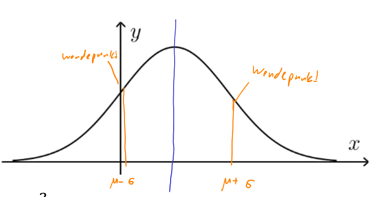

# Spezielle Verteilung

## Normalverteilung

$$
\varphi_{\mu, \sigma}(x)=\frac {1}{\sqrt{2\pi}\cdot \sigma}\cdot e^{-\frac 1 2((x-\mu) : \sigma)^2}\\
$$

* Die Normalverteilung ist normiert, heisst dass $\int^\infty_{-\infty}\varphi(x)dx=1$
  Daher, je grässer $\sigma$ wird, desto breiter und niedriger wird die Glockenkurve.

## Zentraler Grenzwert

Wenn eine Liste von identische verteilte und stochastisch unabhängige Zufallsvariablen $X_1, X_2, ..., X_n$ haben, dann