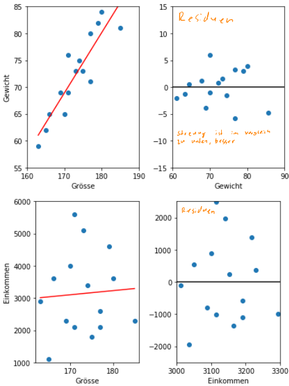

# STS Summary

## Deskriptive Statistik

| Funktion                                            | Nicht Klassiert                                              | Klassiert                                                    |
| --------------------------------------------------- | ------------------------------------------------------------ | ------------------------------------------------------------ |
| absolute Häuffigkeit $h(x)$                         |                                                              |                                                              |
| relative Häuffikeit (PMF) $f(x)$ / $g(x)$           | $f(x)=\frac{h(x)}n$                                          | $g(x)=f_i$                                                   |
| Dichtefunktion $f(x)$ ($b_i=$ Klassengrösse ) (PDF) | -                                                            | $f(x)=\frac{g(x)}{b_i}$                                      |
| kummulative absolute Häuffigkeit $H(x)$             | $H(x)=\sum_{a_i \lt x}h_i$                                   | -                                                            |
| kummulative relative Häuffigkeit (CDF) $F(x)$       | $F(x)=\sum_{a_i}f_i=\frac{H(x)}{n}$                          | $F(x)=\int^x_{-\infty}f(y)\mathrm d y$, $F(x)=F(a_i)+\frac{x-a_i}{a_{i+1}-a_i}\cdot (F(a_{i+1})-F(a_i))$ |
| Modus $x_{mod}$                                     | Höchste absolute Häufigkeit                                  | *gleich*                                                     |
| Klassenmitte $M_i$                                  | -                                                            | $M_i=\frac{a_{i+1}-a_i}{2}$                                  |
| Stichprobenmittelwert $\overline x$                 | $\overline x=\frac 1 n\sum^n_{i=1}x_i$                       | $\overline x=\sum^n_{i=1}M_i\cdot f_i$                       |
| Varianz                                             | $s^2 = \frac 1 n \sum^n_{i=1}(x_i - \overline x)^2 \\ = \frac 1 n \left (\sum^n_{i=1}x_i^2 \right)- \overline x ^2$ | $s^2=\sum^n_{i=1}(M_i-\overline x)^2\cdot f_i$               |
| Korrigierte Varianz                                 | $s_{korr}^2=\frac 1 {n-1}\sum^n_{i=1}(x_i - \overline x)^2 \\ = \frac n {n - 1}s^2$ | $s_{korr}^2= \frac n {n - 1}s^2$                             |
| (korrigierte) Standardabweichung $s$                | $s_{korr}=\sqrt{s_{korr}^2}$                                 | *gleich*                                                     |
| Kovarianz                                           | $s_{xy}=\frac 1 n \sum^n_{i=1}(x_i-\overline x)\cdot (y_i- \overline y)\\= \left(\frac 1 n \sum^n_{i=1}x_iy_i\right)-\overline x \cdot \overline y$ | -                                                            |

### Taschenrechner Befehle

| Funktion                                 | TR-Befehl                             |
| ---------------------------------------- | ------------------------------------- |
| `stat-menu`                              | `shift` + `1` (`STAT`)                |
| Varianz für `x`                          | `stat-menu` - `5: s-var` - `3: xσn`   |
| Varianz für `y`                          | `stat-menu` - `5: s-var` - `6: yσn`   |
| Korrigierte Varianz für `x`              | `stat-menu` - `5: s-var` - `4: xσn-1` |
| Korrigierte Varianz für `y`              | `stat-menu` - `5: s-var` - `7: xσn-1` |
| Durchschnitt für `x`                     | `stat-menu` - `5: s-var` - `2: x `    |
| Durchschnitt für `y`                     | `stat-menu` - `5: s-var` - `5: y `    |
| Pearson-Korrelationskoeffizient $r_{xy}$ | `stat-menu` - `7: Reg` - `3: r`       |

### Quantile / Boxplot

$$
\text{Nicht klassiert:}\\
R_q=\begin{cases}
\frac{x_{[n \cdot q]}+x_{[n\cdot q + 1]}}{2} & n \cdot q \text{ ganze Zahl}\\
x_{[\lceil n\cdot q\rceil]} & n\cdot q \text{ keine ganze Zahl}
\end{cases}\\\\
\text{klassiert:}\\
R_q=\frac{b - a}{F(b) - F(a)}\cdot (q - F(a)) + a
$$

> ***Note:***  
> Für $a$ als die untere und $b$ als die obere Grenze der Klasse, welche das Quantil beinhaltet.
>
> Die Klasse, welche das Quantil beinhaltet, ist die erste Klasse, dessen _CDF_ $q$ überschreitet.

## Pearson-Korrelationskoeffizient

$$
r_{xy}=\frac{S_{xy}}{S_x\cdot S_y}
$$

|                    |                                                              |
| ------------------ | ------------------------------------------------------------ |
| $r_{xy}\approx 1$  | Positiver Linearer Zusammenhang                              |
| $r_{xy}\approx -1$ | Negatiber Linearer Zusammenhang                              |
| $r_{xy}\approx 0$  | Punkte sind gleichmässig um den Schwerpunkt $(\overline x, \overline y)$ verteilt |

Der Pearon-Korrelationskoeffizient ist **nicht** robust und kann von Ausreisser stark beeinflusst werden.

## Spearman-Rangkorrelationskoeffizient

$$
\DeclareMathOperator{\rg}{rg}
r_{Sp}=\frac{\sum^n_{i=1}(\rg(x_i) - \overline{\rg(x)})\cdot(\rg(y_i)-\overline{\rg(y)})}
{\sqrt{\sum^n_{i=1}(\rg(x_i) - \overline{\rg(x)})^2} \cdot \sqrt{\sum^n_{i=1}(\rg(y_i) - \overline{\rg(y)})^2}}\\
\rg(x_i)=1+Anzahl(j \vert x_j < x_i) + \frac 1 2 Anzahl(j | x_j = x_i, i \neq j)
$$

Deutsch: 1 + die Anzahl von Elementen $x_j$, welche kleiner als $x_i$ sind + die halbe Anzahl von Elementen, welche gleich sind, wie $x_i$.

Wenn es doppelte x- oder y-Elemente gibt, dann wird von verbundenen Rängen gesprochen, wobei der Durchschnitt der Ränge berechnet wird.

Der Spearman-Rangkorrelationskoeffizient misst, ob die Daten eine Korrelation mit einer strengen monotoner funktion haben (eine Funktion, welche immer steigt oder fällt)

**TODO: Multivarianten Daten darstellen**

## Kombinatorik

Binomialkoeffizient: $\begin{pmatrix}n \\k \end{pmatrix}=\frac{n!}{(n-k)!\cdot k!}$
Wieviel Möglichkeiten gibt es $k$ Objekte von $n$ Objekten auszuwählen

$n$ sind die Anzahl Optionen, $k$ wie oft gezogen wird

Kombination mit Wiederholung: $k$ Objekte aus $n$ möglchen Sorten/Töpfen

Beispiele:

* Anzahl Möglichenkeiten für eine Personengruppe mit 20 potentiellen Personen: $2^{20}-1$
  Jede Person ist entweder in der Gruppe oder nicht und $-1$ wegen der Leeren-Menge

## Wahrscheinlichkeit

$$
\text{Zähldichte: } \rho: \Omega \to [0, 1]\\
\text{Wahrscheinlichkeitsmass: } P: 2^\Omega \to [0, 1], P(M)=\sum_{\omega \in M} \rho(\omega)
$$

Der Wahrscheinlichkeitsraum $(\Omega, P)$ wird Laplace-Raum genannt, wenn alle Ereignisse gleich wahrscheinlich sind.

* $P(X=x)=f(x)$
* $P(X \le x)=F(x)$
* $P(a \le X \le b)=P(X\le b)-P(X\le a)$
* $P(X > x)=1-P(X\le x)$

### Kenngrössen

*Lagemass*: Was ist das Zentrum
*Streumass*: Die Verteilung des Merkmals

* Erwartungswert $E(X)=\sum_{x\in\R}P(X=x)\cdot x$
  * $E(X+Y)=E(X)+E(Y)$ und $E(\alpha X) = \alpha E(X)$
* Varianz
   $V(X)=E(X^2)-(E(X))^2 = E((X-E(X)^2)=\\(\sum_{x\in\R}P(X=x)\cdot x^2)-E(X)^2=\sum_{x\in\R}P(X=x)\cdot(x-E(X))^2$

### Bedingte Wahrscheinlichkeit

* Eintreten von $B$, wenn $A$ eingetroffen ist (Satz von Bayes): $P(B\vert A) = \frac{P(A\cap B)}{P(A)}=\frac{P(A\vert B)\cdot P(B)}{P(A)}$
* Multiplikationssatz: $P(A\cap B)=P(A\vert B)\cdot P(B)=P(B\vert A)\cdot P(A)$
* Satz von der Totalen Wahrscheinlichkeit: $P(A)=P(A\vert B)\cdot P(B) + P(A|\overline B)\cdot P(\overline B)$

#### Vierfeldertafel

Die Ereignisse in einer Vierfeldertafel **müssen** Disjunkt sein.

### Stochastische Unabhängigkeit

Zwei Ereignisse $A$ und $B$ sind stochastisch unabhängig, wenn gilt $P(A\cap B)=P(A)\cdot P(B)$.

Wenn $A$ und $B$ stochastisch unabhänig sind:

*  sind auch $\overline A$ und $\overline B$, wie $\overline A$ mit $B$ und $A$ mit $\overline B$ unabhängig
* gilt $P(A\vert B)=P(A)$ und $P(B\vert A)=P(B)$
* gilt $E(X\cdot Y)=E(X)\cdot E(Y)$ und $V(X+Y)=V(X) + V(Y)$

Um zu überprüfen ob $n$ Ereignisse unabhänig sind, braucht es $2^n - n -1$ Gleichungen, da sie disjunkt unabhängig sein müssen.

## Spezielle Verteilungen

### Hypergeometrische Verteilung ($X \sim H(N, M, n)$)

Es gibt eine Urne mit $N$ Objekte, von welchen $M$ einer bestimmten Sorte angehöhren ($N- M$ gehöhren zu anderen Sorten). Zufällig wird eine Stichprobe von $n$ Objekten aus der Urne genommen. Wichtig ist, dass **nicht Zurückgelegt wird**.

Die Zufallsvariable $X$ beschriebt die Anzahl von Objekten von der Sorte $M$. Es gilt $X \sim H(N, M, n)$
$$
P(X=x)=\frac{\begin{pmatrix}M\\x\end{pmatrix}\cdot \begin{pmatrix}N - M\\n - x\end{pmatrix}}
{\begin{pmatrix}N\\n\end{pmatrix}}\\
$$

$$
\begin{align}
\mu=E(X)&=n\cdot \frac M N\\
\sigma^2=V(X)&=n\cdot \frac M N \cdot (1 - \frac M N) \cdot \frac{N - n}{N - 1}\\
\sigma = S(X)&=\sqrt{n\cdot \frac M N \cdot (1 - \frac M N) \cdot \frac{N - n}{N - 1}}
\end{align}
$$

### Bernoulliverteilung

Ein Bernoulli-Expermient, ist ein Zufallsexperiment, inwelchem es nur zwei Möglichkeiten gibt.
$$
\begin{align}
P(X=1)&=p\\
P(X=0)&=1-p=q\\
\end{align}
$$

$$
\begin{align}
E(X)&= P(X=1)=p\\
E(X^2)&= P(X=1) = p\\
V(X)&=E(X^2)-(E(X))^2=p - p^2
\end{align}
$$

### Binomailverteilung ($X\sim B(n, p)$)

Wenn ein Bernoulliexperiment $n$-mal wiederholt wird und die Wahrscheinlichkeit für $P(X=1)=p$ ist und $q=1-p$. Die Wiederholungen **müssen** stochastisch unabhängig sein. 

Es gilt $X\sim B(n, p)$
$$
P(X=x)=\begin{pmatrix}n\\x\end{pmatrix}\cdot p^x\cdot q^{n-x}
$$

$$
\begin{align}
\mu=E(X)&=np\\
\sigma^2=V(X)&=npq\\
\sigma = S(X)&=\sqrt{npq}
\end{align}
$$

Wenn gilt $n \lesssim \frac N {20}$, dann kann die eine hypergeometrische Verteilung mit einer Binomialverteilung angenähert werden: $H(N, M, n)\approx B(n, \frac M N)$

### Poissonverteilung ($X\sim P(\lambda)$)

Die Poissonverteilung kann als stochastisches Modell benutzt werden, wenn es um die Wahrscheinlichkeit für das Eintreten einer bestimmten Anzahl gleichartiger Ereignisse geht, welche in einem gegebenen Bereich $\lambda$ (unabhängigi voneiner) beliebig oft auftreten können.
$$
P(X=x)=\frac{\lambda^x}{x!}\cdot e^{-\lambda}
$$

$$
\begin{align}
\mu=E(X)&=\lambda\\
\sigma^2=V(X)&=\lambda\\
\sigma = S(X)&=\sqrt{\lambda}
\end{align}
$$

Für eine Binomialverteilung wenn $n$ gegen unendlich geht und $\lambda=np$ konstant ist, dann kann eine Binomialverteilung mit einer Poissonverteilung approximiert werden: $B(n, p)\xrightarrow{n\to \infty \text{ und } \lambda=np \text{ konstant}} Poi(\lambda)$

Ebenfalls wenn $n \gtrsim 50$ und $p\lesssim 0.1$, dann kann eine Binomialverteilung mit einer Poissonverteilung approximiert werden: $B(n, p)\approx Poi(n\cdot p)$

### Gauss'sche Verteilung ($X\sim N(\mu, \sigma)$ / $X\sim N(0, 1)$)

$$
\begin{align}
\text{PDF: }\varphi_{\mu,\sigma}(x)&=\frac{1}{\sqrt{2\pi}\cdot\sigma}\cdot e^{-\frac1 2\cdot (\frac{x-\mu}{\sigma})^2}\\
\text{CDF: }\phi_{\mu, \sigma}(x)&=\int^x_{-\infty}\varphi_{\mu, \sigma}(t)\mathrm dt0
=\frac 1 {\sqrt{2\pi}\cdot \sigma}\cdot \int^x_{-\infty}e^{-\frac 1 2(\frac{t-\mu}{\sigma})^2}\mathrm dt
\end{align}
$$

Wenn $\mu=0$ und $\sigma = 1$ ist, dann wird von einer Standardnormalverteilung gesprochen und wird einfach als $\varphi(x)$ bezeichnet:
$$
\varphi(x)=\frac 1 {\sqrt{2\pi}}\cdot e^{-\frac 1 2 x^2}
$$
Um eine "normale" Gauss'sche Verteilung zu standardisieren, wird anstatt der Zufallsvariable $X$ folgende Definition $U=\frac{X-\mu} \sigma$ verwendet.

Der Erwartungswert $\mu$ und Standardabweichung $\sigma$ sind Parameter.

Eine Normalverteilung hat folgende Eigenschaften:

* Ist Symetrisch bei der Geraden $x=\mu$
* Hat Wendepunkte bei $\mu-\sigma$ und $\mu + \sigma$
* Ist normiert (totale Fläche unter der Kurve = 1)
* Je grösser $\sigma$, desto breiter und niedriger wird die Glockenkurve
* Eine Änderung von $\mu$ verschiebt die Kurve in der x-Richtung
* $P(a \le X \le b) = P(a < X < b) = \phi_{\mu, \sigma}(b)-\phi_{\mu, \sigma}(a)$
* $P(\vert X - \mu \vert \le \varepsilon)=P(\mu - \varepsilon \le X \le \mu + \varepsilon)=2\cdot \phi_{\mu, \sigma}(\mu + \varepsilon) - 1= 1 - 2\cdot \phi_{\mu,\sigma}(\mu - \varepsilon)$

Für die Verteilung $N(\mu, \sigma)$, liegen

* ca. 68% der Werte zwischen $\mu-\sigma$ und $\mu + \sigma$
* ca. 95% der Werte zwischen $\mu-2\sigma$ und $\mu + 2\sigma$
* ca 99.7% der Wete zwischen $\mu-3\sigma$ und $\mu + 3\sigma$

#### Approximationen

| Was                 | Bedingung | Approximation                                                |
| ------------------- | --------- | ------------------------------------------------------------ |
| $X\sim B(n, p)$     | $npq>9$   | $P(a\le X \le b)=\sum^b_{x=a}P(X=x)\approx \phi_{\mu, \sigma}(b+\frac 1 2)-\phi_{\mu,\sigma}(a-\frac 1 2)$ |
| $X\sim P(\lambda))$ | $x > 9$   | $P(a \le X \le b)=\sum^b_{x=a}P(X=x)\approx \phi_{\mu, \sigma}(b+\frac 1 2)-\phi_{\mu,\sigma}(a-\frac 1 2)$ |
|                     |           |                                                              |

### Zentraler Grenzwertsatz

Wenn mehrere stochastische unabhängige Zufallsvariabeln den selben Erwartungswert $\mu$ und dieselbe Varianz $\sigma ^2$ haben, dann gilt für die Summe $S_n=\sum^n_{i=1}X_i$ der Zufallsvariabeln folgendes:

* $E(S_n)=n\mu$
* $V(S_n)=n\sigma^2$

Zusätzlich gilt, dass die Vertielungsfunktion $F_n(u)$ der standartisierten Zufallsvariable
$$
U_n=\frac{(X_1 + X_2 +...+X_n)-n\mu}{\sqrt n \cdot \sigma}=\frac{\overline X - \mu}{\frac \sigma {\sqrt{n}}}\\
\overline X = \frac {S_n} n
$$
für $n\to\infty$ gegen die Verteilungsfunktion $\phi(u)$ der Standardnormalverteilung konvergiert.

Es kann ebenfalls gesagt werden, dass das arithmetische Mittel $\overline X_n$ von $n$ identisch verteilen, unabhänigen Zufallsvariablen näherungsweise $N(\mu, \frac \sigma {\sqrt n})$ verteilt ist.

## Regression

Das Ziel einer Regresinos-Gerade $g=m\cdot x + d$ ist es den Residuen (oder Fehler) $\sum^n_{i=1} (y_i-g(x_i))^2$ zu minimieren. 
$$
m=\frac{S_{xy}}{S_x^2}{}\\
d=\overline y - m\overline x\\
S_\epsilon^2=\S_y^2-\frac{S_{xy}^2}{S_x^2}
$$
$S_{xy}$ ist die kovarianz, $S_x^2$ ist die (nicht korrigierte)  Varianz, $S_\epsilon^2$ ist die Residualvarianz

### Bestimmtheitsmass

$$
\begin{align}
S_y^2&=S_\epsilon^2 + S_{\hat y}^2\\
R^2&=\frac{S_{\hat y}^2}{S_y^2}\\
R^2&=\frac{S_{xy}^2}{S_x^2\cdot S_y^2}=r_{xy}^2 \\
&=\text{Pearson-Korrelationskoeffizient}
\end{align}
$$

Das Bestimmheitsmass ist zwischen 0 und 1. 0 heisst dass die Gerate nicht passt. 1 heisst, dass die Gerade perfekt passt. Wenn $R^2=0.75$ ist, bedeut dies, dass 75% der gesammten Varianz durch die Regressionsgerade erklärt wird und 25% ist zufalls bedingt.

### Linearisieren

Eine nicht lineare Funktion kann linearisiert werden. Danach ist sie linear und kann durch eine Regressions-Gerade angenähert werden.

### Matrizen

Gegeben sind $n$ Gleichungen und es sind $k$ Regressionsparameter $x_1$, $x_2$, ..., $x_k$ gesucht.

Die Lösung für $\vec x$ ist: $\vec x=(A^TA)^{-1}X^T\vec y$

## Schliessende Statistik

$\Theta=g(X_1, X_2, ..., X_n)$ ist eine Funktion, welche von $n$ Stichprobenvariabeln die Grundgesammtheit schätzen kann. Ein Schätzwert wird als $\hat \theta$ bezeichnet. $\theta$ (ohne Dach) ist der eigentliche, unbekannte Wert/Parameter.

$\overline X$ und $S^2$ sind erwartungstreu ($E(\Theta)=\theta$) und konsistent. $S$ ist konsitent ($E(\Theta)\to \theta$ und $V(\Theta)\to 0$ für $n\to \infty$) aber nicht erwartungstreu. 

Eine Schätzfunktion $\Theta_1$ ist effizienter als $\Theta_2$ wenn gilt $V(\Theta_1) < V(\Theta_2)$

### Vertrauensintervalle

Es werden zwei Stichprobenfunktionen $\Theta_u$ und $\Theta_o$ bestummen, welche den wen wahren Wert $\theta$ mit einer vorgegebener Wahrscheinlichkeit von $\gamma$ einschliesst.
$$
P(\Theta_u \le \theta \le \Theta_o)=\gamma
$$
Wenn konkrete Werte in $\Theta_u$ und $\Theta_o$ eingesetzt werden, dann wird das Intervall $[c_u; c_o]$ gebildet. $\gamma$ heisst das Vertrauensniveau (oder statistische Sicherheit) und $\alpha = 1 - \gamma$ ist die Irrtumwahrscheinlichkeit.

