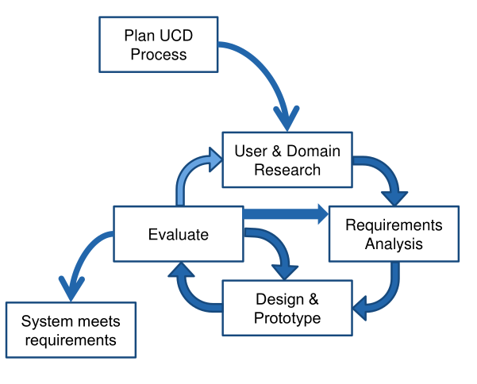
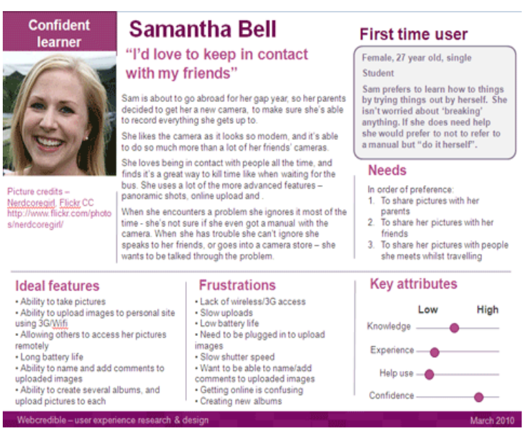
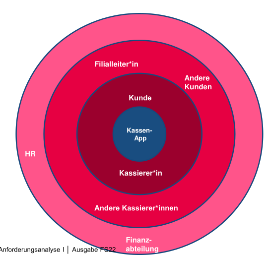
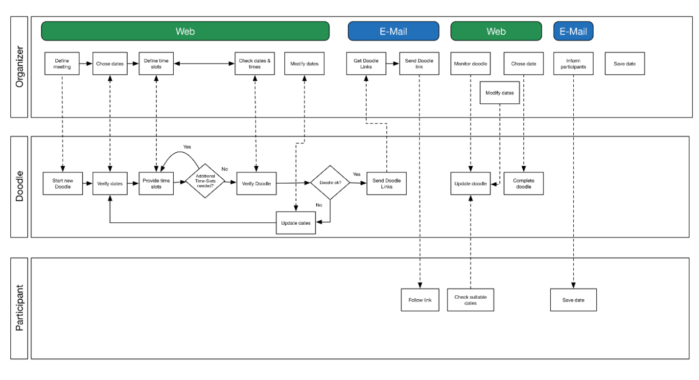

# Usability Engineering

## Usability/UX/Customer Experience

Usability ist wie einfach kann eine Applikation verwendet werden.

Eine gute Usability hat eine Software, wenn sie effiektiv, effizient und mit einer hohen Zufriedenheit vom Nutzer genutzt werdenn kann.

* **Effekivität**: Der Nutzer kann die Aufgaben mit gewünschter Genauigkeit ausführen
* **Effizient**: Der Nutzer kann die Aufgaben mit minimalem Aufwand ausführen
* **Zufriedenheit**: *selbsterklärend...*

Wenn von User Experience (UX) die Rede ist, wird gemeint, wie sich die Applikation anfühlt (Usability + Desirability). Wenn die Customer Experience gemeint ist, wird vom Gesammteindruck der App, der marke und der Firma gesprochen (Usability + UX + Brand Experience).

Es gibt **sieben Anforderungsbereiche** der Usability (laut DIN EN ISO 9241-110). Je nach Applikation sind nicht alle wichtig oder treffen gar nicht zu.

1. Aufgabenangemessenheit
   Eine Aufgabe soll nur so viele Schritte benötigen, wie minimal nötig. Ebenfalls soll nur Informationen angezeigt werden, welche für die aktuelle Aufgabe relevant ist (z.B. Hilfe). 
   Jede Eingabe sollte nur einmal getätigt werden und Eingabefelder sollen Standartwerte oder/und Liste von vordefinierten Werte habe (z.B. Länder). Zudem sollen ableitbare Eingaben vorgeschlagen werden.
2. Lernförderlichkeit
   Die Software soll Informationen über Konzepte und Regeln anbieten, wenn der Nutzer dies wünscht. Dies kann beispielsweise über Tool-Tipps oder Hilfssystem bewerkstelligt werden.
3. Individualisierbarkeit
   Die Applikationen soll sich dem Benutzer anpassen. Dies kann getan werden über Tipps, Tool-Tips, Wizards oder auch Tastaturkürzel für Experten.
   
4. Erwartungskonformität
   Die Applikation soll strickt interne Regeln anwenden. Die Konsistenz von der Terminologie, Reihenfolgen von Knöpfen und Informationsdarstellung sind wichtig und helfen dem Nutzer.
5. Selbstbeschreibungsfähigkeit
   Der Benutzer soll ausreichend informiert werden, wo er ist, was er tun soll und kann, wie er dies zu tun hat (z.B. Formate) und was das System macht.
   Dabei können Dinge wie Labels und Fehlermeldung hilfreich sein.
6. Steuerbarkeit/Kontrolle
   Der Benutzer soll das Tempo und Dialogfluss steuern können. Ebenfalls soll der Benutzer zwischen verschiedenen Inputsmodalitäten (Maus, Tastatur, Touch, ...) wechseln können. Darstellungsformate (Miles vs Kilometer) sollen einstellbar sein.
7. Fehlertoleranz
   Die Applikation soll dem Nutzer klar mitteilen, welche Werte als Input erwartet werded. Benutzeraktionen sollen zudem vor Aktionen überprüft werden. Bei Korrekturen und Fehlermeldungen dürfen **nie** Daten verloren gehen.

## User-Centered Design

### User & Domain Research

In dieser Phase geht es darum die Nutzer, ihr Umfeld und die Domäne zu verstehen. Dafür sollten folgende Fragen beantwortet werden:

* Über den Nutzer:
  * Wer sind die Benutzer?
  * Was sind ihre Arbeit, ihre Aufgaben und Ziele?
  * Wie sieht ihre Umgebung aus?
  * was brauchen sie, um ihre Ziele zu erreichen
  * Welche Begriffe verwenden sie?
  * Welche Normen sind wichtig für sie (organisatorisch, kulturell, sozial)?
  * Was sind Pain-Points in ihrer Arbeit?
* Über die Domäne
  * Wie funktioniert das Geschäft der Firma?
  * Was sind wichtige Konzepte, und Prozesse der Domäne?

Um diese Fragen zu beantwortet können mehrere Tools benutzt werden: Contextual Inquiry, Interviews, Beobachtung, Fokusgruppen, Umfragen, Nutzungsauswertungen, Dokumentenstudium & Mitbewerber studieren.

Folgende Artifakte sollten nach diesem Schritt vorhanden sein: Personas, Usage-Szenarien, Mentales Moddel, Domänenmodell (Siehe [Domainmodellierung](Domänemodellierung.md)), Stackeholder Map, Service Blueprint / Geschäftsprozessmodell, UI-Skizzen, Wireframes

#### Contextual Inquiry

In diesem Verfahren wird ein Nutzer, welcher sein Job erledigt, von einem Experten beobachtet. Der Experte kann während des Beobachtens Fragen stellen. 

Der Nutzen davon ist, dass Nutzer ihre Arbeit demonstrieren können.

### Persona

Eine Persona ist eine fiktive Person, welche eine Benutzergruppe repräsentiert. Dies kann ein nützliches Tool sein, um Designentscheidungen zu diskutieren

Folgendes sollte aufgeschrieben werden:

* Name, Alter, Geschlecht, Herkunft
* Beruf, Ausbildung, Erfahrung
* Verantwortlichkeiten, Aufgaben, Persönliche Ziele
* 1 - 2 Usage Szenarien
* Haltung, Aktivitäten, Bedürfnisse
* Umgebung
* Pain-Points und Frustrationen
* Erwartungen an neue Lösung
* Foto, Kernaussage

### Usage- & Context-Szenario

Ein Szenario ist eine kurze Geschichte, welche beschreibt, wie ein Benutzer (Persona) das Produkt in einer konkreten Situation benützt, um eine bestimmte Aufgabe zu erledigen.

Dabei wird zwischen einer **Usage-Szenario**, was beschreibt, wie das Problem bis her gelöst wurde, und einem **Context-Szenario**, was beschreibt, wie das Problem in der Zukunft gelöst wird, unterschieden.

Typischerweise ist folgendes enhalten:

* Motivation/Trigger: Was löst das Szenario aus?
* Persona und ihre Ziele
* Aktionen und Interaktionen
* Kontext
  * Wo findet das Szenario statt?
  * Wer/was ist sonst noch involviert?
* Probleme und wie damit umgegangen wird

Ein Szenario kann auch als Storyboard umgesetzt werden.

### Stakeholder Map

### Service Blueprint / Geschäftsprozess

