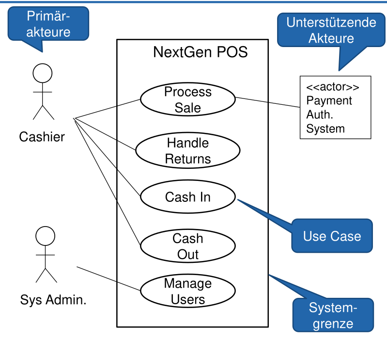
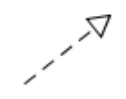
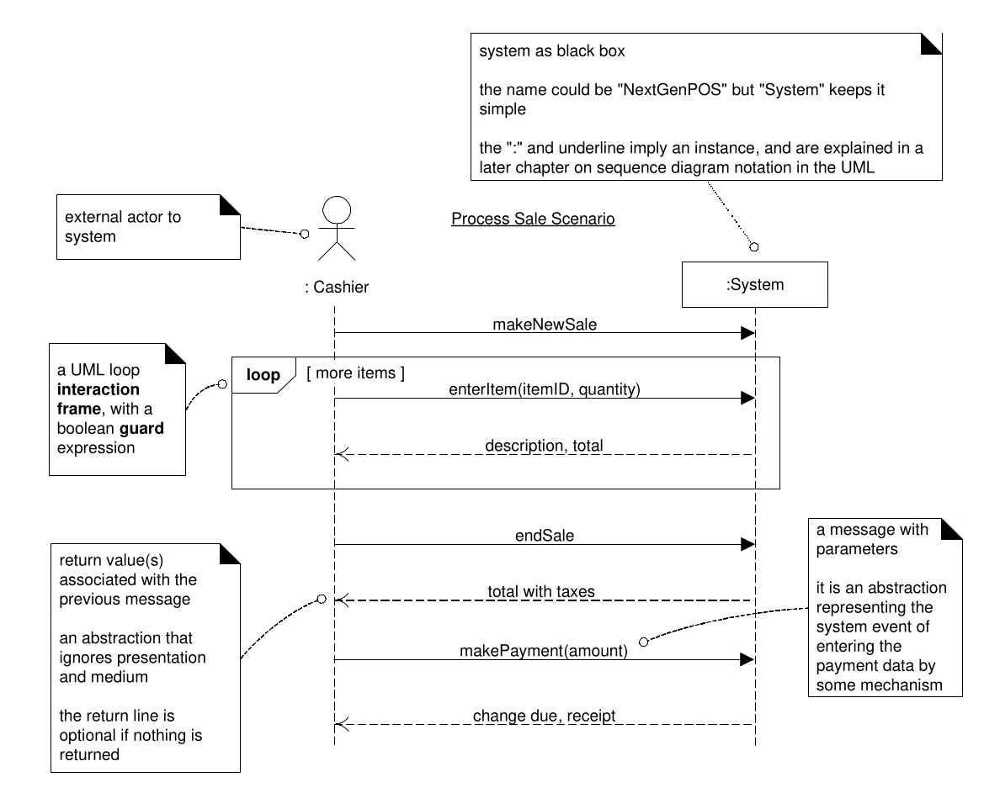

# Use-Case

Es gibt drei verschiedene Use-Case-Typen: Brief UC, Informell (Casual UC), Vollständig (Fully dressed UC).

Ein Use Case **muss** ein konkreten Nutzen für den Akteur erzeugen. Dabei enhält ein Use-Case meistens mehr als eine einzelne Interaktion.

Der Titel eins Use-Case sollte dem Schema `Kasse eröffnen` folgen.

Der **Boss-Test** besagt, falls dein Boss dich frag, was du den ganzen Tag gemacht hast und du sagst, du hast die ganze Zeit den einen Use-Case ausgeführt, sollte er zufrieden sein.

Der **Elementary Business Process Test** (EBP-Test) besagt, dass ein Use Case eine Aufgabe, die von einer Person und einem Ort zu einer bestimmten Zeit ausgeführt wird, als Reaktion auf einen Business Event.

**Wichtig bei Use-Cases:** Das Ping-Pong zwischen den Akteure und dem System gut herausarbeiten. 

## Use-Case finden

1. Systemgrenzen definieren
2. Primärakteure identifizieren
3. Jobs (Ziele, Aufgaben) der Primärakteure identifizieren

## Use-Case-Diagramm

Im folgenden Diagramm sieht man wie `<<extends>>` und `<<include>>` verwendet wird. Mit `<<include>>` werden Prozesse eingebunden, welche selbst keine vollen Use-Case sind und sind **nicht** mit einem Akteur verbunden. Der Prozess ist dann im Use-Case enthalten (z.B. Process Sale enhält Handle TWINT Payment). Ein Use-Case kann mit `<<extends>>` verbunden werden, wenn ein Use-Case erweitert wird (z.B. erweitert den Use-Case "Process Sale with Voucher" den Use-Case "Process Sale"). Ein erweiterten Use-Case kann eine Verbindung mit einem Akteur haben.

Akteure können mit generalisiert werden (z.B. Junior Cashier *is-a* Cashier)

## Brief Use-Case

Ein Brief Use-Case wird meistens zu Beginn erstellt und ist in Prosa. In ein Brief Use-Case kommt folgendes enhalten werden:

* Nur Erfolgsszenario
* Trigger des Use-Case
* Akteure
* Summarischen Ablauf des Use-Case

## Casual Use-Case

Ein Casual Use-Case wird ebenfalls zu Beginn der Analyse verwendet und enthält folgendes:

* Erfolgsszenario & wichtigste Alternativszenarien
* Trigger des Use-Case
* Akteure
* Summarischen Ablauf des Use-Case

## Fully-dressed Use-Case

*  Use-Case-Name

  Aktiv formulieren (ev. Objekt + Verb)
  
* Umfang (Scope)
  Beschreibung des zu entwickelnde System

* Ebene (Level)
  
* Primärakteur (Primary Actor)
  Die Primärakteure und wer den Use-Case initiert

* Stakeholders und Interessen
  Für wen den Use-Case sonst noch relevant ist und welche Interesse diese haben

* Vorbedingungen (Preconditions)
  Voraussetzungen, damit der Use-Case ablaufen kann

* Erfolgsgarantie/Nachbedingungen (Success
  Guarantee)
  Was nach der Ausführung gewährleistet werden muss

* Standardablauf (Main Sucess Scenario)
  Der "normale" Ablauf in einer nummerierten Liste, aber keine Lösungsdetails

* Erweiterungen (Extensions)

  Alternative Erfolgs- und Misserfolgsszenarien
  
* Spezielle Anforderungen (Special Requirements)
  
* Liste der Technik und Datavariationen
  (Technology and Data Variations)

* Häufigkeit des Auftretens (Frequency of Occurance
  
* Verschiedenes (Miscellaneous)

## Systemsequenzdiagram

<