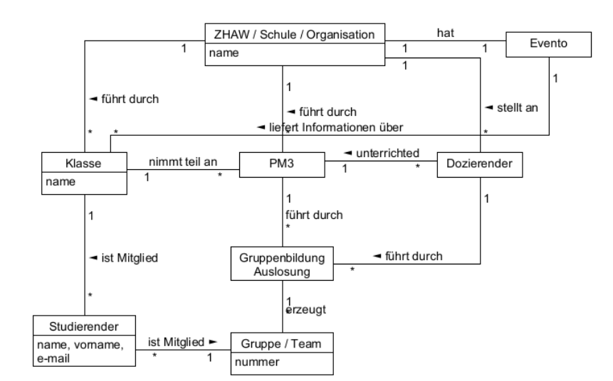

# Domänemodellierung

## Anleitung

1. Konzept identifizieren
2. Attribute zu Konzepte hinzufügen 
   Nur primitiven Typen sollten verwendet werden
3. Komplexe Attribute zu Konzepte hinzufügen
   Komplexe Datentypen sollten als separate Konzepte erstellt werden und mit einer Assoziation verbunden werden
4. Konzepte verbinden

Dabei ist wichtig daran zu decken, dass unwichtige Konzepte weggelassen werden können. Ebenfalls ist das Domänenmodell nicht repräsentativ der endgültig Klassen.

Folgende Antipattern sollten vermieden werden:

* Keine komplexe Datentype als Attribute
* Keine "Software" Klassen (z.B. `SalesDatabase`)
* Keine Methoden auf den Konzepte

## Spezialisierung

Folgendes ist im Domänenmodell erlaubt:

## Aggregation und Komposition

## Zustände

