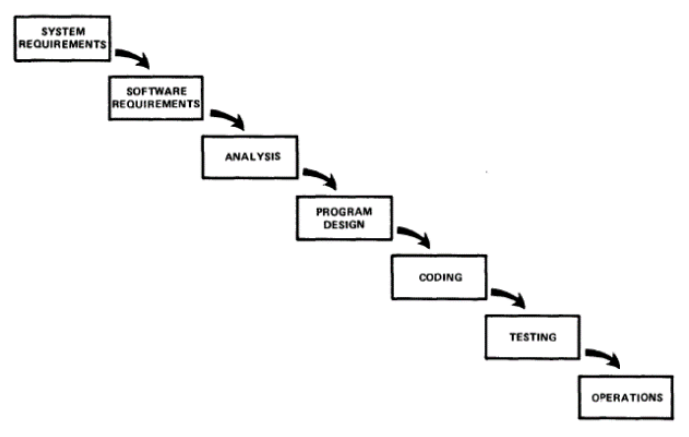
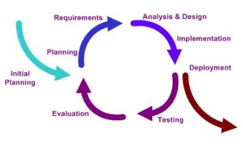
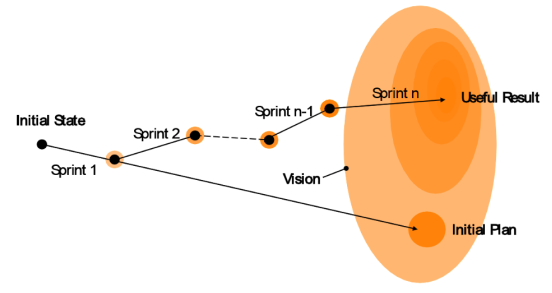

# Modelle

## Wasserfall-Modell

Die Entwicklung wird zu beginn also Folge von Aktivitäten und Phasen definiert und danach umgesetzt. Dies sollte für eine hohe Planbarkeit und eine klare Aufteilung der Aufgaben sorgen. Selten sind aber alle Anforderung zu beginn bekannt zudem ist das Risiko hoch, dass etwas übersehen wurde.

## Scrum (Iterativ-Inkrementelle Prozesse)

Beim iterativen Prozess wird in mehrere Iterationen aufgeteilt, welche in sich selbst ein quasi Wasserfall-Modell ist. Dies erhöht die Flexibilität und vereinfacht das Risikomanagement. Leider verringert sich dabei die Planbarkeit zu Beginn des Projektes und der Kunde muss kontinuierlich im Prozess eingebunden sein.

