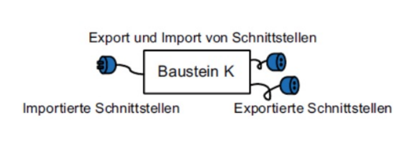
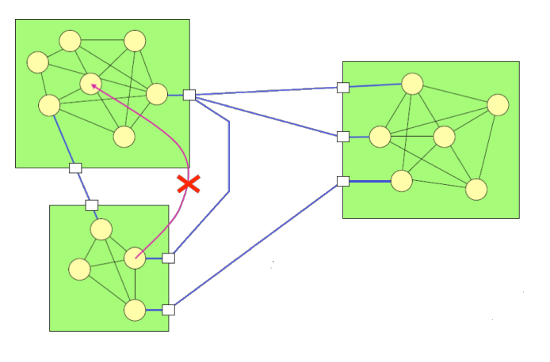
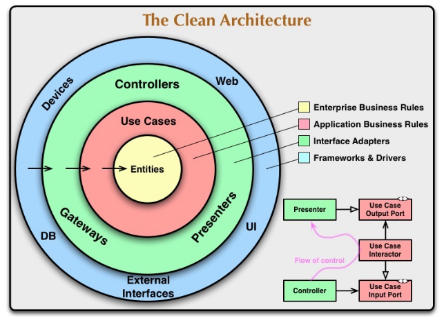

# Software Architektur

## Modulkonzept

Ein Modul bietet gewisse Service an. Diese werden über eine Schnittstelle freigegeben, welche als eine Art von Vertrag wirkt. Das Innenleben eines Moduls wird nicht veröffentlicht. 

Die Schnittstelle eines Moduls sollte soweit definiert sein, dass es einfach Ausgetauscht werden.

### Kohäsion und Koppelung

Zwischen den Modulen gibt es eine schwache Kopplung. Innerhalb eines Moduls gibt es hingegen eine starke Kopplung.

## Clean Architeture

## N + 1 View Model

## Paketdiagramme

* Tier, Layer und Partion

## GRASP

* Information Expert
* Creator
* Controller
* Low Coupling
* High Cohesion
* Polymorphism
* Pure Fabrication
* Indirection
* Protected Variations